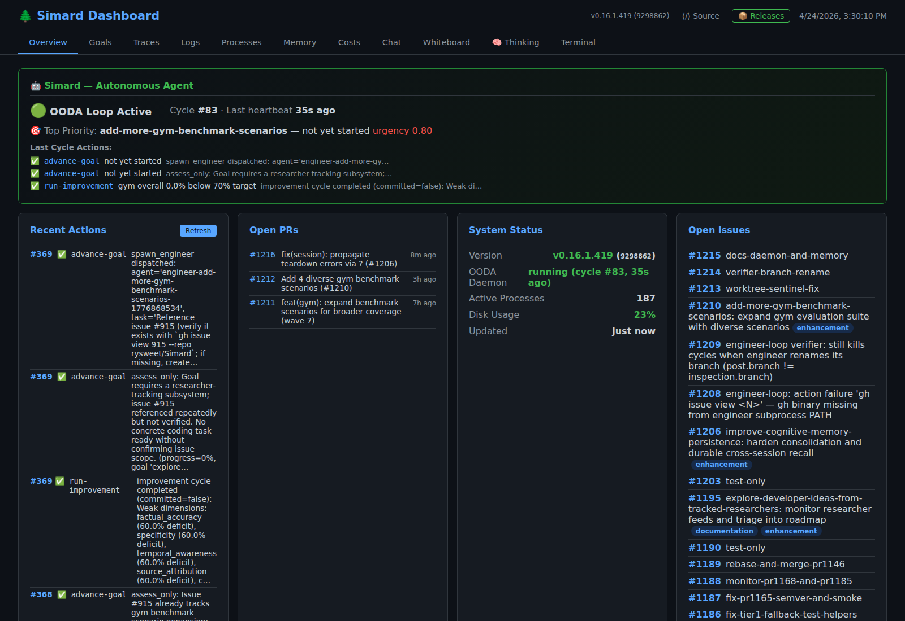
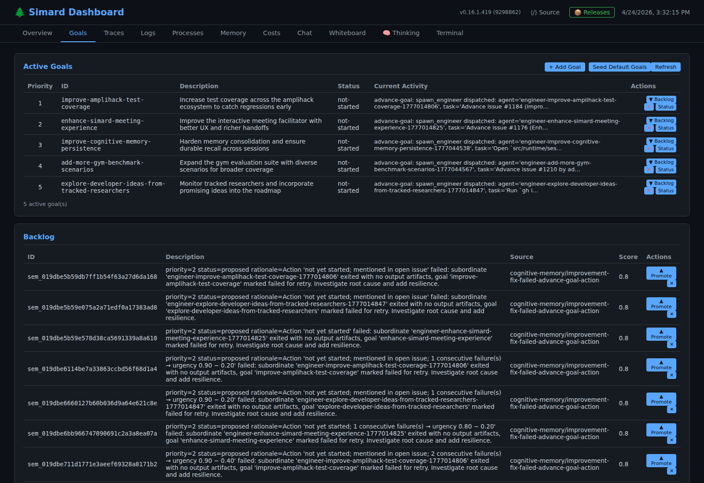
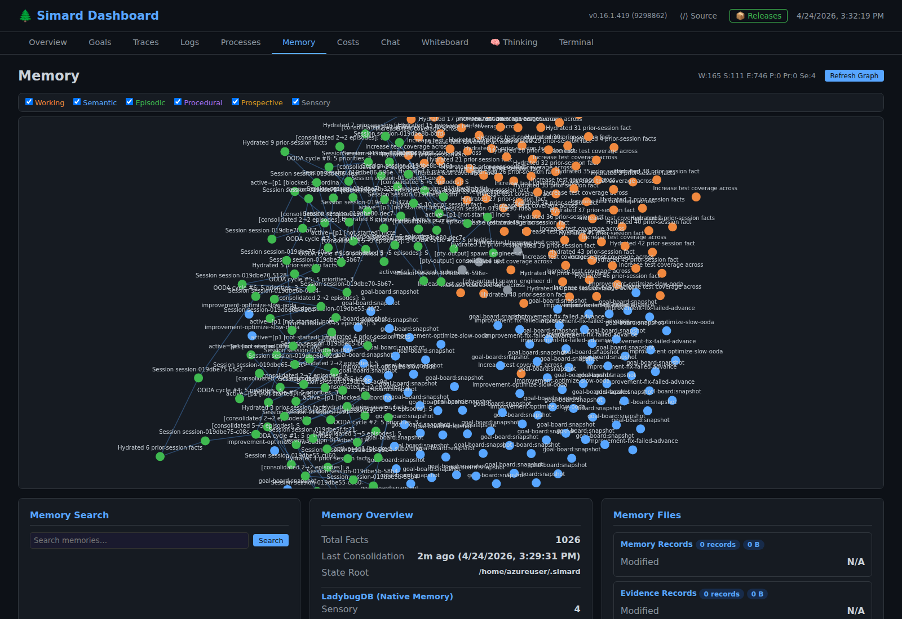

# Dashboard

Simard ships a read-only web dashboard that surfaces what the autonomous OODA daemon is doing right now: the active goal register, recent cycle actions, open PRs and issues, the cognitive memory graph, live traces, costs, and per-process resource usage. It is the primary operator-visible surface when Simard is running in daemon mode.

## Start the dashboard

```bash
simard dashboard serve --port=8080
```

A login code is generated on first start and printed to stdout. It is also persisted to `~/.simard/.dashkey` for re-use. Subsequent visits to `http://localhost:8080/` redirect to a login page that accepts the code and sets a session cookie.

## Tabs

The dashboard is a single-page app with the following tabs:

| Tab | Shows |
|-----|-------|
| **Overview** | Daemon status (OODA loop active / stopped), current cycle number, top-priority goal, last cycle's actions, recent actions stream, system status (version, OODA daemon state, active processes, disk usage), open PRs, and open issues. |
| **Goals** | The full goal register: active top-N goals with priority, status, and current activity; the proposed backlog with promote/dismiss controls. |
| **Traces** | Live-tailed engineer subprocess traces and OODA cycle traces (xterm.js terminal). |
| **Logs** | Aggregated daemon and engineer logs. |
| **Processes** | Live process tree under the daemon — engineer subprocesses, LLM sessions, and their resource usage. |
| **Memory** | Cognitive memory graph (Working / Semantic / Episodic / Procedural / Prospective / Sensory) with per-type filters; full-text memory search; memory overview and per-type file listings. See [Memory architecture](memory.md). |
| **Costs** | Per-provider, per-model token spend across the active session. |
| **Chat** | Direct chat with Simard. |
| **Whiteboard** | Shared scratch canvas. |
| **Thinking** | Live thinking-cycle stream (planner output before action dispatch). |
| **Terminal** | Browser-attached PTY into the daemon host. |

## Screenshots

Overview — what the daemon did this cycle, top priority, recent actions, open PRs, system status, open issues:



Goals — active priorities and backlog:



Memory — six cognitive memory types with filters and search:



## Read-only

The dashboard does not let operators force shell commands or edit code through the browser. Goal promotion, status changes, and refresh are the only state-changing operations. All other panels are observational.

## Related

- [Daemon mode (autonomous OODA loop)](daemon-mode.md)
- [Memory architecture](memory.md)
- [Run the OODA daemon](howto/run-ooda-daemon.md)
- [Dashboard E2E tests](reference/dashboard-e2e-tests.md)
