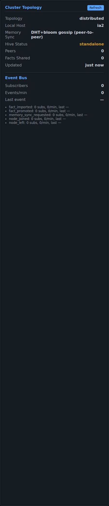
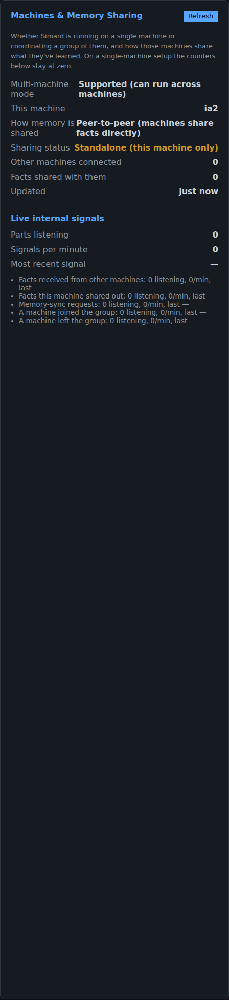
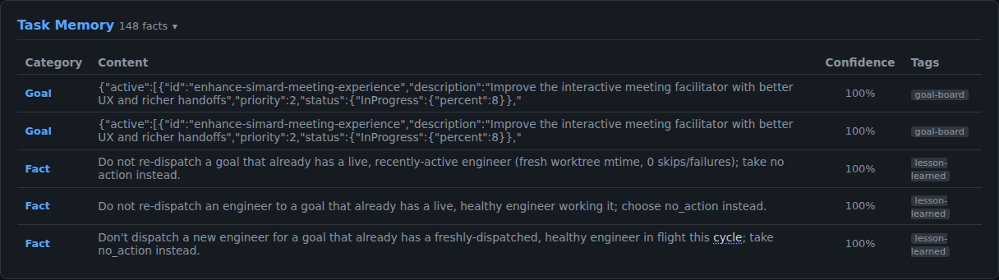
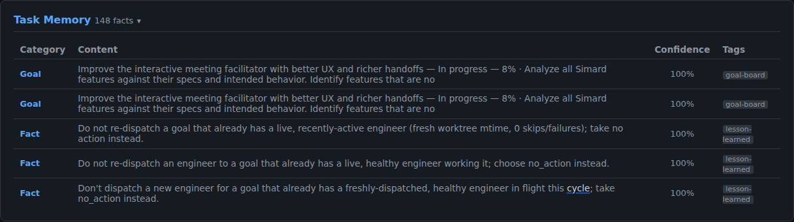
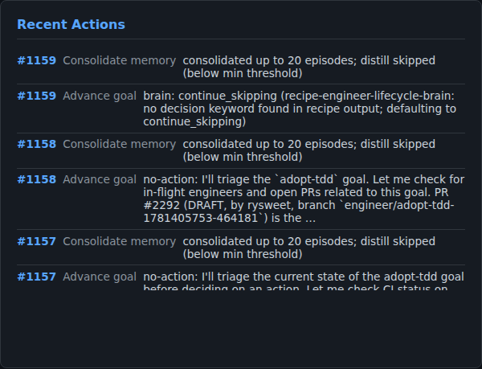
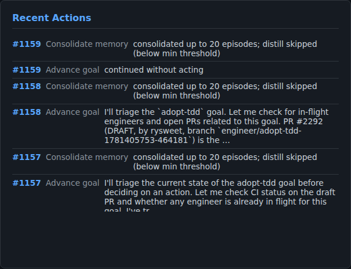
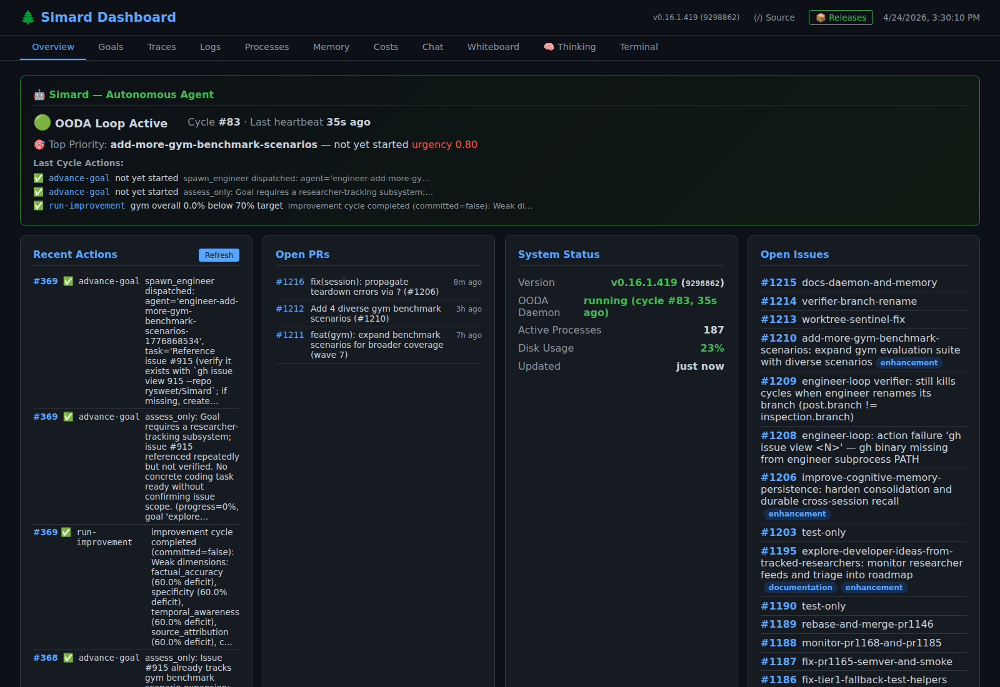
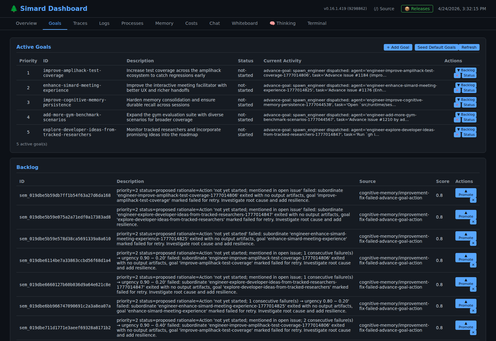

# Dashboard

Simard ships a read-only web dashboard that surfaces what the autonomous OODA daemon is doing right now: the active goal register, recent cycle actions, open PRs and issues, the cognitive memory graph, live traces, costs, and per-process resource usage. It is the primary operator-visible surface when Simard is running in daemon mode.

## Start the dashboard

```bash
simard dashboard serve --port=8080
```

A login code is generated on first start and printed to stdout. It is also persisted to `~/.simard/.dashkey` for re-use. Subsequent visits to `http://localhost:8080/` redirect to a login page that accepts the code and sets a session cookie.

## Tabs

The dashboard is a single-page app with **nine** top-level tabs. Views that answer
the same operator question are grouped into **sub-sections** (panels) inside one
tab, so every datum the dashboard has ever shown is still one or two clicks away —
consolidation regroups data, it never removes it. Tabs render in the nav in this
order:

| Tab | Sub-sections | Shows |
|-----|--------------|-------|
| **Overview** | Summary · Health · Stats | Daemon status (OODA loop active / stopped), current cycle number, top-priority goal, last cycle's actions, and the recent-actions stream (**Summary**); system status — version, daemon state, active process count, disk usage — per-PR **Merge Readiness** (the single Overview PR surface — the duplicative "Open PRs" card was removed, see [Overview → Health: Open PRs card removed](#overview-tab-health-open-prs-card-removed-26)), open issues, and the **Machines & Memory Sharing** card, i.e. whether Simard runs on one machine or a group and how they share what they've learned (**Health**); and aggregate run counters and rollups (**Stats**). |
| **Goals** | Goals · Work Board | The full goal register — active top-N goals with priority, status, and current activity, plus the proposed backlog with promote/dismiss controls (**Goals**) — and the shared scratch canvas with Task Memory and Recent Actions (**Work Board**). |
| **Activity** | Logs · Traces · Thinking · Failures | The **Background Service Log** (live activity from Simard's always-on background process), the cost ledger, and the **Cycle Reports** card — recent OODA cycles with their live cycle number, real per-cycle tree status, and Observe/Orient/Decide/Act detail, collapsed with a `×N` repeat-count and refreshed live, see [Activity: Cycle Reports](#activity-tab-logs-cycle-reports-26) — with a severity menu (All / Errors / Warnings / Info) and free-text search (**Logs**); recent agent traces from the cost ledger, journald, and in-process spans, plus OTEL status, each row read as plain language — **when**, **what**, **who** (**Traces**); the **Thinking** panel's two halves — a **Cycle History** table (collapsed per-cycle timeline with real timestamps, a `×N` repeat-count for runs of equivalent cycles, difference-carrying summaries, and a self-hiding duration-trend chart) and the **Agent Internal Reasoning** OODA Observe/Orient/Decide/Act breakdown, see [Thinking: Cycle History](#thinking-tab-cycle-history-21) (**Thinking**); and brain-fallback and decision failures (**Failures**). |
| **Workers** | Processes · Engineers · Terminal | The live process tree under the daemon — engineer subprocesses, LLM sessions, tmux sessions, and their resource usage (**Processes** / **Engineers**) — and a browser-attached PTY into the daemon host (**Terminal**). |
| **Pull Requests** | Merge Decisions · Readiness | Automated merge decisions and the rationale behind each (**Merge Decisions**), and per-PR readiness checks covering CI, review, and mergeability (**Readiness**). |
| **Resources** | Memory · Costs | The cognitive memory graph (Working / Semantic / Episodic / Procedural / Prospective / Sensory) with per-type filters, full-text search, the live **Memory Store** counts, and the **Memory Files** panel (**Memory**); and per-provider, per-model token spend across the active session (**Costs**). See [Memory architecture](memory.md). |
| **Chat** | — | Direct chat with Simard. Conversations are saved as durable, resumable **sessions**: a sidebar lists every saved chat, the panel fills the page, and assistant replies stream in incrementally. See [Chat: durable, resumable sessions](#chat-tab-durable-resumable-sessions). |
| **Overseer** | — | The overseer goal-board health view: per-goal health, staleness, and the intervention signals that decide when a stalled goal needs attention. |
| **Journal** | — | The daemon's narrative journal — a human-readable, chronological record of what Simard decided and why, newest entries first. |
| **Creative Ideas** | — | The pool of candidate self-improvement ideas Simard generates for herself, each reviewed for feasibility, worth, and measurability. Browse and search by review status (new · needs-revision · needs-human-review · accepted · in-progress · completed · deferred · rejected). |

**Overseer**, **Journal**, and **Creative Ideas** are standalone tabs with no
sub-sections; they are owned by separate features and are kept intact by the
consolidation.

Every former standalone tab now lives as a sub-section and keeps its old deep
link — see [Deep links and tab aliases](#deep-links-and-tab-aliases). The same
nine-tab taxonomy is mirrored in the terminal UI — see
[Terminal UI (TUI)](#terminal-ui-tui).

### Activity tab → Logs: filtering by severity (#1687)

The **Background Service Log** panel (the **Logs** sub-section of the **Activity**
tab) classifies every line into a severity —
**error**, **warning**, or **info** — and the **level menu** filters the view to
just that severity. Picking **Errors** surfaces failures (parse failures, brain
fallbacks, "did not emit a recognised action") and hides routine info lines;
**All levels** shows everything. The text box composes with the level menu to
search within the currently selected severity.

Classification is served by `/api/logs`, which returns a `daemon_log_levels`
array parallel to `daemon_log_lines`, with an identical client-side fallback
classifier. This is required because the daemon emits human-readable lines with
no level token of their own — without classification, selecting any level
(even *Info*) matched nothing and the control appeared inert.

### Activity tab → Logs: Cycle Reports (#26)

The **Cycle Reports** card in the **Logs** sub-section lists recent OODA cycles
in operator language. It shows each cycle's **live** number (`#13`, `#14`, …,
never a frozen `#1`), its **actual** working-tree status ("working tree clean"
vs. "uncommitted changes", not a stale constant), and per-cycle
Observe/Orient/Decide/Act detail — the observed signals, the decided action(s),
and the outcome. Consecutive equivalent cycles collapse into a single row with a
`×N` repeat-count and the cycle range `#A–#B`, so real forward progress stands
out from a stuck loop, and the card refreshes live every 15 s with the rest of
the Logs panel.

The card reads through the **same** shared cycle-report reader
(`cycle_source::read_cycle_reports_collapsed`, unioning both `cycle_reports/`
and `state/cycle_reports/`, newest-first) and the **same** strict display-layer
collapse (`thinking_collapse.rs`, `collapse_reports`) that feed the Thinking
sub-section's [Agent Internal Reasoning](#thinking-tab-cycle-history-21) view,
and renders through the **same** shared client entry-renderer (`renderCycleEntry`)
— so the two views agree on the same data instead of the card rendering a stale
copy. Full contract, the `/api/logs` → `cycle_reports` schema, the shared-path
reconciliation, and the before/after are documented in the
[Activity tab — Cycle Reports reference](reference/dashboard-activity-cycle-reports.md).

### Chat tab: durable, resumable sessions

The **Chat** tab is a full conversational surface over Simard's meeting
backend. Every conversation is a **durable, resumable session** — the complete
turn history is written to disk and survives both page reloads and daemon
restarts.

**Session sidebar.** The tab lists every saved chat session (newest first),
each showing its title — derived from the first message you sent — and when it
was last active. Click a session to reopen it: the panel loads the entire prior
conversation, and the connection resumes with full context on both the UI and
the agent side (the agent is re-seeded with the history, so replies stay
coherent). A **New chat** control starts a fresh session; the session record is
created the moment you send your first message, so empty windows never clutter
the list.

**Full-height layout.** The chat panel fills the available vertical and
horizontal space. The transcript scrolls inside a flex-grown message area while
the input row stays anchored at the bottom, and the panel grows with the browser
window — no fixed small box.

**Streaming with graceful fallback.** Assistant replies appear **incrementally**,
word-by-word, rather than all at once. A client that only understands the legacy
single-message shape still works — it simply receives the reply as one complete
message — so the conversation renders cleanly either way and is persisted
identically.

**Real agent, real memory.** Chat turns flow through the same
`SessionBuilder` / `MeetingBackend` path as the CLI meeting REPL (governed by
`SIMARD_LLM_PROVIDER`), so anything you say can become a goal and slash-commands
like `/status`, `/goal`, and `/close` work exactly as they do on the command
line. See [How to start a meeting](howto/start-a-meeting.md).

Sessions are stored under `<state_root>/chat_sessions/` (keyed by a stable
session id, honoring `SIMARD_STATE_ROOT`). Two REST endpoints back the sidebar —
`GET /api/chat/sessions` (list) and `GET /api/chat/sessions/{id}` (full
history) — and the live conversation runs over `GET /ws/chat` (optionally
`?session_id=<id>` to resume). Full storage layout, the REST contract, and the
WebSocket wire protocol (handshake, `restore`, `chunk`/`done`, and the
non-streaming fallback frame) are documented in the
[Dashboard Chat reference](reference/dashboard-chat.md).

### Overview tab: plain-English action details (#2358)

The Overview tab's **Summary** sub-section shows **Last Cycle Actions** and
**Recent actions** lists containing the
daemon's raw `outcome.detail` strings, which are written for machines
(`brain: continue_skipping (brain-error fallback: no decision keyword found…)`).
Both lists now route those strings through the client-side
`humanizeActionDetail` helper, which strips the `brain:` / `advance-goal:` /
`<x>-brain:` prefixes, maps known decision tokens to plain phrases
(`continue_skipping` → *continued without acting*), drops brain-fallback
boilerplate, and applies the shared `BANNED_JARGON` strip — while preserving any
`agent='engineer-…'` reference verbatim so the inline **Attach →** button still
works. The transform is render-layer only: the canonical `brain` / `ooda_brain`
strings, logs, and API responses are unchanged. See
[Overview action-detail humanization](reference/dashboard-action-detail-humanization.md).

### Overview tab → Health: Open PRs card removed (#26)

The **Health** sub-section previously carried two overlapping PR cards: a plain
**Open PRs** list and the richer **Merge Readiness** card. Everything the Open
PRs card showed (PR number, title, link) is a strict subset of Merge Readiness,
which additionally reports whether each PR can merge (CI rollup, base-branch
allow-list, objective merge-gate verdict, blocker reason, and the active
merge-judge kind). The duplicate **Open PRs** card has been **removed
completely** — its markup, its client renderer, and its `/api/activity` →
`open_prs` data producer (one fewer `gh pr list` subprocess per Overview
refresh). **Merge Readiness** is now the single Overview PR surface; the
**Pull Requests → Readiness** tab (`/api/prs`) is a separate view and is
unaffected. Full before/after and the `/api/activity` contract change are in the
[Open PRs card removal & live memory-consolidation reference](reference/dashboard-overview-health-and-live-memory.md).

### Overview tab → Health: plain-English "Machines & Memory Sharing" card

The **Health** sub-section's card that reports whether Simard is running on one
machine or a
cluster (formerly headed **Cluster Topology**) used to render machine-internal
vocabulary directly: `Topology`, `Memory Sync: DHT+bloom gossip (peer-to-peer)`,
`Hive Status: standalone`, an `Event Bus` panel with `Subscribers` / `Events/min`
counters, and one row per **raw event-topic enum name** (`fact_imported`,
`fact_promoted`, `memory_sync_requested`, `node_joined`, `node_left`). A live
Playwright audit flagged this as the densest jargon cluster on the landing page.

The card is now titled **Machines & Memory Sharing** with a one-line
plain-English description, and every label/value is humanized at the render layer:

| Was | Now |
|-----|-----|
| `Cluster Topology` (card header) | **Machines & Memory Sharing** |
| `Topology: distributed` | **Multi-machine mode: Supported (can run across machines)** |
| `Local Host` | **This machine** |
| `Memory Sync: DHT+bloom gossip (peer-to-peer)` | **How memory is shared: Peer-to-peer (machines share facts directly)** |
| `Hive Status: standalone` | **Sharing status: Standalone (this machine only)** |
| `Peers` | **Other machines connected** |
| `Event Bus` | **Live internal signals** |
| `Subscribers` / `Events/min` / `Last event` | **Parts listening** / **Signals per minute** / **Most recent signal** |
| `fact_imported: 0 subs, …` (raw enum) | **Facts received from other machines: 0 listening, …** |

The transform is render-layer only via the client-side helpers
`humanizeTopology`, `humanizeSyncProtocol`, `humanizeHiveStatus`, and
`humanizeEventTopic`. The `/api/distributed` payload, the underlying protocol
strings, and the stable `data-testid` selectors are unchanged, and each raw
machine id survives as a `title=` hover tooltip so power users lose nothing.
Verified outside-in by `tests/gadugi/dashboard-cluster-clarity.sh`.

Before (machine jargon) and after (plain English):

| Before | After |
|--------|-------|
|  |  |

### Goals tab: lifecycle-status badges (#20)

The **Goals** tab's active-goals table has a **Status** column that renders each
goal's *real, live* lifecycle status as a distinctly-coloured **badge** —
**Not started**, **In progress — N%**, **Blocked — &lt;reason&gt;**,
**Completed**, **Proposed**, or **Paused**. Previously the tab printed the raw
`status` string while the prominent coloured signal was the **Current Activity**
chip (whose red `Failed` state made a mixed board of not-started / in-progress /
blocked / completed goals all *look* failed). The two axes are now separated:
the **Status** column is the authoritative lifecycle indicator, and the
**Current Activity** column keeps its activity chip unchanged.

| Lifecycle | Badge | Colour |
|-----------|-------|--------|
| `NotStarted` / `Proposed` | **Not started** / **Proposed** | grey `#8b949e` |
| `InProgress { percent }` | **In progress — 42%** | accent `var(--accent)` |
| `Blocked(reason)` | **Blocked — &lt;reason&gt;** | amber `#d29922` |
| `Paused` | **Paused** | muted `#6e7681` |
| `Completed` | **Completed** | green `#2ea043` |

Blocked is amber `#d29922`, deliberately different from the activity chip's
`Failed` red `#f85149`, so a lifecycle *block* (e.g. the OODA-safeguard
`🔒 … needs human review` hold) is never mistaken for an activity *failure* —
and the block reason is shown inline. The badge is driven by the additive
`status_progress` field on `/api/goals` (the serialized `GoalProgress` enum),
classified by enum key via `goalLifecycleKey` and coloured from the hard-coded
`GOAL_STATUS_COLORS` allowlist, with the label produced by
`humanizeGoalProgress` and escaped last. The view is **live** — `/api/goals`
reloads the goal board on every request, so it reconciles with `simard goal
list` by construction. See
[Goals tab lifecycle-status badges](reference/dashboard-goal-lifecycle-status.md)
for the full reference.

### Goals tab → Work Board: plain-English Task Memory & Recent Actions

A live Playwright audit of the **Work Board** sub-section (in the **Goals** tab)
flagged two machine-jargon offenders that leaked raw internal representations onto
the page:

- **Task Memory** rendered raw goal-board **JSON blobs** directly — e.g.
  `{"active":[{"id":…,"status":{"InProgress":{"percent":8}}}]}` — exposing the
  serialized `GoalProgress` enum (`InProgress`) to the operator.
- **Recent Actions** showed the raw daemon result string — e.g.
  `brain: continue_skipping (recipe-engineer-lifecycle-brain: no decision keyword
  found in recipe output; defaulting to continue_skipping)`.

Both are now humanized at the render layer:

| Was | Now |
|-----|-----|
| `{"active":[{"id":"enhance-simard-meeting-experience","description":"Improve …","status":{"InProgress":{"percent":8}}}]}` | **Improve the interactive meeting facilitator … — In progress — 8%** |
| `status:{"InProgress":{"percent":5}}` (raw enum) | **In progress — 5%** |
| `status:{"Blocked":"waiting on CI"}` (raw enum) | **Blocked — waiting on CI** |
| `brain: continue_skipping (recipe-engineer-lifecycle-brain: no decision keyword found…)` | **continued without acting** |
| `no-action: I'll triage the adopt-tdd goal…` | **I'll triage the adopt-tdd goal…** |

The transform is render-layer only. Task Memory routes each fact's content
through the new client-side `humanizeTaskMemory` helper (which parses a
goal-board snapshot and renders each active goal as a plain line via
`humanizeGoalProgress`), and Recent Actions routes the daemon result through the
existing, tested `humanizeActionDetail` brain-decision humanizer (the same one
the Overview tab uses) before `renderActionDetail` performs its single escape —
so the inline **Attach →** button still works. The `/api/workboard` payload, the
`GoalProgress` serialization, and the stable `#wb-actions` / `#wb-facts-list`
render slots are unchanged, and the raw JSON / raw daemon string each survives
as an `escAttr()`-hardened `title=` hover tooltip so power users lose nothing.
Verified outside-in by `tests/gadugi/dashboard-workboard-clarity.sh`.

Task Memory — before (raw goal-board JSON) and after (plain English):

| Before | After |
|--------|-------|
|  |  |

Recent Actions — before (raw brain enum) and after (plain English):

| Before | After |
|--------|-------|
|  |  |

### Thinking tab: Cycle History (#21)

The **Thinking** tab has two halves.

The **second half** is the **Agent Internal Reasoning** breakdown: for each
cycle it renders the OODA **Observe / Orient / Decide / Act** phases with their
per-phase detail (goals observed, prioritised, the decided actions, and the
outcomes including the launched-sub-agent block). This half is unchanged.

The **first half** is the **Cycle History** — a compact timeline of recent
cycles plus a duration-trend chart. It answers three questions honestly:

- **When did each cycle run?** Every row shows a real timestamp; `—` appears
  only for legacy cycles that genuinely predate timestamp recording.
- **Progress or loop?** Consecutive *equivalent* cycles collapse into a single
  row with a `×N` repeat-count and the cycle range `#A–#B`, and each row's
  summary describes *what actually happened* (the decided action,
  `no-action: deferring to active engineer on <goal>`, or the meaningful
  decision clause) instead of the old count-boilerplate. A repeated *reasoning*
  decision (never a deferral) is flagged **⚠ possible loop**, so a genuine stuck
  loop stands out while healthy deferrals collapse quietly with just their `×N`.
- **Faster or slower?** A duration-trend chart renders once enough per-cycle
  duration data exists (≥4 timed cycles), and is **hidden entirely** until then
  — the old permanent "Not enough data" placeholder is gone.

Collapse runs at the display layer only (`thinking_collapse.rs`, relaxed mode
for the first half; strict mode is preserved for the second half). Timestamps
and durations come from producer-side telemetry persisted in each
`cycle_reports/cycle_<N>.json`. Full contract, collapse semantics, and the
`/api/ooda-cycles` schema are documented in the
[Thinking tab — Cycle History reference](reference/dashboard-thinking-cycle-history.md).

## Screenshots

Overview — what the daemon did this cycle, top priority, recent actions, open PRs, system status, open issues:



Goals — active priorities and backlog:



Resources → Memory — six cognitive memory types with filters and search:


### Resources tab → Memory: live store vs. legacy snapshots

The **Memory Overview** card (in the **Memory** sub-section of the **Resources**
tab) is the source of truth. Its **Memory Store**
section reports the live cognitive-memory counts straight from the native
graph store: recent observations, what Simard is currently thinking about,
events remembered, facts learned, known procedures, and planned actions.

The **Memory Files** panel sits beside it and is intentionally minimal:

- **Goals (snapshot)** — a point-in-time count of active and backlog goals,
  sourced from cognitive memory (not a disk file). It links to the **Goals**
  tab for the full board.
- **Legacy snapshots** — a single collapsed disclosure ("Legacy snapshots
  (superseded by the Memory Store)") that lists the retired JSON snapshot
  files (`memory_records.json`, `evidence_records.json`, `latest_handoff.json`)
  **only when a file actually has content**. When none of them qualify, the
  panel shows a one-line note instead.

This matters because those JSON files were superseded by the native Memory
Store. Rendering them as permanent "0 records / 0 B" tiles next to a store
holding thousands of facts told operators that memory was empty when it was
rich. The panel now hides empty legacy tiles so the displayed numbers always
match Simard's actual remembered state.

The **Last Memory Compaction** statistic in the same card now reflects **live**
consolidation state (#26). It previously derived from the modification time of
the retired JSON snapshot files, so it stayed frozen even while consolidation
ran (~30 `consolidate-memory` actions per 30 min; episodic memory growing
through the day). It now reads the most recent live consolidation signal — the
newest `consolidate-memory` OODA action timestamp — and shows `Not tracked yet`
when no such signal exists yet: it fails closed to `null` rather than fabricating
a value, with no legacy-file or directory-mtime fallback. `/api/memory` gains a
`recent_consolidation_activity` `{count, last}` summary, so the statistic visibly
advances as memory grows. This
is the same live-read reconciliation as the Activity and Goals tabs (#2697 /
#2695). See the
[Open PRs card removal & live memory-consolidation reference](reference/dashboard-overview-health-and-live-memory.md).

## Feedback widget: report a bug / request a feature (#2629)

Every tab carries a **Report bug / Request feature** control in the shared
header (top-right, next to **Glossary** and **Releases**). It lets an operator
file a defect or a change request **from the page they are looking at**. On
submit, the widget:

1. captures the **current page context** — the active tab, the state/JSON that
   page renders, a timestamp, and page identifiers;
2. bundles it with the operator's report (`type` = bug \| feature, title,
   description); and
3. starts a **new `dev-orchestrator` workstream** — the same
   `smart-orchestrator` → `default-workflow` recipe run engineers and the
   Overseer use, launched through the shipped
   [`RecipeLauncher`](reference/dashboard-feedback-widget.md#launcher-reuse)
   plumbing (no ad-hoc shell-out).

The modal then shows the workstream id and polls until the resulting **PR**
appears, surfacing a link to it. Both endpoints (`POST /api/feedback` and
`GET /api/feedback/status/{id}`) sit **behind the same access-code gate** as the
rest of the dashboard, accept JSON only, sanitize and size-cap all inputs, and
compose the workstream's `task_description` as plain data (never interpolated
into a shell). See
[Dashboard Feedback Widget](reference/dashboard-feedback-widget.md) for the full
API reference and
[How to report a bug or request a feature](howto/report-a-bug-or-request-a-feature.md)
for the walkthrough.

## Instant tab switches: background prefetch and refresh

Every tab's data is **prefetched on page load** and kept on its **own persistent
background refresh**, whether or not that tab is currently visible. Switching to
a tab renders immediately from the already-fetched, continuously-refreshed data
instead of blocking on a slow on-activate fetch. A subtle per-tab
`Updated <relative>` indicator (`[data-testid="{slug}-updated"]`) shows how fresh
each panel is, so there is no silent staleness, and every manual **Refresh**
button still works.

To stay kind to the local daemon, the scheduler bounds concurrency, staggers the
initial wave, jitters the per-tab intervals, de-duplicates concurrent GETs for
the same endpoint, and **suspends all refreshes while the browser tab is hidden**
(resuming — and immediately refreshing the active tab — when it becomes visible
again). Interactive surfaces (Workers → Terminal, Chat live attach) are never
auto-opened in the background.

See [Background tab prefetch and refresh](reference/dashboard-background-tab-prefetch.md)
for the full behaviour, the per-tab refresh schedule, the tuning constants, and
the test coverage.

## Read-only

The dashboard is observational: it does not let operators force shell commands or edit code through the browser. Goal promotion, status changes, refresh, and the [feedback widget](#feedback-widget-report-a-bug-request-a-feature-2629) (which starts a governed workstream, not a shell command) are the only state-changing operations. All other panels are observational. A feedback-launched workstream runs the standard `default-workflow` with CI required green and a human merge — it cannot merge or run arbitrary commands on its own.

## Terminal UI (TUI)

The terminal UI (`simard tui`) presents the **same tab taxonomy** as the web
dashboard so an operator moving between the two never has to relearn the layout.
Tab names, relative order, and grouping match the dashboard exactly.

The TUI renders an **eight-tab subset** of the ten dashboard tabs. It omits
**Pull Requests** and **Resources**, whose data pipelines exist only in the web
surface; adding them to the TUI would be new feature work, not consolidation, and
is deliberately out of scope. The TUI never invents a tab the dashboard does not
have, and never shows a name the dashboard does not use.

| # | TUI tab | Key | Matches dashboard tab | Sub-views |
|---|---------|-----|-----------------------|-----------|
| 1 | **Overview** | `1` | Overview | Summary · Health · Stats |
| 2 | **Goals** | `2` | Goals | Goals · Work Board |
| 3 | **Activity** | `3` | Activity | Logs · Traces · Thinking · Failures |
| 4 | **Workers** | `4` | Workers | Processes · Engineers · Terminal |
| 5 | **Chat** | `5` | Chat | — |
| 6 | **Overseer** | `6` | Overseer | — |
| 7 | **Journal** | `7` | Journal | — |
| 8 | **Creative Ideas** | `8` | Creative Ideas | — |

Number keys `1`–`8` (with the platform tab modifier) jump straight to a tab;
`Tab` / `Shift+Tab` cycle forward and backward. Merged views appear as
**panels** (ratatui sub-views) within their parent tab — e.g. the **Activity**
tab stacks Logs, Traces, Thinking, and Failures panels — so the terminal keeps
the same information density as before the consolidation. The **Chat** tab in the
TUI is the same conversational surface the CLI meeting REPL uses (internally the
`MeetingBackend`); it is labelled **Chat** to match the dashboard.

## Tab identity contract

Every tab in the dashboard satisfies five invariants. They exist so an operator who lands on any single page (deep link, browser-history entry, screenshot in a bug report) can immediately answer *"what page am I on?"* and *"what is this page for?"* without learning Simard's internal vocabulary.

The five invariants:

1. **Unique, non-empty browser `<title>`.** Each tab sets `document.title` to `"{PageName} · Simard"` — including Overview, which uses `"Overview · Simard"`. The format is mechanical and uniform; there are no per-tab exceptions. No two tabs share a title.
2. **Unique, non-empty visible `<h1>`.** Each tab panel renders exactly one `<h1 class="page-h1">` immediately under the global brand bar. No two tabs share an H1.
3. **Non-empty plain-English lede.** Each tab panel renders exactly one `<p class="page-lede">` immediately under its H1. The lede is a single sentence that explains what the page is for in language a non-expert can understand.
4. **No banned jargon in any lede.** The eight strings in the `BANNED_JARGON` constant — `OODA`, `Observe-Orient-Decide-Act`, `spawn_engineer`, `LadybugDB`, `cognitive memory`, `synergize`, `leverage`, and `ideate` — are forbidden anywhere in lede text; the constant is the single source of truth and this doc's own prose is not bound by it. The goal is to ban consultant-speak and insider acronyms that an operator without Simard context cannot decode. The blocklist is enforced at build time by a unit test and again at runtime by the Playwright smoke test. Simard-internal domain vocabulary (`facilitator`, `consolidation`, `episodic`, …) is *allowed* — those are legitimate terms a memory or goals page may need to use; the bar is "no corporate jargon", not "no jargon at all".
5. **Consolidation preserves data.** Grouping related views into sub-sections never drops a datum. Every panel a former standalone tab rendered survives as a labelled sub-section inside its parent tab, and every retired top-level slug still resolves as a deep-link alias to its new home (see [Deep links and tab aliases](#deep-links-and-tab-aliases)). Sub-section headers render as `<h2>`/`<h3>` (never a second `page-h1`), so invariant 2 continues to hold — each tab still has exactly one page `<h1>` when active.

### Canonical tab taxonomy

There are exactly **nine** dashboard tabs and **seven** TUI tabs, drawn from a single shared taxonomy. Tab names, relative order, and grouping are identical across both surfaces; the TUI omits only the two tabs (Pull Requests, Resources) whose data lives solely in the web dashboard. This table is the durable definition of the tab set — new work extends a tab's sub-sections rather than adding a top-level tab, unless a genuinely new operator question demands one.

| # | Tab | Dashboard slug | Sub-sections | In TUI? |
|---|-----|----------------|--------------|---------|
| 1 | **Overview** | `overview` | Summary · Health · Stats | yes (`1`) |
| 2 | **Goals** | `goals` | Goals · Work Board | yes (`2`) |
| 3 | **Activity** | `activity` | Logs · Traces · Thinking · Failures | yes (`3`) |
| 4 | **Workers** | `workers` | Processes · Engineers · Terminal | yes (`4`) |
| 5 | **Pull Requests** | `pull-requests` | Merge Decisions · Readiness | no (web-only) |
| 6 | **Resources** | `resources` | Memory · Costs | no (web-only) |
| 7 | **Chat** | `chat` | — | yes (`5`) |
| 8 | **Overseer** | `overseer` | — | yes (`6`) |
| 9 | **Journal** | `journal` | — | yes (`7`) |

Tab names never use the word "Bridge". **Overseer** and **Journal** are owned by separate features and are carried through the consolidation unchanged.

The global header (`🌲 Simard Dashboard`) is intentionally demoted from `<h1>` to `<div class="brand">` so that every page has exactly one semantic `<h1>` — the page-specific one — when active.

### Where the strings live: `TabMeta` single source of truth

All five user-visible strings per tab (`label`, `title`, `h1`, `lede`, `tooltip`) plus the routing `slug` are defined in **one** Rust module:

```
src/operator_commands_dashboard/index_html/tab_meta.rs
```

```rust
pub struct TabMeta {
    pub slug: &'static str,     // e.g. "activity"
    pub label: &'static str,    // nav button text, e.g. "Activity"
    pub title: &'static str,    // browser <title>, always "{Label} · Simard"
    pub h1: &'static str,       // page <h1>, e.g. "Activity"
    pub lede: &'static str,     // plain-English sentence shown under the H1
    pub tooltip: &'static str,  // rendered as the nav button's HTML `title=`
                                // attribute (browser-native hover tooltip)
}

pub const TAB_METADATA: &[TabMeta] = &[ /* one entry per tab, in nav order */ ];
```

The HTML template is rendered by substituting markers from `TAB_METADATA` in `index_html_string()`:

| Marker              | Resolves to                                                                 |
|---------------------|-----------------------------------------------------------------------------|
| `{{DEFAULT_TITLE}}` | Initial `<title>` of the page (matches the default-active tab).             |
| `{{TAB_NAV}}`       | Full `<div class="tabs">…</div>` nav, one button per tab (label + tooltip + `data-tab`). |
| `{{TAB_META_JS}}`   | `<script>window.__TAB_META = { … };</script>` map of `slug → {title, h1, label}`. |
| `{{BANNED_JARGON_JS}}` | `<script>`-embedded JSON array of the `BANNED_JARGON` constant, so the client-side `humanizeCycleSummary` strips the same jargon the ledes forbid — one source of truth for both the static ledes and the dynamically rendered summary text (#2358). |

The per-tab `<h1 class="page-h1">` and `<p class="page-lede">` blocks are inlined directly in each `<div class="tab-content">` in `part_00.rs` / `part_01.rs` rather than via a marker — so an editor can `grep` for a heading and find it in the markup. The cross-check tests in `tests_tab_meta.rs` (`rendered_html_contains_every_label`, `rendered_html_contains_every_lede`, `rendered_html_contains_every_tooltip_from_sot`) enforce that every value in `TAB_METADATA` appears verbatim in the rendered HTML, so a typo or a forgotten panel header fails CI rather than shipping a tab with the wrong text.

The `__TAB_META` JS object is serialized with `serde_json::to_string` and then `<` is replaced with `\u003c` so that a future lede or title containing `</script>` cannot terminate the inline `<script>` tag. A `debug_assert!` at the end of `index_html_string()` rejects any unresolved `{{MARKER}}` left in the rendered output.

On the client, the existing tab-click handler in `part_01.rs` sets `document.title = window.__TAB_META[slug].title` when a tab is activated. The H1 and lede do not need to be re-injected at click time — every panel is pre-rendered with its own header block, and the handler toggles `class="active"` on `.tab-content` so that exactly one panel is on-screen at any moment.

### Adding a new tab

Adding a tab is a single-file edit followed by writing the panel content:

1. Append a new `TabMeta { … }` entry to `TAB_METADATA` in `tab_meta.rs`. Pick a `slug` matching `^[a-z][a-z0-9-]*$`, a short `label` (one or two words, e.g. `Pull Requests`), a `title` of the form `"{H1} · Simard"`, an `h1` (usually equal to `label`), a `lede` that passes the jargon blocklist, and a `tooltip`. **Prefer adding a sub-section to an existing tab** — the nine-tab taxonomy is deliberately small; only add a top-level tab when a genuinely new operator question needs one.
2. Add the panel to the appropriate `part_NN.rs`: a `<div class="tab-content" id="tab-{slug}">` whose first two children are `<h1 class="page-h1">{h1}</h1>` and `<p class="page-lede">{lede}</p>` with text matching the SoT entry exactly. Sub-sections within the panel use `<h2>`/`<h3>`, never a second `page-h1`.
3. If the tab is shared with the TUI, add a matching arm to `enum Tab` / `ALL_TABS` in `src/bin/simard_tui/app.rs` using the same label and relative order, so the two surfaces stay consistent.
4. Run `cargo test` — the unit tests in `tests_tab_meta.rs` verify uniqueness of `slug`, `label`, `title`, `h1`, non-emptiness of `lede`, absence of banned jargon, and that the rendered HTML contains every label / H1 / lede / tooltip from the SoT. The smoke test picks the new tab up automatically (it discovers tabs from the rendered DOM, not from a hardcoded list).

No other file needs to change for the strings. There is no second place to update a label.

### Deep links and tab aliases

Each tab is deep-linkable by its slug (`#overview`, `#goals`, `#activity`, `#workers`, `#pull-requests`, `#resources`, `#chat`, `#overseer`, `#journal`). Because several former standalone tabs are now **sub-sections**, the client keeps a small **alias allowlist** that maps every retired slug to its new parent tab (and, where useful, scrolls to the sub-section). Old bookmarks, browser history, and links in bug reports keep working:

| Legacy deep link | Resolves to |
|------------------|-------------|
| `#status` | `#overview` → Stats |
| `#workboard` (formerly `#whiteboard`) | `#goals` → Work Board |
| `#logs` | `#activity` → Logs |
| `#traces` | `#activity` → Traces |
| `#thinking` | `#activity` → Thinking |
| `#brain-failures` | `#activity` → Failures |
| `#processes` | `#workers` → Processes / Engineers |
| `#terminal` | `#workers` → Terminal |
| `#merge-decisions` | `#pull-requests` → Merge Decisions |
| `#pr-readiness` | `#pull-requests` → Readiness |
| `#memory` | `#resources` → Memory |
| `#costs` | `#resources` → Costs |

The resolver treats `location.hash` as untrusted input: it strips the leading `#`, matches the value against the allowlist (and the canonical slug set, validated against `^[a-z-]+$`), and **falls back to the default `overview` tab on any unknown or malformed hash**. It never concatenates the hash into a DOM selector or element id. API endpoints are decoupled from slugs and unchanged — for example `/api/workboard` still backs the **Work Board** sub-section even though `#workboard` now lands on the **Goals** tab. (The label lineage is `Whiteboard → Workboard → Work Board`; only the user-facing string ever changed, never the route or storage path.)

The table above covers only the twelve slugs that were real top-level tabs before consolidation (the 17-tab set minus the five that stay top-level: `overview`, `goals`, `chat`, `overseer`, `journal`). Sub-sections that consolidation *introduces* and that were never standalone tabs — **Stats** (under Overview) and **Engineers** (the process-tree view under Workers) — have no legacy slug and therefore no alias entry; they are reached through their parent tab. Do not add `#stats` / `#engineers` aliases: there are no old bookmarks to preserve.

## Tests

Three complementary test layers enforce the Tab Identity Contract and the consolidated tab set:

### Rust unit tests

`src/operator_commands_dashboard/index_html/tests_tab_meta.rs` covers (these are the real test names in the file today):

**Source-of-truth table invariants (iterating `TAB_METADATA`):**

- `tab_meta_slugs_unique` — slugs are unique **and** `assert_eq!(TAB_METADATA.len(), 17, "expected 17 tabs")`. **This literal is the tab-count guard: consolidation changes this single `17` to `9`.** It is the only hard-coded tab count in the suite — every other test derives its expectation from `TAB_METADATA.len()`, so no separate "nine canonical tabs" test exists or is needed.
- `tab_meta_labels_unique`
- `tab_meta_titles_unique_and_non_empty`
- `tab_meta_titles_follow_label_dot_simard_format` — every `title` equals `"{label} · Simard"`.
- `tab_meta_h1s_unique_and_non_empty`
- `tab_meta_ledes_non_empty_and_single_sentence_ish` — non-empty and `len() >= 40` (guards against a one-word placeholder lede).
- `tab_meta_ledes_no_banned_jargon` — rejects every one of the eight `BANNED_JARGON` terms (`OODA`, `Observe-Orient-Decide-Act`, `spawn_engineer`, `LadybugDB`, `cognitive memory`, `synergize`, `leverage`, `ideate`).
- `tab_meta_tooltips_substantive` — every `tooltip` is `>= 18` chars.

**Marker rendering & injection safety:**

- `tab_meta_js_is_valid_json_assignment` — the `{{TAB_META_JS}}` payload round-trips as JSON and `obj.len() == TAB_METADATA.len()` (the count guard again, expressed derivatively — nothing to update here on consolidation).
- `tab_meta_js_resists_script_breakout` — a value containing `</script>` cannot terminate the inline `<script>` (the payload has no literal `</`).
- `banned_jargon_js_is_valid_json_array` — the `{{BANNED_JARGON_JS}}` marker is a JSON array; the `BANNED_JARGON` constant remains the single source of truth for the client-side humanizer.
- `default_title_is_first_tab_title` — `default_title()` equals `TAB_METADATA[0].title`.

**Rendered-HTML cross-checks (SoT ↔ `INDEX_HTML`):**

- `rendered_html_contains_every_label`, `rendered_html_contains_every_lede`, `rendered_html_contains_every_tooltip_from_sot` — every SoT string appears verbatim in the rendered markup. (Per-tab `<h1>`/`<p class="page-lede">` blocks are inlined in `part_00.rs` / `part_01.rs`; there is **no** `{{HEADER:slug}}` marker and no `tab_meta_every_slug_has_header_marker` test.)
- `rendered_html_default_title_matches_sot`, `rendered_html_contains_tab_meta_js_block`.
- `rendered_html_has_no_unresolved_template_markers` — no `{{…}}` survives rendering.
- `rendered_html_demotes_brand_h1_to_div` — the header brand renders as `<div class="brand">`, so the active panel owns the page's only `<h1>` (invariant 2).
- `rendered_html_workboard_label_replaces_whiteboard` — the nav label reads **Workboard**, never **Whiteboard**.
- `tab_nav_html_marks_first_tab_active_and_rest_inactive`.

> Note for the implementer: the stale doc-comment on `default_title()` in `tab_meta.rs` ("exactly 13 entries") predates both the current 17-tab table and the 9-tab target; correct it to match the consolidated count when you flip `tab_meta_slugs_unique`.

Run with:

```bash
cargo test -p simard operator_commands_dashboard
```

### TUI unit tests

`src/bin/simard_tui/app.rs` covers the terminal UI's copy of the taxonomy so the two surfaces cannot drift:

- `ALL_TABS.len() == 7` and each tab's `number()` round-trips (`1`–`7`).
- `label()` returns the shared names (`Overview`, `Goals`, `Activity`, `Workers`, `Chat`, `Overseer`, `Journal`).
- `from_key()` maps digits `1`–`7` (with the tab modifier) to the matching tab and returns `None` for `8`, `9`, `0`, unmodified digits, and non-digit keys — so an out-of-range key can never index past `ALL_TABS`.

Run with:

```bash
cargo test -p simard --bin simard_tui
```

### Python Playwright smoke test

`tests/e2e-dashboard/smoke_python/` is a small pytest suite that exercises the running dashboard end-to-end. It:

1. Reads `~/.simard/.dashkey` (or `SIMARD_DASHKEY`) and POSTs it to `/api/login` as a JSON body (`Content-Type: application/json`, field name `code`) to obtain a session cookie. The encoding matches the existing route handler in `operator_commands_dashboard/auth.rs`.
2. Discovers every nav button by querying `data-tab` attributes — no hardcoded tab list.
3. Clicks each button in turn and uses Playwright's `expect(locator).to_be_visible()` on `.tab-panel[data-tab="{slug}"]`. This avoids hard-coding a `.active` class name and lets the contract survive future tab-handler refactors.
4. Captures `document.title`, the visible `.page-h1` text, and the visible `.page-lede` text.
5. Asserts: at least the nine canonical tabs are present; all titles unique and non-empty; all H1s unique and non-empty; every lede non-empty and free of banned jargon.
6. Prints a markdown table `slug | title | h1 | lede` to stdout. CI uploads this as build evidence and the PR template links it into the description.

`test_tab_clarity.py` additionally asserts the canonical slug set is present and that each retired-slug deep link (`#status`, `#workboard`, `#logs`, `#traces`, `#thinking`, `#brain-failures`, `#processes`, `#terminal`, `#merge-decisions`, `#pr-readiness`, `#memory`, `#costs`) resolves to its parent tab rather than 404-ing, and that an unknown `#hash` falls back to `overview` with no DOM injection.

The `BANNED_JARGON` constant lives in both `tab_meta.rs` and `test_tab_clarity.py`. They are intentionally duplicated (no shared format file) and contributors are responsible for keeping them in step — both files are referenced from the same line in the "Adding a new tab" checklist, and the two-line list is short enough that drift is unlikely.

Run locally:

```bash
pip install -r tests/e2e-dashboard/smoke_python/requirements.txt
python -m playwright install --with-deps chromium

# In another terminal, start the dashboard:
simard dashboard serve --port=8080

pytest tests/e2e-dashboard/smoke_python/ -v
```

The smoke test pins `playwright==1.59.0` to match the CI image and the TypeScript Playwright suite.

### CI

The smoke test runs in the existing `e2e-dashboard` job in `.github/workflows/verify.yml`, after the TypeScript Playwright suite has already started the dashboard server and provisioned `~/.simard/.dashkey`. Three steps are appended:

```yaml
- run: pip install -r tests/e2e-dashboard/smoke_python/requirements.txt
- run: python -m playwright install --with-deps chromium
- run: pytest tests/e2e-dashboard/smoke_python/ -v --tb=short
  env:
    SIMARD_DASHBOARD_URL: http://localhost:${{ env.PORT }}
```

The `SIMARD_DASHBOARD_URL` environment variable is honored by `conftest.py` (defaulting to `http://localhost:8080`) so the same suite runs unchanged in CI and locally on a custom port. A failed assertion fails the job. The evidence table is visible in the job's log.

## Related

- [Daemon mode (autonomous OODA loop)](daemon-mode.md)
- [Memory architecture](memory.md)
- [Run the OODA daemon](howto/run-ooda-daemon.md)
- [Dashboard E2E tests](reference/dashboard-e2e-tests.md)
- [Goals tab lifecycle-status badges](reference/dashboard-goal-lifecycle-status.md)
- [Overview action-detail humanization](reference/dashboard-action-detail-humanization.md)
- [Dashboard Feedback Widget](reference/dashboard-feedback-widget.md)
- [How to report a bug or request a feature from the dashboard](howto/report-a-bug-or-request-a-feature.md)
- [Thinking tab — Cycle History (timestamps, collapse, duration trend)](reference/dashboard-thinking-cycle-history.md)
- [Activity tab — Cycle Reports (live cycle number, accurate tree status, shared detail)](reference/dashboard-activity-cycle-reports.md)
- [Overview Health & live memory-consolidation (Open PRs card removal, live Last Memory Compaction)](reference/dashboard-overview-health-and-live-memory.md)
- [Background tab prefetch and refresh (instant tab switches)](reference/dashboard-background-tab-prefetch.md)
