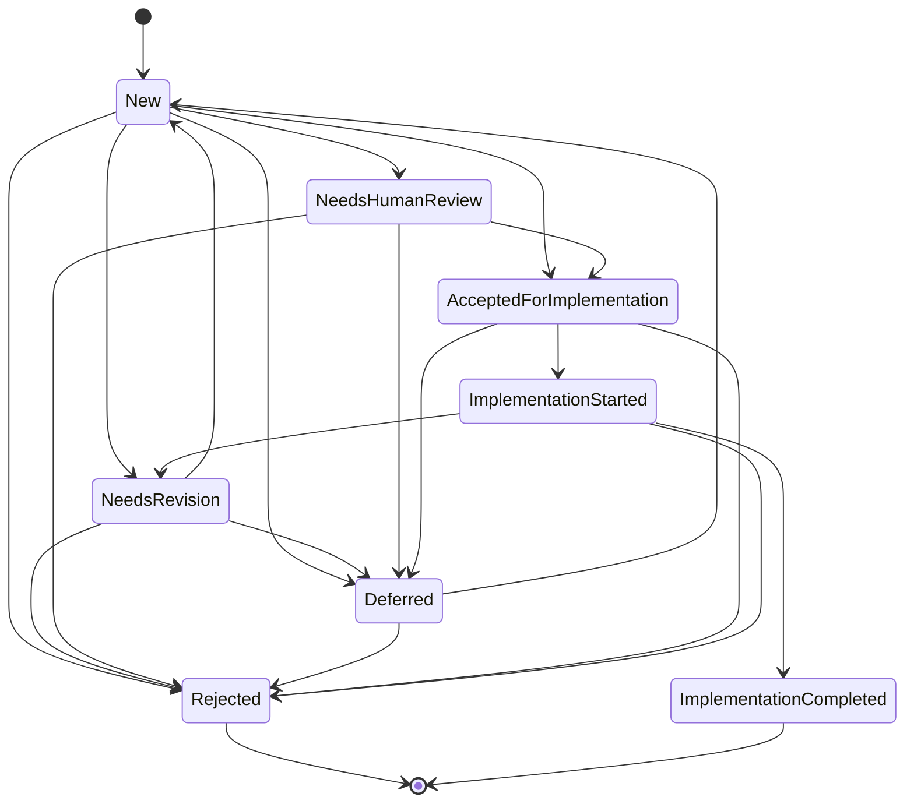

# Creative Ideas background thread — an idea-generation subsystem (design spike)

!!! note "Status — implemented; default-ON, opt-out"
    This subsystem is **wired and live**. The `CreativeIdeasThread` is registered
    with the `Mind` scheduler and runs on its configured cadence, gated
    **default-ON** behind `SIMARD_CREATIVE_IDEAS_ENABLED` (opt out with a falsey
    value), consistent with the Overseer and Journal threads. The generator uses
    a real agent-backed idea source; the four reviewers run as real
    skill/agent adapters; routing files real goals and human-review issues via
    `gh`; and idea-derived PRs are gated (draft + merge-blocking label + owner
    review) — the autonomous merge driver refuses any PR carrying that label.
    The creative-idea memory type (status lifecycle + typed links) lives upstream
    in `amplihack-memory-lib` (guideline G2); Simard orchestrates around it. All
    behaviour below is enforced in code and covered by hermetic tests.

## Problem statement

Simard improves herself by pursuing goals, distilling episodic memory into facts and
procedures, and letting the Overseer watch her process (see
[Overseer](overseer.md)). What she lacks is a **deliberate, always-on source of new
ideas** — a divergent-thinking process that periodically stands back from the current
work, surveys where she is, and proposes *diverse* candidate improvements before any
of them is committed to as a goal.

Today idea generation is implicit and reactive: an idea appears because a human
suggested it, a failure forced it, or an OODA cycle stumbled onto it. There is no
durable **pool of prospective ideas**, no structured **review** of an idea's
feasibility/necessity/measurability, and no **safe routing** from "interesting idea"
to "goal" or "human-gated change." This spike designs that subsystem.

The design must satisfy three constraints that shaped every decision below:

1. **One brain.** This is not a new service or a "Bridge." It is a **cognitive thread**
   plus a set of **reviewers** inside the single Simard brain, reusing the Mind
   scheduler and existing memory/goal/gh subsystems.
2. **Safe by construction.** The subsystem is **default-ON, opt-out** (consistent
   with the Overseer and Journal threads), but safe regardless of the switch:
   high-risk or irreversible ideas *always* route to human review; PRs born from
   creative ideas are **blocked from merge** (draft + label + owner review-required)
   until a human approves — enforced **without** `--admin` or `--no-verify`.
3. **Measured, not vibes.** Every accepted idea carries a concrete **success metric**
   (tied where possible to existing self-metrics) and only reaches
   `ImplementationCompleted` when that metric is met.

## Goals and non-goals

**Delivered:**

- A durable design (this document): data model, status state-machine, thread inputs,
  reviewer pipeline, routing, safety, and future milestones.
- Typed, tested Rust for: the `CreativeIdea` prospective-memory type + status
  state-machine + store/retrieve; the generator thread (typed inputs, pluggable
  idea-source, **registered with the Mind scheduler**, default-ON opt-out); the
  reviewer-pipeline trait + four adapters + synthesis; the routing (idea→goal,
  idea→issue+owner, idea-PR draft+label+owner-review gate) as typed functions.
- **Daemon wiring:** the thread is registered from the OODA daemon's
  cognitive-thread setup and ticks on its cadence, with a dedicated startup log
  line and a per-tick summary (see [Daemon wiring](#daemon-wiring)).
- A production agent-backed idea source, real skill/agent reviewer adapters, and
  a real `gh` routing seam — all driven by the wired thread.
- Tests with **no network** (fakes for reviewers / goal-store / issue-filer / gh /
  clock), including that an enabled tick generates + reviews + routes, that the
  daemon registers the thread when enabled, and that it is not registered when
  opted out.

**Non-goals (explicitly future work):**

- Adaptive cadence / richer portfolio + novelty scoring (M6 tuning).
- A native "links" edge type in prospective memory (see Decision 1 — links are
  carried in the payload for now; a `payload_version` 2 migration is future work).

## Key decisions (resolved ambiguities)

| # | Decision | Rationale |
|---|----------|-----------|
| 1 | Model `CreativeIdea` as a typed struct that **round-trips to/from** a `CognitiveProspective` node. Store `status`, `context`, and typed `links` as a JSON payload in `action_on_trigger`; `description` = the idea text; `status` mirrored into the prospective `status: String`. A thin `CreativeIdeaStore` seam wraps `store_prospective` / `list_all_prospective`. | Zero schema change to prospective memory; fully round-trippable; marks a native links field as future work. |
| 2 | Reuse **`ThreadKind::BackgroundThought`** for the generator thread; do not add an enum variant. | The variant is already reserved for "idle associative background thought"; avoids touching the enum and its exhaustive matches. |
| 3 | New top-level **`src/creative_ideas/`** owns the reviewer-pipeline trait, the four adapters, synthesis, routing, dedup/portfolio, and the config flag. The prospective type lives in `src/cognitive_memory/creative_idea.rs`; the generator thread in `src/cognitive_threads/threads/creative_ideas.rs`. | Respects "prospective type in `cognitive_memory`, thread in `cognitive_threads`" while keeping pipeline/routing cohesive and independently testable. |
| 4 | Do **not** mutate the live `gh` tooling. Define an `IdeaGhClient` **extension seam** (labeled+assigned issue creation; PR draft/label/owner-review-request), faked in tests and backed in production by `RealIdeaGhClient` (a `gh` subprocess impl using pure argv builders). Reuse the existing `GhClient` (`src/stewardship/gh_client.rs`) pattern; never `--admin` / `--no-verify`. | The existing `GhClient` has only `search_issues` / `create_issue`; the gate needs labels/assignees/draft/review. A separate seam adds these without touching the daemon's `gh` tooling and keeps every side effect independently testable with a fake. |

## Reuse map (what this design builds on — no duplication)

| Concern | Existing surface (reused) | This spike adds |
|---------|---------------------------|-----------------|
| Prospective memory | `CognitiveProspective` (`src/memory_cognitive.rs`); `CognitiveMemoryOps::store_prospective` / `list_all_prospective` / `check_triggers` / `resolve_prospective` (`src/cognitive_memory/mod.rs`) | `CreativeIdea` + `CreativeIdeaStore` seam that (de)serializes to a prospective node |
| Thread scheduling | `CognitiveThread` trait, `ThreadKind::BackgroundThought`, `SchedulePolicy`, `Priority`, `ThreadContext`, `ThreadOutcome` (`src/cognitive_threads/thread.rs`); the `Mind` scheduler (#2531) | `CreativeIdeasThread` implementing `CognitiveThread` (gated `enabled()`) |
| Goals | `GoalStore` trait, `GoalRecord`, `GoalStatus`, `GoalUpdate`, `goal_slug` (`src/goals/`) | `route_idea_to_goal(...)` producing a `Proposed` goal |
| GitHub issues | `GhClient` trait + `RealGhClient` (`src/stewardship/gh_client.rs`); `StewardshipIssueFiler` (`src/overseer/observer.rs`) | `IdeaGhClient` extension seam for labeled+assigned issues and PR gate |
| Reviewers | Existing agent/skill invocation (amplihack bin via `SIMARD_AMPLIHACK_BIN`; `AgentRole` in `src/agent_roles.rs`) | `Reviewer` trait + 4 adapters (skill/agent/synthesis) |
| Cross-pollination | Overseer observations (`src/overseer/`); the daily Journal (OODA observe/cycle) | Read-only inputs into the generator's observation window |
| Self-metrics | `recall_precision_at_k` (`RECALL_PRECISION_METRIC`, `src/cognitive_memory/metrics.rs`), distill fact-yield, reasoner-reliability | Measurability reviewer ties idea success metrics to these |
| Budget | `SIMARD_DAILY_BUDGET_USD`, `cost_tracking.rs` | Generator rate-limit + budget check before an expensive tick |

## Data model

### `CreativeIdea`

A `CreativeIdea` is the **prospective-memory** representation of one candidate
improvement. It is a typed struct that round-trips to a single `CognitiveProspective`
node (Decision 1).

```rust
// src/cognitive_memory/creative_idea.rs  (sketch)

/// A candidate self-improvement idea, stored as a prospective-memory node.
pub struct CreativeIdea {
    pub node_id: String,          // prospective node_id ("" until stored)
    pub idea: String,             // the idea text  -> prospective.description
    pub status: IdeaStatus,       // -> mirrored into prospective.status (String)
    pub context: IdeaContext,     // why/when/where it came from  -> payload
    pub links: Vec<MemoryLink>,   // supporting semantic/episodic/procedural nodes -> payload
    pub reviews: Vec<ReviewRecord>, // accumulated reviewer output -> payload
    pub success_metric: Option<SuccessMetric>, // set by measurability reviewer -> payload
    pub created_epoch: u64,       // injected clock -> payload
}

/// Typed edge to another memory node that supports/resources this idea.
pub struct MemoryLink {
    pub kind: MemoryLinkKind,     // Semantic | Episodic | Procedural
    pub node_id: String,
}

pub enum MemoryLinkKind { Semantic, Episodic, Procedural }

/// Provenance + situational context captured at generation time.
pub struct IdeaContext {
    pub source: String,           // e.g. "creative-ideas-thread"
    pub goals_snapshot: Vec<String>,
    pub observation_digest: String, // hash/summary of the >=24h window used
    pub rationale: String,
}
```

**Prospective mapping (round-trip):**

| `CognitiveProspective` field | `CreativeIdea` mapping |
|------------------------------|------------------------|
| `description` | `idea` (the idea text) |
| `status` | `status.as_str()` (mirrored `IdeaStatus`) |
| `trigger_condition` | fixed sentinel `"creative-idea"` (marks the node type for retrieval filtering) |
| `action_on_trigger` | JSON payload: `{ context, links, reviews, success_metric, created_epoch }` |
| `priority` | derived from portfolio/risk (higher = more urgent to review) |

The sentinel `trigger_condition = "creative-idea"` lets `CreativeIdeaStore` filter
`list_all_prospective(...)` down to creative-idea nodes without a schema change. The
payload is versioned (`payload_version`) so a future native-links migration can detect
old rows.

### Status state-machine

`IdeaStatus` is the lifecycle of an idea. Transitions are **explicit and validated**:
`CreativeIdea::try_transition(to)` returns `Err` for any disallowed edge, and every
transition is the *only* way `status` changes.

```rust
pub enum IdeaStatus {
    New,                     // freshly generated, not yet reviewed
    NeedsRevision,           // synthesis asked for a rewrite before acceptance
    NeedsHumanReview,        // high-risk / flagged: a human must decide
    AcceptedForImplementation,
    Rejected,                // terminal
    Deferred,                // parked; may be reconsidered later
    ImplementationStarted,   // a goal/PR is in flight
    ImplementationCompleted, // terminal; ONLY when success_metric is met
}
```

**Allowed transitions** (anything not listed is rejected):

| From | To |
|------|----|
| `New` | `AcceptedForImplementation`, `Rejected`, `Deferred`, `NeedsRevision`, `NeedsHumanReview` |
| `NeedsRevision` | `New` (re-enter review after rewrite), `Rejected`, `Deferred` |
| `NeedsHumanReview` | `AcceptedForImplementation`, `Rejected`, `Deferred` |
| `Deferred` | `New`, `Rejected` |
| `AcceptedForImplementation` | `ImplementationStarted`, `Deferred`, `Rejected` |
| `ImplementationStarted` | `ImplementationCompleted`, `NeedsRevision`, `Rejected` |
| `Rejected` | *(terminal — no outgoing)* |
| `ImplementationCompleted` | *(terminal — no outgoing)* |



Invariant enforced in code and tested: **`ImplementationCompleted` is reachable only
from `ImplementationStarted`, and the router refuses to complete an idea whose
`success_metric` has not been marked met.**

### `CreativeIdeaStore` seam

```rust
pub trait CreativeIdeaStore {
    fn store(&self, idea: &CreativeIdea) -> SimardResult<String>; // -> node_id
    fn update(&self, idea: &CreativeIdea) -> SimardResult<()>;    // re-serialize payload/status
    fn list(&self, limit: u32) -> SimardResult<Vec<CreativeIdea>>;
    fn get(&self, node_id: &str) -> SimardResult<Option<CreativeIdea>>;
}

/// Production adapter over CognitiveMemoryOps (thin; no new backend).
pub struct ProspectiveCreativeIdeaStore<'a> { mem: &'a dyn CognitiveMemoryOps }
```

`list` calls `list_prospective_by_trigger("creative-idea", limit)` — a
trigger-scoped, priority-ordered read whose `limit` bounds only creative-idea
nodes — then keeps rows whose `trigger_condition == "creative-idea"` (a cheap
fail-closed guard) and deserializes the payload. Before issue #122 `list` used
the unfiltered `list_all_prospective` + post-filter, so on a live store the fixed
read window filled with unrelated prospective memories and the idea nodes were
truncated away (see
[Creative Ideas trigger-scoped read](../reference/creative-ideas-trigger-scoped-read.md)).
Tests use an in-memory `FakeCreativeIdeaStore` **and** a round-trip test through a
fake `CognitiveMemoryOps`, plus a `>512`-node regression test.

## The generator thread

`CreativeIdeasThread` implements `CognitiveThread` (`src/cognitive_threads/threads/creative_ideas.rs`).

- **`kind()`** → `ThreadKind::BackgroundThought` (Decision 2).
- **`policy()`** → `SchedulePolicy::Interval(24h)` by default (a large observation
  window; configurable). Reserved to become `Adaptive` later.
- **`priority()`** → `Priority::Low` (never competes with OODA).
- **`enabled()`** → reads `SIMARD_CREATIVE_IDEAS_ENABLED` → **`false` by default**.
  A disabled thread never ticks (scheduler contract), so the subsystem is inert unless
  explicitly turned on.
- **`tick()`** → best-effort, self-contained (returns `ThreadOutcome::failed` rather
  than panicking), uses `ctx.now_epoch` (injected clock) and may `block_on`
  `ctx.runtime` for the idea-source and reviewers. It honors the two `ThreadContext`
  safety fields: it bails early when `ctx.shutdown` is set (cooperative cancellation)
  and performs **no destructive side-effect** (no goal/issue/PR writes) when
  `ctx.dry_run` is true.

### Thread inputs (the observation window)

The thread assembles a typed `GenerationInputs` from **read-only** sources:

```rust
pub struct GenerationInputs {
    pub current_goals: Vec<String>,          // GoalStore active/proposed
    pub recent_activity: ActivityWindow,     // >= 24h of progress & behavior (Journal/OODA)
    pub episodic_summaries: Vec<String>,      // cognitive-memory episodic digests
    pub works_in_progress: Vec<String>,       // open goals/PRs/sessions
    pub overseer_observations: Vec<String>,   // src/overseer (cross-pollination)
    pub conversation_insights: Vec<String>,   // extracted from meetings/conversations
    pub previous_ideas: Vec<CreativeIdea>,    // for dedup/novelty (store.list)
}
```

### Pluggable idea source

```rust
pub trait IdeaSource {
    /// Produce up to `n` diverse raw idea candidates from the inputs.
    fn generate(&self, inputs: &GenerationInputs, n: usize) -> SimardResult<Vec<RawIdea>>;
}
```

- **Production:** `AgenticIdeaSource` renders the generation prompt asset and runs
  one agentic turn through the shared `AgentInvoker` seam (idle-liveness, no
  wall-clock cap), fail-closed on a missing JSON envelope. **Tests:** a
  deterministic `FakeIdeaSource`. The thread targets **ten** ideas per run (the
  design's fixed batch), then applies dedup/portfolio filtering (below).
- Each surviving `RawIdea` becomes a `CreativeIdea { status: New, links, context }`,
  is persisted via `CreativeIdeaStore`, and is driven through the review-and-route
  pipeline by the same tick.

## Reviewer pipeline

Each new idea is reviewed by a fixed set of reviewers, then a synthesis step sets the
status. The pipeline is a trait so reviewers are pluggable and independently testable.

```rust
pub struct ReviewContext<'a> {
    pub idea: &'a CreativeIdea,
    pub inputs: &'a GenerationInputs,
}

pub struct Review {
    pub reviewer: &'static str,       // stable id for telemetry
    pub verdict: ReviewVerdict,       // Support | Concern | Block | NeedsHuman
    pub notes: String,
    pub flags: ReviewFlags,           // high_risk, irreversible, needs_human, ...
    pub proposed_metric: Option<SuccessMetric>, // measurability reviewer only
}

pub trait Reviewer {
    fn id(&self) -> &'static str;
    fn review(&self, ctx: &ReviewContext<'_>) -> SimardResult<Review>;
}
```

The four reviewers (run in order; all four contribute before synthesis):

1. **`crusty-old-engineer` (skill adapter).** Reviews **scope, feasibility, necessity,
   utility, inventiveness, RISK, need-for-human-review, practicality**. Sets
   `flags.high_risk` / `flags.needs_human` when warranted. Adapter shapes the amplihack
   skill invocation; tests use a fake.
2. **`philosophy-guardian` (agent adapter).** "Do we need this? Will it be an
   interesting enhancement?" — **explicitly, a user signal is NOT required to justify
   an idea; exploratory ideas are OK/encouraged.** The adapter therefore treats absence
   of a user signal as neutral, never as a `Block`.
3. **`measurability` (NEW reviewer agent).** Enhances the idea's **measurability**: how
   will we know it is effective / successful / actually improving Simard? It emits a
   concrete `SuccessMetric`, tied where relevant to existing self-metrics
   (`recall_precision_at_k`, distill fact-yield, reasoner-reliability). This metric is
   the *only* thing that can later move the idea to `ImplementationCompleted`.
4. **`idea-feedback-synthesis` (synthesis step).** Reads **all** reviews + the idea
   context, summarizes **next steps**, and **sets the status** per the state-machine.

```rust
pub struct SuccessMetric {
    pub name: String,           // e.g. "recall_precision_at_k"
    pub baseline: Option<f64>,
    pub target: String,         // e.g. ">= +0.05 over 7-day baseline"
    pub how_measured: String,
}

pub trait FeedbackSynthesizer {
    /// Fold all reviews into a next-status + human-readable next steps.
    fn synthesize(&self, ctx: &ReviewContext<'_>, reviews: &[Review])
        -> SimardResult<SynthesisOutcome>;
}

pub struct SynthesisOutcome {
    pub next_status: IdeaStatus,   // MUST be a legal transition from idea.status
    pub next_steps: String,
    pub set_metric: Option<SuccessMetric>,
}
```

**Synthesis policy (default, deterministic fake mirrors it for tests):**

- Any reviewer sets `flags.irreversible` **or** `flags.high_risk` **or**
  `flags.needs_human` → `NeedsHumanReview`.
- Any `Block` (non-philosophy) with no human flag → `Rejected` or `NeedsRevision`
  depending on whether the block is fatal or fixable.
- No metric produced → `NeedsRevision` (an idea with no way to measure success is not
  acceptable).
- Otherwise, sufficient support + a metric → `AcceptedForImplementation`.

The pipeline runner applies `try_transition` so an illegal synthesis verdict is a hard
error, not a silent corruption.

## Routing of reviewed ideas

Routing consumes an idea whose synthesis has set a terminal-ish status and dispatches
it. All routing functions are **typed, side-effect-via-seam, and fake-tested**.

### 1. Accepted, not flagged → a Goal

```rust
pub fn route_idea_to_goal(idea: &CreativeIdea, goals: &dyn GoalStore, now_epoch: u64)
    -> SimardResult<GoalRecord>;
```

Produces a `GoalRecord` (status `Proposed`, `slug = goal_slug(idea.idea)`), tagged in
its evidence/label with the originating `idea.node_id` so the goal is traceable back to
the idea. The idea transitions `AcceptedForImplementation → ImplementationStarted` when
the goal is created. Time is supplied as `now_epoch: u64` (unix-epoch seconds) — the
same injected-clock convention the thread's `tick` uses via `ctx.now_epoch`, rather than
a bespoke clock trait — so routing is deterministic in tests.

### 2. Accepted but flagged → a GitHub Issue tagging the owner

```rust
pub fn route_idea_to_issue(idea: &CreativeIdea, gh: &dyn IdeaGhClient, repo: &str)
    -> SimardResult<GhIssue>;
```

Creates an issue with a **specific label** (`creative-idea`) and **assigns the repo
owner (`rysweet`)**. Applies only to ideas in `NeedsHumanReview`. The issue body embeds
`idea.node_id` (traceability) and the synthesized next steps.

### 3. Idea-PR human-review gate

A PR that arises from a creative-idea goal must be **blocked from merge** until a human
approves — enforced by three mechanisms, **never** by `--admin` / `--no-verify`:

```rust
pub struct IdeaPrGate {
    pub draft: bool,                 // always true: kept as DRAFT
    pub blocking_label: &'static str, // "creative-idea-needs-human-review"
    pub review_requested_from: Vec<String>, // ["rysweet"] — owner review required
    pub originating_idea: String,    // idea.node_id (link back)
}

pub fn mark_idea_pr(pr_number: u64, idea: &CreativeIdea, gh: &dyn IdeaGhClient, repo: &str)
    -> SimardResult<IdeaPrGate>;
```

Enforcement model (all standard GitHub mechanisms, no privilege bypass). `repo`
(`owner/name`) is threaded through so the call reaches the correct repository — every
`IdeaGhClient` PR method requires it:

- **Draft** — a draft PR cannot be merged by anyone until marked ready.
- **Blocking label** — `creative-idea-needs-human-review`; branch-protection /
  required-status can key off this label to keep the merge button disabled.
- **Owner review-required** — `request-review` from `rysweet`; the PR needs the owner's
  approving review. Simard **requests** the review; she never approves her own gate.
- **Link-back** — the PR body carries `originating-idea: <node_id>` and the issue/goal
  carry the PR URL, closing the traceability loop (idea ↔ goal ↔ issue ↔ PR).

The idea only reaches `ImplementationCompleted` when (a) the PR merges through the
normal gate **and** (b) the idea's `success_metric` is marked met — both required.

### `IdeaGhClient` extension seam

```rust
pub trait IdeaGhClient {
    fn create_labeled_issue(&self, repo: &str, title: &str, body: &str,
        labels: &[&str], assignees: &[&str]) -> SimardResult<GhIssue>;
    fn set_pr_draft(&self, repo: &str, pr: u64, draft: bool) -> SimardResult<()>;
    fn add_pr_label(&self, repo: &str, pr: u64, label: &str) -> SimardResult<()>;
    fn request_pr_review(&self, repo: &str, pr: u64, reviewer: &str) -> SimardResult<()>;
}
```

- **Production:** `RealIdeaGhClient` shells out via pure argv builders
  (`gh issue create --label … --assignee …`, `gh pr ready --undo`, `gh pr edit
  --add-label`, `gh pr edit --add-reviewer`), reusing the `RealGhClient`
  subprocess pattern from `src/stewardship/gh_client.rs`. **Tests:**
  `FakeIdeaGhClient` records calls for assertions.
- **Never** emits `--admin` or `--no-verify`; a unit test asserts the constructed
  argument vectors contain neither flag.

## API contracts

This subsystem has **no HTTP/REST/GraphQL surface** — it is an in-process Rust
library. Its "API" is therefore the set of **public trait methods and free
functions** (the module "studs"). The equivalences to a network API are:

| Network concept | This subsystem |
|-----------------|----------------|
| Endpoint | A public trait method / routing free function |
| Request schema | The owned input struct(s) passed in |
| Response schema | The `Ok` payload of the returned `SimardResult<T>` |
| HTTP error / status | A typed `SimardError` variant |
| API version | On-disk payload version + stable env/GitHub identifiers (below) |

All fallible operations return the crate-wide `SimardResult<T>`
(`= Result<T, SimardError>`, `src/error/mod.rs`). No new `Result` alias, no
`anyhow`, no `Box<dyn Error>`, and no `unwrap()`/`expect()` on the runtime path
(tests may `expect`).

### Operation surface (the "endpoints")

| Operation | Request (input) | Response (`Ok`) | Primary error variants |
|-----------|-----------------|-----------------|------------------------|
| `CreativeIdeaStore::store` | `&CreativeIdea` | `String` (node_id) | `InvalidCreativeIdeaRecord`, `PersistentStoreIo`, `StoragePoisoned` |
| `CreativeIdeaStore::update` | `&CreativeIdea` | `()` | `InvalidCreativeIdeaRecord`, `PersistentStoreIo`, `StoragePoisoned` |
| `CreativeIdeaStore::list` | `limit: u32` | `Vec<CreativeIdea>` | `InvalidCreativeIdeaRecord` (payload parse), `StoragePoisoned` |
| `CreativeIdeaStore::get` | `&str` (node_id) | `Option<CreativeIdea>` | `InvalidCreativeIdeaRecord`, `StoragePoisoned` |
| `CreativeIdea::try_transition` | `to: IdeaStatus` | `()` | `InvalidIdeaTransition { from, to }` |
| `IdeaSource::generate` | `&GenerationInputs, n: usize` | `Vec<RawIdea>` | `ReviewUnavailable`, `BudgetExceeded` |
| `Reviewer::review` | `&ReviewContext` | `Review` | `ReviewUnavailable` |
| `FeedbackSynthesizer::synthesize` | `&ReviewContext, &[Review]` | `SynthesisOutcome` | `ReviewBlocked`, `InvalidIdeaTransition` (illegal `next_status`) |
| `route_idea_to_goal` | `&CreativeIdea, &dyn GoalStore, now_epoch: u64` | `GoalRecord` | `InvalidGoalRecord`, `InvalidIdeaTransition` |
| `route_idea_to_issue` | `&CreativeIdea, &dyn IdeaGhClient, repo: &str` | `GhIssue` | `ActionExecutionFailed`, `GitCommandFailed`, `CommandTimeout` |
| `mark_idea_pr` | `pr: u64, &CreativeIdea, &dyn IdeaGhClient, repo: &str` | `IdeaPrGate` | `ActionExecutionFailed`, `GitCommandFailed`, `CommandTimeout` |
| `IdeaGhClient::*` | (see seam above) | per method | `ActionExecutionFailed`, `GitCommandFailed`, `CommandTimeout` |
| `CreativeIdeasThread::tick` | `&mut ThreadContext` | `ThreadOutcome` | **never `Err`** — folds internal errors into `ThreadOutcome::failed` |

The request/response *schemas* are the structs already defined above
(`CreativeIdea`, `GenerationInputs`, `RawIdea`, `ReviewContext`, `Review`,
`SynthesisOutcome`, `SuccessMetric`, `IdeaPrGate`, `GhIssue`, `GoalRecord`).
Each is owned, `Clone + Debug`, and serde-serializable so it round-trips
through prospective memory and is trivially asserted in tests.

### Error-handling patterns

Errors reuse the crate `SimardError` (structured, named-field variants;
`Clone + Debug + Eq + PartialEq`). The design adds **exactly two** new
variants — a single, reviewed touch to the shared enum — each mirroring an
existing shape:

```rust
// src/error/mod.rs (the ONLY additions to the shared enum)
InvalidIdeaTransition {          // mirrors InvalidRuntimeTransition / InvalidSessionTransition
    from: IdeaStatus,
    to: IdeaStatus,
},
InvalidCreativeIdeaRecord {      // mirrors InvalidGoalRecord / InvalidImprovementRecord
    field: String,
    reason: String,
},
```

Everything else reuses existing variants — **no bespoke error machinery**:

- **Serialization** — `serde_json` (de)serialize failures fold into
  `InvalidCreativeIdeaRecord { field, reason }` via `map_err`, exactly as
  `goals::cognitive_memory_store` maps serde errors into `InvalidGoalRecord`.
- **State machine** — every illegal edge (from `try_transition` *and* from an
  illegal synthesis `next_status`) is `InvalidIdeaTransition { from, to }`.
- **Budget / rate limit** — the `tick` budget guard returns the existing
  `BudgetExceeded { period, spent, limit }` (or short-circuits to a skipped
  outcome when merely over cadence).
- **GitHub / routing** — the future real `IdeaGhClient` maps non-zero `gh`
  exits to `GitCommandFailed`/`ActionExecutionFailed` and hangs to
  `CommandTimeout`; fakes return `Ok`.
- **Reviewer adapters** — an unreachable skill/agent returns
  `ReviewUnavailable { reason }`; a fatal synthesis block surfaces as
  `ReviewBlocked { summary }`.
- **Fail-closed deserialization** — an unknown `IdeaStatus`, `ReviewVerdict`,
  or `MemoryLinkKind` string, or a `payload_version` newer than the reader
  understands, yields `InvalidCreativeIdeaRecord` — **never** a silent default.
  A newer on-disk row is a hard, visible error on an older binary, never
  misinterpreted.
- **Total `tick`** — `CreativeIdeasThread::tick` is infallible by contract:
  every internal `Err` is caught, `tracing::warn!`-logged with the stable
  `creative_ideas` thread id, and returned as `ThreadOutcome::failed(reason, elapsed)`.
  A single idea's failure never aborts the batch or the daemon.

### Versioning strategy

With no wire protocol, the only externally-observable contracts that must
remain stable are three; each has an explicit version discipline:

| Contract | Stability rule | Version mechanism |
|----------|----------------|-------------------|
| **On-disk prospective payload** (`action_on_trigger` JSON) | Additive-only within a major version; any rename/removal requires a bump + migration | `payload_version: u16` (starts at `1`). Reader: `== known` parse; `> known` → `InvalidCreativeIdeaRecord`; missing → assume `1` |
| **Node-type sentinel** (`trigger_condition = "creative-idea"`) | Never renamed — it is the retrieval key for already-stored rows | Literal `const CREATIVE_IDEA_TRIGGER`; a rename is a breaking migration, not an edit |
| **Operator / automation surface** (`SIMARD_CREATIVE_IDEAS_*` env vars; labels `creative-idea`, `creative-idea-needs-human-review`; assignee `rysweet`) | Names are the operator + GitHub-automation contract; treated as stable identifiers | Centralized as `const`s in `CreativeIdeasConfig`; changes are documented, breaking changes |

- **Trait/type API** — the Rust surface carries `#![allow(dead_code)]`
  and **no** semver promise yet. The `Reviewer`, `FeedbackSynthesizer`,
  `IdeaSource`, and `IdeaGhClient` traits are the intended long-term extension
  seams, so future capability is added via **new adapter impls** or **new
  trait methods with defaults**, never by changing an existing method signature.
- **Enum evolution** — adding an `IdeaStatus`/`ReviewVerdict` state is
  backward-compatible for *writers*, but per the fail-closed rule an older
  *reader* rejects an unknown state rather than guessing. Such a change
  therefore ships **reader-first** (deploy the reader that understands the new
  state before any writer emits it).
- **Forward-migration hook** (`// FUTURE:`) — promoting `links` from the JSON
  payload to native prospective edges bumps `payload_version` to `2`; a
  one-shot migration reads v1 rows, writes native edges, and rewrites the
  payload. It is safe precisely because v1 rows are self-identifying via
  `payload_version`.

## Safety — "more interesting, yet safe"

| Guardrail | Design | Scaffold hook |
|-----------|--------|---------------|
| **Dedup / novelty** | Reject a new idea that is a near-duplicate of a prior idea (token/shingle similarity over `previous_ideas`, threshold configurable). | `dedup::is_near_duplicate(new, prior, threshold)`; tested to reject a near-duplicate. |
| **Diversity / portfolio** | Keep a balanced portfolio: mix incremental/exploratory and low/high risk; the batch of ten is filtered to spread across risk/novelty buckets. | `portfolio::select_balanced(candidates, budget)`. |
| **Rate-limiting + budget** | The thread checks a per-day cap and `SIMARD_DAILY_BUDGET_USD` (via `cost_tracking`) before an expensive tick; over budget → skip. | `budget::within_budget(now, cfg)`; thread `tick` short-circuits. |
| **High-risk → human** | Any idea flagged high-risk/irreversible **always** routes to `NeedsHumanReview` (synthesis policy above); it can never auto-become a goal. | Enforced in `FeedbackSynthesizer` + `try_transition`. |
| **Cross-pollination** | Feed the Overseer's observations and the daily Journal into `GenerationInputs` (read-only). | `overseer_observations`, `recent_activity` fields. |
| **Outcome feedback** | Measured outcomes update idea status; `ImplementationCompleted` only when the idea's own `success_metric` is met. | `route::mark_completed(idea, metric_met)` refuses if `!metric_met`. |
| **Default-ON, opt-out** | Whole subsystem gated behind `SIMARD_CREATIVE_IDEAS_ENABLED` (default true); a falsey value opts out and the thread never ticks. | Config flag + test asserting the default-ON/opt-out gate. |
| **Dry-run honored** | The global `ThreadContext.dry_run` switch suppresses every destructive side-effect (goal/issue/PR writes); a dry-run tick still generates, reviews, and logs but writes nothing external. | `tick` checks `ctx.dry_run` before routing; routing seams are skipped. |
| **Cooperative shutdown** | The thread observes `ThreadContext.shutdown` (the scheduler's cancellation flag) and returns promptly between pipeline stages instead of blocking a daemon stop. | `tick` polls `ctx.shutdown` between generate → review → route. |

## Daemon wiring

The generator is registered from the OODA daemon's cognitive-thread setup
(`src/operator_commands_ooda/daemon/mod.rs`), alongside the Overseer and Journal
threads, and ticks on its configured cadence — it is not a separate process or a
"Bridge."

**Runtime gate.** The generic cognitive-thread scheduler master switch
(`SIMARD_COGNITIVE_THREADS_ENABLED`) is default-OFF and owns only the
maintenance / engineer-log threads. Creative Ideas is **not** behind it: the
daemon builds the `Mind` runtime when *either* that switch is truthy **or**
`CreativeIdeasConfig::from_env().enabled()` is true (default). This keeps the
existing threads' gating and timing byte-for-byte unchanged while letting the
default-ON Creative Ideas thread run on a stock deployment.

**Registration seam.** The daemon registers via
`register_creative_ideas_if_enabled(&mut mind, &cfg) -> bool`, which registers
only when `cfg.enabled()` and returns whether it did — so "opted out ⇒ not
registered" is a direct unit assertion (via `mind.health()` / `mind.len()`).

**Startup log line** (mirrors the Journal thread):

```text
[simard] OODA daemon: creative-ideas thread ENABLED (default) (interval = 86400s; SIMARD_CREATIVE_IDEAS_ENABLED opt-out)
```

or, when opted out:

```text
[simard] OODA daemon: creative-ideas thread DISABLED (SIMARD_CREATIVE_IDEAS_ENABLED opt-out)
```

**Per-tick log line** (through the shared scheduler prefix, whenever the thread
actually runs — due on the first cycle after startup, then every interval):

```text
[simard] cognitive-thread: creative_ideas: generated 10 idea(s), 8 survived dedup, 8 persisted, 8 reviewed (2 → goal, 1 → issue), 0 review error(s)
```

**Isolation.** Because generation + review touch the network with no wall-clock
cap, the tick runs on a background thread with an overlap guard (a slow tick is
dropped rather than stacked) and panic isolation, so it can never stall or crash
the authoritative OODA loop. Per-idea failures are logged and never abort the
batch; the tick is total (`ThreadOutcome::failed`, never `Err`/panic).

**Deployment.** The `simard-ooda` systemd unit (`scripts/simard-ooda.service`)
runs the subsystem on by default; the operator opts out with a drop-in setting
`SIMARD_CREATIVE_IDEAS_ENABLED=0`. See
[Configure and operate the Creative Ideas thread](../howto/configure-creative-ideas-thread.md#daemon-wiring-startup-how-the-operator-sees-it-run).

## Configuration & gating

| Env var | Default | Effect |
|---------|---------|--------|
| `SIMARD_CREATIVE_IDEAS_ENABLED` | `true` | Master switch; **default-ON, opt-out** — set a falsey value (`0`/`false`/`no`/`off`) to disable. When disabled the thread never ticks. |
| `SIMARD_CREATIVE_IDEAS_INTERVAL_SECS` | `86400` | Generator cadence (large observation window ≥ 24h). |
| `SIMARD_CREATIVE_IDEAS_BATCH` | `10` | Ideas targeted per run. |
| `SIMARD_DAILY_BUDGET_USD` | *(existing)* | Reused for budget-awareness. |

`CreativeIdeasConfig::from_env()` centralizes parsing and is the single source of truth
for gating; a test asserts a default-constructed config is **enabled** (default-ON) and
that only an explicit falsey value opts out.

## Observability

Structured `tracing` only (no `println!`/`eprintln!` beyond the `[simard] …` prefix
convention). Spans/metrics keyed on the stable thread id `creative_ideas` and reviewer
ids (`crusty_old_engineer`, `philosophy_guardian`, `measurability`,
`idea_feedback_synthesis`): ideas generated, deduped, per-verdict counts, routed→goal /
routed→issue / pr-gated, and status-transition events. These reuse the existing
cognitive-thread telemetry surface (`src/cognitive_threads/telemetry.rs`). The daemon
also emits a dedicated startup line (`… creative-ideas thread ENABLED (default) …`) and
a per-tick summary (`[simard] cognitive-thread: creative_ideas: generated N idea(s) …`),
which surface in `journalctl`, the Overseer activity feed, and the dashboard/journal —
see [Daemon wiring](#daemon-wiring).

## Module layout & scaffold-vs-future

```
src/cognitive_memory/creative_idea.rs      # CreativeIdea, IdeaStatus (+ try_transition),
                                           # MemoryLink, CreativeIdeaStore + Prospective adapter
src/cognitive_threads/threads/creative_ideas.rs  # CreativeIdeasThread (CognitiveThread, default-ON),
                                           # register + register_creative_ideas_if_enabled,
                                           # GenerationInputs, IdeaSource trait + FakeIdeaSource
src/creative_ideas/
  mod.rs        # CreativeIdeasConfig::from_env (gating)
  reviewers.rs  # Reviewer trait, Review, 4 adapters (skill/agent/measurability), fakes
  synthesis.rs  # FeedbackSynthesizer, default policy, SynthesisOutcome
  routing.rs    # route_idea_to_goal / route_idea_to_issue / mark_idea_pr, IdeaGhClient + fake
  dedup.rs      # near-duplicate + portfolio + budget helpers
  tests.rs      # unit tests (all fakes, no network)

src/error/mod.rs                           # + InvalidIdeaTransition { from, to },
                                           #   InvalidCreativeIdeaRecord { field, reason }
```

**Implemented (real, tested):** the types, the `IdeaStatus` state-machine +
`try_transition`, the two new `SimardError` variants (`InvalidIdeaTransition`,
`InvalidCreativeIdeaRecord`), the `CreativeIdeaStore` prospective round-trip (with
`payload_version` + append-only revisioning collapsed by `latest_revision_per_idea`),
the generator thread (registered with the `Mind` scheduler, default-ON) with a real
agent-backed `AgenticIdeaSource`, the four real reviewer/synthesis adapters
(`crusty-old-engineer` skill / `philosophy-guardian` agent / `measurability` agent /
deterministic fail-closed synthesis) driven through the shared session `AgentInvoker`
seam (idle-liveness, no wall-clock turn cap), the review-and-route `AgenticIdeaPipeline`
(accepted → goal, human-review → labeled+owner-tagged issue), the real `IdeaGhClient`
`gh` subprocess impl, the merge-driver block-until-human-review guard, dedup/portfolio/
budget helpers, the dashboard + TUI surfacing, and the hermetic tests below.

**Owned upstream (guideline G2):** the creative-idea memory type — the
`CreativeIdeaStatus` lifecycle state machine and the typed `MemoryLink`/`MemoryLinkKind`
(incl. `Goal`) taxonomy — lives in `amplihack-memory-lib`; Simard re-exports and
orchestrates around it.

**Deferred (`// FUTURE:` in the design only):** native prospective "links" edges
(payload_version 2 migration) and the M6 tuning items (adaptive cadence, richer
portfolio/novelty scoring).

## Test plan (no network; all fakes)

1. **State-machine** — `IdeaStatus::try_transition` allows only the edges in the table
   above; every disallowed edge returns `Err`; terminal states have no outgoing edges;
   `ImplementationCompleted` reachable only from `ImplementationStarted`.
2. **Persistence/retrieval** — a generated idea persists as a prospective node with its
   `links` and `context`, and is retrievable via `CreativeIdeaStore` (round-trip through
   a fake `CognitiveMemoryOps`, asserting `trigger_condition == "creative-idea"` and
   payload fidelity).
3. **Pipeline** — the runner invokes **all four** reviewers (fakes) and the synthesis
   step sets a status that is a legal transition from `New`.
4. **Routing — goal** — an `AcceptedForImplementation` (non-flagged) idea produces a
   `Proposed` goal in a fake `GoalStore`, tagged with the originating `node_id`.
5. **Routing — issue** — a `NeedsHumanReview` idea produces an issue via a fake
   `IdeaGhClient` with label `creative-idea` and assignee `rysweet`.
6. **Routing — PR gate** — `mark_idea_pr` marks the PR **draft**, adds label
   `creative-idea-needs-human-review`, and requests review from `rysweet`; a test
   asserts the constructed gh args contain **no** `--admin` / `--no-verify`.
7. **Dedup** — a near-duplicate of a prior idea is rejected.
8. **Default-ON, opt-out** — a default `CreativeIdeasConfig` is **enabled**
   (`enabled()` returns `true`), and only an explicit falsey value
   (`0`/`false`/`no`/`off`) via the env resolver opts out.
9. **Error contracts** — an illegal `try_transition` returns
   `InvalidIdeaTransition { from, to }`; a payload that fails to parse (bad JSON, or a
   `payload_version` newer than the reader) returns `InvalidCreativeIdeaRecord`, and an
   unknown `IdeaStatus`/`ReviewVerdict` string is rejected (fail-closed), never defaulted.
10. **Tick is total** — a `tick` whose idea source/reviewer returns `Err` yields
   `ThreadOutcome::failed` (not a panic, not `Err`), leaving the daemon unaffected.
11. **Wired tick — end to end** — with the thread enabled and injected fakes
    (`FakeIdeaSource`, stub reviewers, `DefaultSynthesizer`, in-memory `GoalStore`,
    `FakeIdeaGhClient`), one `tick` persists ideas into prospective memory, runs the
    four-reviewer pipeline, and produces routing outcomes — an accepted idea lands a
    goal in the store, a human-review idea lands an issue in the fake `gh` client.
12. **Daemon registration — enabled** — `register_creative_ideas_if_enabled` registers
    the `creative_ideas` thread with the `Mind` when the config is enabled (asserted via
    `mind.health()` / `mind.len()`) and returns `true`.
13. **Daemon registration — disabled** — with `SIMARD_CREATIVE_IDEAS_ENABLED=0` (via the
    env resolver), `register_creative_ideas_if_enabled` does **not** register the thread
    and returns `false`.

## Phased roadmap

Milestones **M1–M5 are delivered** (design + typed foundation, thread wiring,
real reviewers, routing side-effects, and the PR gate + outcome loop). The
subsystem is registered with the `Mind` scheduler and default-ON, opt-out.

- **M1 — foundation:** design + typed foundation + tests. *(delivered)*
- **M2 — store + thread:** `CreativeIdeasThread` registered with the `Mind`
  scheduler behind `SIMARD_CREATIVE_IDEAS_ENABLED`; a real agent-backed
  `IdeaSource` producing ideas into prospective memory; `ctx.dry_run` suppresses
  all writes/routing. *(delivered)*
- **M3 — real reviewers:** the four adapters run the real
  `crusty-old-engineer` skill / `philosophy-guardian` agent / measurability agent /
  synthesis through the shared session `AgentInvoker`; reviews persist on the idea.
  *(delivered)*
- **M4 — routing side-effects:** idea→goal and idea→issue (labeled + owner-tagged)
  via the real `IdeaGhClient` `gh` impl (never `--admin`/`--no-verify`).
  *(delivered)*
- **M5 — PR gate + outcome loop:** the draft + blocking-label + owner-review gate
  on creative-idea PRs, enforced by the merge driver's skip guard; measured
  outcomes move an idea to `ImplementationCompleted` only on a met `success_metric`.
  *(delivered)*
- **M6 — tuning (future):** adaptive cadence, richer portfolio balancing, novelty
  scoring, cross-pollination weighting from the Overseer/Journal; native
  prospective "links" edges (payload_version 2).
