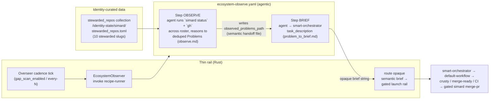

# Ecosystem Observe

> Simard stewards ~10 repositories. The way she notices work across them is the
> **`ecosystem-observe`** recipe: two agent steps (OBSERVE → BRIEF) driven by
> prompts, invoked on the Overseer's cadence by a thin Rust rail. There is no Rust
> "code sensor" — no Rust that calls `gh`, parses issue/PR/CI JSON, or holds
> per-repo observation counts. The observation lives entirely in the agent's
> reasoning and is handed forward semantically.

## Principle (operator directive)

> "Simard should not run on code and parsing but instead on deterministic
> workflows of agentic steps and prompts. It does not need a code sensor."

Concretely, this feature enforces four rules:

1. **The observation is agentic.** An agent runs `gh` across the stewarded repos
   and reasons about build/CI status, PRs, failing checks, fresh issues, stale
   branches, and dependency drift. Rust never queries or parses a repo.
2. **The handoff is semantic.** The prioritized Problem list flows from the
   OBSERVE step to the BRIEF step through an agent-authored, agent-read context
   file. The prohibition is on **Rust** parsing it — no Rust code scrapes,
   deserializes, or counts the handoff. The context file may itself carry a
   structured (e.g. JSON) Problem block that the *next agent* reads; that is
   still fully agentic, because only an LLM interprets it.
3. **Rust is a thin rail.** It only (a) schedules `ecosystem-observe` on the
   Overseer cadence and (b) forwards the agent's opaque semantic result into the
   existing gated launch machinery. It is a `RecipeLauncher`/`RecipeRunner` client
   — it does not itself look at any repo.
4. **The gated path is unchanged.** Every Problem still reaches implementation via
   `smart-orchestrator` → `default-workflow` → crusty review / merge-ready / CI →
   the gated `simard merge-pr --repo` merge. Ecosystem repos get no shortcut.

## Anti-pattern this replaces (retired)

The previous live observation was a single-repo Rust survey-and-parse in
`src/overseer/wiring.rs`:

- `const OVERSEER_SURVEY_REPO: &str = "rysweet/Simard"` — hardcoded, single repo.
- `survey_high_signal_open_issues` / `issue_coverage_from_open_prs` — ran `gh`
  from Rust and parsed the JSON into Rust structs.
- `detect_workstream_gaps` → `Vec<GapItem>` → `FlagWorkstreamGaps` — turned parsed
  numbers into an operator notification.

That path is **retired**. It only ever saw one repo, and it made Rust responsible
for observing and parsing — the exact anti-pattern the operator directive forbids.
It is replaced by the agentic `ecosystem-observe` recipe as the observation SOURCE.

> **Do not reintroduce it.** Any new Rust that calls `gh`, parses issue/PR/CI
> output, or holds a per-repo observation struct (counts, activity, problem lists)
> is the anti-pattern. The observation result is the agent's reasoning, not a Rust
> type. The only Rust that observation touches is the thin rail described below.

## Architecture



The three moving parts are: the **identity-curated roster**, the **recipe + prompts** (the
substance), and the **thin rail** (the only new Rust).

## 1. Roster — the single source of truth

The stewarded-repo list is **identity-curated, deploy-durable state** that Simard
OWNS and curates agentically — not a committed framework file bound to code. It
is the `stewarded_repos` collection of the generic identity-scoped mechanism in
`src/identity_curated_state.rs`.

**Durable file (single source of truth):**
`<state_root>/identity-state/simard/stewarded_repos.toml`
(`<state_root>` = `SIMARD_STATE_ROOT` → `SIMARD_HOME` → `~/.simard`).

**First-use seed (committed identity data):**
`prompt_assets/simard/identity/stewarded_repos.seed.toml`

On **first use** — before any durable file exists — the rail seeds the collection
from the committed seed (resolved **install-first** —
`~/.simard/prompt_assets/simard/identity/stewarded_repos.seed.toml` preferred over
the in-tree `<repo_root>/prompt_assets/simard/identity/stewarded_repos.seed.toml`)
and persists it under the state root. From then on the durable curated copy wins;
the seed is never consulted again. Because `install` re-installs `prompt_assets/`
on every self-deploy but **never** overwrites the state root, Simard's agentic
add/remove edits survive re-deploys. See
[Stewarded-roster resolution](../reference/ecosystem-roster-resolution.md) for the
full resolution ladders and the fail-closed loader / wiring contract.

```toml
# prompt_assets/simard/identity/stewarded_repos.seed.toml — the first-use SEED
# for Simard's identity-curated `stewarded_repos` collection. Generic curated-data
# shape: schema_version + a [[item]] array of { key, note }. For this collection
# `key` is an owner/name slug and `note` is a human label. Editing this seed only
# affects a FRESH identity that has not yet seeded its durable roster.
schema_version = 1

[[item]]
key = "rysweet/Simard"
note = "Orchestrator / self-improving engineering identity (steward of this roster)"

[[item]]
key = "rysweet/RustyClawd"
note = "Rust-native LLM agent SDK (base type)"

[[item]]
key = "rysweet/amplihack-rs"
note = "Core framework — skills, workflows, recipes, hooks, CLI, fleet"

[[item]]
key = "rysweet/azlin"
note = "Azure VM provisioning CLI"

[[item]]
key = "rysweet/amplihack-memory-lib"
note = "Graph-based 6-type cognitive memory (Kuzu-backed)"

[[item]]
key = "rysweet/amplihack-agent-eval"
note = "Agent evaluation harness — L1–L12 benchmarks"

[[item]]
key = "rysweet/agent-kgpacks"
note = "Knowledge graph packages — GraphRAG grounding"

[[item]]
key = "rysweet/amplihack-recipe-runner"
note = "Code-enforced YAML workflow execution engine"

[[item]]
key = "rysweet/amplihack-xpia-defender"
note = "Cross-Prompt Injection Attack detection library"

[[item]]
key = "rysweet/gadugi-agentic-test"
note = "Multi-agent outside-in testing (Electron/CLI/web/TUI)"
```

### Roster rules

- **Format.** `schema_version` (integer) plus a `[[item]]` array. Each item has a
  `key` (`owner/name` slug) and a human-readable `note`. Anything beyond these
  strings is ignored — it is data, not configuration for behavior.
- **`amplihack` means `rysweet/amplihack-rs`.** The Python `rysweet/amplihack` is
  deprecated and is not on the roster.
- **Validation (loader).** Slugs are validated as `owner/name` before use. Malformed
  slugs (whitespace, `..`, a leading `-`, shell metacharacters, missing `/`) are
  **skipped with a logged warning** — they never reach `gh`. An empty roster (no
  valid slugs) is an **error**, never a silent empty pass: the observation tick is
  skipped and warns, and no Problems are fabricated.
- **Roster as an allowlist.** The agent scans exactly the repos on the roster. It
  does not discover or expand to other repositories. Adding stewardship for a new
  repo is an agentic `add_item` edit against the `stewarded_repos` collection — no
  code change, and the edit survives self-deploys.

## 2. Prompts — the substance

### `prompt_assets/simard/overseer/observe.md` (generalized to multi-repo)

The OBSERVE prompt is generalized from a single `StatusSnapshot` to the whole
ecosystem. It **broadens** the observation — it does not drop Simard's own
meta-health signals. The agent still reads the `StatusSnapshot` (the value
`simard status` renders) *and* now runs `gh` across each roster repo, reasoning
over both into one unified Problem list. Its contract:

- **Input.** (a) Simard's own process-health signals — the agent runs
  `simard status` itself (agentic; Rust does not pre-render a `StatusSnapshot`
  into the prompt) to read distillation failure rate, restart churn, budget
  pressure, ladder exhaustion, CI clusters, and anomalies; (b) the roster
  (list of slugs + notes); and (c) the set of Simard's in-flight OODA refs (so it
  can dedup against work an engineer already owns). Cross-repo issue/PR titles and
  bodies are treated as **untrusted input** (XPIA framing): the step is strictly
  read-only and report-only; nothing the agent reads can trigger an effect except
  through the downstream gated path.
- **What the agent looks for, per repo.** Build/CI status; open PRs (green +
  mergeable = delivery-ready; failing = quality regression); failing checks and
  clusters; fresh high-signal issues; stale branches; dependency drift. These
  repo signals sit alongside the retained process-health signals, so the emitted
  `kind` set still spans `process_health` / `resource_pressure` /
  `delivery_ready` / `quality_regression` / `goal_hygiene` / `cross_cutting`.
- **Authorship scope.** Only `rysweet`-authored issues/PRs are actionable (per
  `engineer_system.md`).
- **Dedup.** A candidate Problem whose dedup key matches any in-flight ref is
  dropped — the Overseer never duplicates Simard's own OODA work. Per-repo `gh`
  failures are skipped with a note, not aborted.
- **Output.** A prioritized, **deduped** Problem list (kind / priority / dedup_key /
  summary with the triggering number / evidence), most-important first, written
  with the agent's file tool to the shared `observed_problems_path` handoff file
  for the BRIEF agent to read (Rust never reads it).

The `#2419 not wired live` banner is **removed** — this prompt is now loaded and
run by the `ecosystem-observe` recipe.

### `prompt_assets/simard/overseer/problem_to_brief.md` (unchanged contract)

The BRIEF prompt turns one Problem into a bounded `smart-orchestrator`
`task_description` — the same entrypoint engineers use. It consumes the OBSERVE
step's handoff directly from the shared context file (read by this agent, not by
Rust). For a `resource_pressure` or
otherwise non-code Problem it returns an escalation rather than fabricating a
brief. Its `#2419 not wired live` banner is **removed**.

## 3. Recipe — the deterministic agentic workflow

**File:** `prompt_assets/simard/recipes/ecosystem-observe.yaml`

Two agent steps with a semantic handoff carried through a **context-file path**
— the exact convention `goal-session-actor.yaml` uses and that
`recipe_context_file.rs` (`ContextFile`, issues #2640/#2692/#2622) provides.
The OBSERVE agent *writes* its deduped Problem list to the shared path with its
file tool; the BRIEF agent *reads* that same path with its file tool. Rust never
touches the payload. The `gh` calls happen **inside** the OBSERVE agent step's
reasoning — never in Rust, never between steps.

> **Handoff mechanism (verified).** No existing Simard recipe interpolates a
> prior step's `output:` capture as `{{that_output}}` into a later step. Every
> cross-step / cross-phase handoff rides a `{{<key>_path}}` context file (the
> proven `ContextFile` `<key>_path` transport). This recipe follows that same
> convention: the shared `observed_problems_path` is the seam, not a step-output
> variable. The `output:` field is retained only as the recipe's terminal
> stdout capture, not as an inter-step channel.

```yaml
name: "ecosystem-observe"
description: "Agentic multi-repo ecosystem observation → smart-orchestrator briefs"
version: "1.0.0"
author: "Simard"
tags: ["simard", "overseer", "observe", "ecosystem"]

context: {}

steps:
  # OBSERVE — the agent runs `gh` across the roster and REASONS to a deduped
  # Problem list, WRITING it to the shared context-file path with its file tool.
  # Loads prompt_assets/simard/overseer/observe.md.
  - id: "observe"
    type: "agent"
    agent: "default"
    prompt: |
      # ... contents of overseer/observe.md, generalized to multi-repo ...
      Roster file             = {{roster_path}}
      In-flight refs file     = {{inflight_refs_path}}
      Write your Problem list to = {{observed_problems_path}}
      {{escalation_note}}
    output: "observe_result"

  # BRIEF — turn each Problem into a bounded smart-orchestrator task_description.
  # READS observed_problems_path with its file tool and interprets it
  # SEMANTICALLY. Loads overseer/problem_to_brief.md.
  - id: "brief"
    type: "agent"
    agent: "default"
    prompt: |
      # ... contents of overseer/problem_to_brief.md ...
      Observed problems (read this path) = {{observed_problems_path}}
    output: "ecosystem_briefs"
```

- **Semantic handoff.** OBSERVE writes its reasoning to the file at
  `observed_problems_path`; BRIEF reads that file. The payload may be structured
  (a JSON Problem block is fine) — the invariant is that **no Rust** parses it;
  only the next agent does. Using a context-file path (not a `{{step_output}}`
  variable) matches the verified runner convention above and keeps an
  unbounded Problem list off `argv` (`ARG_MAX`-safe, per `ContextFile`).
- **Loadability.** The recipe is valid runner YAML and is parsed by the same
  recipe-loading test harness the other Simard recipes use. It resolves in both the
  worktree and installed layouts via the shared recipe-path resolution.
- **Context vars (passed via `-c`, all `_path` values via `ContextFile`).**

  | Var | Meaning |
  |-----|---------|
  | `roster_path` | Path to the roster the OBSERVE agent scans (the rail writes the validated stewarded-roster slugs to a `ContextFile`; see §4). |
  | `inflight_refs_path` | Path to Simard's in-flight OODA refs, for dedup. |
  | `observed_problems_path` | Shared handoff file: OBSERVE writes the deduped Problem list here, BRIEF reads it. |
  | `escalation_note` | Empty on the base attempt; carries a higher-effort / repair instruction on escalation-ladder retries (renders to nothing when empty). **Set by the rail, not by the `observe()` caller** — mirrors `ooda-orient.yaml` / `recipe_brain.rs`. |

## 4. Thin rail — the only new Rust

A tiny seam schedules the recipe on the Overseer cadence and forwards its result.
It mirrors the existing `RecipeLauncher` / `RecipeRunner` seam and holds **no**
observation state.

```rust
/// The thin rail. Invokes the `ecosystem-observe` recipe on the Overseer cadence
/// and returns its OPAQUE semantic result. It never inspects, parses, or counts
/// the result, and it never touches a repo.
pub trait EcosystemObserver {
    /// Run one observation pass.
    ///
    /// - `Ok(Some(brief))` — the recipe produced a semantic brief string to route
    ///   into the gated launch rail. `brief` is opaque prose; the rail forwards it
    ///   verbatim and never parses it.
    /// - `Ok(None)`         — nothing actionable this pass.
    /// - `Err(_)`           — infrastructure fault. The caller logs a warning,
    ///   skips the tick, and fabricates NO problems (fail-closed).
    fn observe(
        &self,
        roster: &[String],
        inflight_refs: &InFlightRefs,
    ) -> SimardResult<Option<String>>;
}
```

Behavior:

- **Cadence.** Reuses the existing gate: enabled unless opted out
  (`SIMARD_OVERSEER_GAP_SCAN` falsey), and only every N ticks
  (`SIMARD_OVERSEER_GAP_SCAN_EVERY_N`, floor 1). The unit of work changes from "a
  gap-scan" to "one agentic observation pass."
- **Roster + refs in, opaque string out.** The rail receives the validated roster
  (`&[String]`) and in-flight refs, writes each unbounded value to a
  per-invocation `ContextFile`, and passes only the short `<key>_path` tokens
  (`roster_path`, `inflight_refs_path`, `observed_problems_path`) on `argv`. It
  invokes the recipe-runner and forwards the opaque result string. The boundary
  type is a plain `String` — there is no `RepoActivity`, no `Problem` struct, no
  counts in Rust.
- **Escalation is rail-owned, not a trait parameter.** `escalation_note` is a
  recipe context var the rail sets (empty on the base attempt, populated on
  escalation-ladder retries) — exactly as `recipe_brain.rs` does for
  `ooda-orient.yaml`. It is deliberately **absent** from the `observe()`
  signature: the caller asks for one observation pass, and the rail owns the
  bounded retry/escalation wrapper internally.
- **Fail-closed.** A runner failure, an empty roster, or an unusable result yields
  "nothing actionable" — it never fabricates a brief or triggers an unintended
  launch. (Contrast the merge judge, which fails open; observation must not invent
  work.)
- **Guards preserved.** The recursion / steward-identity guard, in-flight dedup, gap
  dedup window, `rysweet`-only authorship, and the gated `merge-pr` path all remain
  in force.

### Retirement

The single-repo **gh survey-and-parse** — `OVERSEER_SURVEY_REPO` /
`OVERSEER_SURVEY_LIMIT`, `survey_high_signal_open_issues`,
`issue_coverage_from_open_prs`, `issue_refs_from_pr`, and `hash_issue_numbers` —
is **deleted** as the observation source: no Rust queries or parses a repo any
more. `workstream_gaps()` no longer surveys GitHub; the cross-repo observation is
now the agentic `EcosystemObserver`, invoked on the Overseer cadence in
`run_cycle`.

The `detect_workstream_gaps → FlagWorkstreamGaps` chain is **retained** but
narrowed: it is a pure function over Simard's own in-memory goal board +
anomalies (`detect_workstream_gaps(&board, &[], anomalies, &[])`) — board/backlog
hygiene, not a repo code sensor — so it is no longer fed any surveyed repo state.

## Configuration

The feature reuses the existing Overseer cadence knobs — no new env vars.

| Env var | Default | Effect |
|---------|---------|--------|
| `SIMARD_OVERSEER_ACTING` (or the acting-Overseer gate) | on when the Overseer runs | If the Overseer is off, observation is off. |
| `SIMARD_OVERSEER_GAP_SCAN` | on (opt-out) | Set to a falsey value (`0`, `false`, `no`) to disable ecosystem observation. |
| `SIMARD_OVERSEER_GAP_SCAN_EVERY_N` | `1` | Run the observation pass once every N Overseer ticks. Unset/empty/`0`/negative clamp to `1`. |

The stewarded roster itself is **identity-curated durable state**, not env and not
a committed framework file. The single source of truth is
`<state_root>/identity-state/simard/stewarded_repos.toml`
(`<state_root>` = `SIMARD_STATE_ROOT` → `SIMARD_HOME` → `~/.simard`), seeded once
from `prompt_assets/simard/identity/stewarded_repos.seed.toml`. Curate it with the
`add_item` / `remove_item` primitives against the `stewarded_repos` collection; the
edit is written to the state root, which `install` never overwrites, so it survives
self-deploys. See
[Stewarded-roster resolution](../reference/ecosystem-roster-resolution.md).

## Examples

### Run the observation chain by hand

```bash
# Point the recipe at the stewarded roster and Simard's in-flight refs, plus a
# writable handoff path for the OBSERVE→BRIEF semantic handoff. On the live
# cadence the rail creates these via ContextFile; by hand you pass real files.
amplihack recipe run prompt_assets/simard/recipes/ecosystem-observe.yaml \
  -c roster_path=~/.simard/identity-state/simard/stewarded_repos.toml \
  -c inflight_refs_path=/tmp/simard-inflight-refs.json \
  -c observed_problems_path=/tmp/simard-observed-problems.txt \
  -c escalation_note=""
```

The OBSERVE step scans each roster repo with `gh`, reasons to a deduped Problem
list, writes it to `observed_problems_path`, and the BRIEF step reads that file
and emits `smart-orchestrator` `task_description`s. The Overseer normally does
this for you on its cadence.

### Add a repo to stewardship

Curate the `stewarded_repos` collection agentically — an `add_item` upsert writes
the durable roster under the state root (which `install` never overwrites), so the
edit survives self-deploys. No code change, and no framework-file edit:

```toml
# The resulting durable roster at
# <state_root>/identity-state/simard/stewarded_repos.toml gains an item:
[[item]]
key = "rysweet/new-tool"
note = "Reason this repo is now stewarded"
```

Next observation pass includes it automatically. (Editing the committed seed
`prompt_assets/simard/identity/stewarded_repos.seed.toml` only affects a *fresh*
identity that has not yet seeded its roster.)

### Disable / throttle observation

```bash
# Disable entirely:
export SIMARD_OVERSEER_GAP_SCAN=0

# Or run it once every 6 ticks instead of every tick:
export SIMARD_OVERSEER_GAP_SCAN_EVERY_N=6
```

## Tutorial — how one ecosystem Problem becomes a merged PR

1. **Cadence tick.** The Overseer's cycle reaches an observation tick (gate on,
   every-N satisfied). The thin rail calls `EcosystemObserver::observe(roster, refs)`.
2. **OBSERVE (agent).** The recipe's OBSERVE step runs `simard status` and `gh`
   across the roster, reasons about health/CI/PR/issue/branch/dependency state,
   drops anything already in-flight, and writes a deduped, prioritized Problem
   list to the shared `observed_problems_path` handoff file.
3. **BRIEF (agent).** The BRIEF step reads that file semantically and writes a
   bounded `smart-orchestrator` `task_description` for each actionable Problem
   (escalating non-code Problems instead of briefing them).
4. **Route.** The rail receives the opaque brief string and forwards it into the
   existing gated launch machinery.
5. **Implement (gated).** `smart-orchestrator` → `default-workflow` produces a PR,
   which passes crusty review / merge-ready / CI.
6. **Merge (gated).** The PR merges only through `simard merge-pr --repo …` — the
   same authority path every ecosystem change already uses.

At no point does Rust query a repo, parse `gh` output, or hold a per-repo
observation struct. Observation is the agent's reasoning; Rust is the rail.

## Testing

- **Thin-rail unit tests (fake recipe-runner seam).** With a fake
  `EcosystemObserver` / recipe-runner: the recipe is invoked on cadence; a returned
  semantic result is routed to the brief/goal seam; a runner failure degrades
  safely — a logged warning, the tick skipped, and **no fabricated Problems**. No
  test parses `gh` output.
- **Roster loader tests.** Valid slugs load; malformed and injection-shaped slugs
  are rejected/skipped; an empty roster returns an error (never a silent empty pass).
- **Recipe loadability test.** `ecosystem-observe.yaml` parses and validates via the
  shared recipe-loading harness, including that the OBSERVE→BRIEF handoff is wired
  through the `{{observed_problems_path}}` context-file var (not a `{{step_output}}`
  interpolation), matching the proven `ContextFile` convention.
- The prompts and recipe are the substance and carry no Rust behavioral tests beyond
  loadability.

Gates: `cargo build`, `cargo test`, and `cargo clippy -- -D warnings` all pass. No
point-in-time report docs are committed.

## Security

- **XPIA is the dominant new risk.** The OBSERVE agent ingests attacker-controllable
  issue/PR text from public repos. Mitigation is structural: OBSERVE is strictly
  read-only / report-only; every effect stays behind the gated `smart-orchestrator`
  → merge-ready → CI → `merge-pr` rail. `observe.md` frames ingested cross-repo text
  as untrusted.
- **Command safety.** `gh` is invoked argv-only (`-R <slug>`), never shell-
  interpolated. The roster acts as an allowlist — no repo discovery or expansion.
- **Fail-closed.** Any fault yields "nothing actionable," so a failure never invents
  a brief or triggers an unintended launch.
- **Data.** The `stewarded_repos` collection holds only public slugs (safe to
  commit in the seed / persist under the state root — no secrets/PII). In-flight
  refs pass via a per-invocation context file, not argv.

## See also

- [`docs/design/overseer.md`](./overseer.md) — the Overseer's meta-OODA loop and
  capability map.
- [Stewarded-roster resolution](../reference/ecosystem-roster-resolution.md) —
  how the rail resolves the identity-curated durable roster (and its first-use
  seed) and its wiring contract.
- [`docs/ecosystem-map.md`](../ecosystem-map.md) — the human-readable repository
  inventory (points at the `stewarded_repos.seed.toml` seed for the stewarded roster).
- `prompt_assets/simard/overseer/observe.md` — the OBSERVE prompt.
- `prompt_assets/simard/overseer/problem_to_brief.md` — the BRIEF prompt.
- `prompt_assets/simard/recipes/ecosystem-observe.yaml` — the recipe.
