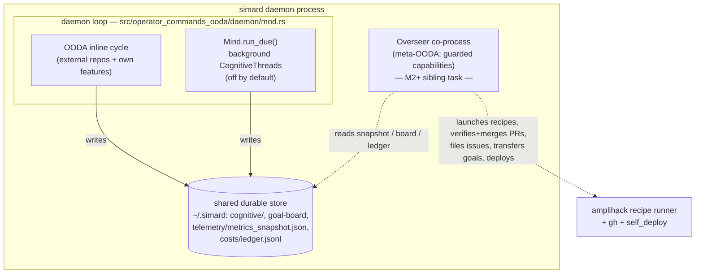
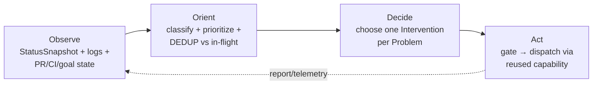

# Overseer — an embedded operator/observer co-process (design spike)

!!! note "Status — design + scaffolding only (#2419)"
    This is a **design spike**. It ships a design document, a Rust type/trait
    **sketch** (`src/overseer/`, additive and `#![allow(dead_code)]`), and prompt
    scaffolding (`prompt_assets/simard/overseer/`). It changes **no daemon runtime
    behavior**: nothing constructs or schedules an `Overseer`, and nothing is wired
    into `main` or the daemon loop. The goal is to fix the architecture, the reuse
    map, and the guardrails so a later milestone can wire it behind an env flag
    without redesigning.

## Problem statement

Over many sessions, a human + Copilot pair has acted as Simard's **operator**: not
writing Simard's feature code, but watching **how** Simard runs, spotting process
problems, and driving fixes and cross-cutting initiatives. Concretely that operator
has:

- **Monitored telemetry/health** — distillation parse-failure rate (≈62% at times),
  reasoner/brain `decide_ladder_exhausted`, graceful self-relaunch/restart churn
  (≈hourly), engineer spawn rate, LLM cost vs daily budget, cognitive-memory growth,
  gym-skip status.
- **Detected and diagnosed problems** — launch-banner pollution causing parse
  failures, goal-board multi-writer persistence race, stale-completion goals
  re-litigated forever, restart churn, weak distillation.
- **Driven fixes OUTSIDE Simard's loop** — launching amplihack recipe workstreams
  (`smart-orchestrator` → `default-workflow`), then **verifying** the resulting PRs
  (CI green + constraint checks: no `Bridge`, no stray `print!`, additive /
  non-breaking, PRD preserved), **resolving** merge conflicts, **merging**, and
  **deploying** the new binary, updating a deployed-commit marker.
- **Sequenced parallel workstreams** to avoid conflicts (feature recipes first;
  mechanical sweeps like rename / `print!`-purge one-at-a-time on shared OODA-core
  files).
- **Transferred goals** to Simard via the meeting REPL; ran **quality audits** in
  loops (crusty-old-engineer-gated); set up a recurring monthly self-audit.
- **Produced periodic status reports** (uptime, resources, tokens/cost, active
  workstreams, completed work by repo → PR, memory/brain stats, telemetry
  anomalies, goals, self-improvement PRs).
- **Curated naming/architecture** and filed **deduplicated** GitHub issues for
  recurring failures (stewardship mode).

That role is currently **human-in-the-loop**. This spike designs how to embed it as
an autonomous **co-process inside the daemon**, all in Rust, reusing Simard's
already-shipped machinery and the amplihack recipe runner. The operator role is
mechanical enough — observe a typed snapshot, classify, launch a known recipe,
verify against a checklist, merge/deploy through gated authorities — that it can be
encoded faithfully without inventing new execution machinery.

## The name: **Overseer**

We recommend one faculty name: **`Overseer`** (module `overseer`, type `Overseer`).

| Candidate | Verdict | Reason (grounded in source) |
|-----------|---------|-----------------------------|
| **Operator** | ✗ reject | Collides with **seven** existing modules — `operator_cli`, `operator_commands`, and `operator_commands_{dashboard,engineer,gym,meeting,ooda,review,terminal}` — which are the **human operator's manual CLI surface** (`simard goal`, `merge-pr`, `self-deploy`, `meeting`, …). Naming the autonomous faculty `operator` creates a three-way `operator` / `operator_cli` / `operator_commands` ambiguity. The Overseer *automates* that operator role, so it needs a distinct name. |
| **Copilot** | ✗ reject | Collides with `base_type_copilot`, `copilot_status_probe`, `copilot_task_submit`, and the `AMPLIHACK_AGENT_BINARY=copilot` agent binary. "amplihack Copilot" names the *pairing*, not a good type. |
| **Curator** | ✗ reject | Collides with `goal_curation` and implies a narrow (goal-only) scope. |
| **Sentinel** | ✗ reject | Connotes passive watching; the faculty also **acts** (launches, merges, deploys). |
| **Overseer** | ✓ **choose** | Collision-free in the codebase; connotes active meta-level supervision (an overseer *directs* work, not just watches). |

No type or module contains the word **`Bridge`** (operator preference; enforced as a
review rule for new code — see [pr-verify checklist](#pr-verify-checklist)).

## Architecture

### Decision: sibling co-process, not a `CognitiveThread`

The Overseer is a **sibling co-process** that shares the daemon's durable store and
telemetry — **not** a `CognitiveThread` hosted by the `Mind`. An optional *read-only
sensor* may be packaged as a thread for M1 (below), but the **acting** Overseer is a
co-process.

This is grounded in the shipped cognitive-thread contract
([reference](../reference/cognitive-thread-scheduling.md),
[howto](../howto/add-a-new-cognitive-thread.md)):

1. **Threads are least-authority.** A `CognitiveThread` receives a `ThreadContext`
   with exactly `{ state_root, repo_root, memory, runtime, shutdown, now_epoch,
   dry_run }` and is explicitly forbidden **"no code path to `self_deploy` /
   `self_relaunch` / redeploy"**. The Overseer's job **requires** guarded deploy
   authority and PR-merge authority — the opposite of a thread's mandate.
2. **Threads are small, bounded, best-effort chores.** They tick synchronously under
   a per-tick budget (`SIMARD_MIND_MAX_NONCRITICAL_PER_TICK`), are capped to
   `Priority::Low`/`Normal` (Critical is OODA-only), and are backed off on failure.
   The Overseer launches **long-running** recipe/merge/deploy work that must not be
   starved by, or steal budget from, the OODA cycle.
3. **Clean boundary / anti-recursion.** A thread runs *inside* the same scheduler as
   OODA. The Overseer must sit at the **meta level** — observing and improving
   Simard's own process — and must never be scheduled by, or schedule, Simard's
   OODA. Making it a co-process makes that separation structural, not conventional.

### How it shares store and telemetry

The Overseer's Observe step is **read-only** over the same durable sources the
daemon already flushes — it never reads daemon RAM, so it is process-agnostic:

- **Primary input:** `crate::status::assemble(&AssembleOptions)`
  (`src/status/provider.rs:58`) → `crate::status::StatusSnapshot`
  (`src/status/mod.rs`) — the exact value `simard status` renders on all three
  surfaces ([StatusSnapshot API](../reference/status-snapshot-api.md),
  [unified telemetry](../concepts/unified-telemetry-and-status.md)). Backed by
  `~/.simard/telemetry/metrics_snapshot.json`, `costs/ledger.jsonl`, `/proc`, and
  `systemctl`.
- **Goal board:** `crate::goal_curation::load_goal_board` for dedup/conflict checks,
  under the flock write-lock `BoardWriteLock` (#2514,
  `src/goal_curation/operations.rs:190`) when it proposes.
- **Cost:** `crate::cost_tracking` (`daily_summary`) + `SIMARD_DAILY_BUDGET_USD`.

### Embedding seam (described, not wired)

The daemon loop lives in `src/operator_commands_ooda/daemon/mod.rs`. Each iteration
it runs the authoritative OODA cycle inline, then ticks the `Mind`
(`mind.run_due(&mut ctx)`, ~L959–984; the `Mind` is wired ~L517–562, additive and
**off by default** via `SIMARD_COGNITIVE_THREADS_ENABLED`). Two future wiring
options — **neither implemented in this spike**:

- **M1 read-only sensor:** register an `impl CognitiveThread` next to
  `MaintenanceThread` / `EngineerLogAnalysisThread`. It only Observes → emits signals
  → files deduped issues → renders a report. It fits the least-authority
  `ThreadContext` because it takes **no** high-risk action.
- **M2+ acting Overseer:** spawn a sibling supervised task alongside the loop, holding
  the guarded capability handles. This is the co-process proper.

## The observer's meta-OODA loop

The Overseer runs its **own** OODA, distinct from Simard's repo-facing OODA and
modeled on the same Observe/Orient/Decide/Act pattern (`src/ooda_loop/cycle.rs`) with
deterministic floors under prompt-driven reasoners (mirroring `OodaOrientBrain` /
`OodaDecideBrain`). One turn is `Overseer::run_cycle` in the Rust sketch.

| Phase | What it does | Reuses |
|-------|--------------|--------|
| **Observe** | Assemble a typed `ObservedState` from `StatusSnapshot` + recent PR/CI/goal state; derive `Signal`s (`signal::signals_from`). | `status::assemble`; `cost_tracking`; PR reads via `PrGhClient` (`merge_authority.rs`). |
| **Orient** | Classify signals into `Problem`s, assign `Priority`, compute a coarse `dedup_key`, and **drop any problem an in-flight engineer already owns**. | `goal_curation::load_goal_board` (in-flight refs); dedup semantics mirror `stewardship::failure_signature`. |
| **Decide** | Choose exactly one `Intervention` per `Problem` (prompt-driven with a deterministic floor). | prompt `problem_to_brief.md`; routing floor mirrors `OodaDecideBrain`. |
| **Act** | Apply guardrails, then dispatch the intervention through the reused capability. `run_cycle` **plans**; execution is the M2+ Act seam (`Overseer::act`). | the capability map below. |

## Capability / action set → existing Simard modules

Every `Intervention` maps onto a capability trait (`src/overseer/capabilities.rs`),
and every capability is satisfied by an **existing** Simard function — the Overseer
is an orchestrator over shipped code, not a reimplementation.

| `Intervention` | Capability trait | Existing Simard reuse (file:line) |
|----------------|------------------|-----------------------------------|
| `LaunchRecipe{brief}` | `RecipeLauncher` | `amplihack recipe run amplifier-bundle/recipes/smart-orchestrator.yaml -c task_description=…` (`src/bin/simard_engineer_loop_recipe.rs:51`, `src/bin/simard_self_improve_recipe.rs:50`); `recipe-runner-rs` + `AMPLIHACK_AGENT_BINARY` (`src/stewardship/recipe_merge_judge.rs:191`); concurrency via `agent_supervisor::spawn_subordinate` (`src/agent_supervisor/lifecycle/spawn.rs:27`); output parse `recipe_output::extract` (`src/recipe_output/extract.rs`). |
| `VerifyAndMergePr{repo,pr}` | `PrOps::verify` + `PrOps::merge` | gates `evaluate_objective_gates` (`src/stewardship/merge_authority.rs:495`); merge `merge_pr_if_merge_ready` (`:564`); review `review_pipeline::{review_diff,should_commit}` (`src/review_pipeline.rs:128,147`). |
| `ResolveConflict{repo,pr}` | `PrOps::resolve_conflict` | `git_guardrails::check_git_safety` (`src/git_guardrails.rs:41`) around the union-merge / `--no-verify` push. |
| `Deploy{commit}` | `Deployer` | `self_deploy::orchestrator::SelfDeployOrchestrator::run` (`src/self_deploy/orchestrator.rs:229`); `self_relaunch::{build_canary,verify_canary,all_gates_passed,default_gates,handover}` (`src/self_relaunch/*`); marker `env!("SIMARD_GIT_HASH")` via `self_deploy::health`. |
| `FileIssue{run}` | `IssueFiler` | `stewardship::process_orchestrator_run` (`src/stewardship/mod.rs:51`); dedup `stewardship::{failure_signature,find_existing}` (`src/stewardship/dedup.rs`); backlog `goal_curation::enqueue_stewardship_issue`. |
| `TransferGoal{goal}` | `MeetingHost` | `meeting_repl::run_meeting_repl` (`src/meeting_repl/repl.rs:211`); `meeting_facilitator` handoff (`MeetingHandoff`, `write_meeting_handoff`); `meetings::PersistedMeetingGoalUpdate`. |
| `Report` | `StatusReader` | `status::provider::assemble` (`src/status/provider.rs:58`) rendered via `status::render::to_terminal` (`src/status/render.rs:28`) / `status::json::to_string_pretty` (`src/status/json.rs:12`); optional operator push via `ConversationChannel` (feature-gated — see [Design consolidation](#design-consolidation)). |
| `RunAudit{scope}` | `Auditor` | `self_quality_audit::run_self_quality_audit` (`src/self_quality_audit.rs`); recipe `prompt_assets/simard/recipes/monthly-self-quality-audit.yaml`. |
| `Escalate{reason}` | (guardrail) | surface to the operator; no auto-execution. |
| (curation) | `GoalCurator` | `goal_curation::{load_goal_board,promote_to_active,save_goal_board}`; `BoardWriteLock` (#2514, `operations.rs:190`); `MAX_ACTIVE_GOALS`. |

### Signal / Problem model

`Signal`s are cheap, additive indicators; `Problem`s are classified, prioritized,
deduplicated. Every signal cites the `StatusSnapshot` field it comes from:

| `Signal` | Snapshot source |
|----------|-----------------|
| `DistillFailureRate{pct}` | `telemetry.distill_fail_pct` |
| `RestartChurn{restarts}` | `telemetry.restart_churn` / `daemon.n_restarts` |
| `LadderExhausted{count}` | `memory.decide_ladder_exhausted` |
| `BudgetPressure{spent,budget}` | `llm.ledger_today.cost_usd` vs `llm.daily_budget_usd` |
| `EngineerSpawnRate{live}` | `resources.live_engineers` |
| `MemoryGrowth{nodes_total}` | `memory.nodes_total` |
| `GymSkipped` | `gym.skip_gym` |
| `CiFailureCluster{repo,failing}` | PR `statusCheckRollup` (`merge_authority`) |
| `PrReadyToMerge{repo,pr}` | `evaluate_objective_gates` OK |
| `StaleGoal{goal_id}` | goal board + failure counts |
| `Anomaly{detail}` | `telemetry.anomalies[]` |

## Guardrails (first-class)

Guardrails are a design centerpiece, not an afterthought. They **layer on top of**
Simard's always-on floors (`git_guardrails`, `ado_acl_guard`) — never replacing them.

### Autonomy boundary

Per the [operational autonomy model](../concepts/operational-autonomy-model.md):
**most operations run autonomously** ("for most operations she should not need
outside-party validation"), while a small **HIGH-RISK** set surfaces to the operator.
Autonomy removes the *human-wait*, never a *quality/safety gate*.

`guardrails::classify(&Intervention) -> RiskClass`:

- **Routine (autonomous):** `LaunchRecipe`, `VerifyAndMergePr`, `FileIssue`,
  `TransferGoal`, `Report`, `RunAudit`, `GoalCurator` proposals. Objective gates
  (CI-green, base allowlist, merge-judge) stay intact.
- **HIGH-RISK (gated → `Escalate` unless opted in):** `Deploy` (self-mutating binary
  swap), `ResolveConflict` (can involve force-adjacent / `--no-verify` pushes),
  `Escalate`. These map to the autonomy model's five gated operations (force-push /
  history rewrite, repo/branch deletion, public/breaking API change,
  security/credential change, writes to protected `~/src` repos), enforced by
  `git_guardrails` + `ado_acl_guard`. `AutonomyGate.allow_high_risk` defaults `false`.

### Anti-recursion (never loop on itself; never entangle with OODA)

Two layers:

1. **Structural.** The Overseer is a co-process, **not** a `CognitiveThread`, so
   Simard's OODA scheduler never runs it and it never runs OODA. The two loops
   cannot drive each other.
2. **Identity (`guardrails::RecursionGuard`).** The Overseer stamps its own work
   (author login, `overseer/` branch prefix, `overseer:` goal-source tag) and
   **refuses to act on its own artifacts** — it never verifies/merges/deploys its own
   PRs, sweeps its own branches, or re-opens goals it filed. Combined with Orient's
   dedup against in-flight work, this prevents both self-loops and fighting Simard's
   engineers.

### Budget + concurrency caps

- **Budget (`guardrails::BudgetGate`).** Before any cost-bearing intervention
  (`LaunchRecipe`, `RunAudit`), check today's spend vs `SIMARD_DAILY_BUDGET_USD`
  (default 500, the same knob OODA uses) via `cost_tracking::daily_summary`. Over
  budget → hold + report, never launch.
- **Concurrency.** A per-cycle launch cap (`max_launches_per_cycle`) bounds how many
  workstreams one cycle starts, on top of the launcher's own AIMD engineer cap
  (`agent_supervisor` / `SIMARD_MAX_CONCURRENT_ACTIONS`). The Overseer never raises
  real parallelism beyond the AIMD ceiling.

### Conflict-avoidance sequencing

`guardrails::ConflictSequencer` admits at most one active workstream per
`sequence_group`. Feature recipes (unsequenced) may run in parallel; **mechanical
sweeps** that touch shared OODA-core files (renames, `print!`-purges) declare a
group (e.g. `ooda-core`) and run **one-at-a-time**, exactly the operator's manual
discipline. This prevents the Overseer's own workstreams from colliding on shared
files.

### pr-verify checklist

`PrOps::verify` runs a checklist before any merge. Items 1–2 and 7 reuse existing
code; items 3–6 are **new additive diff-scans** this design introduces (they do not
exist yet):

| # | Check | Status |
|---|-------|--------|
| 1 | CI green (all required checks SUCCESS/NEUTRAL/SKIPPED) | reuse `evaluate_objective_gates` |
| 2 | Mergeable + base-branch allowlist | reuse `evaluate_objective_gates` |
| 3 | No `Bridge` naming in added lines | **new** diff-scan |
| 4 | No stray `print!`/`println!`/`eprintln!` in added `src/**` | **new** diff-scan |
| 5 | Additive / non-breaking (no removed `pub` items) | **new** diff-scan |
| 6 | PRD (`Specs/ProductArchitecture.md`) preserved | **new** check |
| 7 | No Bug/Security finding ≥ High | reuse `review_pipeline::should_commit` |

See `prompt_assets/simard/overseer/pr_verify.md` and `deploy_gate.md`.

## Persisted state

The Overseer is **deliberately DB-free**, matching the cognitive-thread rule
("do not add a schema, migration, or table"). It persists only small, file-backed
markers under the shared state root (`~/.simard/overseer/`):

| State | Shape | Why |
|-------|-------|-----|
| Last-cycle marker | epoch file (reuse `self_quality_audit::{read_last_run,write_last_run}`) | durable cadence across restarts |
| Active workstreams | `{ dedup_key → WorkstreamHandle }` (JSON) | dedup + poll launched recipes to their PRs |
| Active sweep groups | list of `sequence_group` | conflict sequencing across cycles |
| Deployed-commit marker | reuse the existing `self_deploy` marker (`env!("SIMARD_GIT_HASH")` + drift check) | do not duplicate deploy bookkeeping |

Durable *findings* are **GitHub issues or code**, never committed snapshot docs
(stewardship rule). Everything else lives in telemetry and the `StatusSnapshot`.

## Explicit boundary vs Simard's own OODA

| | **Simard's OODA** (`ooda_loop`) | **Overseer meta-OODA** (`overseer`) |
|---|---|---|
| Scope | External repos she stewards + her own feature work | Simard's **own** health/process + cross-cutting initiatives |
| Runs as | Inline daemon cycle + `Mind` threads | **Sibling co-process** (M2+) |
| Observe input | Repo/goal/git/gym/memory state | `StatusSnapshot` + PR/CI/goal state |
| Acts by | Spawning engineers on goals (`AdvanceGoal`, …) | Launching recipes on **process** problems; verify/merge/deploy; file issues; transfer goals |
| Scheduling | The OODA scheduler | Its own loop — never scheduled by, and never schedules, OODA |
| Self-reference | Advances the goal board | **Refuses its own artifacts**; dedups against OODA's in-flight work |

The Overseer works **above** Simard's OODA. When it finds a *process* problem it
either files a deduped issue, launches a fix workstream, or **transfers a goal** to
Simard via a meeting — it does not reach into the OODA loop's state.

## Rust sketch

The type/trait sketch lives in `src/overseer/` (additive, `#![allow(dead_code)]`,
clippy-clean, unit-tested; **not** wired into `main`):

| File | Contents |
|------|----------|
| `capabilities.rs` | `OverseerError`; `ObservedState` (Observe input, field-by-field cited); the eight capability traits (`StatusReader`, `RecipeLauncher`, `PrOps`, `Deployer`, `MeetingHost`, `IssueFiler`, `GoalCurator`, `Auditor`), each doc-annotated with the exact reused function; supporting briefs. |
| `signal.rs` | `Signal`, `Problem`, `ProblemKind`, `Priority`; pure `signals_from`. |
| `intervention.rs` | `Intervention` (the nine variants above) + `PlannedIntervention`. |
| `guardrails.rs` | `RiskClass` + `classify`; `AutonomyGate`; `RecursionGuard` + `Subject`; `BudgetGate`; `ConflictSequencer`. |
| `mod.rs` | `Overseer` co-process type + `Capabilities`; `run_cycle` (meta-OODA); `orient` / `decide` / `classify_signal`; `act` (M2+ execution seam); tests. |

The trait method signatures reference self-contained newtypes (so the sketch
compiles independently of upstream signature drift); the **doc comments carry the
precise reuse contract** naming each existing function/file. An optional read-only
`impl CognitiveThread` sensor (M1) is described above; the acting Overseer is the
co-process.

## Design consolidation

This design has been reconciled against the code at HEAD before implementation.
The `src/overseer/` scaffolding matches the [Rust sketch](#rust-sketch) table
exactly (five modules, wired additively at `src/lib.rs:104`, `#![allow(dead_code)]`,
**not** reachable from `main`), and every reuse target in the
[capability map](#capability-action-set-existing-simard-modules) was verified to
resolve to a real symbol. The ledger below is the authoritative reference the M1+
implementation follows — it replaces "trust the citations" with "citations verified".

### Grounding ledger (verified at HEAD)

| Reuse target | Resolved symbol (file:line) |
|---|---|
| Observe input | `status::provider::assemble` (`src/status/provider.rs:58`) → `StatusSnapshot` |
| Report render | `status::render::to_terminal` (`src/status/render.rs:28`); `status::json::{to_string, to_string_pretty}` (`src/status/json.rs:7,12`) |
| Merge gates | `stewardship::merge_authority::evaluate_objective_gates` (`src/stewardship/merge_authority.rs:495`) |
| Merge | `stewardship::merge_authority::merge_pr_if_merge_ready` (`:564`) |
| Issue filing / dedup | `stewardship::process_orchestrator_run` (`src/stewardship/mod.rs:51`); `failure_signature` / `find_existing` (`src/stewardship/dedup.rs`) |
| Recipe launch | `amplihack recipe run … smart-orchestrator` (`src/bin/simard_engineer_loop_recipe.rs:51`) |
| Deploy / canary | `self_deploy::orchestrator::SelfDeployOrchestrator::run` + `self_relaunch` gates |
| Goal transfer | `meeting_repl::run_meeting_repl` (`src/meeting_repl/repl.rs:211`) |

One drift was found and fixed during consolidation: the `Report` row above
previously cited the module paths `status::render` / `status::json`; the real
public entry points are `status::render::to_terminal` and
`status::json::to_string_pretty`.

### Merge authority takes no `--admin` path (verified)

The Overseer never bypasses branch protection. Grounding confirms `--admin` /
`--no-verify` appear **only** in comments and the `ResolveConflict` docstring —
never in the merge path. `merge_pr_if_merge_ready` gates on
`evaluate_objective_gates` (required checks green + base-branch allowlist) and
merges through the normal `gh` path, so pr-verify checks #1–2 and the
"objective gates only" guarantee are code-backed, not aspirational.

### Reporting / operator-delivery seam (feature-independent)

`Report` (and the operator side of `TransferGoal`) render through the same
telemetry surface `simard status` uses, with **no Cargo-feature dependency**:

- **Default delivery:** `status::render::to_terminal(&snapshot)` (human) /
  `status::json::to_string_pretty(&snapshot)` (machine) to the log / operator.
- **Optional push delivery:** the `ConversationChannel` trait
  (`src/conversation_channel/mod.rs:90`; `send(Outbound)` is **async** —
  `impl Future + Send`). The concrete `SignalConversation` sender is behind
  `#[cfg(feature = "signal")]` (`src/lib.rs:139`, **default off**), so **M1
  `Report` must not hard-depend on `signal`** — it degrades to the render path
  when the feature is absent.
- **No-network tests** reuse `MockConversationChannel`
  (`src/conversation_channel/mock.rs`) and assert on `.sent()`, satisfying the
  roadmap's "no network" test constraint for the reporting path as well as the
  issue-filer.

### Terminology note

The daemon-side host type is still `Mind` (the `*Brain` → reasoner rename has
not landed at HEAD), so this document uses `Mind` deliberately. The pr-verify
"no `Bridge` naming" scan (check #3) is therefore scoped to **added lines only**
— pre-existing `terminal_engineer_bridge` code is untouched by the Overseer.

## Phased roadmap

Each phase is independently shippable, additive, and gated behind an env flag
(`SIMARD_OVERSEER_*`, default off).

| Milestone | Scope | Reuse | Test strategy | Exit criteria |
|-----------|-------|-------|---------------|---------------|
| **M1 — read-only observer** | Observe + Orient + `Report` + `FileIssue` only. Optional packaging as an `impl CognitiveThread` sensor. No launches, no merges, no deploy. | `status::assemble`; `stewardship::process_orchestrator_run` (deduped issues); `cost_tracking`. | Unit: `signals_from` thresholds; `orient` dedup vs in-flight; issue-filer idempotency with a fake `GhClient` (no network). | Runs behind flag; emits a report + files deduped issues; provably takes no write action beyond issue-filing. |
| **M2 — autonomous fix-launching + PR verify/merge** | `LaunchRecipe` (smart-orchestrator), poll → PR, `VerifyAndMergePr` for green/merge-ready PRs (routine autonomy). | `spawn_subordinate` / recipe runner; `merge_pr_if_merge_ready`; `evaluate_objective_gates`; `review_pipeline`; NEW pr-verify diff-scans (Bridge / `print!` / additive / PRD). | Unit: budget gate holds launches; per-cycle launch cap; pr-verify checklist pass/fail on fixture diffs; merge only when `ready`. Integration: fake recipe runner + fake `PrGhClient`. | Launches a fix for a seeded process problem and merges the resulting green PR through the gated authority, in a fixture. |
| **M3 — guarded deploy + goal transfer** | `Deploy` (HIGH-RISK, opt-in) via canary gates + marker update; `ResolveConflict`; `TransferGoal` via meeting REPL. | `SelfDeployOrchestrator` + `self_relaunch` gates + marker; `git_guardrails`; `run_meeting_repl` + handoff. | Unit: deploy gate refuses no-op/rollback/red-canary/crash-loop; HIGH-RISK gated off by default; recursion guard refuses own PRs. Integration: fake deployer/canary; meeting handoff round-trip. | With opt-in, advances the deployed-commit marker only on a green canary; otherwise escalates. Never touches `~/.simard/worktrees`. |
| **M4 — audits + self-tuning** | `RunAudit` loops (crusty-old-engineer-gated) on demand; recurring self-audit; threshold self-tuning of `SIMARD_OVERSEER_*` knobs. | `self_quality_audit::run_self_quality_audit`; `monthly-self-quality-audit.yaml`; telemetry history. | Unit: audit scope routing; tuning stays within clamped floors; no unbounded growth. | Runs a bounded audit loop and adjusts thresholds within floors, all observable in telemetry. |

## Test strategy (cross-cutting)

- **Pure + injected-clock unit tests**, no sleeps, no network (the shipped
  cognitive-thread discipline): thresholds, dedup, gating, sequencing, recursion.
- **Injected capability fakes** for every trait (the sketch's tests already do this
  for all eight) so behavior is asserted with zero side effects.
- **Idempotency** on `FileIssue`/`LaunchRecipe` (a second cycle finds the existing
  issue/workstream and does not duplicate) — mirrors `stewardship` dedup tests.
- **Failure isolation**: a failing capability degrades one intervention, never the
  cycle (Observe failure aborts the cycle cleanly; board-read failure degrades to
  "no dedup", never a crash).

## Risks and sharp edges (crusty review)

This spike is intentionally incomplete. Before ANY acting milestone (M2+) is
built, these must be resolved — they are hard gates, not advice.

1. **Closed self-modification loop.** `VerifyAndMergePr` is currently classed
   Routine/autonomous while `Deploy` is HIGH-RISK. Autonomous-merge plus eventual
   auto-deploy is a closed loop gated only by "CI green" — which is the absence of
   one signal, not judgment. The failure mode is slow degradation across many
   green-but-wrong merges (the Knight Capital shape). **Do NOT classify
   `VerifyAndMergePr` as Routine on day one** — keep it human-in-loop / `Escalate`
   until M1 signal quality is proven. Autonomy is earned, not defaulted.

2. **The safety checks are the unbuilt part.** The pr-verify diff-scans (items
   3–6: no-`Bridge`, no-`print!`, additive, PRD-preserved) are specified, not
   implemented. **M2 (merge authority) is HARD-GATED on those existing and being
   unit-tested.** No merge capability ships before the merge-safety scans do.

3. **`RecursionGuard` must fail CLOSED.** `is_own()` returns `false` when the
   identity fields (`author_login`/`branch_prefix`/`goal_source_tag`) are empty, so
   a misconfiguration silently disables anti-recursion. A guardrail that turns
   itself off when unconfigured is worse than none. When identity is unconfigured,
   `admit()` on a PR/commit subject must REFUSE (error), not allow. The Overseer
   must also run under a DISTINCT identity — never the human operator's login, or
   `is_own` will (correctly) refuse the human's PRs too.

4. **Two controllers, one mutable store.** Observe is read-only, but Act writes
   heavily (goal board, issues, launched engineers) into the same state Simard's
   OODA concurrently mutates. "The loops can't drive each other" is about
   scheduling, not shared state. Dedup (drop problems an in-flight engineer owns)
   is racy: read→decide→act has a window. Treat this as a coordination problem
   (two-autoscalers-on-one-cluster / split-brain), document the race window, and
   keep the per-cycle launch cap conservative.

5. **Operator expedients are not autonomous policy.** `--no-verify` pushes and
   admin-merges past pending CI are deliberate human shortcuts under supervision.
   Baked into an unattended loop they keep the shortcut and lose the judgment.
   `ResolveConflict` is correctly HIGH-RISK; do not let routine merge paths inherit
   the expedients.

6. **Single-source the budget.** `BudgetGate` hardcodes `500.0`; read
   `SIMARD_DAILY_BUDGET_USD` so it cannot drift from the OODA loop's ceiling.

7. **Prefer M1. Earn the rest.** M1 (observe → report → file deduped issues)
   delivers most of the value (visibility) at a fraction of the risk. M2–M4 should
   be justified by M1's signals proving boring, not assumed.

### References
- Knight Capital, SEC order (2013): https://www.sec.gov/litigation/admin/2013/34-70694.pdf
- Bainbridge, *Ironies of Automation* (1983): https://www.ise.ncsu.edu/wp-content/uploads/2017/02/Bainbridge_1983_Automatica.pdf
- Google SRE Book, *Automation at Google*: https://sre.google/sre-book/automation-at-google/

## Non-goals (this spike)

- No daemon runtime behavior change; nothing wired into `main` or the daemon loop.
- No always-on process; no redeploy; no writes to the live `~/.simard/worktrees`.
- No new database/schema; no new always-on metrics endpoint.
- The `Bridge`/`print!`/additive/PRD diff-scans are **specified**, not implemented.

## Related reading

- [Operational autonomy model](../concepts/operational-autonomy-model.md) — the
  autonomy boundary and HIGH-RISK gating this design inherits.
- [Cognitive-thread scheduling](../reference/cognitive-thread-scheduling.md) and
  [Add a new cognitive thread](../howto/add-a-new-cognitive-thread.md) — the
  least-authority thread contract that justifies co-process over thread.
- [StatusSnapshot API](../reference/status-snapshot-api.md) and
  [Unified telemetry and status](../concepts/unified-telemetry-and-status.md) — the
  Observe input.
- [Stewardship API](../reference/stewardship-api.md) — deduped issue filing.
- [Self-Deploy API](../reference/self-deploy-api.md) and
  [Cross-repo merge authority](../reference/cross-repo-merge-authority.md) — the
  guarded deploy and merge actions.
- [Overseer operator-notification reliability](../reference/overseer-operator-notifications.md)
  and [Configure Overseer email notifications](../howto/configure-overseer-email-notifications.md)
  — the reliable, safe two-channel (Signal + email) operator-notification path, including
  the anti-self-ingest Signal marker and the authenticated SMTP relay.
