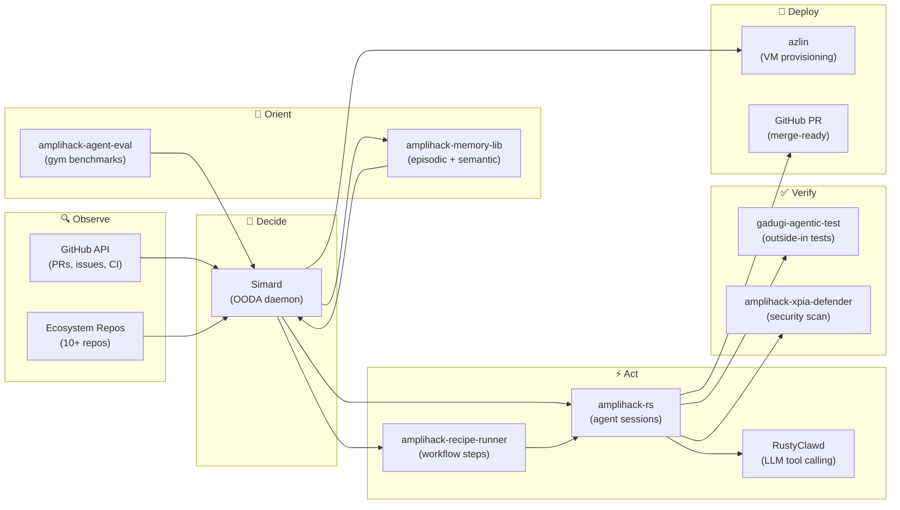

# Amplihack Ecosystem Map

> A comprehensive inventory of the repositories that form the amplihack agentic
> coding platform, their relationships, and how they fit together.
>
> **Last updated**: 2026-06-12 — auto-generated from GitHub API metadata and
> `prompt_assets/simard/engineer_system.md`.

## Overview

The amplihack ecosystem is a constellation of repositories that together form an
agentic coding platform. At its center is **Simard** — an autonomous engineering
identity that orchestrates work across the ecosystem — built on top of
**RustyClawd** (LLM SDK) and **amplihack-rs** (the core framework). Supporting
libraries provide cognitive memory, security hardening, workflow execution,
evaluation, knowledge grounding, testing, and remote infrastructure. Two
security-focused applications — **skwaq** (vulnerability research) and
**Powderfinger** (cloud weakness deployment and investigation) — share the
same Rust + RustyClawd foundation and demonstrate the ecosystem's reach
beyond coding automation into security analysis.

The ecosystem is predominantly **Rust** for performance-critical runtimes,
**Python** for ML/evaluation tooling, and **TypeScript** for testing
infrastructure.

## Repository Inventory

### Active Repositories

| Repository | Description | Primary Language | Role | Updated |
|---|---|---|---|---|
| [Simard](https://github.com/rysweet/Simard) | Terminal-native autonomous engineering identity | Rust | Orchestrator / self-improving agent | 2026-06-11 |
| [RustyClawd](https://github.com/rysweet/RustyClawd) | Rust-native LLM agent SDK — tool calling, streaming, provider abstraction | Rust + Python | Agent SDK (base type) | 2026-04-03 |
| [amplihack-rs](https://github.com/rysweet/amplihack-rs) | Core framework — skills, workflows, recipes, hooks, CLI, fleet management | Rust | Framework / CLI | 2026-06-11 |
| [azlin](https://github.com/rysweet/azlin) | Azure VM provisioning CLI for rapid dev environment setup | Rust | Infrastructure / fleet | 2026-05-03 |
| [amplihack-memory-lib](https://github.com/rysweet/amplihack-memory-lib) | Graph-based 6-type cognitive memory system (Kuzu-backed) | Rust + Python | Memory subsystem | 2026-04-11 |
| [amplihack-agent-eval](https://github.com/rysweet/amplihack-agent-eval) | Agent evaluation harness — L1–L12 progressive difficulty benchmarks | Python | Evaluation / benchmarking | 2026-04-22 |
| [agent-kgpacks](https://github.com/rysweet/agent-kgpacks) | Knowledge graph packages — domain-specific GraphRAG for agent grounding | Python | Knowledge / RAG | 2026-03-25 |
| [amplihack-recipe-runner](https://github.com/rysweet/amplihack-recipe-runner) | Code-enforced YAML workflow execution engine | Rust | Workflow execution | 2026-05-01 |
| [amplihack-xpia-defender](https://github.com/rysweet/amplihack-xpia-defender) | Cross-Prompt Injection Attack detection and defense library | Rust | Security | 2026-03-10 |
| [gadugi-agentic-test](https://github.com/rysweet/gadugi-agentic-test) | Multi-agent outside-in testing for Electron, CLI, web, and TUI apps | TypeScript | Testing | 2026-06-02 |
| [amplihack-traits](https://github.com/rysweet/amplihack-traits) | Shared Rust traits (LLM completion, Agent, Grader) breaking circular deps | Rust | Foundational traits | 2026-04-02 |
| [skwaq](https://github.com/rysweet/skwaq) | Self-improving multi-agent vulnerability analyzer — 18 agents, LadybugDB code property graph, taint analysis, multi-agent debate | Rust | Security research | 2026-05-06 |
| [Powderfinger](https://github.com/rysweet/Powderfinger) | Multiagent system for dynamic killchain generation — deploys vulnerable Azure infra, investigates cloud weaknesses, shift-left scanning | Rust | Security deployment & investigation | 2026-05-12 |

### Deprecated / Archived

| Repository | Status | Successor |
|---|---|---|
| [amplihack](https://github.com/rysweet/amplihack) (Python) | **Deprecated** | [amplihack-rs](https://github.com/rysweet/amplihack-rs) |
| [gadugi](https://github.com/rysweet/gadugi) | **Archived** | [gadugi-agentic-test](https://github.com/rysweet/gadugi-agentic-test) |

### Supporting / Ancillary

| Repository | Description | Primary Language |
|---|---|---|
| [amplifier-bundle-recipes](https://github.com/rysweet/amplifier-bundle-recipes) | Recipe definitions for the amplifier bundle | Python |
| [eval-recipes](https://github.com/rysweet/eval-recipes) | Evaluation recipe configurations | HTML |
| [recipe-agent-azure-hive](https://github.com/rysweet/recipe-agent-azure-hive) | Azure hive orchestration recipe | Shell |
| [recipe-agent-eval-parity-review](https://github.com/rysweet/recipe-agent-eval-parity-review) | Eval parity review recipe | — |

### Notable Workspace Crates (inside amplihack-rs)

The `amplihack-rs` repository is a Rust workspace containing **26 crates**.
Two frequently referenced by name are:

| Crate | Purpose |
|---|---|
| `amplihack-hooks` | Pre/post tool-use hooks for workflow enforcement and safety |
| `amplihack-multilspy` | Multi-language LSP integration for code intelligence |
| `amplihack-security` | Security primitives (sandboxing, permission checks) |
| `amplihack-fleet` | Multi-agent fleet orchestration |
| `amplihack-hive` | Distributed hive mind coordination |
| `amplihack-workflows` | Workflow definitions and execution logic |
| `amplihack-cli` | CLI entry point and command routing |
| `amplihack-memory` | Internal memory abstraction (distinct from amplihack-memory-lib) |

## Dependency Graph

Cross-repository crate and package dependencies:

```mermaid
graph TD
    subgraph "Foundational Layer"
        TRAITS["amplihack-traits<br/><i>Rust traits: Agent, Grader, LLM</i>"]
        XPIA["amplihack-xpia-defender<br/><i>XPIA detection library</i>"]
        MEMORY["amplihack-memory-lib<br/><i>6-type cognitive memory</i>"]
    end

    subgraph "SDK Layer"
        RUSTY["RustyClawd<br/><i>rustyclawd-core + rustyclawd-tools</i>"]
    end

    subgraph "Framework Layer"
        AMP_RS["amplihack-rs<br/><i>26-crate workspace: CLI, hooks,<br/>workflows, fleet, security</i>"]
        RECIPE["amplihack-recipe-runner<br/><i>YAML workflow executor</i>"]
    end

    subgraph "Application Layer"
        SIMARD["Simard<br/><i>Autonomous engineering identity</i>"]
        AZLIN["azlin<br/><i>Azure VM provisioning</i>"]
    end

    subgraph "Security Applications"
        SKWAQ["skwaq<br/><i>Multi-agent vulnerability analyzer</i>"]
        POWDER["Powderfinger<br/><i>Cloud weakness deployment &amp; investigation</i>"]
    end

    subgraph "Evaluation & Knowledge"
        EVAL["amplihack-agent-eval<br/><i>L1–L12 agent benchmarks</i>"]
        KGPACKS["agent-kgpacks<br/><i>GraphRAG knowledge packs</i>"]
    end

    subgraph "Testing"
        GADUGI["gadugi-agentic-test<br/><i>Outside-in agentic testing</i>"]
    end

    %% Cross-repo compile-time dependencies
    SIMARD -->|"rustyclawd-core<br/>rustyclawd-tools"| RUSTY
    SIMARD -->|"amplihack-memory"| MEMORY

    %% Trait hierarchy (as documented in amplihack-traits README)
    MEMORY -.->|"depends on"| TRAITS
    AMP_RS -.->|"depends on"| TRAITS

    %% Runtime integrations
    SIMARD -.->|"spawns agent sessions via"| AMP_RS
    SIMARD -.->|"runs recipes via"| RECIPE
    SIMARD -.->|"provisions VMs via"| AZLIN
    SIMARD -.->|"benchmarks via"| EVAL
    SIMARD -.->|"validates with"| GADUGI
    SIMARD -.->|"domain knowledge via"| KGPACKS
    AMP_RS -.->|"uses for defense"| XPIA

    %% Security application dependencies
    SKWAQ -->|"rustyclawd-core<br/>rustyclawd-tools"| RUSTY
    POWDER -->|"rustyclawd-core<br/>rustyclawd-tools"| RUSTY
    SKWAQ -.->|"code property graph"| MEMORY
    SKWAQ -.->|"vuln knowledge via"| KGPACKS
    SKWAQ -.->|"runs recipes via"| RECIPE
    POWDER -.->|"CWE knowledge graph"| KGPACKS
    POWDER -.->|"runs recipes via"| RECIPE

    classDef rust fill:#deb887,stroke:#8b4513,color:#000
    classDef python fill:#306998,stroke:#FFD43B,color:#fff
    classDef typescript fill:#3178c6,stroke:#fff,color:#fff
    classDef mixed fill:#9370db,stroke:#483d8b,color:#fff

    class SIMARD,AMP_RS,RECIPE,XPIA,AZLIN,TRAITS,SKWAQ,POWDER rust
    class EVAL,KGPACKS python
    class GADUGI typescript
    class RUSTY,MEMORY mixed
```



**Legend**: Solid arrows = compile-time crate dependencies (pinned by git rev).
Dashed arrows = runtime integration (subprocess spawning, CLI invocation, API calls).

## Data Flow

How data moves through the ecosystem during a typical autonomous engineering cycle:



## Integration Points

### Simard ↔ RustyClawd

Simard depends on `rustyclawd-core` and `rustyclawd-tools` as compile-time
crate dependencies (pinned to commit `43ebaa1`). RustyClawd provides the LLM
completion pipeline — streaming responses, tool calling, and provider
abstraction (Anthropic, OpenAI, Azure). Simard uses these crates for all direct
LLM interactions in its engineer, meeting, and gym modes.

### Simard ↔ amplihack-memory-lib

Simard depends on the `amplihack-memory` crate (pinned to commit `4ab3def`)
from the amplihack-memory-lib repository. This gives Simard its 6-type
cognitive memory model: sensory (raw observations), working (active context),
episodic (session events), semantic (distilled knowledge), procedural
(step-by-step procedures), and prospective (future trigger-action pairs). The
memory is backed by Kuzu, an embedded graph database.

### Simard ↔ amplihack-rs

Simard spawns subordinate `amplihack` sessions as subprocesses for parallel
engineering work. The amplihack-rs CLI provides the agent runtime — skills,
workflows, hooks, and fleet management — that these sessions execute in.
Simard's engineer mode creates GitHub issues, launches amplihack coding
sessions to implement them, reviews output, and tracks progress.

### Simard ↔ amplihack-recipe-runner

The recipe runner executes multi-step YAML-defined workflows (e.g.,
`smart-orchestrator`, `default-workflow`, `investigation-workflow`). Simard
invokes `amplihack recipe run` to drive structured task execution. The runner
enforces step ordering in compiled Rust code — models cannot skip or reinterpret
steps. Skwaq and Powderfinger also use the recipe runner for their own
multi-step workflows (investigation pipelines, deploy-investigate-score loops),
making it a shared execution backbone across the ecosystem.

### Simard ↔ azlin

Simard uses azlin for remote fleet management — provisioning Azure VMs,
deploying agent sessions to remote machines, and managing distributed
engineering work across multiple hosts.

### Simard ↔ amplihack-agent-eval

The evaluation framework runs L1–L12 benchmark scenarios against Simard (and
other agents) to measure memory recall, tool use, planning, and reasoning.
Simard's gym mode runs these benchmarks, identifies weaknesses, and delegates
improvement work to coding agents — forming a self-improvement loop.

### Simard ↔ gadugi-agentic-test

Gadugi provides outside-in end-to-end testing. Simard's quality standards
require qa-team scenarios written and validated with `gadugi-test validate` /
`gadugi-test run` before PRs are merge-ready. The framework tests CLI, TUI,
web, and Electron interfaces using autonomous AI agents.

### Simard ↔ agent-kgpacks

Simard uses agent-kgpacks for domain-specific knowledge grounding. Knowledge
packs provide structured GraphRAG context — Simard can install packs covering
its own codebase, the amplihack framework internals, or external domain
knowledge to enrich its orient/decide phases with grounded facts rather than
relying solely on LLM training data.

### amplihack-rs ↔ amplihack-xpia-defender

The XPIA defender library scans text, bash commands, URLs, and inter-agent
messages for prompt injection patterns. amplihack-rs integrates this for
security hardening of agent pipelines — blocking dangerous content with a
fail-closed default.

### amplihack-traits (foundational)

The traits crate defines `Agent`, `Grader`, `LlmCompletion`, and shared types
that multiple Rust repos depend on. It breaks circular dependencies:

```
amplihack-traits           ← leaf (no amplihack deps)
  ↑
amplihack-memory-lib       ← depends on traits
  ↑
amplihack-rs               ← depends on traits + memory-lib
```

### agent-kgpacks (knowledge grounding)

Knowledge packs convert documentation into local graph databases with vector
search. Installed as agent skills, they provide domain-specific grounded context
at query time — replacing reliance on training data for specialized topics.

### skwaq ↔ RustyClawd + LadybugDB

Skwaq is a self-improving multi-agent vulnerability analyzer. Its 18 specialized
agents (taint tracker, exploit assessor, binary analyst, debate moderator, etc.)
are powered by RustyClawd for LLM tool calling. Skwaq builds a code property
graph in LadybugDB (the same embedded graph engine used by Simard's cognitive
memory) and uses multi-agent debate to reason about exploitability. A built-in
Skwaq Gym benchmarks detection accuracy against 6 industry datasets and drives a
self-improvement loop — similar in architecture to Simard's own gym-driven
improvement.

**Integration with the ecosystem:**
- **RustyClawd** — all 18 agents use `rustyclawd-core` + `rustyclawd-tools`
- **LadybugDB** — shared graph engine with `amplihack-memory-lib`
- **agent-kgpacks** — vulnerability knowledge packs provide domain-specific
  grounding (CWE taxonomies, exploit patterns, hardening guidance)
- **amplihack-recipe-runner** — skwaq uses YAML recipes for structured
  multi-step investigation workflows (ingest → analyze → debate → report)
- **Self-improvement pattern** — mirrors Simard's gym → analyze failures →
  propose improvements → overfitting review loop
- **Simard potential** — Simard could orchestrate skwaq scans as a security
  quality gate before PR merges

### Powderfinger ↔ RustyClawd + agent-kgpacks

Powderfinger is a multiagent system with three complementary aspects: red team
(deploy intentionally vulnerable Azure infrastructure from CWE descriptions),
blue team (investigate real tenants for cloud weaknesses), and shift-left
(scan Terraform plans at PR time and watch deployments via webhooks). All three
share a 959-CWE knowledge graph.

**Integration with the ecosystem:**
- **RustyClawd** — investigation agents use `rustyclawd-core` for LLM reasoning
- **agent-kgpacks** — CWE knowledge graph is a domain-specific knowledge pack
- **amplihack-recipe-runner** — Powderfinger uses YAML recipes for structured
  deploy → investigate → score workflows
- **gadugi-agentic-test** — Powderfinger's deploy → investigate → score loop
  parallels gadugi's outside-in testing methodology
- **Simard potential** — Simard could run Powderfinger's `scan-plan` against
  infrastructure PRs across the ecosystem, and use `deploy → investigate → score`
  as a gym benchmark for security agent improvement

## How the Pieces Fit Together

For someone new to the ecosystem, here is the mental model:

1. **amplihack-traits** is the leaf crate that defines shared interfaces. If you
   are writing a new Rust component that needs to talk to agents or graders,
   start here.

2. **amplihack-memory-lib** gives any agent persistent, graph-based memory with
   six cognitive categories. It depends on traits and is consumed by both Simard
   and amplihack-rs.

3. **RustyClawd** is the LLM SDK — it handles the raw mechanics of talking to
   Claude, GPT, etc. with tool calling and streaming. Simard uses it directly.

4. **amplihack-rs** is the framework. It is a 26-crate Rust workspace that
   provides everything an agentic coding session needs: CLI, workflows, hooks,
   fleet management, security, delegation, and more. The `amplihack` binary is
   what users install and run. Notable internal crates include `amplihack-hooks`
   (pre/post tool-use enforcement) and `amplihack-multilspy` (multi-language LSP
   integration).

5. **amplihack-recipe-runner** executes YAML workflow recipes in compiled Rust
   code, making step-skipping physically impossible. It drives structured
   multi-step agent workflows like `smart-orchestrator`.

6. **amplihack-xpia-defender** provides prompt injection defense. It is a
   standalone library that amplihack-rs integrates for security scanning.

7. **Simard** sits at the top. She is an autonomous engineering identity that
   uses RustyClawd for LLM calls, amplihack-memory-lib for persistent memory,
   and orchestrates work by spawning amplihack-rs sessions. She monitors all
   ecosystem repos, creates issues, launches coding agents, reviews output, and
   runs gym benchmarks — continuously improving herself and the platform.

8. **azlin** provisions the Azure VMs that Simard deploys remote sessions to.

9. **amplihack-agent-eval** measures how well agents perform via progressive
   benchmarks (L1–L12). Simard's gym mode uses this for self-evaluation.

10. **agent-kgpacks** converts documentation into installable knowledge graph
    skill packs for domain-specific grounding.

11. **gadugi-agentic-test** validates everything end-to-end with autonomous
    AI-driven testing — the quality gate before any PR merges.

12. **skwaq** is a security-focused application built on RustyClawd. It uses 18
    specialized agents to research vulnerabilities in source code and binaries,
    building code property graphs in LadybugDB (shared engine with
    amplihack-memory-lib). Its self-improvement loop mirrors Simard's gym pattern.

13. **Powderfinger** is the offensive/defensive security counterpart. It deploys
    intentionally vulnerable Azure infrastructure (red), investigates real
    tenants for weaknesses (blue), and provides shift-left scanning at PR time
    and deploy time (green). Its CWE knowledge graph is a domain-specific
    knowledge pack from agent-kgpacks.

```
┌─────────────────────────────────────────────────────────┐
│                        Simard                           │
│              (orchestrator / engineer)                   │
├──────────┬──────────┬──────────┬────────────────────────┤
│ RustyClawd│ memory  │amplihack │  azlin    eval  gadugi │
│  (LLM SDK)│  -lib   │   -rs    │ (infra) (bench) (test)│
├──────────┴──────────┤  (framework)                      │
│   amplihack-traits  │  ├─ hooks                         │
│    (shared types)   │  ├─ multilspy                     │
│                     │  ├─ security                      │
│  xpia-defender      │  ├─ fleet                         │
│  (security lib)     │  ├─ workflows                     │
│                     │  └─ ... (26 crates)               │
│  recipe-runner      │                                   │
│  (workflow engine)  │  agent-kgpacks (knowledge packs)  │
├─────────────────────┴───────────────────────────────────┤
│                Security Applications                     │
│  skwaq (vuln research)    Powderfinger (cloud security) │
│  └─ RustyClawd + LadybugDB  └─ RustyClawd + CWE graph  │
└─────────────────────────────────────────────────────────┘
```

---

*This document is maintained in the Simard repository. To update, modify
`docs/ecosystem-map.md` and open a PR. The authoritative repo list lives in
`prompt_assets/simard/engineer_system.md`.*
