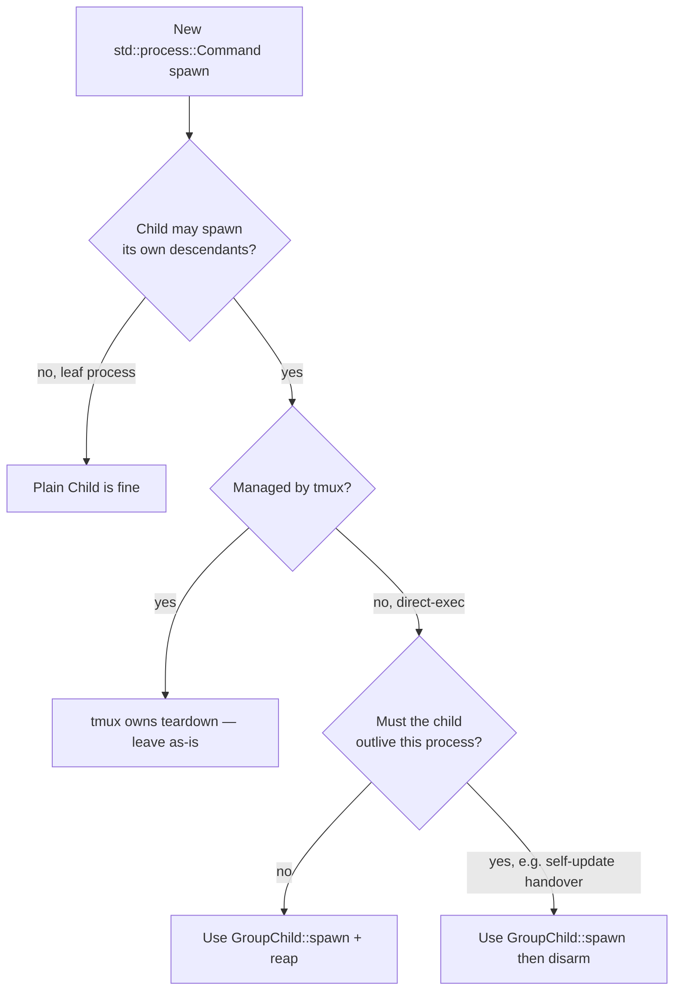

# How to add a process-group-guarded spawn

> **The `simard::process_group_guard` brick ships**
> (`src/process_group_guard/mod.rs`). Wrap a nested subprocess launch in
> `GroupChild::spawn` so its entire subtree is torn down on Drop — on `?`,
> error, timeout, or panic. Call `reap()` on the success path; use `disarm()`
> only for a child that must deliberately outlive its parent. Do **not**
> hand-roll `child.kill()` + descendant tracking; the guard already does it.

Use this runbook whenever you add code that spawns a child which may itself
spawn descendants — `recipe-runner-rs` / `amplihack recipe run`, a
`copilot`/`claude` agent, or any long-running helper. The first adopter is the
engineer-loop command-timeout path
([`src/engineer_loop/execution/mod.rs`](https://github.com/rysweet/Simard/blob/main/src/engineer_loop/execution/mod.rs));
this guide generalises that pattern. Cross-linked to
[`amplihack-rs#964`](https://github.com/rysweet/amplihack-rs/issues/964). For the
why, see [Nested-Subprocess Orphan Guard](../concepts/nested-subprocess-orphan-guard.md);
for the full contract, see the
[Process-Group Guard API](../reference/process-group-guard-api.md).

## Decision: do you need the guard?



There is also a case the guard does **not** help with: a single blocking
`cmd.output()` (spawn-and-wait atomic) has no in-process early-return window, so
wrapping it adds nothing. Orphans from a whole-process abort are the OS-level
reaper's job ([`self_deploy::orphan`](../reference/self-deploy-api.md)), not
`GroupChild`'s. The guard earns its keep where you **manually** spawn, then poll
or `?` before waiting — exactly where a failure path could skip cleanup.

If you land in the **`GroupChild::spawn`** or **`disarm`** box, continue.

## Step 1 — Build the `Command` as usual

Construct the command with an explicit arg vector (never
`sh -c "<interpolated>"`). Attach any context payload via the existing
[`simard::spawn_payload`](./add-a-safe-agent-spawn-site.md) facade *before*
handing the command to the guard. `recipe_context(site, key, value)` returns a
`RecipeArg` (small values inline as `key=value`; large ones spill to a private
temp file); pass `.arg_value()` to `-c` and **keep the `RecipeArg` in scope**
until the child is reaped, since its `Drop` unlinks any temp file it created.

```rust
use std::process::{Command, Stdio};
use simard::spawn_payload;

let mut cmd = Command::new(recipe_runner_bin);
cmd.arg("recipe").arg("run").arg("smart-orchestrator");
let goal_arg = spawn_payload::recipe_context("recipe-runner", "goal_id", &goal_id)?;
cmd.arg("-c").arg(goal_arg.arg_value()); // small=inline / large=temp-file path
cmd.stdout(Stdio::piped()).stderr(Stdio::piped());
```

## Step 2 — Spawn through `GroupChild`

Replace `cmd.spawn()?` with `GroupChild::spawn(&mut cmd)`. On Unix this applies
`process_group(0)` so the child leads its own group.

```rust
use simard::process_group_guard::GroupChild;

let mut guard = GroupChild::spawn(&mut cmd)?; // process_group(0) on Unix
```

Drive the child through `child_mut()` for pipes / polling:

```rust
loop {
    match guard.child_mut().expect("armed guard owns its child").try_wait()? {
        Some(_status) => break,                 // exited — fall through to reap
        None => { /* poll deadline, sleep */ }  // still running
    }
}
```

## Step 3 — Let Drop clean up on failure paths

**Do not write manual teardown.** Every non-happy path is covered by `Drop`.
Return the error / use `?` / let the timeout branch drop the guard:

```rust
// Timeout branch: dropping `guard` group-kills the entire subtree —
// SIGTERM(-pgid) -> grace -> SIGKILL(-pgid). No child.kill() needed.
if Instant::now() >= deadline {
    return Err(SimardError::CommandTimeout { /* … */ }); // <- Drop fires here
}

// Error propagation: `?` drops `guard`, killing the group on the way out.
let parsed = parse_output(&out)?;                        // <- Drop fires if this errors
```

A panic anywhere in scope unwinds through the same `Drop` — the subtree is still
reaped.

## Step 4 — Reap on success (suppress teardown)

Once the child has exited normally its descendants are already gone, so there is
nothing to tear down. Either call `reap()` (marks the guard reaped so `Drop` will
not re-signal a possibly-recycled pgid) or `disarm()` to reclaim the `Child` and
collect output:

```rust
// Reclaim ownership and gather output exactly as a bare Child would:
let child = guard.disarm().expect("armed guard owns its child before disarm");
let output = child.wait_with_output()?;
// ...or, if you only need the status: let status = guard.reap()?;
```

## Step 5 — `disarm()` only for an intentional survivor

The one case where a child *must* outlive its parent is the
[safe-self-update](../safe-self-update.md) exec-handover. Relinquish the guard so
`Drop` does nothing and the child survives:

```rust
let mut guard = GroupChild::spawn(&mut handover_cmd)?;
let child = guard.disarm().expect("armed guard owns its child");
// ...proceed to exec/exit; `child` is now unmanaged and intentionally detached.
```

If you reach for `disarm()` anywhere other than a deliberate detach — or a
success path where you also collect output — double-check you don't actually want
the default armed teardown on the failure paths.

## Step 6 — Add a regression test

Two complementary styles ship in-repo; copy whichever fits:

- **Offline contract test** with the injected recording probe — assert the
  escalation without spawning a process (template:
  [`src/process_group_guard/tests.rs`](https://github.com/rysweet/Simard/blob/main/src/process_group_guard/tests.rs)):

  ```rust
  use std::sync::Arc;
  use std::time::Duration;
  use simard::process_group_guard::GroupChild;
  // `RecordingProbe` + `from_parts` are crate-internal test helpers.

  // grace = ZERO keeps the escalation loop sleep-free; the probe scripts
  // aliveness and records every (pgid, signal) pair for assertion.
  ```

- **Real-subtree end-to-end test** — spawn a child that forks a grandchild, drop
  the armed guard, and assert the grandchild is gone (template:
  [`tests/process_group_orphan_reaping.rs`](https://github.com/rysweet/Simard/blob/main/tests/process_group_orphan_reaping.rs)).

## Checklist before you push

- [ ] The child is spawned via `GroupChild::spawn` (not bare `cmd.spawn()`).
- [ ] No manual `child.kill()` on error/timeout paths — Drop owns teardown.
- [ ] Success path calls `reap()` or `disarm()`; `disarm()` used **only** for an
      intentional detached survivor or success-path output collection.
- [ ] Signalling is numeric-PID `libc::kill(-pgid, …)` only — no
      `pkill`/`killall` (repo shell policy).
- [ ] No `print!`/`println!`; instrumentation is structured `tracing` (`warn!`).
- [ ] A regression test proves zero orphans on a failed/aborted run.
- [ ] `cargo fmt`, `cargo clippy -D warnings`, `cargo test` are green.

## Related

- [Process-Group Guard API](../reference/process-group-guard-api.md)
- [Nested-Subprocess Orphan Guard (concept)](../concepts/nested-subprocess-orphan-guard.md)
- [Add a Safe Agent/Recipe Spawn Site](./add-a-safe-agent-spawn-site.md)
- [Safe Self-Update](../safe-self-update.md)
