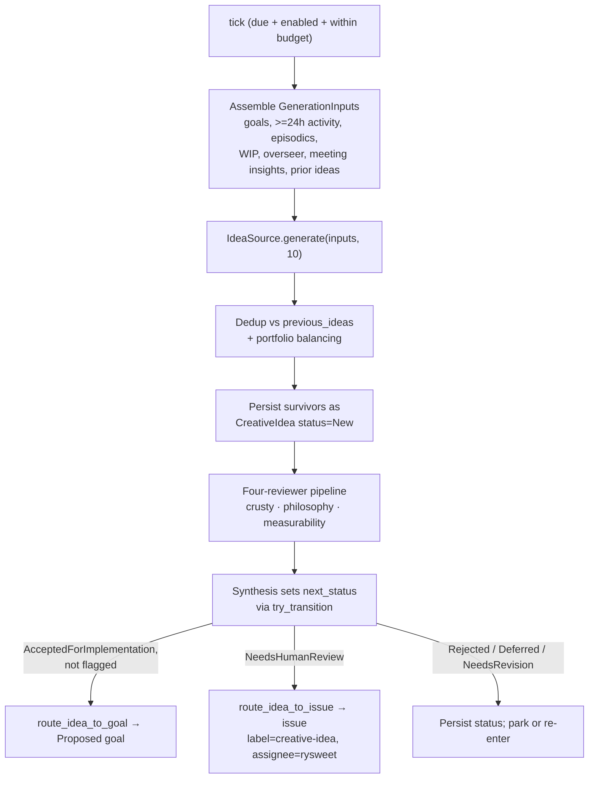

# Configure and operate the Creative Ideas thread

!!! note "Status — typed foundation + tests, OFF by default (#2419)"
    The Creative Ideas subsystem ships as **tested scaffolding**, gated OFF
    behind `SIMARD_CREATIVE_IDEAS_ENABLED` and **not yet registered** with the
    `Mind` scheduler. Its reviewer and `gh` adapters run through **fakes** in
    tests; the production idea-source, real skill/agent reviewers, and the real
    `gh` PR/issue wiring are marked `// FUTURE:` and land across milestones
    M2–M6 (see the
    [design roadmap](../design/creative-ideas-thread.md#phased-roadmap-future-milestones)).
    This guide documents the surface as built so you can enable, tune, extend,
    and test it. For the exact Rust API, see the
    [Creative Ideas API reference](../reference/creative-ideas-api.md).

## What the Creative Ideas thread is

The Creative Ideas thread is a **background cognitive thread** — one scheduled
mental process among many that the `Mind` runs alongside OODA (see
[Cognitive-thread scheduling](./configure-cognitive-thread-scheduling.md)). On a
long cadence (≥ 24 h by default) it stands back from the current work, surveys
where Simard is, and proposes a **diverse batch of ten candidate
self-improvement ideas**. Each idea is stored as a **prospective-memory** node,
reviewed by a four-reviewer pipeline, and then routed safely — to a goal, to a
human-review issue, or parked.

It is a divergent-thinking *source of new ideas*, not an executor. Nothing is
committed to without review, high-risk ideas always go to a human, and any PR
born from a creative idea is **blocked from merge** until the owner approves —
enforced with plain GitHub mechanisms, **never** `--admin` or `--no-verify`.

## When to use this

- You want to **turn the subsystem on** in a non-production checkout and watch it
  generate and review ideas.
- You want to **tune** how often it runs, how many ideas it targets, or its
  budget ceiling.
- You are **extending** it with a real idea source or a new reviewer.
- You need to understand the **human-review gate** on creative-idea PRs.

If instead you want to add an unrelated scheduled process, see
[Add a new cognitive thread](./add-a-new-cognitive-thread.md). To change
*engineer* concurrency, that is the AIMD action-slot scaler
(`SIMARD_MAX_CONCURRENT_ACTIONS`), not this thread.

## Turn it on

The subsystem is OFF by default. `CreativeIdeasConfig::from_env()` is the single
gate; a default config is disabled and the thread's `enabled()` returns `false`,
so it never ticks.

!!! warning "Do not enable on the live daemon or against `~/.simard`"
    This is a spike. Enable it only in a disposable checkout with an isolated
    state root. The thread is also not registered with the `Mind` yet, so on the
    current build turning the flag on has no runtime effect until the M2 wiring
    milestone lands.

```bash
# Master switch (default: false)
export SIMARD_CREATIVE_IDEAS_ENABLED=1

# Optional tuning (defaults shown)
export SIMARD_CREATIVE_IDEAS_INTERVAL_SECS=86400   # cadence: >= 24h observation window
export SIMARD_CREATIVE_IDEAS_BATCH=10              # ideas targeted per run
export SIMARD_DAILY_BUDGET_USD=5.00                # reused budget ceiling (existing knob)
```

| Env var | Default | Effect |
|---------|---------|--------|
| `SIMARD_CREATIVE_IDEAS_ENABLED` | `false` | Master switch. False ⇒ no generation, no routing, no side effects. |
| `SIMARD_CREATIVE_IDEAS_INTERVAL_SECS` | `86400` | Generator cadence. Keep it large — this is a reflective pass, not a hot loop. |
| `SIMARD_CREATIVE_IDEAS_BATCH` | `10` | Ideas targeted per run before dedup/portfolio filtering. |
| `SIMARD_DAILY_BUDGET_USD` | *(existing)* | Reused: the thread skips an expensive tick when over budget. |

The truthiness check mirrors `overseer_acting_enabled()` — `1`, `true`, `yes`,
etc. count as on; unset or `0` is off.

## What one generation tick does

When enabled and due, `CreativeIdeasThread::tick` runs this pipeline. It is
best-effort and total: any internal error is logged and folded into
`ThreadOutcome::failed(reason, elapsed)` — it never panics and never aborts the
daemon.



Budget/cadence guards short-circuit before any expensive work: over budget or
merely not-yet-due ⇒ a **skipped** outcome with no side effects.

## The four reviewers

Every new idea is reviewed in order; then a synthesis step sets its status.

| Reviewer | What it judges |
|----------|----------------|
| **crusty-old-engineer** (skill) | Scope, feasibility, necessity, utility, inventiveness, **risk**, need-for-human-review, practicality. Raises the `high_risk` / `needs_human` flags. |
| **philosophy-guardian** (agent) | "Do we need this? Will it be interesting?" — but a **user signal is not required**; exploratory ideas are encouraged, so absence of a user request is never a block. |
| **measurability** (agent, new) | Attaches a concrete **success metric** — tied where relevant to existing self-metrics like `recall_precision_at_k`, distill fact-yield, or reasoner-reliability. Without a metric, the idea cannot be accepted. |
| **idea-feedback-synthesis** | Reads all reviews, writes next steps, and **sets the status** per the state machine. |

**Synthesis policy** (default, deterministic):

- Any `high_risk` / `irreversible` / `needs_human` flag ⇒ **NeedsHumanReview**.
- A fatal block from a **non-philosophy reviewer** ⇒ **Rejected**; a fixable block ⇒ **NeedsRevision**. (A philosophy-guardian "no user signal" is never a block — exploratory ideas are encouraged.)
- No success metric ⇒ **NeedsRevision** (unmeasurable ideas are not accepted).
- Otherwise, enough support + a metric ⇒ **AcceptedForImplementation**.

## Where reviewed ideas go (routing)

| Synthesis result | Route | Effect |
|------------------|-------|--------|
| `AcceptedForImplementation`, not flagged | `route_idea_to_goal` | A `Proposed` goal on the goal board, tagged with the originating idea `node_id`. The idea moves to `ImplementationStarted`. |
| `NeedsHumanReview` | `route_idea_to_issue` | A GitHub issue labelled `creative-idea` and **assigned to `rysweet`**, body embeds the idea `node_id` + next steps. |
| `Rejected` / `Deferred` / `NeedsRevision` | *(none)* | Status persisted; parked or re-entered on a later pass. |

## The human-review gate on creative-idea PRs

A PR that arises from a creative-idea goal is tracked specially and **cannot be
merged** until a human approves. `mark_idea_pr(pr, idea, gh, repo)` applies three
standard GitHub mechanisms and returns an `IdeaPrGate` describing them (`repo` is
`owner/name`, required because the underlying `gh` PR calls are repo-scoped):

- **Draft** — the PR is kept as a draft; a draft PR is unmergeable by anyone
  until explicitly marked ready.
- **Blocking label** — `creative-idea-needs-human-review`; branch protection /
  required status can key off this label to disable the merge button.
- **Owner review-required** — review is *requested* from `rysweet`. Simard
  never approves her own gate.
- **Link-back** — the PR body carries `originating-idea: <node_id>`, so the
  idea ↔ goal ↔ issue ↔ PR chain is fully traceable.

!!! danger "Never bypass the gate"
    The gate is enforced entirely with ordinary GitHub features. Simard
    **never** runs `gh pr merge --admin` or `git --no-verify`, and a unit test
    asserts the constructed `gh` argument vectors contain neither flag. An idea
    reaches `ImplementationCompleted` only when **both** the PR merges through
    the normal gate **and** its success metric is met.

## Trace an idea end to end

Every hop carries the originating idea `node_id`, so you can follow one idea
through the whole system:

1. **Idea** — a prospective node with `trigger_condition = "creative-idea"`.
   List creative ideas via `CreativeIdeaStore::list` (or inspect prospective
   memory with the [memory CLI](../reference/simard-memory-cli.md)).
2. **Goal** — its `GoalRecord` evidence/label contains the idea `node_id`
   (see the [Goal board API](../reference/goal-board-api.md)).
3. **Issue** — for human-review ideas, the `creative-idea` issue assigned to
   `rysweet` embeds the `node_id`.
4. **PR** — its body carries `originating-idea: <node_id>`, and it stays a
   labelled draft with an owner review requested until approved.

## Monitor it

Everything emits through the existing cognitive-thread telemetry facade
(`src/cognitive_threads/telemetry.rs`; see
[Telemetry metrics](../reference/telemetry-metrics.md)) keyed on the stable
thread id `creative_ideas` and the reviewer ids `crusty_old_engineer`,
`philosophy_guardian`, `measurability`, `idea_feedback_synthesis`:

- ideas generated / deduped per run,
- per-reviewer verdict counts,
- routed→goal / routed→issue / pr-gated counts,
- status-transition events.

Output is structured `tracing` only — no `println!`/`eprintln!` beyond the
`[simard] …` prefix convention.

## Safety knobs

| Guardrail | Knob / hook | Behavior |
|-----------|-------------|----------|
| Dedup / novelty | `dedup::is_near_duplicate(new, prior, threshold)` | Rejects a near-duplicate of a prior idea (token/shingle similarity). |
| Diversity / portfolio | `portfolio::select_balanced(candidates, budget)` | Spreads the batch across risk/novelty buckets. |
| Rate-limit / budget | `budget::within_budget(now, cfg)` + `SIMARD_DAILY_BUDGET_USD` | Skips an expensive tick when over budget. |
| High-risk → human | synthesis policy + `try_transition` | High-risk/irreversible ideas can never auto-become a goal. |
| Outcome feedback | `route::mark_completed(idea, metric_met)` | Refuses `ImplementationCompleted` unless the success metric is met. |
| OFF by default | `SIMARD_CREATIVE_IDEAS_ENABLED` | Whole subsystem inert unless explicitly enabled. |
| Dry-run | `ThreadContext.dry_run` | When set, `tick` still generates/reviews/logs but performs **no** destructive side-effect (no goal, issue, or PR writes). |
| Cooperative shutdown | `ThreadContext.shutdown` | `tick` observes the scheduler's cancellation flag and returns promptly between pipeline stages, so a daemon stop is never blocked mid-generation. |

## Extend it

### Add a custom idea source

Implement `IdeaSource`. The thread targets ten diverse candidates, then applies
dedup + portfolio filtering.

```rust
use simard::cognitive_threads::threads::creative_ideas::{GenerationInputs, IdeaSource, RawIdea};
use simard::error::SimardResult;

struct MyIdeaSource;

impl IdeaSource for MyIdeaSource {
    fn generate(&self, inputs: &GenerationInputs, n: usize) -> SimardResult<Vec<RawIdea>> {
        // Derive candidates from the read-only observation window.
        let ideas = inputs
            .current_goals
            .iter()
            .take(n)
            .map(|g| RawIdea {
                idea: format!("Improve tooling around: {g}"),
                links: Vec::new(),
                rationale: "derived from an active goal".into(),
            })
            .collect();
        Ok(ideas)
    }
}
```

### Add or swap a reviewer

Implement `Reviewer`. Keep the id stable (it keys telemetry) and only raise
`needs_human` when a human genuinely must decide.

```rust
use simard::creative_ideas::reviewers::{Review, ReviewContext, ReviewFlags, ReviewVerdict, Reviewer};
use simard::error::SimardResult;

struct SecuritySmellReviewer;

impl Reviewer for SecuritySmellReviewer {
    fn id(&self) -> &'static str { "security_smell" }

    fn review(&self, ctx: &ReviewContext<'_>) -> SimardResult<Review> {
        let risky = ctx.idea.idea.to_lowercase().contains("disable auth");
        Ok(Review {
            reviewer: self.id(),
            verdict: if risky { ReviewVerdict::NeedsHuman } else { ReviewVerdict::Support },
            notes: "checked for auth/secret smells".into(),
            flags: ReviewFlags { high_risk: risky, irreversible: false, needs_human: risky },
            proposed_metric: None,
        })
    }
}
```

Production reviewer adapters invoke an amplihack skill/agent through the
`invoke_agent(prompt) -> String` seam; the prompt bodies are marked `// FUTURE:`
until the real reviewers are wired (M3).

## Test it (no network, all fakes)

Every unit test runs with fakes and an injected clock — no network, no sleeps.

```rust
// Routing: an accepted, non-flagged idea produces a Proposed goal.
let mut idea = CreativeIdea::new("index episodic recall by recency");
idea.try_transition(IdeaStatus::AcceptedForImplementation).expect("legal edge");

let goals = FakeGoalStore::default();
let now_epoch = 1_700_000_000_u64;                 // injected clock (unix epoch seconds)
let goal = route_idea_to_goal(&idea, &goals, now_epoch).expect("routes to goal");

assert_eq!(goal.status, GoalStatus::Proposed);
assert!(goal.evidence_contains(&idea.node_id));   // traceable back to the idea

// PR gate: draft + blocking label + owner review, and NO privilege bypass.
let gh = FakeIdeaGhClient::default();
let gate = mark_idea_pr(42, &idea, &gh, "rysweet/Simard").expect("gate applied");
assert!(gate.draft);
assert_eq!(gate.blocking_label, "creative-idea-needs-human-review");
assert_eq!(gate.review_requested_from, vec!["rysweet".to_string()]);
assert!(gh.recorded_args().iter().all(|a| a != "--admin" && a != "--no-verify"));
```

The design's [test plan](../design/creative-ideas-thread.md#test-plan-no-network-all-fakes)
covers the full set: valid/invalid `try_transition` edges, persist+retrieve with
links, the four-reviewer pipeline + synthesis, all three routing paths, dedup
rejection, off-by-default, the two error contracts, and a total `tick`.

## Troubleshooting

| Symptom | Likely cause | Fix |
|---------|--------------|-----|
| Thread never runs | `SIMARD_CREATIVE_IDEAS_ENABLED` unset/`0`, or (current build) not registered with the `Mind` | Set the flag in a disposable checkout; runtime wiring lands in M2. |
| No ideas generated but tick ran | Over budget or not yet due | Check `SIMARD_DAILY_BUDGET_USD` and `SIMARD_CREATIVE_IDEAS_INTERVAL_SECS`; a skipped tick has no side effects. |
| An idea stuck in `NeedsRevision` | Measurability reviewer produced no success metric | Ensure the idea admits a concrete metric; unmeasurable ideas are intentionally not accepted. |
| `InvalidIdeaTransition` in logs | Synthesis proposed an illegal `next_status` | Expected hard error — the runner rejects illegal edges rather than corrupting status. |
| `InvalidCreativeIdeaRecord` on read | Bad JSON payload or a `payload_version` newer than this binary | Fail-closed by design — do not downgrade-read; upgrade the reader (reader-first rollout). |
| A creative-idea PR looks mergeable | Draft/label/owner-review not applied | Re-run `mark_idea_pr`; never work around it with `--admin`/`--no-verify`. |

## See also

- [Creative Ideas subsystem API reference](../reference/creative-ideas-api.md)
- [Creative Ideas background thread — design](../design/creative-ideas-thread.md)
- [Configure and monitor cognitive-thread scheduling](./configure-cognitive-thread-scheduling.md)
- [Add a new cognitive thread](./add-a-new-cognitive-thread.md)
- [Goal board API](../reference/goal-board-api.md)
