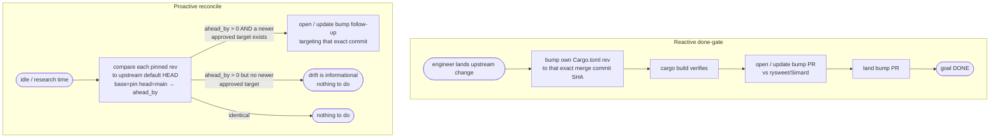

# How to keep Simard's own dependency pins up to date

> **Status: active.** This document describes shipped behaviour. The
> dependency-pin done-gate and proactive reconcile are implemented entirely in
> prompt assets (`goal_session_objective.md`, `engineer_system.md`,
> `progress_assessment_reviewer.md`, and the `progress-assessment.yaml` recipe
> mirror); this guide is both the operator reference and the spec the
> prompt-content pin tests enforce.

Simard's root `Cargo.toml` pins several of the tools she maintains by **exact
git rev**, not by branch:

| Crate (in `Cargo.toml`) | Upstream repo | Default branch |
| --- | --- | --- |
| `amplihack-agent-eval` | `rysweet/amplihack-rs` | `main` |
| `amplihack-memory` | `rysweet/amplihack-memory-lib` | `main` |
| `rustyclawd-core` | `rysweet/RustyClawd` | `main` |
| `rustyclawd-tools` | `rysweet/RustyClawd` | `main` |

Two of those crates — `rustyclawd-core` and `rustyclawd-tools` — pin the **same
upstream repo at the same rev**, so they must always be bumped together (see
[Bump-PR conventions](#bump-pr-conventions-and-de-duplication)).

A git-rev pin is reproducible, but it is also **frozen**. When Simard lands a
fix in one of those upstream repos, her own pin keeps pointing at the *old*
commit, so the fix she just merged is **not in her own build**. The motivating
case: `amplihack-agent-eval` was pinned ~22 commits behind `amplihack-rs`
`main`, which meant roughly nine merged PRs were absent from the very daemon
that wrote them.

This guide describes the two behaviours that close that gap. Both are
expressed **entirely in prompt assets** — there is no new Rust subsystem, no new
CLI command, and no change to any parser contract.

> **The finish line moves.** Under this feature, opening (or even merging) the
> *upstream* PR is **not** "done". A goal that changes a Simard
> build-dependency is done only once
> the fix is **running in Simard's own build** — i.e. her own pin has been
> bumped, `cargo build` is green, and the bump PR has landed on
> `rysweet/Simard`. This is the source-side complement of
> [Safe Self-Update](../safe-self-update.md), which swaps the *running binary*.

---

## The two triggers at a glance



| | Trigger A — Reactive | Trigger B — Proactive |
| --- | --- | --- |
| **Fires when** | An engineer merges a change to a repo Simard depends on | Simard has spare, low-priority "ok to be idle" research time |
| **Priority** | Blocks the originating goal from being "done" | Low — a follow-up, never preempts real work |
| **Output** | Same goal stays open until the own-pin bump lands | A new bump follow-up goal/PR |
| **Lives in** | `goal_session_objective.md` + `engineer_system.md` + `progress_assessment_reviewer.md` | `engineer_system.md` (dependency-drift) + a note in `goal_session_objective.md` |

---

## Trigger A — the reactive done-gate

When an engineer **lands** (merges to the upstream default branch) a change to
one of the three repos Simard pins by git rev — `amplihack-rs`,
`amplihack-memory-lib`, or `RustyClawd` — the *same goal* is not complete until
Simard has also:

1. **Bumped her own pin.** Edit the matching `rev = "…"` in the root
   `Cargo.toml` to the **exact immutable SHA of the merge commit that carried
   that change** — that specific commit is the approved target here. It is *not*
   "whatever `main` points at now": `main` may already have moved on, and the
   pin must not chase it.
2. **Verified the build.** `cargo build` (low-space variant when disk is tight —
   `scripts/cargo-low-space build`) must succeed against the new rev. A bump
   that does not build is rolled back, not shipped.
3. **Opened (or updated) the bump PR** against `rysweet/Simard` — see
   [Bump-PR conventions](#bump-pr-conventions-and-de-duplication).
4. **Landed the bump PR.** It rides the same
   [PR-finalization review pipeline](../reference/pr-finalization-pipeline.md)
   and merge-ready gate as any other Simard change (CI-green → merge), exactly
   like [making Simard own each PR to landing (#2410)](../reference/pr-finalization-pipeline.md).

Only after step 4 is the originating goal allowed to report `done`.

The actual **redeploy** of the running daemon (swapping the binary, hot-reloading
prompts) remains **operator-gated** — it is the operator's step, performed via
[Safe Self-Update](../safe-self-update.md), and is *not* required for the
automated goal to be marked done. The done-gate guarantees the fix is *in the
shipped source build*; the operator decides when to roll it out.

### Where this gate lives

| Prompt asset | Responsibility |
| --- | --- |
| `prompt_assets/simard/goal_session_objective.md` | **Encodes** the done-gate: a goal that lands an upstream change to a build-dependency repo is not done until the own-pin bump lands and `cargo build` passes. Stays **prose only** (preserves the `NO ACTION` marker and `PROGRESS: NN` line the goal-session parser reads). |
| `prompt_assets/simard/engineer_system.md` | **Tells** the engineer that landed the upstream change to follow through with the own-`Cargo.toml` bump + build-verify + bump PR. |
| `prompt_assets/simard/progress_assessment_reviewer.md` | **Rejects** a premature `done` — see [Reviewer enforcement](#reviewer-enforcement). |

This is a **new done-gate that runs *after* landing**, alongside #2410. It
composes additively with the already-shipped behaviours:

- **#2404 loop-awareness** — the bump is concrete forward progress, not a loop.
- **#2405 per-issue fan-out** — a bump follow-up is just another work item.
- **#2410 own-PRs-to-landing** — the bump PR is owned to landing like any PR.
- **#2413 crusty / pr-guide finalization** — the bump PR runs the same
  finalization pipeline before merge.

### Does the done-gate hold the goal open, or spawn a follow-up?

**Trigger A holds the *originating* goal open** — that is what makes "landing
upstream is not done" meaningful. It deliberately does *not* spawn a separate
goal; coupling the bump to the goal that caused it is the point.

This does **not** trip loop-awareness (#2404). Loop/stall detection flags
*repetition without progress*. The done-gate instead appends a **bounded,
monotonic sequence of new artifacts** — one rev-bump commit, one `cargo build`,
one bump PR — each concrete forward progress on a *different* file
(`Cargo.toml`) and a *different* PR than the upstream change. If that bounded
sequence itself gets stuck (e.g. the bump PR cannot land), it surfaces through
the **normal stall path** and is escalated like any other blocked PR — it is
never retried indefinitely. Contrast with Trigger B, which *is* a separate
low-priority follow-up precisely because nothing is holding a goal open.

---

## Trigger B — the proactive reconcile

When Simard has low-priority idle/research time (the same budget she uses for
self-maintenance), she periodically measures each rev-pinned git dependency's
**drift**: how many commits has the upstream default branch advanced *past* the
pinned rev?

For each dependency she compares the pinned rev to the upstream `HEAD`.

> **Read the compare orientation carefully.** The GitHub compare API is
> `compare/{base}...{head}`, and `ahead_by` / `behind_by` are reported **from
> the point of view of `head`**. With `base = $PINNED` and `head = main`:
>
> * `ahead_by` = how many commits **`main` is ahead of the pin** — this is the
>   drift number you want;
> * `behind_by` = how many commits `main` is *behind* the pin. Whenever the pin
>   is an ancestor of `main` (the normal case) this is **always `0`**;
> * `status` is therefore `"ahead"` for a pin that trails `main`, never
>   `"behind"`, and `"identical"` only when the pin *is* `main`'s HEAD.
>
> Reading `.behind_by` in this orientation is a silent no-op: it prints `0`
> forever and the drift check can never fire. Use `.ahead_by`. (To get a
> `behind_by`-shaped answer you would have to flip the operands to
> `compare/main...$PINNED`.)

```bash
# Current pin — read it from the ONE live dependency line rather than
# hardcoding a rev here, which would go stale at the next bump.
#   * `^` anchors to the start of the line, so the `#` provenance comments
#     (which also carry 40-char SHAs, including git *tree* hashes) can never
#     match;
#   * the `rev = "…"` capture takes exactly one 40-char hex value;
#   * the count check refuses to continue on zero or multiple matches instead
#     of silently pasting two concatenated SHAs into the compare URL.
PINNED=$(sed -n 's/^amplihack-agent-eval[[:space:]]*=.*,[[:space:]]*rev[[:space:]]*=[[:space:]]*"\([0-9a-f]\{40\}\)".*/\1/p' Cargo.toml)

if [ "$(printf '%s\n' "$PINNED" | grep -c '^[0-9a-f]\{40\}$')" -ne 1 ]; then
  echo "ERROR: expected exactly one amplihack-agent-eval rev, got: '$PINNED'" >&2
else
  # Upstream default-branch HEAD
  git ls-remote https://github.com/rysweet/amplihack-rs.git main

  # How far has `main` advanced past the pin? base=pin, head=main, so the
  # answer is `ahead_by` (main ahead of pin); `behind_by` is always 0 here.
  # "$PINNED" is quoted so a malformed value can never word-split the path.
  gh api "repos/rysweet/amplihack-rs/compare/$PINNED...main" \
    --jq '{status, main_ahead_of_pin: .ahead_by}'
fi
```

`status: "ahead"` with `main_ahead_of_pin > 0` means `main` has moved on since
the pin. `status: "identical"` with `main_ahead_of_pin == 0` means the pin *is*
the current `main` HEAD.

### Drift is a signal, not an automatic bump

**A non-zero drift count does not by itself mean the pin is wrong.** Simard
pins **immutable commit SHAs**, and for `amplihack-agent-eval` the pin targets a
**tagged release commit** (currently the `v0.18.25` source commit — see the
provenance block on the `amplihack-agent-eval` line in the root `Cargo.toml`).
Upstream `main` advances continuously, so a release pin starts drifting the
moment the next commit lands upstream — that is normal and expected, not a
defect.

So the reconcile asks two questions, in order:

1. **Is there a newer *approved target*?** For a release-pinned crate that means
   a newer **release tag** that has been reviewed and chosen for adoption; for a
   crate deliberately tracking `main`, it means the specific merged commit that
   carries the wanted fix. If there is no such target, drift is **informational
   only** and there is nothing to do.
2. **If yes, adopt that exact target** — never "whatever `main` happens to be
   right now". Simard then opens (or updates) a **bump follow-up** that does
   what Trigger A does: re-point the rev to the chosen commit, verify
   `cargo build`, and ship it through the normal landing pipeline.

Concretely: the drift number tells Simard *how much* upstream has moved and is
useful for deciding whether a review is worth scheduling. It is **not** a
tripwire that must be driven back to zero, and a pin is **not stale merely
because `ahead_by > 0`**. Chasing every `main` commit would defeat the point of
pinning — reproducible builds on a reviewed, release-quality commit.

This trigger is **low priority by construction**. It never preempts an active
engineering goal; it only fills spare capacity. It is described in
`engineer_system.md` (the "dependency-drift" self-maintenance directive) and
**noted** as acceptable idle-time work in `goal_session_objective.md`.

This is the **upstream-repo analog of the self-update Simard already has.**
`goal_session_objective.md` already carries a "Self-update awareness" section in
which the OODA brain detects *Simard-repo* drift via `compute_commits_behind()`
and triggers `simard safe-update` when no engineers are in flight. Trigger B
points that same "detect drift, reconcile when idle" posture at the **repos
Simard pins** instead of the Simard repo itself — it reuses the existing idle
self-maintenance idea rather than inventing a new scheduler.

---

## Bump-PR conventions and de-duplication

Both triggers can want to bump the *same* dependency, and the daemon runs
multiple engineers concurrently (#2405). To avoid a pile of duplicate bump PRs,
the bump uses a **deterministic naming convention keyed on the upstream repo**
— *not* on the crate — so that crates sharing a repo collapse into one PR:

| Field | Value |
| --- | --- |
| Branch | `chore/bump-<upstream-repo>-pin` (e.g. `chore/bump-rustyclawd-pin`) |
| PR title | `chore(deps): bump <upstream-repo> pin to <short-sha>` |
| Base | `rysweet/Simard` `main` |

`<upstream-repo>` is the source repository, lower-cased (`amplihack-rs`,
`amplihack-memory-lib`, `rustyclawd`). Each bump PR updates **every** crate that
pins that repo:

| `<upstream-repo>` | Crates bumped together in one PR |
| --- | --- |
| `amplihack-rs` | `amplihack-agent-eval` |
| `amplihack-memory-lib` | `amplihack-memory` |
| `rustyclawd` | `rustyclawd-core` **and** `rustyclawd-tools` |

> **One PR per upstream repo — bump shared crates atomically.** When several
> crates pin the same repo at the same rev (today `rustyclawd-core` and
> `rustyclawd-tools` both pin `RustyClawd` at `43ebaa1`), the bump PR re-points
> **all** of them to the new rev in the **same commit**. Never open a branch per
> crate: that would split one upstream commit across two PRs and let the build
> see two different `RustyClawd` revs at once.

**Before opening a bump PR, check for an existing open one:**

```bash
# Is a bump PR already open for this upstream repo?
gh pr list --repo rysweet/Simard --state open \
  --head "chore/bump-rustyclawd-pin" \
  --json number,title,headRefName
```

- **Found** → **update it**: re-point every crate from that repo to the **newly
  selected approved target commit** — the reviewed release commit, or the
  specific merged commit carrying the required fix — **never "the latest
  `main`"**. Then re-run `cargo build`, force-update the branch, and refresh the
  PR body. Do **not** open a second PR.
- **Not found** → open a fresh PR with the convention above.

> **Cross-repo safety.** The upstream change lives in another repo
> (`amplihack-rs`, `RustyClawd`, …); the **bump PR is always opened against
> `rysweet/Simard`**, because `Cargo.toml` lives in Simard. This is the same
> separation as [routing a goal to its target repo](./route-a-goal-to-its-target-repo.md):
> work happens where the file being changed lives.

---

## Reviewer enforcement

`progress_assessment_reviewer.md` **is** the gate that stops a premature
`done`. Its output contract is **unchanged** — a single-line JSON object
`{"verdict": "accept" | "reject", "rationale": "…"}` — and the `verdict` token
stays exactly `accept` / `reject` (lowercase) so the Rust reviewer parser keeps
working.

The reviewer cannot diff git revs itself (it sees only the problem, plan,
prior/claimed percent, and a WIP summary). So the rule **is** phrased as
**evidence-absence**, not rev-comparison:

> Reject a `done` / 100% claim when the problem or plan describes **landing an
> upstream change to a Simard build-dependency repo**, but the plan / WIP
> summary shows **no evidence** of *both* (a) the own `Cargo.toml` rev bump to
> the merged commit and (b) a verified `cargo build`.

Example rejection the reviewer **emits** (matching the spaced JSON form the
existing reviewer prompt already uses):

```json
{"verdict": "reject", "rationale": "Upstream PR merged to amplihack-rs main, but no evidence the own Cargo.toml amplihack-agent-eval rev was bumped and cargo build re-verified; landing upstream is not done until the fix ships in Simard's own build."}
```

If the WIP summary *does* show the bump landed and the build passed, the
reviewer accepts as normal.

---

## Operator: rolling a bump into the running daemon

Landing the bump PR puts the fix in the **source build**. To get it into the
**running daemon**, an operator:

1. Pulls the merged bump on the host and rebuilds, or
2. Runs [Safe Self-Update](../safe-self-update.md)
   (`simard safe-update`) which downloads, self-tests, swaps, and validates the
   new binary.

Prompt-asset changes (this feature is all prompts) are **hot-reloaded** by
syncing the assets into the live state root:

```bash
rsync -a prompt_assets/simard/ ~/.simard/prompt_assets/simard/
```

No daemon restart is required for the prompt changes to take effect on the next
OODA cycle. The binary-level dependency bump still requires a rebuild/redeploy
as above.

---

## Verify end-to-end

1. **Confirm the pins and their upstreams:**

   ```bash
   grep -nE 'git = .*(amplihack-rs|amplihack-memory-lib|RustyClawd)' Cargo.toml
   ```

2. **Measure one dependency's drift from `main`:**

   ```bash
   # Anchored at `^` so the `#` provenance comments (which also contain
   # 40-char SHAs) cannot match; the count check refuses zero-or-many.
   PINNED=$(sed -n 's/^amplihack-agent-eval[[:space:]]*=.*,[[:space:]]*rev[[:space:]]*=[[:space:]]*"\([0-9a-f]\{40\}\)".*/\1/p' Cargo.toml)

   if [ "$(printf '%s\n' "$PINNED" | grep -c '^[0-9a-f]\{40\}$')" -ne 1 ]; then
     echo "ERROR: expected exactly one amplihack-agent-eval rev, got: '$PINNED'" >&2
   else
     # base=pin, head=main => `.ahead_by` is how far main is AHEAD of the pin.
     # `.behind_by` is always 0 in this orientation — reading it is a no-op.
     gh api "repos/rysweet/amplihack-rs/compare/$PINNED...main" --jq '.ahead_by'
   fi
   ```

   A non-zero result means `main` has advanced past the pin. That is
   **informational**: see
   [Drift is a signal, not an automatic bump](#drift-is-a-signal-not-an-automatic-bump).
   It becomes a Trigger-B bump follow-up only when a newer **approved target**
   (for `amplihack-agent-eval`, a newer reviewed **release tag**) should be
   adopted — not merely because the counter is non-zero.

3. **After a bump lands, confirm the rev moved to the chosen target and the
   build is green:**

   ```bash
   git -C ~/src/Simard pull
   grep -n 'amplihack-agent-eval' ~/src/Simard/Cargo.toml   # rev == the adopted target commit
   cargo build --quiet                                       # succeeds
   ```

4. **Confirm no duplicate bump PRs are open:**

   ```bash
   gh pr list --repo rysweet/Simard --state open \
     --search 'in:title "chore(deps): bump"'
   ```

   At most one open PR per **upstream repo** (so `rustyclawd-core` and
   `rustyclawd-tools` never appear in two separate bump PRs).

---

## Related reading

- [Safe Self-Update](../safe-self-update.md) — the binary-swap half of
  "ship it into her own running build"; this guide is the source-pin half.
- [PR-finalization review pipeline](../reference/pr-finalization-pipeline.md) —
  the gate every bump PR passes before merge.
- [How to route a goal to its target ecosystem repo](./route-a-goal-to-its-target-repo.md) —
  the same "work where the file lives" separation, applied to upstream goals.
- [Ecosystem map](../ecosystem-map.md) — the repos Simard stewards and depends on.
