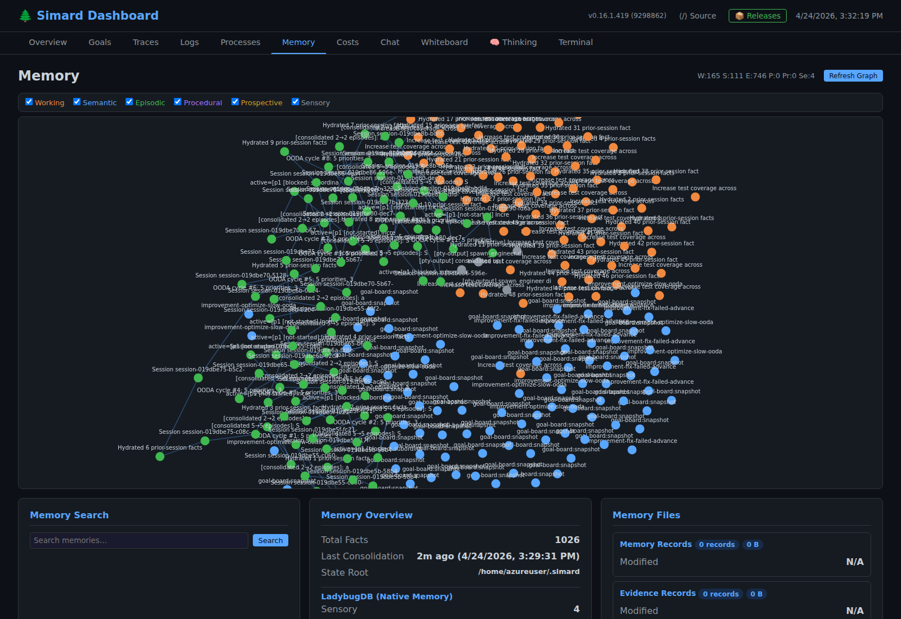

# Memory architecture

Simard's memory is not a flat key-value store. She uses **six distinct memory types** modeled after cognitive psychology. They are provided by the upstream [`amplihack-memory-lib`](https://github.com/rysweet/amplihack-memory-lib) crate (persistent, LadybugDB/`lbug`-backed) and reached through the `LibraryCognitiveMemory` adapter, which implements the `CognitiveMemoryOps` trait. This library backend is the sole on-disk cognitive-memory backend — there is no Python bridge and no native fork.

For the full canonical specification (schema, consolidation rules, hive event bus contract) see [Cognitive Memory Architecture](architecture/cognitive-memory.md). This page is the operator-level summary.

## The six memory types

| Type | Lifetime | What it holds |
|------|----------|---------------|
| **Sensory** | TTL ~300 s (configurable) | Raw observations: PTY output, error messages, objective text. Auto-expires unless promoted. |
| **Working** | Task-scoped (cleared at task end) | The 20-slot active task context: goal, constraints, plan steps, current execution state. |
| **Episodic** | Persistent, autobiographical | "What happened this session" — every cycle, every action, every observation. |
| **Semantic** | Persistent, deduplicated | Facts and learned concepts promoted from episodic memory ("the test harness uses CARGO_TARGET_DIR"). |
| **Procedural** | Persistent, indexed by trigger, deduplicated by name | Learned how-to: action sequences that worked for a given situation. Written by the OODA Act phase for successful outcomes. Storing an identically-named procedure is idempotent (#2298). See [OODA procedural memory](reference/ooda-procedural-memory.md) and [Procedural-memory store idempotency](reference/cognitive-memory-procedural-idempotency.md). |
| **Prospective** | Persistent, time/event-indexed | Future intentions: Active goals as trigger-action pairs, meeting action items. See [Goal–prospective memory mirror](reference/goal-prospective-memory-mirror.md). |

## Consolidation flow

```
(intake)  ──(classify)───▶  Episodic    (noise dropped/down-scoped at the door, #2327)
Sensory   ──(attention)──▶  Episodic
Working   ──(task end)───▶  Episodic
Episodic  ──(distill)────▶  Semantic    (DERIVES_FROM edge back to source episode, #2325)
Episodic  ──(distill)────▶  Procedural  (PROCEDURE_DERIVES_FROM edge, #2327)
OODA Act  ──(success)────▶  Procedural    (#2280)
Goal put  ──(Active)─────▶  Prospective   (#2207/#2280)
```

A deterministic **episode ingestion policy** runs before every
`store_episode` write: it drops operational-noise episodes (session
start/complete/persist markers, `flushing working memory`,
`continue_skipping`) and down-scopes the unrecognised, while storing
meaningful events with structured metadata — unless a failure signal
overrides the drop (#2327). Promotion then runs **automatically** at the
end of every OODA cycle (on a backlog threshold or cycle interval, not
only when the brain chooses `ConsolidateMemory`), distilling recurring
episodes into both facts and procedures. See
[Episode ingestion policy & automatic promotion](architecture/episode-ingestion-policy.md).

Facts (and procedures) written *with provenance* keep a typed
`DERIVES_FROM` / `PROCEDURE_DERIVES_FROM` graph edge back to the
episode(s) they were derived from, turning the flat node store into a
connected graph that can be traversed both ways (#2325). See
[Cognitive-memory provenance](reference/cognitive-memory-provenance.md).

The OODA daemon dispatches a `consolidate-memory` action whenever working-memory pressure or recent-episode density crosses a threshold. Consolidation is idempotent and runs without spawning an engineer subprocess. Procedural memories are written inline during the OODA Act phase (not during consolidation) — each successful `ActionOutcome` produces an `ooda:{kind}` procedure. Prospective memories are written each cycle by a **board-sourced reconcile**: before every preparation pass the daemon mirrors each Active goal in the live `GoalBoard` into a prospective trigger via `store_prospective`, so `check_triggers` has something to match. See [Goal–prospective memory mirror](reference/goal-prospective-memory-mirror.md) for the original `CognitiveMemoryGoalStore` mirror and [Goal-board prospective reconcile](reference/goal-board-prospective-reconcile.md) for the per-cycle board-sourced step that the live daemon actually runs.

## Inspecting memory from the CLI

Use `simard memory stats` to see per-type counts for the live store, and
`simard memory dump` for sample rows. Both are read-only and safe to run
while the daemon holds the store — they read through the daemon's memory
socket when it is up and fall back to a direct on-disk open when it is
down.

```text
$ simard memory stats
cognitive memory @ /home/azureuser/.simard/cognitive  (via daemon socket)

  TYPE          COUNT
  sensory           4
  working           7
  episodic         18
  semantic          5     (facts)
  procedural        5     (procedures)
  prospective       5     (triggers)
  ---------------------
  total            44
```

The `episodic` count here is the number of episodes **stored**; it is
distinct from the `… episodes` figure in the per-cycle OODA log, which
counts episodes **recalled for the current objective** (keyword-relevant,
self-session noise filtered). A populated store can legitimately recall
`0` episodes for an unrelated objective. See
[Memory introspection CLI](reference/simard-memory-cli.md) for the full
contract, including the type→field mapping and the stored-vs-recalled
distinction.

## Cross-session recall

Semantic, procedural, and prospective memory survive process restarts and are queried at the start of every engineer dispatch. When the daemon spawns a new engineer for a goal it seeds the engineer's working memory with the most relevant prior episodes for that goal-id, so engineers continue where the previous attempt left off.

## On-disk layout

The library backend persists at `state_root/cognitive` (a LadybugDB `GraphStore`). In production `state_root` is `~/.simard`:

```
~/.simard/
  └── cognitive/             # library CognitiveMemory store (LadybugDB):
                             #   sensory, working, episodic, semantic,
                             #   procedural, prospective
```

The library owns its own durability (WAL + CHECKPOINT). The old native store at `~/.simard/cognitive_memory.ladybug` is abandoned by Phase 2b — it is never read or migrated, and the memory store rebuilds from scratch in `cognitive/`.

Inspect with `simard memory stats` / `simard memory dump` (see
[Memory introspection CLI](reference/simard-memory-cli.md)), or with the
dashboard's **Memory** tab ([Dashboard](dashboard.md)) — the graph view
supports per-type filters and full-text search across the persistent
layers.



## Hive event bus (multi-agent knowledge sharing)

When multiple agents (engineer subprocesses, meeting facilitators, gym runs) operate concurrently, they share knowledge through the **hive event bus** (`src/hive_event_bus.rs`). Each agent emits memory events that other agents can subscribe to, enabling cross-agent learning without a central coordinator.

For multi-host coordination see [Distributed operations](distributed-operations.md).

## Code entry points

- `src/cognitive_memory/mod.rs` — `CognitiveMemoryOps` trait + DTOs
- `src/cognitive_memory/library_adapter.rs` — `LibraryCognitiveMemory` (the sole backend)
- `src/hive_event_bus.rs` — multi-agent event bus

## Related

- [Cognitive Memory Architecture](architecture/cognitive-memory.md) (canonical, full detail)
- [Episode ingestion policy & automatic promotion](architecture/episode-ingestion-policy.md) — the classifier that keeps episodic memory clean and the scheduler that promotes it automatically (#2327)
- [Episode ingestion classifier API](reference/episode-ingestion-classifier.md) — `classify`, `sanitize_transcript`, the metadata taxonomy, and the intake wiring (#2327)
- [Automatic distillation scheduler API](reference/automatic-distillation-scheduler.md) — `run_scheduled_distillation`, the `distill_trigger` predicate, config fields, and the procedures extension (#2327)
- [Configure episode hygiene and promotion](howto/configure-episode-hygiene-and-promotion.md) — operator tuning and observability (#2327)
- [Library-backed Cognitive Memory](architecture/cognitive-memory-library-adapter.md) — the `amplihack-memory-lib` backend, now the sole on-disk store (de-fork Phase 2b)
- [Memory introspection CLI](reference/simard-memory-cli.md) — `simard memory stats` / `simard memory dump` for read-only, lock-safe per-type counts and sample rows
- [OODA procedural memory](reference/ooda-procedural-memory.md) — how successful OODA outcomes become procedures
- [Procedural-memory store idempotency](reference/cognitive-memory-procedural-idempotency.md) — exact-name dedup that stops repeated cycles re-storing identical procedures (#2298)
- [Goal–prospective memory mirror](reference/goal-prospective-memory-mirror.md) — how Active goals become prospective triggers
- [Goal-board prospective reconcile](reference/goal-board-prospective-reconcile.md) — the per-cycle board-sourced mirror the live daemon runs so triggers actually populate (#2308)
- [Prospective-trigger firing](reference/prospective-trigger-firing.md) — how the OODA objective probe and case-insensitive match make stored triggers fire
- [Episodic keyword recall](reference/cognitive-memory-episodic-recall.md) — how stored episodes surface for a matching objective
- [Cognitive-memory provenance](reference/cognitive-memory-provenance.md) — DERIVES_FROM / PROCEDURE_DERIVES_FROM edges linking distilled facts and procedures back to their source episodes (#2325)
- [Dashboard](dashboard.md) — Memory tab
- [Daemon mode](daemon-mode.md) — when consolidation runs
