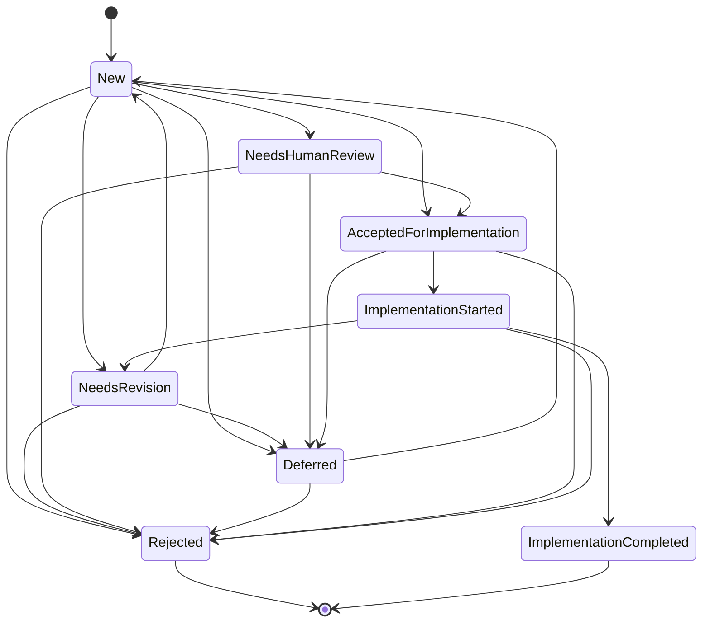

# Creative Ideas subsystem API reference

Modules:
`simard::cognitive_memory::creative_idea`,
`simard::cognitive_threads::threads::creative_ideas`,
`simard::creative_ideas`.

This page documents the public Rust surface of the **Creative Ideas** idea-
generation subsystem: a cognitive thread plus a four-reviewer pipeline that
primes a pool of candidate self-improvement ideas inside the single Simard
brain. For the motivation, decision log, safety model, and roadmap, see
[Creative Ideas background thread (design)](../design/creative-ideas-thread.md).
To turn it on and operate it, see
[Configure and operate the Creative Ideas thread](../howto/configure-creative-ideas-thread.md).

!!! note "Status — implemented; default-ON, opt-out (#2419)"
    The types, the `IdeaStatus` state machine, the `CreativeIdeaStore`
    prospective round-trip, the generator thread, the reviewer / synthesis /
    routing surface, and the dedup/portfolio/budget helpers **are implemented and
    tested**. The subsystem is **default-ON, opt-out** behind
    `SIMARD_CREATIVE_IDEAS_ENABLED`, is **registered** with the `Mind` scheduler,
    and its idea source, reviewers, and guarded GitHub routing run for real
    (tests drive them through deterministic mutation-store and transport
    fakes). The creative-idea memory type (status
    lifecycle + typed links) is owned upstream in `amplihack-memory-lib`
    (guideline G2) and re-exported here. This reference describes the surface as
    built; the
    [design roadmap](../design/creative-ideas-thread.md#phased-roadmap)
    records the delivered milestones (M1–M5) and future tuning (M6). No type or
    module contains the word `Bridge` (operator preference).

## Module layout

```
src/cognitive_memory/creative_idea.rs   # CreativeIdea, IdeaStatus (+ try_transition),
                                         # MemoryLink/MemoryLinkKind, IdeaContext,
                                         # CreativeIdeaStore + ProspectiveCreativeIdeaStore,
                                         # FakeCreativeIdeaStore (cfg(test))
src/cognitive_threads/threads/creative_ideas.rs
                                         # CreativeIdeasThread (impl CognitiveThread, gated),
                                         # GenerationInputs, ActivityWindow, RawIdea,
                                         # IdeaSource trait + FakeIdeaSource, register(&mut Mind)
src/creative_ideas/
  mod.rs         # CreativeIdeasConfig::from_env (gating), const identifiers, re-exports
  reviewers.rs   # Reviewer, Review, ReviewVerdict, ReviewFlags, 4 adapters, fakes
  synthesis.rs   # FeedbackSynthesizer, DefaultSynthesizer, SynthesisOutcome, SuccessMetric
  routing.rs     # route_idea_to_goal plus pure guarded issue/PR request adapters,
                 # IdeaPrGate
  dedup.rs       # is_near_duplicate, select_balanced, within_budget
  dedup_gate.rs  # PLANNED (#2925, not yet implemented): semantic dedup +
                 # enhance gate — plan_candidate, PlannedAction, apply_enhance,
                 # consolidate_existing (see the dedup-gate API reference)
  tests.rs       # unit tests (all fakes, no network)
src/error/mod.rs # + InvalidIdeaTransition, InvalidCreativeIdeaRecord
```

All fallible operations return the crate-wide
`SimardResult<T> = Result<T, SimardError>` (`src/error/mod.rs`). There is no new
`Result` alias, no `anyhow`, and no `unwrap()`/`expect()` on the runtime path
(tests may `expect`). Every public struct is `Clone + Debug` and serde-
serializable so it round-trips through prospective memory and is trivially
asserted in tests.

## Configuration

`CreativeIdeasConfig::from_env()` is the single source of truth for gating and
cadence. A default-constructed config is **enabled** (default-ON, opt-out),
consistent with the Overseer and Journal threads.

| Env var | Default | Effect |
|---------|---------|--------|
| `SIMARD_CREATIVE_IDEAS_ENABLED` | `true` | Master switch (default-ON). Only an explicit falsey value (`0`/`false`/`no`/`off`) opts out ⇒ the thread never ticks and nothing is generated or routed. |
| `SIMARD_CREATIVE_IDEAS_INTERVAL_SECS` | `86400` | Generator cadence — a large (≥ 24 h) observation window. |
| `SIMARD_CREATIVE_IDEAS_BATCH` | `10` | Ideas targeted per run (the design's fixed batch of ten). |
| `SIMARD_DAILY_BUDGET_USD` | *(existing)* | Reused for budget-awareness before an expensive tick. |

```rust
pub struct CreativeIdeasConfig {
    pub enabled: bool,        // SIMARD_CREATIVE_IDEAS_ENABLED (default true; opt-out)
    pub interval_secs: u64,   // SIMARD_CREATIVE_IDEAS_INTERVAL_SECS (default 86_400)
    pub batch: usize,         // SIMARD_CREATIVE_IDEAS_BATCH (default 10)
}

impl Default for CreativeIdeasConfig {
    /// A default config is ENABLED (default-ON, opt-out).
    fn default() -> Self;
}

impl CreativeIdeasConfig {
    /// Parse from the environment. Gate mirrors overseer_acting_enabled():
    /// unset/empty ⇒ enabled; only an explicit falsey value opts out.
    pub fn from_env() -> Self;
    /// Parse from an arbitrary env resolver (test seam).
    pub fn from_lookup(lookup: impl Fn(&str) -> Option<String>) -> Self;
    /// True unless the master switch was explicitly set to a falsey value.
    pub fn enabled(&self) -> bool;
}
```

Stable operator/automation identifiers are centralized as `const`s so they are
treated as a contract (see [Versioning](#versioning)):

| Const | Value | Used for |
|-------|-------|----------|
| `CREATIVE_IDEA_TRIGGER` | `"creative-idea"` | Prospective node-type sentinel (retrieval key) and the issue label |
| `CREATIVE_IDEA_PR_LABEL` | `"creative-idea-needs-human-review"` | The merge-blocking PR label |
| `CREATIVE_IDEA_OWNER` | `"rysweet"` | Issue assignee / PR reviewer for the human gate |

## Data model

### `CreativeIdea`

A `CreativeIdea` is the prospective-memory representation of one candidate
improvement. It is a typed struct that round-trips to a single
`CognitiveProspective` node.

```rust
pub struct CreativeIdea {
    pub node_id: String,                       // prospective node_id ("" until stored)
    pub idea: String,                          // idea text  -> prospective.description
    pub status: IdeaStatus,                    // -> mirrored into prospective.status (String)
    pub context: IdeaContext,                  // provenance/situation  -> payload
    pub links: Vec<MemoryLink>,                // supporting memory nodes -> payload
    pub reviews: Vec<Review>,                  // accumulated reviewer output -> payload
    pub success_metric: Option<SuccessMetric>, // set by the measurability reviewer -> payload
    pub created_epoch: u64,                    // injected clock -> payload
}

pub struct MemoryLink {
    pub kind: MemoryLinkKind,                  // Semantic | Episodic | Procedural
    pub node_id: String,
}

pub enum MemoryLinkKind { Semantic, Episodic, Procedural }

pub struct IdeaContext {
    pub source: String,                        // e.g. "creative-ideas-thread"
    pub goals_snapshot: Vec<String>,
    pub observation_digest: String,            // hash/summary of the >=24h window used
    pub rationale: String,
}
```

**Prospective mapping (round-trip).** The store (de)serializes a `CreativeIdea`
to/from one `CognitiveProspective` node without any schema change to
prospective memory:

| `CognitiveProspective` field | `CreativeIdea` mapping |
|------------------------------|------------------------|
| `description` | `idea` (the idea text) |
| `status` | `status.as_str()` (mirrored `IdeaStatus`) |
| `trigger_condition` | fixed sentinel `CREATIVE_IDEA_TRIGGER` (`"creative-idea"`) — the retrieval filter |
| `action_on_trigger` | JSON payload `{ payload_version, context, links, reviews, success_metric, created_epoch }` |
| `priority` | derived from portfolio/risk (higher = more urgent to review) |

The payload is versioned (`payload_version: u16`, starts at `1`) so a future
native-links migration can detect old rows. A row whose `payload_version` is
newer than the reader understands is a hard `InvalidCreativeIdeaRecord`, never a
silent default.

### `IdeaStatus` state machine

`IdeaStatus` is the lifecycle of an idea. `status` changes **only** through
`CreativeIdea::try_transition`, which validates the edge and returns
`InvalidIdeaTransition { from, to }` for anything not in the table below.

```rust
pub enum IdeaStatus {
    New,                     // freshly generated, not yet reviewed
    NeedsRevision,           // synthesis asked for a rewrite before acceptance
    NeedsHumanReview,        // high-risk / flagged: a human must decide
    AcceptedForImplementation,
    Rejected,                // terminal
    Deferred,                // parked; may be reconsidered later
    ImplementationStarted,   // a goal/PR is in flight
    ImplementationCompleted, // terminal; ONLY when success_metric is met
}

impl CreativeIdea {
    /// Validate and apply a status transition. Returns InvalidIdeaTransition on
    /// any edge not in the allowed table.
    pub fn try_transition(&mut self, to: IdeaStatus) -> SimardResult<()>;
}

impl IdeaStatus {
    pub fn as_str(&self) -> &'static str;
    pub fn is_terminal(&self) -> bool;               // Rejected | ImplementationCompleted
    pub fn can_transition_to(&self, to: IdeaStatus) -> bool;
}

// Parsing is via the standard `FromStr` trait (fail-closed: an unknown string
// yields `InvalidCreativeIdeaRecord`, never a silent default):
impl std::str::FromStr for IdeaStatus {
    type Err = SimardError;
    fn from_str(s: &str) -> SimardResult<Self>;      // unknown -> InvalidCreativeIdeaRecord
}
```

**Allowed transitions** (anything not listed is rejected):

| From | To |
|------|----|
| `New` | `AcceptedForImplementation`, `Rejected`, `Deferred`, `NeedsRevision`, `NeedsHumanReview` |
| `NeedsRevision` | `New`, `Rejected`, `Deferred` |
| `NeedsHumanReview` | `AcceptedForImplementation`, `Rejected`, `Deferred` |
| `Deferred` | `New`, `Rejected` |
| `AcceptedForImplementation` | `ImplementationStarted`, `Deferred`, `Rejected` |
| `ImplementationStarted` | `ImplementationCompleted`, `NeedsRevision`, `Rejected` |
| `Rejected` | *(terminal — no outgoing)* |
| `ImplementationCompleted` | *(terminal — no outgoing)* |



**Enforced invariants** (tested):

- `ImplementationCompleted` is reachable **only** from `ImplementationStarted`.
- The router refuses to complete an idea whose `success_metric` has not been
  marked met — see [`mark_completed`](#outcome-feedback).
- Any idea flagged high-risk/irreversible must pass through `NeedsHumanReview`
  before it can reach `AcceptedForImplementation` (enforced by the synthesis
  policy, below).

### `CreativeIdeaStore` seam

```rust
pub trait CreativeIdeaStore {
    fn store(&self, idea: &CreativeIdea) -> SimardResult<String>; // -> node_id
    fn update(&self, idea: &CreativeIdea) -> SimardResult<()>;    // re-serialize payload/status
    fn list(&self, limit: u32) -> SimardResult<Vec<CreativeIdea>>;
    fn get(&self, node_id: &str) -> SimardResult<Option<CreativeIdea>>;
}

/// Production adapter over CognitiveMemoryOps (thin; no new backend).
pub struct ProspectiveCreativeIdeaStore<'a> { /* mem: &'a dyn CognitiveMemoryOps */ }
```

`store`/`update` call `store_prospective`; `list` calls
`list_prospective_by_trigger(CREATIVE_IDEA_TRIGGER, limit)` — a trigger-scoped,
priority-ordered read whose `limit` bounds only creative-idea nodes — then keeps
rows whose `trigger_condition == CREATIVE_IDEA_TRIGGER` (a cheap fail-closed
guard) and deserializes the payload; `get` filters `list` by `node_id`. Before
issue #122 `list` used the unfiltered `list_all_prospective` + post-filter, so on
a live store the fixed read window filled with unrelated prospective memories and
the idea nodes were truncated away — see
[Creative Ideas trigger-scoped read](./creative-ideas-trigger-scoped-read.md).
Tests use an in-memory `FakeCreativeIdeaStore` **and** a round-trip test through a
fake `CognitiveMemoryOps` that asserts `trigger_condition == "creative-idea"` and
payload fidelity (`links`, `context`, `success_metric`), plus a `>512`-node
regression test that proves the pool survives a store full of unrelated
prospectives.

## The generator thread

`CreativeIdeasThread` implements the `CognitiveThread` trait
(see [Cognitive-thread scheduling](./cognitive-thread-scheduling.md)).

| Method | Value | Notes |
|--------|-------|-------|
| `kind()` | `ThreadKind::BackgroundThought` | Reuses the reserved variant; no enum change. |
| `policy()` | `SchedulePolicy::Interval(Duration::from_secs(interval_secs))` | Default 24 h; reserved to become `Adaptive` later. |
| `priority()` | `Priority::Low` | Never competes with OODA. |
| `enabled()` | `config.enabled()` → **`true` by default** | Default-ON, opt-out. A disabled thread never ticks (scheduler contract), so an opted-out subsystem is inert. |
| `tick(&mut ThreadContext)` | `ThreadOutcome` | **Never returns `Err`** — internal errors are folded into `ThreadOutcome::failed(reason, elapsed)`. Uses `ctx.now_epoch` (injected clock) and may `block_on` `ctx.runtime`. Honors `ctx.shutdown` (returns promptly between stages) and `ctx.dry_run` (performs no goal/issue/PR side-effect). |

```rust
/// Register the Creative Ideas thread with the Mind scheduler, using the
/// production idea source + review/route pipeline. Called from the daemon's
/// cognitive-thread setup behind SIMARD_CREATIVE_IDEAS_ENABLED (default-ON).
pub fn register(mind: &mut Mind, config: CreativeIdeasConfig);

/// Register only when `cfg.enabled()`; returns whether it registered. The daemon
/// calls this so "disabled ⇒ not registered" is directly unit-testable.
pub fn register_creative_ideas_if_enabled(mind: &mut Mind, cfg: &CreativeIdeasConfig) -> bool;
```

### Manual generation — `run_now` (operator "Run now")

`tick` is **gated** (it no-ops when `enabled()` is false or the 24-hour interval
is not yet due) and **total** (it swallows errors into `ThreadOutcome::failed`).
Neither is what an operator wants when clicking **Run now**: they want one pass
**now**, and they want any failure surfaced. `run_now` is the un-gated,
error-returning entrypoint for exactly that.

```rust
impl CreativeIdeasThread {
    /// Run ONE generation pass unconditionally, ignoring `enabled()` and the
    /// interval schedule, and RETURN the outcome (unlike the total `tick`).
    /// Side effects are identical to a scheduled tick: it persists via the
    /// injected `ctx.memory` and may route accepted ideas to goals/issues.
    /// Used by the dashboard "Run now" control; surfaces errors loudly.
    pub fn run_now(&mut self, ctx: &mut ThreadContext<'_>) -> SimardResult<GenerationReport>;
}
```

- **Un-gated by design.** The scheduler gate (`enabled()` + interval) would
  silently skip a manual run; `run_now` bypasses it so an operator always gets a
  pass. A daemon restart resets the 24-hour timer, which is a primary reason a
  manual run exists.
- **Loud, never silent.** It returns `Err` (e.g. `ReviewUnavailable`,
  `PersistentStoreIo`) instead of folding into a `failed` outcome, so callers can
  surface the exact cause.
- **Additive.** `tick`, `run_tick` (private), and the `CognitiveThread` trait
  impl are unchanged. `GenerationReport` is the same struct a tick produces
  (`generated`, `surviving`, `persisted`, `reviewed`, `routed_goal`,
  `routed_issue`, `review_errors`).

This is the seam the dashboard `POST /api/creative-ideas/run` handler invokes
(against the live daemon store, guarded against concurrent runs) — see
[Dashboard HTTP API](#dashboard-http-api-operator-controls) below.

### Daemon registration

The thread is registered from the OODA daemon's cognitive-thread setup
(`src/operator_commands_ooda/daemon/mod.rs`), next to the Overseer and Journal
threads. Two facts make it observable and testable:

- **Runtime gate.** The daemon builds the `Mind` runtime when *either* the
  generic scheduler master switch (`SIMARD_COGNITIVE_THREADS_ENABLED`,
  default-OFF, which owns the maintenance/engineer-log threads) **or** Creative
  Ideas is enabled — so the default-ON Creative Ideas thread runs even on a stock
  deployment where the generic scheduler is off. Registration goes through
  `register_creative_ideas_if_enabled`, so an opted-out config leaves the thread
  unregistered (asserted by a test via `mind.health()` / `mind.len()`).
- **Startup + per-tick logs.** At startup the daemon emits one dedicated line
  mirroring the Journal thread:
  `[simard] OODA daemon: creative-ideas thread ENABLED (default) (interval = {n}s; SIMARD_CREATIVE_IDEAS_ENABLED opt-out)`
  (or `… DISABLED (SIMARD_CREATIVE_IDEAS_ENABLED opt-out)`). Each run surfaces its
  summary through the shared scheduler prefix:
  `[simard] cognitive-thread: creative_ideas: generated N idea(s), …`.
  The tick executes on a background thread with an overlap guard and panic
  isolation, so it cannot stall or crash the authoritative OODA loop.

### Thread inputs (the observation window)

`tick` assembles a typed `GenerationInputs` from **read-only** sources:

```rust
pub struct GenerationInputs {
    pub current_goals: Vec<String>,          // GoalStore active/proposed
    pub recent_activity: ActivityWindow,     // >= 24h of progress & behavior (Journal/OODA)
    pub episodic_summaries: Vec<String>,     // cognitive-memory episodic digests
    pub works_in_progress: Vec<String>,      // open goals/PRs/sessions
    pub overseer_observations: Vec<String>,  // src/overseer (cross-pollination)
    pub conversation_insights: Vec<String>,  // extracted from meetings/conversations
    pub previous_ideas: Vec<CreativeIdea>,   // for dedup/novelty (store.list)
}
```

### Pluggable idea source

```rust
pub struct RawIdea { pub idea: String, pub links: Vec<MemoryLink>, pub rationale: String }

pub trait IdeaSource {
    /// Produce up to `n` diverse raw idea candidates from the inputs.
    fn generate(&self, inputs: &GenerationInputs, n: usize) -> SimardResult<Vec<RawIdea>>;
}
```

- **Production:** `AgenticIdeaSource` (`src/creative_ideas/source.rs`) — renders
  the generation prompt asset, runs one agentic turn through the shared
  `AgentInvoker` seam (idle-liveness, no wall-clock cap), and parses the JSON
  envelope into `RawIdea`s. Fail-closed: a response with no JSON envelope is a
  hard error, never a silent empty batch. Built by `register`/`from_env`.
- **Tests:** `FakeIdeaSource` (deterministic; `with_ideas` / `failing`).

The thread targets **ten** ideas per run, applies dedup + portfolio filtering
(below), persists each survivor as `CreativeIdea { status: New, links,
context }` via `CreativeIdeaStore`, then drives it through the review-and-route
pipeline.

## Reviewer pipeline

Each new idea is reviewed by four reviewers in order; a synthesis step then sets
the status. Reviewers are a trait so they are pluggable and independently
testable.

```rust
pub struct ReviewContext<'a> {
    pub idea: &'a CreativeIdea,
    pub inputs: &'a GenerationInputs,
}

pub enum ReviewVerdict { Support, Concern, Block, NeedsHuman }

pub struct ReviewFlags {
    pub high_risk: bool,
    pub irreversible: bool,
    pub needs_human: bool,
}

pub struct Review {
    pub reviewer: &'static str,                 // stable id for telemetry
    pub verdict: ReviewVerdict,
    pub notes: String,
    pub flags: ReviewFlags,
    pub proposed_metric: Option<SuccessMetric>, // measurability reviewer only
}

pub trait Reviewer {
    fn id(&self) -> &'static str;
    fn review(&self, ctx: &ReviewContext<'_>) -> SimardResult<Review>;
}
```

The four reviewers and their stable ids:

| Order | Reviewer id | Kind | Responsibility |
|-------|-------------|------|----------------|
| 1 | `crusty_old_engineer` | skill adapter | Scope, feasibility, necessity, utility, inventiveness, **RISK**, need-for-human-review, practicality. Sets `high_risk`/`needs_human` when warranted. |
| 2 | `philosophy_guardian` | agent adapter | "Do we need this? Will it be an interesting enhancement?" **A user signal is NOT required** — absence of one is neutral, never a `Block`; exploratory ideas are encouraged. |
| 3 | `measurability` | agent adapter (NEW) | Emits a concrete `SuccessMetric`, tied where relevant to existing self-metrics (`recall_precision_at_k`, distill fact-yield, reasoner-reliability). This metric is the only thing that can later move the idea to `ImplementationCompleted`. |
| 4 | `idea_feedback_synthesis` | synthesis step | Reads **all** reviews + context, summarizes next steps, and **sets the status** per the state machine. |

Production adapters shape an amplihack skill/agent invocation via the shared
`AgentInvoker::invoke(prompt) -> String` seam (the same blessed session path the
OODA brain uses); the three vetting reviewers ship with real prompt assets
(`prompt_assets/simard/creative_ideas_review_*.md`). All tests inject
deterministic fake invokers.

### Synthesis

```rust
pub struct SuccessMetric {
    pub name: String,           // e.g. "recall_precision_at_k"
    pub baseline: Option<f64>,
    pub target: String,         // e.g. ">= +0.05 over 7-day baseline"
    pub how_measured: String,
}

pub struct SynthesisOutcome {
    pub next_status: IdeaStatus,        // MUST be a legal transition from idea.status
    pub next_steps: String,
    pub set_metric: Option<SuccessMetric>,
}

pub trait FeedbackSynthesizer {
    /// Fold all reviews into a next-status + human-readable next steps.
    fn synthesize(&self, ctx: &ReviewContext<'_>, reviews: &[Review])
        -> SimardResult<SynthesisOutcome>;
}

pub struct DefaultSynthesizer; // deterministic policy below; the test fake mirrors it
```

**Default synthesis policy** (deterministic; the test fake mirrors it):

1. Any reviewer sets `irreversible` **or** `high_risk` **or** `needs_human`
   → `NeedsHumanReview`.
2. Any `Block` (from a non-philosophy reviewer) with no human flag →
   `Rejected` (fatal) or `NeedsRevision` (fixable).
3. No metric produced → `NeedsRevision` (an idea with no way to measure success
   is not acceptable).
4. Otherwise, sufficient support + a metric → `AcceptedForImplementation`.

The pipeline runner applies `try_transition` to `next_status`, so an illegal
synthesis verdict is a hard `InvalidIdeaTransition`, not a silent corruption.

## Routing

Routing consumes an idea whose synthesis has set a status and dispatches it. All
routing functions are typed, produce side effects only through an injected seam,
and are fake-tested.

### 1. Accepted, not flagged → a Goal

```rust
pub fn route_idea_to_goal(idea: &CreativeIdea, goals: &dyn GoalStore, now_epoch: u64)
    -> SimardResult<GoalRecord>;
```

Produces a `GoalRecord` with status `Proposed` and `slug = goal_slug(idea.idea)`,
tagged in its evidence/label with the originating `idea.node_id` for
traceability. The idea transitions `AcceptedForImplementation →
ImplementationStarted` when the goal is created. Time is passed as
`now_epoch: u64` (unix-epoch seconds) — the same injected-clock convention as
`ctx.now_epoch` in `tick`, so there is no separate `Clock` trait to depend on
and timestamps are deterministic under test.

### 2. Accepted but flagged → a GitHub Issue tagging the owner

```rust
pub fn route_idea_to_issue(
    idea: &CreativeIdea,
    guard: &mut GitHubMutationGuard,
    authorization: &AutonomousGitHubAuthorization,
) -> Result<GitHubMutationOutcome, GitHubMutationError>;
```

Applies only to ideas in `NeedsHumanReview` whose typed lineage is eligible.
It constructs the labeled and assigned request; the guard derives mutation
identity, reserves budget, reconciles restart state, and owns transport.

### 3. Idea-PR human-review gate

```rust
pub struct IdeaPrGate {
    pub draft: bool,                        // always true: kept as DRAFT
    pub blocking_label: &'static str,       // "creative-idea-needs-human-review"
    pub review_requested_from: Vec<String>, // ["rysweet"] — owner review required
    pub originating_idea: String,           // idea.node_id (link back)
}

pub fn mark_idea_pr(
    pr_number: u64,
    idea: &CreativeIdea,
    guard: &mut GitHubMutationGuard,
    authorization: &AutonomousGitHubAuthorization,
) -> Result<IdeaPrGate, GitHubMutationError>;
```

A PR arising from a creative-idea goal is blocked from merge by three standard
GitHub mechanisms - **never** `--admin` or `--no-verify`. Each draft, label,
body edit, and review request is a repository-scoped guarded operation:

- **Draft** — a draft PR cannot be merged by anyone until marked ready.
- **Blocking label** — `creative-idea-needs-human-review`; branch protection /
  required status can key off it to keep the merge button disabled.
- **Owner review-required** — `request-review` from `rysweet`. Simard
  *requests* the review; she never approves her own gate.
- **Link-back** — the PR body carries `originating-idea: <node_id>`, closing
  the idea ↔ goal ↔ issue ↔ PR traceability loop.

A unit test asserts the constructed `gh` argument vectors contain neither
`--admin` nor `--no-verify`.

### Pure GitHub request adapter

```rust
pub fn build_idea_pr_mutations(
    idea: &CreativeIdea,
    pull_request: PullRequestNumber,
) -> Result<Vec<GitHubMutationRequest>, IdeaRoutingError>;
```

- The adapter is pure. Issue and PR writes both use
  [the stewardship mutation guard](./stewardship-mutation-guard.md).
- Guard transport fakes assert the shared budget and emitted operations.

### Outcome feedback

```rust
/// Move an idea to ImplementationCompleted — refuses unless metric_met is true.
pub fn mark_completed(idea: &mut CreativeIdea, metric_met: bool) -> SimardResult<()>;
```

`mark_completed` returns `InvalidIdeaTransition` if the idea is not in
`ImplementationStarted`, and refuses (does not transition) when `!metric_met`.
`ImplementationCompleted` therefore fires only when **both** the PR merges
through the normal gate and the idea's `success_metric` is met.

## Error handling

The subsystem reuses the crate `SimardError` (structured, named-field variants;
`Clone + Debug + Eq + PartialEq`) and adds **exactly two** new variants:

```rust
// src/error/mod.rs — the ONLY additions to the shared enum
InvalidIdeaTransition {          // mirrors InvalidRuntimeTransition / InvalidSessionTransition
    from: IdeaStatus,
    to: IdeaStatus,
},
InvalidCreativeIdeaRecord {      // mirrors InvalidGoalRecord / InvalidImprovementRecord
    field: String,
    reason: String,
},
```

Everything else reuses existing variants — no bespoke error machinery:

| Source | Variant |
|--------|---------|
| serde (de)serialize failure | `InvalidCreativeIdeaRecord { field, reason }` (via `map_err`) |
| Illegal `try_transition` / illegal synthesis `next_status` | `InvalidIdeaTransition { from, to }` |
| Over budget / rate limit | `BudgetExceeded { period, spent, limit }` (or a skipped outcome when merely over cadence) |
| `gh` non-zero exit / hang (future real impl) | `GitCommandFailed` / `ActionExecutionFailed` / `CommandTimeout` |
| Unreachable skill/agent | `ReviewUnavailable { reason }` |
| Fatal synthesis block | `ReviewBlocked { summary }` |
| Unknown `IdeaStatus`/`ReviewVerdict`/`MemoryLinkKind` string, or too-new `payload_version` | `InvalidCreativeIdeaRecord` — **fail-closed**, never a silent default |

`CreativeIdeasThread::tick` is infallible by contract: every internal `Err` is
caught, `tracing::warn!`-logged with the stable `creative_ideas` thread id, and
returned as `ThreadOutcome::failed(reason, elapsed)`. A single idea's failure
never aborts the batch or the daemon.

## Operation surface (the "endpoints")

The subsystem is an in-process Rust library, so its core "API" is its public
trait methods and free functions (below). In addition, the **operator dashboard**
exposes a small HTTP surface over this library for the Creative Ideas tab — see
[Dashboard HTTP API](#dashboard-http-api-operator-controls).

| Operation | Request (input) | Response (`Ok`) | Primary error variants |
|-----------|-----------------|-----------------|------------------------|
| `CreativeIdeaStore::store` | `&CreativeIdea` | `String` (node_id) | `InvalidCreativeIdeaRecord`, `PersistentStoreIo`, `StoragePoisoned` |
| `CreativeIdeaStore::update` | `&CreativeIdea` | `()` | `InvalidCreativeIdeaRecord`, `PersistentStoreIo`, `StoragePoisoned` |
| `CreativeIdeaStore::list` | `limit: u32` | `Vec<CreativeIdea>` | `InvalidCreativeIdeaRecord`, `StoragePoisoned` |
| `CreativeIdeaStore::get` | `&str` (node_id) | `Option<CreativeIdea>` | `InvalidCreativeIdeaRecord`, `StoragePoisoned` |
| `CreativeIdea::try_transition` | `to: IdeaStatus` | `()` | `InvalidIdeaTransition { from, to }` |
| `IdeaSource::generate` | `&GenerationInputs, n: usize` | `Vec<RawIdea>` | `ReviewUnavailable`, `BudgetExceeded` |
| `Reviewer::review` | `&ReviewContext` | `Review` | `ReviewUnavailable` |
| `FeedbackSynthesizer::synthesize` | `&ReviewContext, &[Review]` | `SynthesisOutcome` | `ReviewBlocked`, `InvalidIdeaTransition` |
| `route_idea_to_goal` | `&CreativeIdea, &dyn GoalStore, now_epoch: u64` | `GoalRecord` | `InvalidGoalRecord`, `InvalidIdeaTransition` |
| `route_idea_to_issue` | `&CreativeIdea, &mut GitHubMutationGuard, &AutonomousGitHubAuthorization` | `GitHubMutationOutcome` | `GitHubMutationError` |
| `mark_idea_pr` | `pr: u64, &CreativeIdea, &mut GitHubMutationGuard, &AutonomousGitHubAuthorization` | `IdeaPrGate` | `GitHubMutationError` |
| `mark_completed` | `&mut CreativeIdea, metric_met: bool` | `()` | `InvalidIdeaTransition` |
| `CreativeIdeasThread::tick` | `&mut ThreadContext` | `ThreadOutcome` | **never `Err`** — folds into `ThreadOutcome::failed` |
| `CreativeIdeasThread::run_now` | `&mut ThreadContext` | `GenerationReport` | `ReviewUnavailable`, `PersistentStoreIo`, `InvalidIdeaTransition` (returned, not folded) |

### Dashboard HTTP API (operator controls)

The operator dashboard layers three write endpoints (plus the pre-existing two
read endpoints) over this library for the **Creative Ideas** tab. All are under
`/api/creative-ideas`, return `application/json`, and sit behind `require_auth`.
Ideas are addressed by their stable **`idea_id`**. Reads degrade to
`{"error": …}` at HTTP 200; writes return an explicit success or an
`{"error": …}` (also HTTP 200) that the UI renders as a visible banner — no edge
is applied silently. Full request/response JSON, gating rules, and examples live
in the operator guide:
[Creative Ideas tab — live view and operator controls](../operator-dashboard/creative-ideas-operator-controls.md).

| Method & path | Backs onto | Notes |
|---------------|-----------|-------|
| `GET /api/creative-ideas` | `CreativeIdeaStore::list` (shared live reader) | Live pool (latest revision per idea) + per-status counts. |
| `POST /api/creative-ideas/search` | `CreativeIdeaStore::list` + in-memory filter | Filter by `status` and/or free-text `query`. |
| `POST /api/creative-ideas/run` | `CreativeIdeasThread::run_now` | **Run now.** Un-gated pass against the live daemon store; process-level re-entrancy guard returns `{"running": true}` if one is in flight. |
| `POST /api/creative-ideas/{id}/promote` | `try_transition(AcceptedForImplementation)` + `store.update` [+ `route_idea_to_goal`] | Body `{"route_to_goal"?: bool}` (default `true`). Persists acceptance before best-effort goal routing; routing failure surfaces `goal_error` without rolling back acceptance. |
| `POST /api/creative-ideas/{id}/prune` | `try_transition(Rejected)` + `store.update` | Rejects the idea (terminal). |

Writes flow through the same `CognitiveMemoryOps` the daemon holds (the tier-0
in-process writer), so the tab reflects operator actions on the next refresh with
no split-brain, and — per operator preference — **no type, module, or identifier
introduced for this surface contains the word `Bridge`**.

## Versioning

With no wire protocol, three externally-observable contracts must remain stable:

| Contract | Stability rule | Version mechanism |
|----------|----------------|-------------------|
| On-disk prospective payload (`action_on_trigger` JSON) | Additive-only within a major version; rename/removal needs a bump + migration | `payload_version: u16` (starts at `1`). Reader: `== known` parse; `> known` → `InvalidCreativeIdeaRecord`; missing → assume `1` |
| Node-type sentinel (`trigger_condition = "creative-idea"`) | Never renamed — it is the retrieval key for stored rows | Literal `const CREATIVE_IDEA_TRIGGER`; a rename is a breaking migration |
| Operator / automation surface (`SIMARD_CREATIVE_IDEAS_*`, labels, assignee) | Stable identifiers | Centralized `const`s in `CreativeIdeasConfig` |

- **Trait/type API** — the Rust surface is
  `#![allow(dead_code)]` and carries no semver promise. `Reviewer`,
  `FeedbackSynthesizer`, `IdeaSource`, and `GitHubMutationTransport` are the
  long-term extension seams: extend via new impls or guarded operation variants,
  never through a side-channel writer.
- **Enum evolution** — adding an `IdeaStatus`/`ReviewVerdict` state is
  backward-compatible for writers, but per the fail-closed rule an older reader
  rejects an unknown state. Ship such a change **reader-first**.
- **Forward-migration hook (`// FUTURE:`)** — promoting `links` to native
  prospective edges bumps `payload_version` to `2`; a one-shot migration reads
  v1 rows, writes native edges, and rewrites the payload.

## Observability

Structured `tracing` only (no `println!`/`eprintln!` beyond the `[simard] …`
prefix convention). Spans/metrics are keyed on the stable thread id
`creative_ideas` and the reviewer ids (`crusty_old_engineer`,
`philosophy_guardian`, `measurability`, `idea_feedback_synthesis`): ideas
generated, deduped, per-verdict counts, routed→goal / routed→issue / pr-gated,
and status-transition events. These reuse the existing cognitive-thread
telemetry surface (`src/cognitive_threads/telemetry.rs`) documented in
[Telemetry metrics](./telemetry-metrics.md).

## Test fakes

All tests run with no network and an injected clock. The following fakes are
part of the module surface (`cfg(test)` where applicable):

| Fake | Replaces | Used by |
|------|----------|---------|
| `FakeIdeaSource` | `IdeaSource` | pipeline / dedup tests |
| `FakeCreativeIdeaStore` | `CreativeIdeaStore` | persistence tests (plus a fake `CognitiveMemoryOps` round-trip) |
| Fake reviewers + fake `FeedbackSynthesizer` | `Reviewer` / `FeedbackSynthesizer` | pipeline / synthesis tests |
| `FakeGoalStore` | `GoalStore` | `route_idea_to_goal` |
| Fake mutation store and transport | `GitHubMutationGuard` dependencies | issue/PR routing, restart replay, shared-budget enforcement, and no privilege-bypass arguments |
| Injected `now_epoch: u64` | wall clock | deterministic timestamps (no `Clock` trait) |

See the [design test plan](../design/creative-ideas-thread.md#test-plan-no-network-all-fakes)
for the full list of assertions.

## See also

- [Creative Ideas tab — live view and operator controls](../operator-dashboard/creative-ideas-operator-controls.md)
- [Creative Ideas background thread — design](../design/creative-ideas-thread.md)
- [Configure and operate the Creative Ideas thread](../howto/configure-creative-ideas-thread.md)
- [Creative Ideas durable read-after-write](./creative-ideas-durable-read-after-write.md) — the persistence/read seam that keeps the dashboard tab non-empty and durable across restart (#2798)
- [Creative Ideas trigger-scoped read](./creative-ideas-trigger-scoped-read.md) — the trigger-scoped, priority-ordered read that keeps the pool visible on a live store full of unrelated prospectives (#122)
- [Cognitive-thread scheduling](./cognitive-thread-scheduling.md)
- [Add a new cognitive thread](../howto/add-a-new-cognitive-thread.md)
- [Goal board API](./goal-board-api.md) · [Stewardship API](./stewardship-api.md)
