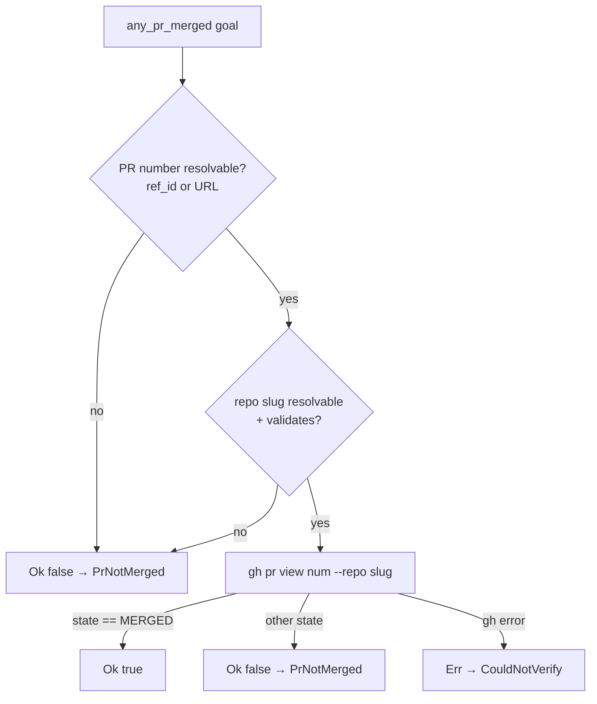

# Cross-repo merged-PR evidence API reference

> **Status: implemented.** `parse_pr_url`, the PR-target resolver, and the
> reworked `GhCliEvidenceSource::any_pr_merged` live in
> [`src/goal_curation/completion_gate.rs`](https://github.com/rysweet/Simard/blob/main/src/goal_curation/completion_gate.rs).
> This is an **additive, non-breaking** extension of the
> [completion-evidence gate](./completion-evidence-gate-api.md): the
> `EvidenceSource` trait, its blanket `impl for &T`, `CompletionEvidenceGate::evaluate`,
> and the `WipRef` schema are all unchanged.
> Issue [#4375](https://github.com/rysweet/Simard/issues/4375).

This reference specifies the merged-PR evidence resolution that lets the
[deploy-aware done-gate](../concepts/deploy-aware-done-gate.md) verify clause 1
("merged PR") against **each goal's own target repository**, reading the PR
linkage the goal actually persisted (a numeric `WipRef.ref_id` **or** a
`WipRef.url`). For the rationale and the failure it fixes — the per-cycle
`completion BLOCKED … — missing PR not merged` reconciliation loop — see
[cross-repo completion reconciliation](../concepts/cross-repo-completion-reconciliation.md).

## Contents

- [`parse_pr_url`](#parse_pr_url)
- [PR-target resolution](#pr-target-resolution)
- [`any_pr_merged` behaviour](#any_pr_merged-behaviour)
- [Fail-closed invariants](#fail-closed-invariants)
- [Argument-injection validation](#argument-injection-validation)
- [Unchanged surface](#unchanged-surface)
- [Regression tests](#regression-tests)

## `parse_pr_url`

A pure, panic-free helper that recovers `(owner/repo, pr_number)` from a GitHub
pull-request URL.

```rust
/// Parse a GitHub PR URL into `(owner/repo, pr_number)`.
///
/// Returns `Some(("owner/repo".into(), "42".into()))` for a URL of the shape
/// `https://github.com/<owner>/<repo>/pull/<digits>` (where `<digits>` is
/// followed by the end of the URL or a `/…` suffix such as `/files`); returns
/// `None` for any non-PR URL, an issue URL, or malformed input. Total and
/// panic-free: never unwraps, bounds input length, and logs a `tracing::debug`
/// on a miss.
fn parse_pr_url(url: &str) -> Option<(String, String)>;
```

Behaviour:

| Input | Result |
| --- | --- |
| `https://github.com/rysweet/agent-kgpacks-rs/pull/42` | `Some(("rysweet/agent-kgpacks-rs", "42"))` |
| `https://github.com/rysweet/Simard/issues/9` | `None` (issue, not a PR) |
| `https://github.com/rysweet/agent-kgpacks-rs/pull/42/files` | `Some(("rysweet/agent-kgpacks-rs", "42"))` |
| `https://github.com/rysweet/agent-kgpacks-rs/pull/abc` | `None` (non-digit number) |
| `not a url` / empty / `> 2048` chars | `None` |

Guarantees:

- **Total & pure.** No I/O, no network, no `unwrap`/`panic`; input length is
  bounded (`<= 2048`).
- **Strict shape.** Requires a `/pull/<digits>` segment followed by the end of
  the URL or a `/…` suffix (e.g. `/files`); the PR number is ASCII-digit-only.
- **No URL-decoding.** The parser does not percent-decode, so it cannot
  reintroduce `/` or control characters into the slug.

## PR-target resolution

`any_pr_merged` resolves *which repo* to query and *which PR number* to check
using deterministic, first-match-wins precedence.

**Repository slug precedence:**

| Order | Source | Example |
| --- | --- | --- |
| 1 | Qualified `goal.repo` (`owner/repo`, not `Simard`) | `rysweet/agent-kgpacks-rs` |
| 2 | `owner/repo` parsed from the PR `WipRef.url` | `rysweet/agent-kgpacks-rs` |
| 3 | Bare `goal.repo` scoped under the default owner | `agent-kgpacks-rs` → `rysweet/agent-kgpacks-rs` |
| 4 | Default `rysweet/Simard` | `rysweet/Simard` |

**PR number precedence:**

| Order | Source | Example |
| --- | --- | --- |
| 1 | Numeric `WipRef.ref_id` on a `pr` wip_ref | `42` |
| 2 | Number parsed from the PR `WipRef.url` | `42` |

Rows 1, 3, and 4 of the slug table preserve the pre-existing `repo_slug`
behaviour; row 2 (URL-derived repo) and PR-number row 2 (URL-derived number) are
the additive recovery paths introduced by
[#4375](https://github.com/rysweet/Simard/issues/4375).

> **Pairing rule (repo/number consistency).** The repo and PR number are logically
> a *pair*, not two independent lookups. When the PR **number** is recovered from a
> `WipRef.url` (i.e. there is no numeric `ref_id`), the query uses **that same
> URL's `owner/repo`**, so the gate never checks a URL-derived number against a
> different repo. A **qualified `goal.repo`** (slug row 1) only overrides the
> URL-derived repo when the number itself came from a numeric `ref_id` — the case
> where the goal record asserts the PR lives in `goal.repo`. This keeps the
> `(repo, number)` pair atomic and avoids a cross-repo mismatch on URL-only
> linkages whose `goal.repo` points elsewhere.

## `any_pr_merged` behaviour

```rust
impl EvidenceSource for GhCliEvidenceSource {
    /// Is any PR for this goal merged?
    ///
    /// Resolves the PR number and target repo via the precedence above,
    /// consulting `WipRef.url` when a numeric `ref_id` or qualified `goal.repo`
    /// is absent, then runs `gh pr view <num> --repo <owner/repo> --json state
    /// --jq .state` and returns `state == "MERGED"`.
    fn any_pr_merged(&self, goal: &ActiveGoal) -> SimardResult<bool>;
    // is_deployed: unchanged. issue_closed: resolution unchanged, but it gains
    // the same fail-closed slug/number validation (see below).
}
```

Decision flow:



A cross-repo goal (e.g. `repo = rysweet/agent-kgpacks-rs`, or a PR-URL-only
linkage with no `goal.repo`) whose PR is merged now returns `Ok(true)`, so the
gate certifies `Complete` and the goal archives instead of re-blocking.

## Fail-closed invariants

This resolution never weakens the gate into a silent always-pass:

| Situation | Result | Blocker |
| --- | --- | --- |
| No `pr` wip_ref and no parseable PR URL | `Ok(false)` (no network) | `PrNotMerged` |
| PR URL present but unparseable | fall through to slug precedence; if still no number → `Ok(false)` | `PrNotMerged` |
| Resolved slug/number fails validation | fail closed (no `gh` call) | `PrNotMerged` |
| PR resolves but state ≠ `MERGED` | `Ok(false)` | `PrNotMerged` |
| `gh` invocation error | `Err(..)` | `CouldNotVerify { detail }` |
| PR resolves and state == `MERGED` | `Ok(true)` | — (clause satisfied) |

There is no path where an absent or unmerged PR is reported as merged.

## Argument-injection validation

Before the resolved repo slug and PR number reach the `gh` subprocess, both are
validated; failures **fail closed** (block) rather than reaching `gh`:

- **PR number:** non-empty ASCII digits only (`^[0-9]+$`). This validation
  applies to **every** number path — including a number taken verbatim from
  `WipRef.ref_id` (which `first_ref_of_kind` returns unvalidated) — so the
  `ref_id` linkage is now hardened against argument injection too, not just the
  URL-derived path.
- **Repo slug:** `^[A-Za-z0-9._-]+/[A-Za-z0-9._-]+$` — no leading `-`, no
  whitespace, no shell metacharacters.

The command is invoked with `Command::args` (no shell, no `sh -c`, no string
interpolation), and only the read-only `gh pr view` verb is used. `gh` stderr is
surfaced at `debug`/`warn`; auth tokens are never logged.

The **same validation is applied to `issue_closed`** (whose issue number is an
untrusted `WipRef.ref_id` and whose slug may echo an unvalidated `goal.repo`): a
non-digit number or unsafe slug fails closed — the issue is treated as still open
(blocks archival) and `gh` is never invoked. This is a defense-in-depth parity
fix; `issue_closed`'s resolution logic is otherwise unchanged.

## Unchanged surface

To keep the change additive and non-breaking, the following are **not** modified:

- The [`EvidenceSource` trait](./completion-evidence-gate-api.md#evidence-sources)
  signature and its blanket `impl EvidenceSource for &T`.
- [`CompletionEvidenceGate::evaluate`](./completion-evidence-gate-api.md#completionevidencegate)
  and the `CompletionVerdict` / `MissingEvidence` types.
- The `WipRef` schema in
  [`types.rs`](https://github.com/rysweet/Simard/blob/main/src/goal_curation/types.rs)
  (`kind`, `ref_id`, `label`, `url`) — the fix reads the existing `url` field; no
  new field is added.
- The **repo-relative URL/number resolution** itself — it is scoped to the
  merged-PR clause; `is_deployed` and the `is_self_affecting` classifier are not
  modified, and `issue_closed`'s success semantics (a closed linked issue ⇒
  `true`) are preserved.
- The `SIMARD_COMPLETION_EVIDENCE` kill-switch semantics.

> **Note — `issue_closed` hardening.** `issue_closed` is *not* left byte-for-byte
> unchanged: it gains the **same fail-closed argument-injection validation** as
> `any_pr_merged` (a non-digit issue number or an unsafe `owner/repo` slug now
> fails closed — blocks — without reaching `gh`). This is a defense-in-depth
> parity fix, not a change to the clause's resolution logic; see
> [Argument-injection validation](#argument-injection-validation) and the
> `issue_closed_fails_closed_*` regression tests.

Existing tests continue to pass unchanged, including
`gh_source_repo_slug_resolves_all_four_forms` and
`gh_source_no_pr_ref_reports_unmerged_without_network` (the no-PR short-circuit
still returns without a network call).

## Regression tests

Added in
[`src/goal_curation/completion_gate/tests.rs`](https://github.com/rysweet/Simard/blob/main/src/goal_curation/completion_gate/tests.rs),
hermetic (no `gh`, no network) via a goal-aware evidence double:

| Test | Asserts |
| --- | --- |
| Cross-repo merged PR (via `repo = rysweet/agent-kgpacks-rs` or a PR-URL-only linkage) | gate returns `Complete`; `archive_completed_with_evidence` **archives** it |
| Goal with no / unmerged PR | gate returns `Blocked` with `MissingEvidence::PrNotMerged`; goal **stays active** |
| `parse_pr_url` unit cases | valid PR URL, issue URL, garbage, non-digit number, leading-dash/whitespace all resolve per the table above |
| Repeat evaluation determinism | evaluating the same goal twice yields the identical verdict |

The regression fake is a **goal-aware** `EvidenceSource` that varies
`any_pr_merged` by the goal's *resolved* repo/URL (not the goal-ignoring
`FakeEvidence`), so the tests exercise the resolution precedence itself.

## See also

- [Cross-repo completion reconciliation concept](../concepts/cross-repo-completion-reconciliation.md)
- [Completion-evidence gate API reference](./completion-evidence-gate-api.md)
- [Goal target-repo routing API reference](./goal-target-repo-routing.md)
- [Cross-repo merge authority](./cross-repo-merge-authority.md)
- [How to diagnose a rejected goal completion](../howto/diagnose-a-rejected-goal-completion.md)
