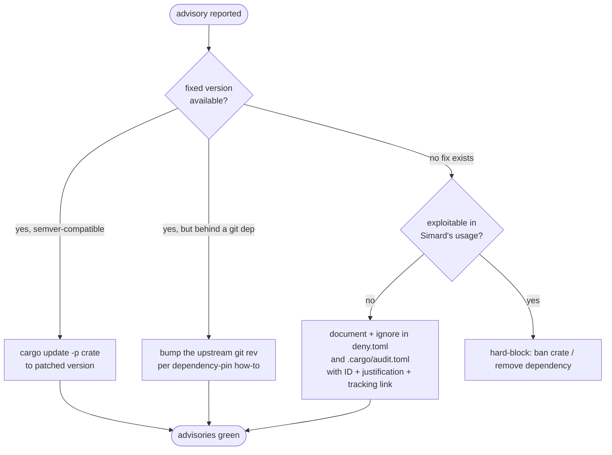

# Dependency trust policy

> **Status: active.** This page documents the shipped `cargo-vet` integration
> for issue #2262: the `supply-chain/` baseline, the CI certification gate, the
> criteria for trusting or exempting a crate, and how a reported advisory moves
> to *resolved* or *exempted*. It is both the operator reference and the spec
> the `cargo vet` CI job enforces.

Exact-rev pinning (see
[the dependency-pin how-to](../howto/self-maintain-dependency-pins.md)) makes
Simard's dependency graph **reproducible** — the same source always resolves to
the same crates. It does not, by itself, say anything about whether those
crates are **trustworthy**. `cargo-vet` closes that gap: it records an explicit,
reviewable certification for every third-party crate in the graph and fails CI
when an un-certified crate appears.

## At a glance

| Concern | Tool | Config | CI gate |
| --- | --- | --- | --- |
| "Has this crate version been vetted?" | `cargo-vet` | `supply-chain/{config.toml,audits.toml,imports.lock}` | `cargo vet --locked` |
| "Does this crate have a known vulnerability?" | `cargo-audit` | `.cargo/audit.toml` | `cargo audit` |
| "Is the license / source / advisory acceptable?" | `cargo-deny` | `deny.toml` | `cargo deny --locked check` |

The three tools are complementary, not redundant — `cargo-vet` answers a
question the other two cannot: *who looked at this code and what did they
conclude?* See [supply-chain audit](./supply-chain-audit.md) for how all three
jobs are wired into `verify.yml` as lockfile-only, cache-neutral CI jobs.

## The `supply-chain/` baseline

`cargo vet init` records the current dependency graph as a baseline under a
committed `supply-chain/` directory:

| File | Purpose |
| --- | --- |
| `supply-chain/config.toml` | Policy: imported audit sources, per-crate exemptions, and the criteria each dependency must satisfy. |
| `supply-chain/audits.toml` | Simard's own audit certifications (entries added as crates are reviewed locally). |
| `supply-chain/imports.lock` | Locked cache of audits imported from trusted external registries (e.g. the Mozilla / Bytecode Alliance audit sets); empty until imports are configured. |

At initialization every crate already in the graph is recorded as an
**exemption** (`[[exemptions.<crate>]]` in `config.toml`). An exemption means
*"this crate is in the baseline and tolerated, but not yet positively
certified."* This makes the gate **non-breaking on day one** (CI is green
immediately) while establishing a ratchet: from the baseline forward, **any new
crate or version that is neither imported-audited nor explicitly exempted fails
CI**.

```text
supply-chain/
├── config.toml     # imports, policy, exemptions (baseline = current graph)
├── audits.toml     # Simard-authored certifications
└── imports.lock    # locked cache of imported third-party audit sets
```

## CI gate

`cargo-vet` runs as its own lockfile-only job in
`.github/workflows/verify.yml`, alongside `cargo-audit` and `cargo-deny`:

```yaml
cargo-vet:
  runs-on: ubuntu-latest
  timeout-minutes: 10
  permissions:
    contents: read
  steps:
    - name: Check out repository
      uses: actions/checkout@34e114876b0b11c390a56381ad16ebd13914f8d5 # v4
    - name: Install cargo-vet
      uses: taiki-e/install-action@7b51dc7487ebab790625f16f2c5f541029a3b0ab # cargo-vet
      with:
        tool: cargo-vet
    - name: Run cargo vet
      run: cargo vet --locked
```

Properties, identical to the other guardrail jobs:

- **Lockfile-only** — no crate compilation, not in `pre-commit`, never writes
  the shared `simard-ci-v2` cache.
- **`contents: read`** only — no token write scope.
- **SHA-pinned** `taiki-e/install-action` with an explicit `tool: cargo-vet`
  input (each tool has its own tag/commit, so a SHA pin alone selects the tool
  baked into that commit — always pass `tool:`).
- **`--locked`** — fails on a dirty `Cargo.lock`.

`cargo vet --locked` passes when every third-party crate in the locked graph is
covered by an audit (imported or local) **or** an explicit exemption.

## Trusted-crate criteria

A crate is promoted from *exempted* to *certified* (an entry in
`audits.toml`, or an imported audit in `imports.toml`) when it meets the
trust criteria below. The default certification level is
`safe-to-deploy` (the crate will be compiled and run, including its build
scripts), with `safe-to-run` reserved for build/test-only dependencies.

A crate qualifies for certification when **all** of the following hold:

1. **No unexpected build-time behaviour.** Its `build.rs` and any proc-macros
   are accounted for in the
   [build-script / proc-macro inventory](./supply-chain-audit.md#build-script-buildrs-inventory)
   — i.e. either a vendored C/asm compile or a benign feature probe, with no
   network access and no filesystem writes outside `OUT_DIR`.
2. **Trusted provenance.** It comes from crates.io or one of the three
   allowlisted git sources, and (for git sources) is pinned by exact rev.
3. **An existing audit can be imported,** *or* a local source review found no
   `unsafe` misuse, no embedded credentials, and no network/exec calls beyond
   the crate's documented purpose.
4. **No unresolved advisory** against the pinned version (see
   [advisory resolution](#advisory-resolution-policy)).

Imported audits (Mozilla, Bytecode Alliance, Embark, and similar published
audit sets) satisfy criterion 3 for the large foundational crates
(`serde`, `tokio`, `syn`, `rustls`, …) without re-reviewing them locally.

## Exemption criteria

A crate stays **exempted** (rather than certified) when it cannot yet meet the
certification criteria but is still acceptable to ship. Every exemption is a
deliberate, reviewable decision — not a default. An exemption is acceptable
only when:

- The crate is part of the **initial baseline** (`cargo vet init` recorded the
  pre-existing graph), and re-certifying it is scheduled but not yet done; or
- It is a **first-party git dependency** (`amplihack-memory`, `amplihack-agent-eval`,
  `rustyclawd-core`, `rustyclawd-tools`) whose source Simard already controls
  and pins by exact rev — these are exempt by ownership, and tracked by the
  [dependency-pin reconcile](../howto/self-maintain-dependency-pins.md); or
- It is a transitive crate with an **unresolvable advisory that has no fix**,
  documented and tracked (see the `rsa` case below).

The ratchet direction is one-way: exemptions are **removed** as crates earn
certifications, never added casually. A brand-new transitive crate that lands
without an audit fails CI until it is either certified or — with a written
justification — exempted.

## Advisory resolution policy

Issue #2262 named two advisories — `paste 1.0.15` (RUSTSEC-2024-0436,
*unmaintained*) and `lru 0.12.5` (RUSTSEC-2026-0002, *unsound* — a Stacked
Borrows violation in `IterMut`, patched in `lru >= 0.16.3`) — both reaching the
graph transitively through `ratatui 0.29.0` and to be cleared by a `ratatui`
upgrade. Both are **still in the locked graph** (`cargo tree -i paste` and
`cargo tree -i lru` both resolve to `ratatui 0.29.0 → simard`), so they are
dispositioned explicitly rather than assumed gone. The acceptance criterion is
**reframed** from a hard-coded *"fix paste/lru"* to the durable, drift-proof
form:

> **No remaining unmitigated advisories.** `cargo deny check advisories` and
> `cargo audit` are green, where every advisory the database reports against
> the locked graph is either resolved or carries a justified, tracked exemption.

A reported advisory is **mitigated** one of two ways, depending on its class
(see the cargo-deny 0.19.x advisory schema in
[`deny.toml` → `[advisories]`](./supply-chain-audit.md#advisories)):

- **Vulnerability** — always fails the check; mitigated only by a fix
  or an explicit, justified `ignore`. `rsa` (below) is the single such `ignore`.
- **Unmaintained reaching the graph transitively** — surfaced but **non-failing**
  under the `unmaintained = "workspace"` scope (which fails only on advisories
  against a *direct* workspace dependency).
- **Unsound / notice** — not raised by cargo-deny's default checks at all, so
  they never fail `cargo deny check advisories`. They remain visible via the
  `cargo audit` job, which reports them as non-failing warnings.

The transitive unmaintained / unsound advisories need no `ignore`; they are
tracked for an upstream bump and stay visible in `cargo audit`, which exits `0`
today.

The work list is whatever the live tools report — not a hard-coded snapshot.
A *vulnerability* with no in-scope mitigation is resolved by the following
decision order (transitive unmaintained/unsound advisories take the scope path
above instead):



1. **Patched version on crates.io** → `cargo update -p <crate>` to the fixed
   patch release; commit the `Cargo.lock` change.
2. **Fix lives behind a first-party git dependency** (the advisory arrives via
   `rustyclawd-tools`, `rustyclawd-core`, or `amplihack-memory`) → bump the
   upstream rev through the normal
   [bump-PR pipeline](../howto/self-maintain-dependency-pins.md). Patching the
   upstream crate itself is that repo's work, not Simard's.
3. **No fix exists and not exploitable in Simard's usage** → a documented,
   tracked `ignore` in both `deny.toml` and `.cargo/audit.toml`. This is the
   sanctioned path for transitive, unfixable advisories.
4. **No fix and exploitable** → remove the dependency or hard-ban it in
   `[bans]`.

### The `rsa` exemption (RUSTSEC-2023-0071)

The one standing exemption is `rsa` / **RUSTSEC-2023-0071** (the "Marvin"
timing side-channel):

- **No fixed release exists** upstream.
- It reaches the graph **transitively**:
  `rustyclawd-tools → octocrab → jsonwebtoken → rsa`.
- It is used only to **verify** JWTs issued by GitHub, not to decrypt
  attacker-controlled ciphertext, so the timing oracle is not reachable in
  Simard's usage.
- Tracked upstream: <https://github.com/RustCrypto/RSA/issues/19>.

It is exempted **once per tool**, with identical justification, in
`.cargo/audit.toml` (existing) and `deny.toml` (added for #2260), and is
re-checked whenever a fixed `rsa` release ships.

### Transitive unmaintained / unsound advisories

These advisories are *not* vulnerabilities and reach the graph only
transitively, so the `workspace` scope surfaces them **without failing CI**.
They are tracked (not per-ID ignored) so a fix or replacement is adopted as
soon as one ships:

| Crate | Advisory | Class | Reaches the graph via | Cleared by |
| --- | --- | --- | --- | --- |
| `paste` 1.0.15 | RUSTSEC-2024-0436 | unmaintained | `ratatui 0.29.0` | a `ratatui` bump |
| `proc-macro-error2` 2.0.1 | RUSTSEC-2026-0173 | unmaintained | `validator_derive → validator → rustyclawd-tools` | a `rustyclawd-tools` bump |
| `lru` 0.12.5 | RUSTSEC-2026-0002 | unsound (`IterMut` Stacked Borrows; patched `>= 0.16.3`) | `ratatui 0.29.0` | a `ratatui` bump |
| `git2` 0.20.4 | RUSTSEC-2026-0183, RUSTSEC-2026-0184 | unsound (potential UB in `Remote::list()` / buffer-created `BlameHunk`); local repo ops only | `rustyclawd-tools` | a `rustyclawd-tools` bump |

Because none is workspace-direct, `cargo deny check advisories` stays green
**without** any per-ID `ignore`: the `unmaintained = "workspace"` scope covers
`paste` / `proc-macro-error2`, and cargo-deny does not raise the `unsound`
advisories (`lru`, `git2`) at all. `cargo audit` reports all four as non-failing
warnings and exits `0`.

Each is closed by an **upstream bump**, not by Simard code: one `ratatui` bump
clears both `paste` and `lru` (to `>= 0.16.3`) at once, and a `rustyclawd-tools`
bump clears `git2` — both tracked through the
[bump-PR pipeline](../howto/self-maintain-dependency-pins.md). Should any one
start failing — a *new* unmaintained advisory landing on a *direct* dependency,
or one of these being re-classified as a vulnerability or pulled in directly —
the `workspace` scope forces an explicit decision: carry a *temporary* justified
`ignore` (ID + "via `<upstream>`, no upgrade yet" + tracking link) in `deny.toml`
and `.cargo/audit.toml` until the bump lands. The only **permanent** `ignore` in
the policy remains `rsa` (RUSTSEC-2023-0071), the one advisory with no upstream
fix.

## Workflow: vetting a crate or resolving an advisory

```bash
# See what is not yet certified.
cargo vet

# Certify a crate version you have reviewed locally.
cargo vet certify <crate> <version>

# Import/refresh trusted external audit sets.
cargo vet import <name> <url>
cargo vet update-imports

# Resolve a freshly reported advisory (patched version on crates.io):
cargo update -p <crate>
cargo audit          # confirm it cleared
cargo deny check advisories
```

A change that adds an exemption or an `ignore` is treated as a
**security-sensitive** change in review: it must state the advisory/crate ID,
the justification, and a tracking link, exactly like any `deny.toml` ignore.

## See also

- [Supply-chain audit and guardrails](./supply-chain-audit.md) — `deny.toml`,
  the build-script / proc-macro inventory, and how all three guardrail jobs are
  wired into CI.
- [Release integrity](./release-integrity.md) — SBOM + signing, the
  release-side complement to dependency trust.
- [Keep Simard's dependency pins up to date](../howto/self-maintain-dependency-pins.md) —
  the exact-rev bump pipeline that resolves advisories arriving via git deps.
- [Security policy](https://github.com/rysweet/Simard/blob/main/SECURITY.md) —
  vulnerability reporting and supported versions.
