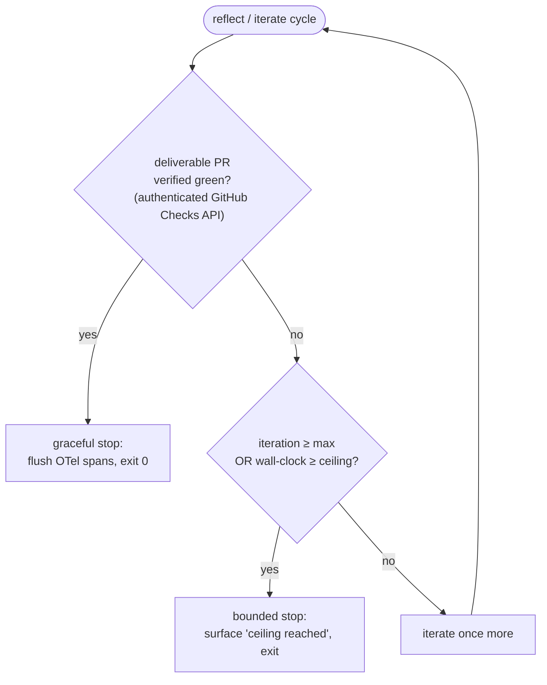

# Reference: Ecosystem runner-hardening batch (PR #131)

> **Status: design — not yet implemented.** This page specifies the intended
> behaviour of the batch; nothing here has shipped yet. P2/P3/P5 are not merged
> upstream, the P1 credential is not yet rotated, and Simard's current
> `amplihack-agent-eval` pin (`14dc30b1`) predates all of them. Present-tense is
> used to describe the **specified** behaviour, not a claim that it is live. This
> batch spans **three repositories** — the fixes will live **upstream** in
> [`rysweet/amplihack-recipe-runner`](https://github.com/rysweet/amplihack-recipe-runner)
> and [`rysweet/amplihack-rs`](https://github.com/rysweet/amplihack-rs); this
> repository (`rysweet/Simard`) **ingests** them by exact git-rev pin. Simard
> only *consumes* the runner as a pinned dependency, so the downstream lever
> here is a rev-bump + `Cargo.lock` refresh, described in
> [How to ingest the ecosystem runner-hardening fixes](../howto/ingest-ecosystem-hardening-fixes.md).

This page is the single specification the batch is verified against. It records
the finished state of six problems observed by the Overseer against the
amplihack ecosystem (see the [Ecosystem map](../ecosystem-map.md)):

| ID | Repo (where the fix lives) | Problem | Class | Outcome |
| --- | --- | --- | --- | --- |
| **P1** | `amplihack-recipe-runner` (PR #131) | `Repo Guardian / agent` required check red on a MERGEABLE PR | quality_regression | Root cause = expired `ANTHROPIC_API_KEY` (infra 401), **not** the E2BIG code change. Fixed by secret rotation (ops) + a fail-fast liveness probe (code). |
| **P2** | `amplihack-rs` (#1018) | Publish **step-14** version bump collides with a hardcoded version-pin test | cross_cutting | Test derives the expected version from the single source of truth; bump behaviour preserved. Unblocks #1022 / #1007. |
| **P3** | `amplihack-rs` (#1025) | Recipe-runner keeps reflecting after its deliverable PR is already green | resource_pressure | Bounded, cooperative graceful-stop on verified-green goal + hard iteration/wall-clock ceiling. |
| **P5** | `amplihack-rs` (#1024) | Signal-subscriber daemons orphaned to init on session end | resource_pressure | setsid/PGID-scoped reaping of **owned** process groups on session teardown. |
| **P4** | `amplihack-rs` (#1015) | Non-draft, MERGEABLE, all-green PR awaiting merge | delivery_ready | **Escalation only** — routed to the merge steward; no code brief. |
| **P6** | `rysweet/Simard` | 16 green PRs accumulating vs `per-cycle launch cap reached` | goal_hygiene | **Escalation only** — routed to the delivery steward; partially relieved by P3 freeing launch slots. |

> **Non-goal for this checkout.** P1–P5 are **not** implementable by editing this
> tree. Attempting to "fix" upstream code by editing a downstream consumer is a
> hollow result. The sole native action in `rysweet/Simard` is the audited
> rev-bump once the upstream fixes land — see
> [downstream ingestion](#downstream-ingestion-the-only-native-action-here).

---

## Cross-cutting constraints (apply to every code workstream)

All four code workstreams (P1 probe, P2, P3, P5) are held to the same contract,
which is also what the regression tests and CI assert:

- **Additive / non-breaking by default.** Behaviour is unchanged for the paths a
  problem does *not* describe. The E2BIG fix from PR #131 is **preserved**, never
  reverted; the publish version-bump keeps working; active-session subscriber
  behaviour is untouched; runs whose goal is *not* yet met keep iterating.
- **Reference the issue in the PR.** Each PR names its originating issue
  (#1018, #1025, #1024) or PR (#131).
- **Preserve the PRD.** No product-requirement regressions.
- **No `bridge` naming.** New identifiers never introduce the forbidden `bridge`
  term — the same guard as
  [Fix a No-`bridge` Naming Guard Failure](../howto/fix-a-no-bridge-naming-guard-failure.md).
- **No stray `print!` / `println!` / `eprint!` / `dbg!`.** New code emits only
  structured `tracing` events and OpenTelemetry (OTel) spans. This is asserted by
  the standing AST meta-test (`syn` scan of the diff).
- **Regression test required.** Every workstream ships a test that fails before
  the change and passes after it.

---

## P1 — Repo Guardian credential liveness + E2BIG child-env allow-list

**Where it lives:** upstream `amplihack-recipe-runner`
(`.github/workflows/repo-guardian.*`) and `amplihack-rs` (child-env construction).

### Root cause (recorded, not assumed)

The brief hypothesised that PR #131's E2BIG child-env-bounding change had stripped
a variable the guardian's `agent` step depends on. **GitHub Actions evidence
disproves that hypothesis:** the `agent` job returns `401 authentication_failed`
with `apiKeySource: none` on *every* branch since 2026-04-28 — an expired
`ANTHROPIC_API_KEY` org/repo secret, an **infra credential-lifecycle failure**.
The `agent` job never invokes the Rust binary that PR #131 touched, so **no code
patch fixes P1**. The merge unblock is a **secret rotation** (ops); the *code*
deliverable is a fail-fast liveness probe so this class of failure is loud and
immediate next time.

### Deliverable A — credential-liveness probe (code, upstream)

The Repo Guardian workflow gains a cheap **authenticated** probe that runs before
the agent step. The shallow presence-check that preceded it passed on a dead key
(a non-empty string is not a valid credential); the liveness probe makes an
expired key fail fast with a clear, actionable message instead of ~10 silent
retries.

```yaml
# .github/workflows/repo-guardian.* — runs before the `agent` step
# (illustrative; the step and script live upstream and are not yet written)
- name: Verify ANTHROPIC_API_KEY liveness
  env:
    ANTHROPIC_API_KEY: ${{ secrets.ANTHROPIC_API_KEY }}
  run: |
    # Cheap authenticated call; fail closed with a clear message on 401.
    scripts/check-anthropic-key-liveness.sh   # illustrative name
```

Contract:

- **Fail-closed.** A `401` / `apiKeySource: none` fails the job **immediately**
  with `Repo Guardian: ANTHROPIC_API_KEY is invalid or expired — rotate the
  org/repo secret (see runbook)`, not after the agent's retry budget is spent.
- **Least data.** The probe issues the smallest authenticated request that
  distinguishes "valid key" from "invalid key"; it logs **only** the auth
  outcome, never the key or any response body. `::add-mask::` coverage is kept.
- **Fork isolation.** The probe (like the agent step) does **not** receive the
  secret in `pull_request` runs from forks.

### Deliverable B — E2BIG child-env allow-list (code, upstream `amplihack-rs`)

PR #131's fix that prevents `E2BIG` (`os error 7`, argument/environment list too
long) on bash steps is **preserved and made explicit**. Child processes receive a
**minimal, documented allow-list** rather than the full ambient environment:

| Preserved var(s) | Why |
| --- | --- |
| `ANTHROPIC_API_KEY` | agent/LLM auth |
| `GH_TOKEN`, `GITHUB_TOKEN` | GitHub API / `gh` auth |
| `HTTP_PROXY`, `HTTPS_PROXY`, `NO_PROXY` (and lower-case) | egress through corporate proxy |
| `SSL_CERT_FILE`, `SSL_CERT_DIR`, `REQUESTS_CA_BUNDLE`, `NODE_EXTRA_CA_CERTS` | custom CA trust |
| `PATH`, `HOME`, `USER`, `LANG`, `TERM` | baseline process hygiene |

- **Bounded (fixes E2BIG).** The child environment is capped to the allow-list
  plus the step's declared vars, so the total env size cannot grow unbounded and
  trip `E2BIG`. This is a **complementary** bound — it caps the *count/size of
  ambient environment variables* on `envp` — alongside the distinct out-of-band
  payload invariant of
  [Comprehensive E2BIG elimination](../concepts/e2big-elimination.md), which
  keeps large *values* (prompt/context) off `argv`/`envp` entirely. The two
  mechanisms bound different inputs to the same `execve` limit; neither replaces
  the other.
- **Not too narrow.** The list explicitly keeps the auth/proxy/CA vars the
  guardian's agent step needs; a regression test asserts each one survives the
  bounding.
- **Not too wide.** Unrelated ambient secrets are **not** forwarded to children,
  so bounding does not become a secret-leak vector.

> **Interaction with P1-A:** the allow-list keeps `ANTHROPIC_API_KEY` present;
> the liveness probe verifies it is *valid*. The two are complementary — presence
> is necessary, liveness is sufficient.

---

## P2 — Publish step-14 version derivation (#1018, upstream `amplihack-rs`)

**Symptom.** The workflow-publish step-14 auto-bumps the crate version; a separate
test asserts a **hardcoded/pinned** literal version. After a bump the literal no
longer matches, so feature-branch CI fails — corroborated by PRs #1022 and #1007
stuck with build/Test checks in a `null` (not-passing) state.

**Fix (finished state).** The version-pin test **derives** the expected version
from the **single source of truth** (`Cargo.toml` / a version constant) instead
of embedding a literal, and validates it is well-formed semver:

```rust
// Before: brittle literal that step-14's bump invalidates.
// assert_eq!(reported_version(), "0.42.0");

// After: derived from the single source of truth.
let expected = env!("CARGO_PKG_VERSION");            // from Cargo.toml
assert!(semver::Version::parse(expected).is_ok());   // well-formed
assert_eq!(reported_version(), expected);
```

Contract:

- **Bump behaviour preserved.** Step-14 still bumps and publishes exactly as
  before; only the *test's* expectation is decoupled from a literal.
- **Single source of truth.** The expected version has exactly one authoritative
  origin; the test never hardcodes a second copy.
- **Credential isolation.** Fork-`pull_request`-triggered runs must **not**
  receive crates.io / publish credentials — the publish path is gated to trusted
  contexts only.
- **Unblocks the pattern.** A branch that lands this also unblocks the #1022 /
  #1007 build/Test failures; #1018 is referenced in the PR.

---

## P3 — Graceful reflect/iterate cancellation (#1025, upstream `amplihack-rs`)

**Symptom.** The recipe-runner keeps running its reflect/iterate loop **after** its
deliverable PR is already green, with no cooperative cancellation — burning LLM
budget and engineer cycles, and (per the Overseer) contributing to
`per-cycle launch cap reached`.

**Fix (finished state).** The reflect step gains a **bounded, cooperative
graceful-stop**. Its termination predicate is keyed on an **authoritative,
authenticated** green status plus a **hard ceiling**:



Termination contract:

- **Terminate on verified-green.** When the deliverable PR exists and **all
  required checks are green** — read from the authenticated GitHub **Checks API**,
  the authoritative source, never scraped from agent stdout — the loop stops
  cleanly.
- **Keep going when unmet.** If the goal is **not** yet met, behaviour is
  unchanged: the loop keeps iterating. This is the additive guarantee.
- **Hard ceiling (fail-closed cost guard).** An independent
  `max-iteration` **and** wall-clock ceiling bound a *never-green* goal so it
  cannot run unbounded (a cost-DoS). Hitting the ceiling stops with a distinct,
  visible outcome rather than looping forever.
- **Clean shutdown.** On stop, in-flight `tracing` / OTel spans are **flushed**
  with secrets scrubbed from span attributes (no tokens, keys, or full prompt
  bodies).

This composes with the existing
[Overseer recipe-launch idempotency](./overseer-recipe-launch-idempotency.md) and
mirrors, upstream, the Simard-native
[completion-evidence gate](./completion-evidence-gate-api.md) posture (a goal is
"done" only on *verified* evidence). Those Simard modules are **reference
patterns only**, not edit targets for this batch.

### P3 configuration

| Setting | Purpose | Default |
| --- | --- | --- |
| `AMPLIHACK_REFLECT_GRACEFUL_STOP` | Kill-switch for the graceful-stop path (`off` reverts to legacy loop) | on |
| `AMPLIHACK_REFLECT_MAX_ITERATIONS` | Hard per-run iteration ceiling for a never-green goal | bounded (non-zero) |
| `AMPLIHACK_REFLECT_WALL_CLOCK_SECS` | Hard wall-clock ceiling for a never-green goal | bounded (non-zero) |

---

## P5 — Signal-subscriber daemon lifecycle (#1024, upstream `amplihack-rs`)

**Symptom.** Signal-subscriber daemons spawned during a Copilot session are
**orphaned to init** (re-parented to PID 1) when the session ends — an unbounded
background-process/resource leak.

**Fix (finished state).** Signal-subscriber daemons are tied to their **session
lifecycle** and reliably reaped on session end via **process-group / setsid-aware**
termination:

- **Owned process group.** Each subscriber is spawned into its **own process
  group** (`setsid` / `setpgid`) recorded in a supervised child registry.
- **Deterministic teardown.** A session shutdown hook signals the **owned PGID**
  (`SIGTERM`, then `SIGKILL` after a grace window) so no child survives teardown.
  Teardown is **idempotent** and runs on the panic and `SIGTERM` paths, not only
  the clean-exit path.
- **Privilege-boundary safety.** The reaper signals **only** process groups it
  **owns** — it verifies PGID/session ownership before signalling, so it can never
  kill an unrelated group. This is the same class of guard as the Simard-native
  [subordinate-kill PID guard](./subordinate-kill-pid-guard-api.md) (kill by
  verified identity, not by a possibly-reused PID).
- **Active session unchanged.** Subscriber behaviour **during** a live session is
  untouched; only teardown is added.

### P5 configuration

| Setting | Purpose | Default |
| --- | --- | --- |
| `AMPLIHACK_SIGNAL_SUBSCRIBER_REAP` | Kill-switch for lifecycle reaping (`off` reverts to legacy spawn) | on |
| `AMPLIHACK_SIGNAL_SUBSCRIBER_GRACE_MS` | Grace window between `SIGTERM` and `SIGKILL` on teardown | bounded (non-zero) |

Verification harness: after a session ends, **no** signal-subscriber process
survives with `PPID == 1`.

---

## P4 & P6 — escalations (no code brief)

These two problems are **merge/ops throughput actions**, not code fixes. They are
routed to the delivery/merge steward and carry no implementation brief.

- **P4 — `amplihack-rs` #1015.** A non-draft, MERGEABLE, fully-green PR. This is a
  **merge action**: land it through the normal merge-ready gate. No code change.
- **P6 — `rysweet/Simard` backlog.** 16 non-draft / MERGEABLE / all-green PRs
  accumulating while the Overseer hits `per-cycle launch cap reached`. This is a
  **merge-draining / launch-capacity throughput** issue: escalate to the delivery
  steward and/or raise the per-cycle launch cap. It is **partially relieved by
  P3**, which frees launch slots by stopping already-green runs from reflecting.

> Escalations are surfaced, not silently dropped. See
> [Triage stale pull requests](../howto/triage-stale-pull-requests.md) and
> [Review Overseer workstream gaps](../howto/review-overseer-workstream-gaps.md).

---

## Downstream ingestion — the only native action here

Editing this checkout cannot fix upstream code. The **one** native lever in
`rysweet/Simard` is to **ingest** the landed P2 / P3 / P5 fixes by bumping the
`amplihack-agent-eval` git-rev pin (source repo `amplihack-rs`) and regenerating
`Cargo.lock`, exactly as in
[amplihack pin bump to upstream main (#2626)](./amplihack-pin-bump-2626.md).

**Ingestion is gated:**

1. The upstream fix must have **merged** to `amplihack-rs` `main` with all
   required checks green (P1 rotation must have unblocked the required checks
   first).
2. The pin is bumped to a **specific audited SHA**, never a moving branch ref, so
   the bump ingests exactly the audited commits and nothing unrelated.
3. `cargo build && cargo test` pass; the
   [supply-chain guardrails](./supply-chain-audit.md) stay green.

Do **not** bump unaudited upstream changes. The full procedure and done-gate are
in [How to ingest the ecosystem runner-hardening fixes](../howto/ingest-ecosystem-hardening-fixes.md)
and [How to keep Simard's dependency pins up to date](../howto/self-maintain-dependency-pins.md).

---

## Configuration summary

| Var / setting | Repo | Governs |
| --- | --- | --- |
| `ANTHROPIC_API_KEY` (rotation) | `amplihack-recipe-runner` (ops) | Unblocks the `Repo Guardian / agent` required check for PR #131 (P1) |
| `check-anthropic-key-liveness.sh` step | `amplihack-recipe-runner` | Fail-fast credential liveness (P1) |
| child-env allow-list (code constant) | `amplihack-rs` | Bounded child env / E2BIG allow-list (P1-B) — fixed in source, not a runtime tunable |
| `AMPLIHACK_REFLECT_GRACEFUL_STOP` | `amplihack-rs` | Graceful reflect cancellation kill-switch (P3) |
| `AMPLIHACK_REFLECT_MAX_ITERATIONS` / `_WALL_CLOCK_SECS` | `amplihack-rs` | Never-green hard ceiling (P3) |
| `AMPLIHACK_SIGNAL_SUBSCRIBER_REAP` | `amplihack-rs` | Subscriber lifecycle reaping kill-switch (P5) |
| `AMPLIHACK_SIGNAL_SUBSCRIBER_GRACE_MS` | `amplihack-rs` | `SIGTERM`→`SIGKILL` grace window (P5) |
| `amplihack-agent-eval` git rev (`Cargo.toml`) | `rysweet/Simard` | Downstream ingestion of P2/P3/P5 |

> **Names illustrative.** The `AMPLIHACK_*` env-var names above are the specified
> intent; the authoritative names are owned by `amplihack-rs`. Treat this table as
> the contract's *shape*, not a frozen key list, until the upstream fixes land.

---

## Security considerations

- **P1 is the security-critical item — a credential-lifecycle failure.** Rotate to
  a **least-privilege**, org/repo-scoped key; keep it out of fork `pull_request`
  runs; keep `::add-mask::` coverage; audit the agent-output artifact for
  accidental secret capture.
- **Fail-closed.** Invalid credentials (P1) and unmet/never-green goals (P3) fail
  **visibly and bounded** — they never retry silently or run unbounded.
- **No secrets in telemetry.** `tracing` / OTel span attributes are scrubbed of
  tokens, keys, and full prompt bodies (P3).
- **Untrusted-input isolation.** Fork/PR-triggered contexts receive **no** publish
  (crates.io) or API credentials (P1 / P2).
- **Least privilege for children.** Env allow-lists (P1-B) and spawned daemons
  (P5) receive only the vars / signals they need; the reaper signals **only**
  owned process groups.
- **Supply-chain integrity.** The downstream rev-bump pins an **audited SHA** and
  passes `cargo build` / `cargo test`; unaudited upstream is never ingested (P4 /
  P6 governance).

---

## Verify end-to-end

**P1 (upstream / ops):**

```bash
# PR #131's remaining red required check goes green after rotation.
gh pr checks 131 --repo rysweet/amplihack-recipe-runner --required
# The liveness probe fails fast (non-zero) on an invalid key, with a clear message.
```

**P2 / P3 / P5 (upstream `amplihack-rs`):** each ships a regression test —

- P2: a test asserting the version **derives** from the source of truth, not a
  literal, and build/Test are green on a branch unblocking #1022 / #1007.
- P3: a test proving the loop **terminates on verified-green** *and* **keeps
  iterating when unmet** *and* **respects the max-iteration / wall-clock ceiling**
  (never-green ⇒ bounded, not infinite).
- P5: a harness proving **no** signal-subscriber process survives session teardown
  (`PPID == 1`).

**Downstream (this repo), after the upstream fixes land and are audited:**

```bash
# Bump amplihack-agent-eval to the audited amplihack-rs SHA, then:
cargo update -p amplihack-agent-eval
cargo build --release && cargo test
cargo deny --locked check && cargo audit && cargo vet --locked
```

---

## See also

- [How to ingest the ecosystem runner-hardening fixes](../howto/ingest-ecosystem-hardening-fixes.md) —
  the downstream rev-bump procedure and done-gate for this batch.
- [How to keep Simard's dependency pins up to date](../howto/self-maintain-dependency-pins.md)
  and [amplihack pin bump to upstream main (#2626)](./amplihack-pin-bump-2626.md) —
  the reconcile pattern this ingestion instantiates.
- [Comprehensive E2BIG elimination](../concepts/e2big-elimination.md) — the
  failure class the P1-B child-env allow-list bounds.
- [Subordinate-kill PID-guard API](./subordinate-kill-pid-guard-api.md) — the
  "kill by verified identity" pattern P5 mirrors.
- [Completion-evidence gate API](./completion-evidence-gate-api.md) — the
  "done only on verified evidence" pattern P3 mirrors.
- [Overseer recipe-launch idempotency](./overseer-recipe-launch-idempotency.md)
  and [How to review Overseer workstream gaps](../howto/review-overseer-workstream-gaps.md) —
  the launch-capacity context for P3 / P6.
- [Ecosystem map](../ecosystem-map.md) — the repos this batch spans and how Simard
  depends on them.
