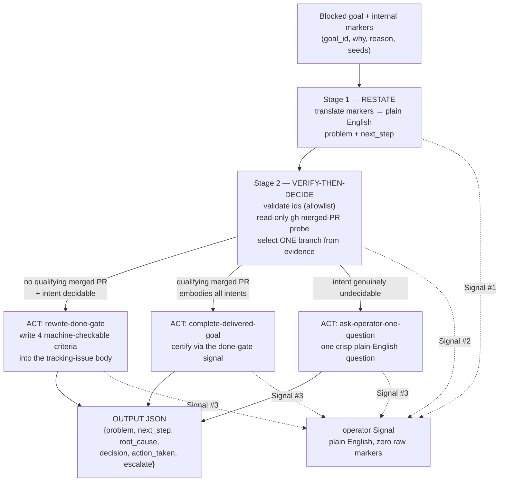

# Escalation-triage decision pipeline (verify-then-decide)

> **Status: current.** This page specifies the **verify-then-decide procedure**
> the escalation-triage brain
> ([`escalation_triage.md`](https://github.com/rysweet/Simard/blob/main/prompt_assets/simard/overseer/escalation_triage.md))
> follows when it triages a genuinely-blocked goal. It is a
> **requirements-level contract** — the procedure and its invariants that this
> triage must honour — **not** a new deterministic code path.
>
> **What enforces the determinism (read this first).** The general agentic brain
> in
> [`escalation_triage.md`](https://github.com/rysweet/Simard/blob/main/prompt_assets/simard/overseer/escalation_triage.md)
> owns the *escalate-vs-course-correct decision* (rewrite / complete / ask) — see
> the [Escalation Triage atlas](../atlas/escalation-flow/README.md). The extra
> discipline this page pins — probe-**before**-write ordering, the
> `goal_id`/issue-number allowlists, the argv/`--body-file` mechanics, and the
> `SIMARD:done-criteria` delimiters — is the **execution discipline required for
> this triage** (the locked requirements for issue 4455). It is enforced by the
> playbook's ROLE order, these documented requirements, and review — **not** by a
> Rust state machine or any new code, and this feature adds **none**. There is no
> in-repo mechanism that makes the branch selection deterministic on its own; the
> determinism is a discipline the brain applies as it runs the playbook. If the
> playbook or trigger is revised, keep these invariants in lockstep.

The Overseer's thin Rust trigger (`overseer::act_escalate_blocked_goal`) hands a
genuinely-blocked goal to the triage brain. The brain then runs three stages, in
order, and sends the operator exactly **one jargon-free Signal message per
stage**. This page documents the stages, the read-only probe that orders the
decision, the criteria block the rewrite writes, and the OUTPUT contract. It adds
**no source code**: the procedure is a recipe of agentic steps composed over the
existing `gh` session and Signal notifier (guideline **G3: agentic over brittle
heuristics**). No new environment variable, endpoint, or dependency is added.

The pipeline exists to end a specific failure mode: a goal whose finish line
cannot be measured automatically. The done-gate can never certify it, so the
engineer re-investigates every cycle without shipping, and the goal is re-blocked
for the *same* reason again and again. The fix is not another retry — it is to
**write a checkable finish line** (or, if the work already shipped, to certify
completion).

---

## Pipeline at a glance



| Stage | Name | Reads | Writes | Signal |
|---|---|---|---|---|
| 1 | **RESTATE** | internal markers (`why`, `reason`, seeds) | — | #1 — plain-English "what's wrong" |
| 2 | **VERIFY-THEN-DECIDE** | `gh pr list` / `gh issue view` (read-only) | — | #2 — plain-English "what I checked / decided" |
| 3 | **ACT** | — | issue body **or** done-gate certification **or** one operator question | #3 — plain-English "what I did / need from you" |

Every operator-facing string — all three Signal messages and every field of the
OUTPUT JSON — is **plain English with zero raw markers**. See
[Operator-facing translation boundary](#operator-facing-translation-boundary).

---

## Stage 1 — RESTATE

The brain receives the playbook [INPUTS](https://github.com/rysweet/Simard/blob/main/prompt_assets/simard/overseer/escalation_triage.md)
(`goal_id`, `problem_seed`, `next_step_seed`, `internal_why`, `reason_marker`).
It **translates** every internal marker into language a non-engineer understands
and emits a refined plain-English `problem` and `next_step`.

Markers are **evidence to translate, never text to forward.** The operator must
never see `OODA-SAFEGUARD`, `UNCLEAR-CRITERIA`, `GENUINELY-STUCK`, `why=`,
`evidence=[…]`, a 🔒 lock token, or cycle numbers. For example, the internal
diagnostic

```
no-progress breaker BLOCKED 4x with UNCLEAR-CRITERIA (cycles 2407/2410/2417/2420);
guided-retry engineer repeatedly reclaimed; unmeasurable done-gate the agent cannot self-clarify
```

is restated for the operator as:

> "This goal keeps getting stuck because there's no clear, checkable definition
> of *done* — so each engineer who picks it up re-investigates the same wall and
> never ships. It's been re-blocked several times for exactly this reason."

**Signal message #1** carries that restatement. It names *what* is wrong, not the
machinery that detected it.

---

## Stage 2 — VERIFY-THEN-DECIDE

This is the verify-then-decide discipline at the core of the procedure — the
ordering the locked requirements mandate for this triage. Before the brain picks
a course-correction branch, it **verifies the ground truth** with a read-only
GitHub probe, and selects the branch **from probe evidence only** — never from a
recurrence count, a hunch, or the raw markers.

### Input validation (allowlist, before any `gh` call)

| Value | Allowlist | On reject |
|---|---|---|
| `goal_id` | `^[A-Za-z0-9._-]+$` | **fail-visible**: record the rejected value (redacted), send no probe, take no write |
| issue number | `^\d+$` | **fail-visible**: same |

Validation runs **before** any subprocess. A value that fails the allowlist is
never interpolated into a command.

### The read-only merged-PR probe

The probe answers one question: **has a merged PR already delivered this goal's
intent?** It is constructed as **argv arrays** (never a shell string), reuses the
existing authenticated `gh` session, and requests **read** scope only:

```bash
# Illustrative argv — the brain runs these read-only, never through a shell.
gh pr list --state merged --search "<goal keywords>" \
  --json number,title,mergedAt,closingIssuesReferences --limit 20
gh issue view <issue-number> --json number,state,title,body,url
```

The probe **never** writes, merges, closes, or edits. It reads PR/issue state and
returns structured JSON the brain inspects.

### Branch selection (deterministic)

The brain selects **exactly one** branch from the probe result:

| Probe evidence | Intent | Branch (`decision`) |
|---|---|---|
| **No** qualifying merged PR | Decidable (a clear finish line can be written) | `rewrite-done-gate` **(default)** |
| A merged PR whose diff embodies **all** the goal's intents, with its linked issue `CLOSED` | — | `complete-delivered-goal` |
| Either — but the intent itself is genuinely ambiguous (a scope call only the operator can make) | Undecidable | `ask-operator-one-question` |

Ordering removes the ambiguity: **probe first → default to `rewrite-done-gate`;
fall to `complete-delivered-goal` only on confirmed delivery; escalate with
`ask-operator-one-question` only when intent is genuinely undecidable.**

> **A "qualifying" merged PR** is one whose diff embodies *every* intent the goal
> describes — not merely a PR that mentions the goal. Partial delivery does **not**
> qualify; it routes to `rewrite-done-gate` so the remaining, checkable work is
> pinned.

### Fail-visible, never infer delivery

If a probe command errors (network, auth, `gh` non-zero exit), the brain
**records the command and the redacted error and does not infer completion.** A
failed probe never routes to `complete-delivered-goal`. When intent is decidable,
a failed probe falls back to `rewrite-done-gate` (the safe, additive branch);
otherwise it routes to `ask-operator-one-question`. There is **no silent
fallback** and **no swallowed error**.

**Signal message #2** states, in plain English, what the brain checked and what
it decided — e.g. "I checked whether this was already finished by an existing
change; it wasn't, so I'm going to write down a clear, checkable finish line."

---

## Stage 3 — ACT

The brain performs exactly the action its Stage-2 branch selected.

### Branch `rewrite-done-gate` (the default path)

The brain writes a **machine-checkable finish line** into the blocked goal's
**GitHub tracking issue body**. It does **not** edit source code and does **not**
touch the goal-board entry —
the entry references the issue, so pinning the issue is sufficient and keeps the
action additive, non-breaking, and CI-neutral.

The finish line is written as a **delimited criteria block** so re-runs overwrite
exactly that section and never disturb the rest of the body:

```markdown
<!-- SIMARD:done-criteria:begin -->
### Finish line (machine-checkable)

This goal is **done** when a single merged PR delivers all of the following, each
of which Simard can verify automatically:

- [ ] **roster-seeded-from-identity** — the stewarded-repo roster is seeded from
      the named identity file (`prompt_assets/simard/identity/…`), verifiable by a
      file/command assertion named here.
- [ ] **roster-persisted-as-self-deploy-safe-identity-state** — the roster is
      stored as durable identity **state** under the state root, which a
      self-deploy does **not** overwrite (verifiable via the documented
      self-deploy-preserve path), **not** as a tracked committed file.
- [ ] **ecosystem_repos.toml-wiring-removed** — the committed
      `prompt_assets/simard/ecosystem_repos.toml` wiring is deleted, verifiable by
      file-absence / grep-absence.
- [ ] **certified-by-exactly-one-merged-PR** — completion is certified by exactly
      one PR observed `MERGED` with its linked tracking issue observed `CLOSED`.

Simard certifies this goal complete when the fourth signal is observed (the merged
PR + closed linked issue) **and** that PR's diff embodies the first three signals.
<!-- SIMARD:done-criteria:end -->
```

> **What the completion-evidence gate actually observes.** The
> [completion-evidence gate](./completion-evidence-gate-api.md) certifies a goal
> on `pr_merged` + `issue_closed` (+ a verified deploy for self-affecting goals) —
> it reads PR/issue **state**, not the checklist text in the issue body. So the
> **fourth** criterion (one merged PR + its linked issue `CLOSED`) is what the
> gate observes directly; criteria **1–3** are file/command-checkable acceptance
> items the merging engineer (and reviewer) verify, and which the merged PR's diff
> must embody. "Machine-checkable" here means *each criterion is expressed as a
> concrete file/command/state assertion* — not that the gate independently
> re-runs assertions 1–3. Writing this block does not, by itself, cause automatic
> certification; it makes the finish line unambiguous so a conforming PR can trip
> the gate.

Write mechanics:

- The body is passed via `gh issue edit <n> --body-file <path>` (or stdin) —
  **never** shell-interpolated — so criteria text and markers cannot inject a
  command.
- The block is bounded by the stable HTML-comment markers
  `<!-- SIMARD:done-criteria:begin -->` / `…:end -->`. On a re-run the brain
  replaces **only** the delimited span; unrelated body content is preserved
  (idempotent).
- The write is **scope-bound** to the exact repo/issue the Stage-2 probe read.
  No other artifact is touched.

The four criteria above are the concrete finish line for the roster goal
(`move-the-governed-repo-roster-out-of-framework-a8f57a50`); the *shape* — a
checklist of file/command/PR-observable signals plus a one-line certification
rule — is the general contract for any `rewrite-done-gate` action.

### Branch `complete-delivered-goal`

If Stage 2 found a **qualifying** merged PR, the brain does **not** rewrite
criteria. It certifies completion through the existing done-gate signal (the
merged PR + its `CLOSED` linked issue) so the goal leaves the active board as
done rather than staying blocked. No new criteria are invented for work that
already shipped.

### Branch `ask-operator-one-question`

Only when intent is genuinely undecidable, the brain asks the operator **exactly
one** crisp, plain-English question and sets `escalate` to that question's
rationale. Never a wall of jargon; never more than one question.

**Signal message #3** states, in plain English, what the brain did — e.g. "Done —
I wrote a clear, checkable finish line for this goal, so it can now be certified
automatically; nothing needed from you."

---

## OUTPUT contract

After Stage 3, the brain emits the playbook OUTPUT JSON verbatim:

```json
{
  "problem": "plain-English statement of WHAT is wrong (no jargon, no marker tokens)",
  "next_step": "plain-English recommended NEXT STEP",
  "root_cause": "one or two sentences on the true root cause, grounded in the evidence",
  "decision": "rewrite-done-gate | complete-delivered-goal | ask-operator-one-question",
  "action_taken": "what you actually did (the rewrite / completion) or the single question asked",
  "escalate": "reason a human is genuinely required, or null"
}
```

| Field | Contract |
|---|---|
| `problem` / `next_step` | Plain English; refined from the seeds; **zero raw markers**. |
| `root_cause` | One or two sentences, grounded in the Stage-2 evidence. |
| `decision` | Exactly one of the three branch tokens. |
| `action_taken` | The concrete rewrite/completion performed, or the single question asked. |
| `escalate` | **`null`** on `rewrite-done-gate` and `complete-delivered-goal`; a one-sentence rationale only on `ask-operator-one-question`. |

---

## Operator-facing translation boundary

Everything a human sees is **plain English**. The following tokens are **never**
surfaced in a Signal message, in the OUTPUT `problem`/`next_step`, or in an error
log:

`OODA-SAFEGUARD`, `UNCLEAR-CRITERIA`, `GENUINELY-STUCK`, `why=`, `evidence=[…]`,
the 🔒 lock token, lock/claim tokens, cycle numbers, and internal absolute paths.

The translation layer that strips these doubles as an **injection filter** (see
[Security](#security)). Engineering docs like this page may name the markers to
explain the boundary; operator channels never carry them.

---

## Configuration

There is **no new environment variable and no new config file.** The pipeline
reuses the trigger, the `gh` session, and the notifier that already exist.

| Concern | Source | Notes |
|---|---|---|
| When triage launches | `overseer::act_escalate_blocked_goal` | Unchanged thin trigger; fail-closed recursion guard + in-flight dedup. |
| GitHub access | Existing authenticated `gh` session | Read for the probe; a single additive issue-body write on `rewrite-done-gate`. No admin/delete/secrets/branch-protection scope. |
| Operator delivery | [`DualChannelNotifier`](./overseer-operator-notifications.md) | One Signal message per stage; anti-self-ingest marker applied by the notifier. |
| Build memory (deployed) | `NODE_OPTIONS=--max-old-space-size=32768` | Operator preference for large Rust/node builds; set in `~/.amplihack/config`. Not required by the pipeline itself. |

The **only** artifact this pipeline mutates on the expected path is the blocked
goal's own tracking-issue body, and only inside the delimited criteria block.

---

## Examples

### Expected path — roster goal, no prior delivery → `rewrite-done-gate`

The blocked goal is
`move-the-governed-repo-roster-out-of-framework-a8f57a50`. Its internal WHY is a
repeated unmeasurable-done-gate block.

1. **RESTATE** → Signal #1: "This goal keeps stalling because *done* isn't
   defined in a way Simard can check, so it never ships."
2. **VERIFY-THEN-DECIDE** → the probe finds **no** merged PR that delivers all
   four intents; intent is decidable → `decision = rewrite-done-gate`. Signal #2:
   "I checked whether this was already finished — it wasn't — so I'll write a
   clear, checkable finish line."
3. **ACT** → the brain writes the four-criterion block (above) into the tracking
   issue via `--body-file`. Signal #3: "Done — the goal now has a checkable
   finish line; nothing needed from you."

OUTPUT:

```json
{
  "problem": "This goal to move Simard's list of stewarded repositories out of framework code and into her own durable identity keeps stalling because there's no clear, automatically-checkable definition of when it's finished.",
  "next_step": "Write down a concrete, checkable finish line: seed the roster from the identity file, store it as durable identity state a self-deploy won't overwrite, and remove the old committed ecosystem_repos.toml wiring — confirmed by one merged PR.",
  "root_cause": "The goal's finish condition was unmeasurable, so the done-gate could never certify it; every engineer re-investigated the same undefined target and re-blocked for the identical reason.",
  "decision": "rewrite-done-gate",
  "action_taken": "Wrote four machine-checkable finish criteria into the goal's tracking-issue body (roster seeded from identity, persisted as self-deploy-safe identity state, ecosystem_repos.toml wiring removed, certified by exactly one merged PR).",
  "escalate": null
}
```

### Alternate path — work already shipped → `complete-delivered-goal`

If the Stage-2 probe had found a merged PR whose diff seeds the roster from
identity, persists it as self-deploy-safe state, and removes the
`ecosystem_repos.toml` wiring — with the linked issue `CLOSED` — the brain would
certify completion via the done-gate signal instead of rewriting criteria, and
the goal would leave the active board as done. `escalate` stays `null`.

### Alternate path — genuinely undecidable intent → `ask-operator-one-question`

If the *intent* itself were ambiguous (a scope call only the operator can make),
the brain would ask exactly one plain-English question — e.g. "Should the roster
live entirely in identity state, or stay dual-sourced during migration?" — and
set `escalate` to that rationale. This is **not** the roster goal's situation: its
four intents are clear, so the expected branch is `rewrite-done-gate`.

---

## Scope boundary (what this pipeline must NOT do)

- It does **not** implement the roster→identity-state migration. It only writes
  the finish line the migration must satisfy.
- It does **not** touch `resolve_ecosystem_roster_path`,
  `build_ecosystem_observer`, or `act_escalate_blocked_goal`. See
  [Ecosystem-roster path resolution](./ecosystem-roster-resolution.md).
- It does **not** edit source code on the expected path (zero source edits); the
  only mutation is the delimited criteria block in the tracking issue.
- It does **not** escalate to a human unless intent is genuinely undecidable
  (`escalate` stays `null` otherwise).

---

## Security

- **No shell interpolation.** Every `gh` invocation is an argv array; the issue
  body is delivered via `--body-file`/stdin. Goal ids, keywords, and marker text
  never reach a shell (command-injection guard).
- **Allowlist before subprocess.** `goal_id` (`^[A-Za-z0-9._-]+$`) and the issue
  number (`^\d+$`) are validated before any `gh` call; a reject is fail-visible
  with no write.
- **Read-only-probe-before-write invariant.** The pipeline branches to
  `gh issue edit` **only after** the Stage-2 decision is fixed by the read-only
  probe. There is no write before the probe.
- **Marker/injection sanitizer.** The operator-facing translation layer strips
  control characters and neutralizes stray GitHub markup — bare `#123`,
  `@mentions`, `owner/repo#123` cross-references, and task-list toggles — before
  any text enters a Signal message or the issue body, blocking cross-reference
  injection and satisfying the plain-English boundary.
- **No secret or marker leakage.** Zero tokens, lock tokens, `evidence=[…]`
  blobs, cycle numbers, or internal absolute paths appear in Signal messages,
  OUTPUT JSON, or error logs; token-bearing env/args are redacted on failure.
- **Least privilege, scope-bound write.** The pipeline reuses the existing
  authenticated `gh` session (read for the probe, one additive body write) with
  no admin/delete/secrets/branch-protection scope, and binds the write to the
  exact repo/issue the probe read.
- **Idempotent, bounded mutation.** The HTML-comment-delimited criteria block
  means a re-run overwrites exactly that span and nothing else.
- **Fail-visible, never infer.** A probe error is recorded (redacted) and never
  read as "delivered"; there is no silent fallback.

---

## See also

- [`escalation_triage.md`](https://github.com/rysweet/Simard/blob/main/prompt_assets/simard/overseer/escalation_triage.md) —
  the agentic brain this pipeline runs (ROLE, INPUTS, OUTPUT).
- [Escalation Triage & Course-Correction atlas](../atlas/escalation-flow/README.md) —
  the end-to-end data-flow and the recipe-vs-code line.
- [How to triage a blocked goal with unclear finish criteria](../howto/triage-a-blocked-goal-with-unclear-finish-criteria.md) —
  the operator runbook and the roster-goal worked example.
- [Overseer root-cause ("WHY") API](./overseer-root-cause-why-api.md) — the
  root-cause model behind the internal markers this pipeline translates.
- [Completion-evidence gate API](./completion-evidence-gate-api.md) — the gate
  that reads the machine-checkable criteria this pipeline writes.
- [Ecosystem-roster path resolution](./ecosystem-roster-resolution.md) — the
  roster subsystem this pipeline must **not** modify.
- [Overseer operator-notification reliability](./overseer-operator-notifications.md) —
  the Signal/email delivery contract for the per-stage messages.
