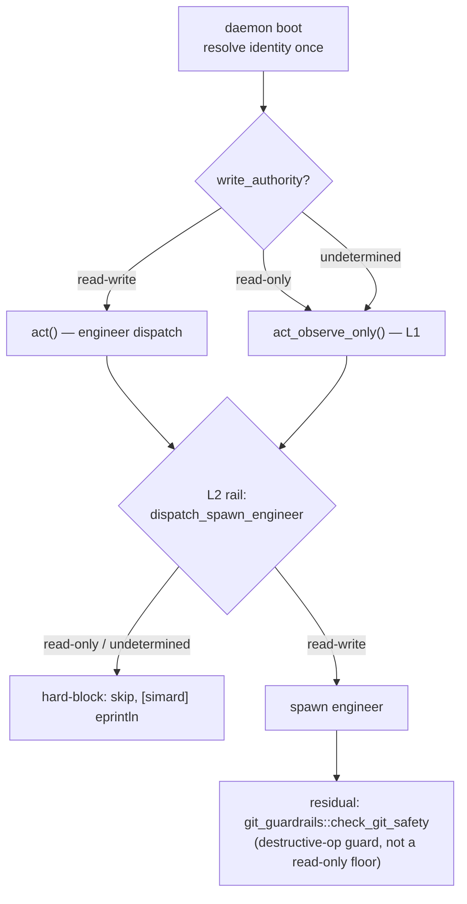

# Identity write-authority & observer posture API reference

> **Issue [#3125](https://github.com/rysweet/Simard/issues/3125).** An identity
> can now declare a **write-authority posture** and its **own seed goals**
> scoped to a **target repo set**. A `read-only` identity runs an
> **observe-only Act phase** that records observations and proposes goals to its
> own board and **never** dispatches a write-bearing engineer. This makes a
> read-only OBSERVER (for example, the Crocutus identity watching the hyenas
> Azure DevOps repos) first-class at the **cognition** level — where goals are
> seeded and engineer dispatch is decided — rather than relying on downstream
> command guardrails that only block *destructive* git/ADO operations.

!!! note "Relationship to #3071"
    This documents the **shipped** #3125 feature. The typed posture symbols
    (`WriteAuthority`, `SeedGoal`, `IdentityPosture`, `ResolvedPosture`,
    `with_posture`, `seed_identity_board`, `act_observe_only`) are in the tree
    and exercised by tests. Two facts a reader must know:

    1. **This branch has no generic read-only write floor.** The only
       pre-existing write guards in this tree are the *destructive-operation*
       guardrails `git_guardrails::check_git_safety` (gated by
       `SIMARD_GIT_GUARDRAILS`) and `ado_acl_guard::check_ado_acl_safety`. They
       block force-push, `reset --hard`, branch deletion, ADO ACL escalation and
       similar — but they still permit ordinary commits, branches, and PRs. They
       do **not** make a repo read-only. That is precisely why #3125's
       cognition-level enforcement (L1 + L2 below) is *load-bearing* here, not a
       mere credit optimization: on this base it is the only thing that makes a
       read-only identity actually read-only.
    2. **The typed posture is the successor to #3071's env floor.** PR
       [#3071](https://github.com/rysweet/Simard/pull/3071) added an env-driven
       observe-only floor (`read_only_guard` / `SIMARD_OBSERVE_ONLY`) and is
       tracked toward this typed design in
       [#3067](https://github.com/rysweet/Simard/issues/3067). **#3071 is not an
       ancestor of this branch**, so those symbols do not resolve here. Design
       decision: the typed `write_authority` rail (L2) is **authoritative**. If
       this branch is later rebased onto #3071, the typed rail **supersedes**
       #3071's env-keyed `dispatch_spawn_engineer` short-circuit — the
       `SIMARD_OBSERVE_ONLY` env var may remain as an operator override, but the
       resolved posture is the single source of truth. There is no "layer vs
       replace" ambiguity: posture wins.

Modules: `simard::identity::types`, `simard::identity::manifest`,
`simard::identity::toml_types`, `simard::identity::file_loader`,
`simard::identity::compose`, `simard::goal_curation::operations`,
`simard::ooda_loop::types`, `simard::ooda_actions::observe_only`,
`simard::ooda_actions::advance_goal::spawn`

The feature is **additive**. With no identity (or a `read-write` identity),
Simard's behavior is unchanged: the same five `DEFAULT_SEED_GOALS` and the same
engineer-dispatching Act phase. The posture is resolved **once at daemon boot**
and threaded through the [`OodaState`](#oodastate-threading); it is never
re-derived per cycle.

---

## Enforcement model

#3125 adds **two cognition-level enforcement layers** (L1, L2). They sit above
the pre-existing *destructive-operation* guardrails, which act only as a
residual backstop — those guardrails are **not** a read-only floor:

| Layer | Where | What it does |
|-------|-------|--------------|
| **L1 — cognition branch** (new) | `ooda_loop::cycle` Act-phase entry | When posture is `read-only`, run the agentic `act_observe_only` branch instead of the engineer-dispatching `act`. No write-bearing engineer is ever *considered*. |
| **L2 — deterministic rail** (new) | `ooda_actions::advance_goal::spawn::dispatch_spawn_engineer` | A thin deterministic guard hard-blocks `dispatch_spawn_engineer` when posture is `read-only` **or undetermined**, at **both** call sites (`advance_goal/mod.rs`, `concurrent.rs`). This *typed*, `write_authority`-keyed rail is the sole spawn-time posture guard; it supersedes #3071's env-keyed `SIMARD_OBSERVE_ONLY` short-circuit if the two ever coexist. |
| **Residual backstop** (pre-existing) | `git_guardrails::check_git_safety` (`SIMARD_GIT_GUARDRAILS`) and `ado_acl_guard::check_ado_acl_safety` | Block *destructive* git ops and ADO ACL escalation. They permit ordinary writes, so they are **not** a read-only boundary — just a last-ditch guard against destructive commands. Untouched by this feature. |

L1 stops Simard from *thinking* about writes (so no AI credits are burned on
doomed engineer dispatch, and — because no read-only write floor exists on this
base — so no ordinary write ever happens either). L2 is the deterministic
backstop. The destructive-op guardrails remain only as a residual safety net.



---

## WriteAuthority

Module: `simard::identity::types`

```rust
#[derive(Clone, Copy, Debug, Eq, PartialEq, Ord, PartialOrd, Hash, Default, Serialize, Deserialize)]
#[serde(rename_all = "kebab-case")]
pub enum WriteAuthority {
    /// Observe-only. The Act phase records observations and proposes goals but
    /// never dispatches a write-bearing engineer. Fail-closed default for an
    /// identity whose posture cannot be determined.
    ReadOnly,
    /// Full authority (Simard's historical behavior). The Act phase may
    /// dispatch engineers. This is the default when no field is present.
    #[default]
    ReadWrite,
}
```

`Copy` + `Default` (`ReadWrite`). The serde rename maps the enum to the kebab
tokens `read-only` / `read-write`, matching the TOML surface and the
`OperatingMode` precedent. Because the field carries `#[serde(default)]`, an
**absent** `write_authority` deserializes to `ReadWrite` (see
[AC6](#acceptance-criteria)).

### Methods

```rust
impl WriteAuthority {
    /// `true` only for `ReadWrite`. The deterministic rail matches on this so
    /// that any non-`ReadWrite` value (including future variants) fails closed.
    pub fn may_dispatch_engineers(&self) -> bool;

    /// `true` for `ReadOnly`.
    pub fn is_read_only(&self) -> bool;
}
```

> **Deny-by-default.** The rail and Act-phase switch are written to **allow**
> only the proven `ReadWrite` case (`may_dispatch_engineers()`), so any unknown
> or unresolved posture fails closed. Never match "block `ReadOnly`, allow the
> rest".

---

## SeedGoal

Module: `simard::identity::types`

```rust
#[derive(Clone, Debug, Eq, PartialEq)]
pub struct SeedGoal {
    pub priority: u32,
    pub title: String,
    pub description: String,
    /// Target-repo slug. `Some(slug)` scopes the goal to an ecosystem repo;
    /// `None` targets the daemon's own repo (Simard). For a `read-only`
    /// identity, `None` (or a slug outside `targets`) is a fail-closed config
    /// error — see validation rules below.
    pub repo: Option<String>,
}
```

A `SeedGoal` is the identity-declared analogue of one `DEFAULT_SEED_GOALS`
tuple `(priority, title, description, repo)`. When an identity supplies seed
goals, they **fully replace** `DEFAULT_SEED_GOALS` (they do not merge).

---

## IdentityPosture

Module: `simard::identity::posture`

```rust
#[derive(Clone, Debug, Eq, PartialEq)]
pub struct IdentityPosture {
    pub write_authority: WriteAuthority,
    pub targets: Vec<String>,
    pub seed_goals: Vec<SeedGoal>,
}
```

The target-scoped posture read off a resolved manifest.

### Constructor

```rust
impl IdentityPosture {
    /// Read the posture (authority + targets + seed goals) off a manifest.
    pub fn from_manifest(manifest: &IdentityManifest) -> Self;
}
```

## ResolvedPosture

Module: `simard::identity::posture`

The boot-time resolution — and the single place the fail-closed rule lives:

```rust
#[derive(Clone, Debug, Eq, PartialEq)]
pub enum ResolvedPosture {
    /// No identity present — Simard's own read-write default (a *determined*
    /// state, AC1).
    None,
    /// An identity IS present but its posture is unresolved — fail CLOSED (AC5).
    Undetermined,
    /// A resolved identity posture.
    Identity(IdentityPosture),
}

impl ResolvedPosture {
    /// `None` ⇒ ReadWrite; `Undetermined` ⇒ ReadOnly; `Identity` ⇒ declared.
    pub fn write_authority(&self) -> WriteAuthority;
    /// Target repo slugs (empty for `None` / `Undetermined`).
    pub fn targets(&self) -> &[String];
    /// Identity seed goals (empty for `None` / `Undetermined`).
    pub fn seed_goals(&self) -> &[SeedGoal];
}
```

| State | How it arises | `write_authority()` |
|-------|---------------|---------------------|
| **No identity** | `SIMARD_IDENTITY_PATH` unset | `ReadWrite` (AC1) |
| **Read-write identity** | manifest resolves to `ReadWrite` | `ReadWrite` (AC1) |
| **Read-only identity** | manifest resolves to `ReadOnly` | `ReadOnly` (AC2–AC4) |
| **Undetermined** | identity present but posture unresolvable (load/parse/thread gap) | `ReadOnly`, no-spawn (AC5) |

> **"No identity" is a *determined* state.** It maps to `read-write` so Simard
> herself is unchanged. "Undetermined" only applies when an identity context
> exists but its posture cannot be read — that fails closed to `read-only`.

---

## IdentityManifest posture fields

Module: `simard::identity::manifest`

`IdentityManifest` gains three additive fields:

```rust
pub struct IdentityManifest {
    // ... existing fields ...
    pub write_authority: WriteAuthority,   // default ReadWrite
    pub targets: Vec<String>,              // default empty
    pub seed_goals: Vec<SeedGoal>,         // default empty
}
```

Existing `IdentityManifest::new(..)` callers are **unchanged** — `new()`
constructs a manifest with `write_authority = ReadWrite`, `targets = []`,
`seed_goals = []`. The posture is attached with a dedicated builder rather than
growing `new()`'s argument list (which is already `#[expect(too_many_arguments)]`):

```rust
impl IdentityManifest {
    /// Attach a write-authority posture, target set, and seed goals.
    /// Validates the read-only seed-goal scoping rules (below); on violation it
    /// returns `SimardError::InvalidIdentityComposition` (fail-closed). The
    /// file loader maps that to `IdentityTomlParseError` so a bad `identity.toml`
    /// surfaces as a parse error.
    pub fn with_posture(
        self,
        write_authority: WriteAuthority,
        targets: Vec<String>,
        seed_goals: Vec<SeedGoal>,
    ) -> SimardResult<Self>;
}
```

### Validation rules (fail-closed)

`with_posture()` enforces read-only seed-goal scoping. The failure is
`SimardError::InvalidIdentityComposition`; when reached through the file loader
it is re-surfaced as `SimardError::IdentityTomlParseError`:

| Rule | Applies to | Violation |
|------|-----------|-----------|
| Every seed goal's `repo` must be `Some(slug)` and `slug ∈ targets` | `read-only` identity | Missing/out-of-`targets` repo — **never** silently scoped to `rysweet/Simard` |
| `repo = None` retains "own repo" semantics | `read-write` identity | — (allowed; matches `DEFAULT_SEED_GOALS` `None`-slug behavior) |

---

## TOML surface

Module: `simard::identity::toml_types`

`TomlIdentity` gains three `#[serde(default)]` fields (so old `identity.toml`
files parse unchanged and `deny_unknown_fields` is preserved):

```rust
pub(crate) struct TomlIdentity {
    // ... existing fields ...
    #[serde(default)]
    pub write_authority: WriteAuthority,     // absent ⇒ ReadWrite
    #[serde(default)]
    pub targets: Vec<String>,                // absent ⇒ []
    #[serde(default)]
    pub seed_goals: Vec<TomlSeedGoal>,       // absent ⇒ []
}

#[derive(Debug, Deserialize)]
#[serde(deny_unknown_fields)]
pub(crate) struct TomlSeedGoal {
    pub priority: u32,
    pub title: String,
    pub description: String,
    #[serde(default)]
    pub repo: Option<String>,
}
```

### `identity.toml` schema (additive)

```toml
[[identities]]
name = "hyena-observer"
default_mode = "curator"
write_authority = "read-only"                 # "read-only" | "read-write" (default "read-write")
targets = ["hyenas/repo-a", "hyenas/repo-b"]  # observe scope — never a write scope

[[identities.seed_goals]]
priority = 80
title = "Observe branch hygiene"
description = "OBSERVE ONLY: assess branch hygiene, CODEOWNERS, LICENSE, dependabot, large blobs"
repo = "hyenas/repo-a"                         # must be within `targets` for a read-only identity
```

| Field | Type | Default | Notes |
|-------|------|---------|-------|
| `write_authority` | string | `"read-write"` | `read-only` or `read-write`. Absent ⇒ `read-write` (AC6). Invalid string ⇒ `IdentityTomlParseError`. |
| `targets` | `[string]` | `[]` | Target-repo slugs. **Observe scope only** — never used as a write scope. |
| `seed_goals` | array of tables | `[]` | Identity seed goals. When non-empty, they **replace** `DEFAULT_SEED_GOALS`. |
| `seed_goals[].priority` | integer | — | Required. |
| `seed_goals[].title` | string | — | Required. |
| `seed_goals[].description` | string | — | Required. Prefix with `OBSERVE ONLY:` by convention for read-only identities. |
| `seed_goals[].repo` | string | — | Target slug. Required-in-`targets` for read-only identities; optional (own-repo) for read-write. |

---

## Composition semantics

Module: `simard::identity::compose`

When a composite identity merges components (see
[pluggable identity](./pluggable-identity-api.md#composition-semantics)), the
new fields merge as follows:

| Field | Merge strategy | Rationale |
|-------|---------------|-----------|
| `write_authority` | **Most restrictive wins** — `ReadOnly` if *any* component is `ReadOnly`, else `ReadWrite` | A read-only restriction can never be diluted by composition |
| `targets` | Union (deduplicated) | Observe scope is the union of component scopes |
| `seed_goals` | Concatenation | Each component contributes its goals |

The most-restrictive rule means composition can only ever *tighten* write
authority, never loosen it.

---

## Builtin identities

Module: `simard::identity::loader`

`BuiltinIdentityLoader` returns manifests with `write_authority = ReadWrite`,
`targets = []`, `seed_goals = []` for all built-ins
(`simard-engineer`, `simard-meeting`, `simard-gym`, `simard-goal-curator`,
`simard-improvement-curator`, `simard-composite-engineer`). This guarantees
**AC1**: Simard's own identities keep full authority and the baked-in defaults.

---

## OodaState threading

Module: `simard::ooda_loop::types`

The boot-resolved posture is threaded through three additive `OodaState` fields
(not `OodaConfig`), each defaulting to the Simard-unchanged value in
`OodaState::new`:

```rust
pub struct OodaState {
    // ... existing fields ...
    /// Active identity's write posture. `ReadWrite` by default.
    pub write_authority: WriteAuthority,
    /// Target repo slugs the identity is scoped to. Empty for Simard.
    pub observer_targets: Vec<String>,
    /// Identity-declared seed goals. Empty for Simard (keeps DEFAULT_SEED_GOALS).
    pub identity_seed_goals: Vec<SeedGoal>,
}
```

`OodaState::new(..)` sets `write_authority = ReadWrite`, `observer_targets = []`,
`identity_seed_goals = []`, so any code path that builds a fresh state (tests,
recipe steps) is unchanged. The daemon overwrites them once at boot.

---

## Daemon boot identity resolution

Module: `simard::bootstrap::assembly` (`resolve_boot_posture`) +
`simard::operator_commands_ooda::daemon` (`run_ooda_daemon`)

At daemon boot the active identity is resolved **once** using the existing
`SIMARD_IDENTITY_PATH` / `load_identity` plumbing — the same loader chain
documented in [pluggable identity](./pluggable-identity-api.md)
(depend-not-fork). `resolve_boot_posture()` returns a [`ResolvedPosture`](#resolvedposture);
the daemon writes its `write_authority()`, `targets()`, and `seed_goals()` into
`OodaState`:

```text
SIMARD_IDENTITY_PATH unset      ⇒ ResolvedPosture::None          (read-write)
identity resolves (read-write)  ⇒ ResolvedPosture::Identity(..)  (read-write)
identity resolves (read-only)   ⇒ ResolvedPosture::Identity(..)  (read-only)
identity present, unresolvable  ⇒ ResolvedPosture::Undetermined  (read-only, no-spawn)
```

Operator diagnostics follow the `[simard] eprintln` convention, e.g.:

```text
[simard] OODA daemon: identity write posture = read-only (targets: hyenas/repo-a, hyenas/repo-b; identity seed goals: 2) (issue #3125)
[simard] identity posture UNDETERMINED — failing CLOSED to read-only (no engineer dispatch): <error> (issue #3125)
```

> **No wall-clock timeout** is placed on identity resolution or any agentic
> step. Failure to resolve does not silently degrade to read-write — it fails
> **closed** to `read-only`.

---

## seed_identity_board

Module: `simard::goal_curation::operations`

```rust
/// Seed a goal board from an identity's declared seed goals if the board has no
/// active goals. Each goal is seeded UNASSIGNED (no engineer dispatch) and
/// scoped to the seed goal's own `repo` (a target slug), never rysweet/Simard.
/// Read-only scope validation happens upstream at identity load
/// (`IdentityManifest::with_posture`); this trusts the already-validated `repo`.
/// Returns the number of goals added (0 if the board was non-empty).
pub fn seed_identity_board(board: &mut GoalBoard, seeds: &[SeedGoal]) -> usize;
```

`DEFAULT_SEED_GOALS` and `seed_default_board` are **untouched**. The cycle
chooses the source:

```text
state.identity_seed_goals is empty   ⇒ seed_default_board(..)   (Simard defaults — AC1)
state.identity_seed_goals non-empty  ⇒ seed_identity_board(..)  (full replacement — AC2)
```

### Cycle seeding hook

Module: `simard::ooda_loop::cycle`

At the existing board-seeding point (after the cognitive-memory board load and
the `.reseed_goals` marker path), the cycle branches on
`state.identity_seed_goals`: when non-empty it seeds via `seed_identity_board`
(overriding the defaults); otherwise it calls `seed_default_board` exactly as
before. See [Goal-board persistence](../concepts/goal-board-persistence.md) for
the marker protocol.

---

## Observe-only Act phase

Module: `simard::ooda_actions::observe_only`

```rust
/// Run one observe-only Act pass and return the number of goals proposed.
/// Consults the agentic brain over the identity's targets, records observations
/// as `[simard]` diagnostics, and appends UNASSIGNED, target-scoped goals.
/// NEVER calls `dispatch_spawn_engineer`. Fail-closed: a brain error surfaces
/// (no fallback to engineer dispatch), and a proposal whose repo is absent or
/// outside `targets` is a hard error that leaves the board untouched.
pub(crate) fn act_observe_only(
    brain: &dyn ObserveOnlyBrain,
    targets: &[String],
    state: &mut OodaState,
) -> SimardResult<usize>;

/// Agentic reasoner for the observe-only Act phase: decides — over the
/// identity's target repo set — what to observe and what goals to propose.
/// A trait so the intelligence can live in a prompt/reasoner; the no-spawn
/// guarantee is the deterministic rail (below), independent of the brain.
/// No caller-imposed wall-clock timeout is applied to `observe`.
pub trait ObserveOnlyBrain: Send + Sync {
    fn observe(&self, targets: &[String]) -> SimardResult<ObserveOutcome>;
}

pub struct ObserveOutcome {
    pub observations: Vec<String>,
    pub proposals: Vec<SeedGoal>,
}
```

The Act phase (`ooda_loop::act`) branches on `state.write_authority.is_read_only()`:
when read-only it calls `run_observe_only_act`, which runs the brain over
`state.observer_targets` via `act_observe_only` and returns one benign
observe-only `ActionOutcome` per planned action — **never** reaching the
engineer-dispatching path.

The wired baseline brain is `DeterministicObserveBrain`, a non-agentic floor
(mirroring `DeterministicLifecycleBrain` / `DeterministicAdmissionBrain`): it
records that it inspected the identity's targets and proposes no new goals (the
identity's declared seed goals were placed on the board at boot by
`seed_identity_board`). A prompt-backed `ObserveOnlyBrain` can replace it
without touching the rail. There is **no wall-clock timeout** on `observe`; if
the brain errors, the failure surfaces (no fallback, no silent continue) and
still performs **zero** dispatch.

---

## Deterministic spawn rail

Module: `simard::ooda_actions::advance_goal::spawn`

`dispatch_spawn_engineer` gains a thin deterministic guard at its top, before
any assignment re-check or worktree work:

```rust
pub fn dispatch_spawn_engineer(
    action: &PlannedAction,
    state: &Mutex<&mut OodaState>,
    goal_id: &str,
    task: &str,
    brain: &dyn OodaBrain,
    admission: &dyn OodaAdmissionBrain,
    repo_root: &Path,
) -> ActionOutcome {
    // L2 rail: deny-by-default. Only ReadWrite may dispatch engineers; any
    // ReadOnly (or, should a future variant appear, non-ReadWrite) posture is
    // hard-blocked here, before any assignment re-check or worktree work.
    {
        let guard = lock_state(state);
        if !guard.write_authority.may_dispatch_engineers() {
            eprintln!(
                "[simard] spawn_engineer BLOCKED for goal '{goal_id}': identity posture is {} \
                 (deny-by-default: only read-write may dispatch engineers) — no write-bearing \
                 engineer dispatched (issue #3125)",
                guard.write_authority
            );
            return make_outcome(
                action,
                true, // success=true skip — a policy no-op, not a brain failure
                format!(
                    "spawn_engineer skipped: identity posture is read-only (observe-only) for \
                     goal '{goal_id}' — no engineer dispatched"
                ),
            );
        }
    }
    // ... existing dispatch logic ...
}
```

Key properties:

| Property | Behavior | Why |
|----------|----------|-----|
| **Deny-by-default** | Matches `may_dispatch_engineers()` (allow only `ReadWrite`) | Unknown/undetermined postures fail closed |
| **`success = true` skip** | Returns a success outcome, not a failure | A policy no-op must **not** trip the 3-strikes brain-failure safeguard (`BRAIN_FAILURE_BLOCKED_PREFIX`) or bump `goal_failure_counts` |
| **Both call sites** | Guards `advance_goal/mod.rs` **and** `concurrent.rs` | Prevents a concurrent-path escape |
| **`[simard]` eprintln** | Visible operator diagnostic on every block | No silent degradation |

This rail is the authoritative spawn-time posture guard. The pre-existing
destructive-op guardrails (`git_guardrails::check_git_safety`,
`ado_acl_guard::check_ado_acl_safety`) are independent and remain only as a
residual backstop — they do not enforce read-only.

---

## Error variants

The feature reuses existing `SimardError` variants; **no new variant is
introduced**.

### IdentityTomlParseError

```rust
SimardError::IdentityTomlParseError { path: PathBuf, reason: String }
```

Produced for posture validation failures (fail-closed):

- Invalid `write_authority` string (not `read-only`/`read-write`) — a TOML
  deserialize error.
- Read-only seed goal with `repo = None` or `repo ∉ targets` — surfaced from
  `with_posture`'s `InvalidIdentityComposition`, re-mapped by the file loader.

Note: `IdentityManifest::with_posture` returns
`SimardError::InvalidIdentityComposition` directly; the file loader converts it
to `IdentityTomlParseError` so a bad `identity.toml` reads as a parse error.

---

## Acceptance criteria

The implementation is verified by tests mapping to these criteria:

| ID | Criterion |
|----|-----------|
| **AC1** | No-identity **and** read-write identity ⇒ exactly the five named `DEFAULT_SEED_GOALS` and the engineer-dispatching Act phase (Simard unchanged). |
| **AC2** | A read-only identity's seed goals **override** `DEFAULT_SEED_GOALS`. |
| **AC3** | Read-only posture ⇒ **zero** `dispatch_spawn_engineer` calls, on both the single and concurrent paths. |
| **AC4** | Observe-only Act records observations and proposes goals scoped to `targets`, not `rysweet/Simard`. |
| **AC5** | Undetermined posture ⇒ no spawn (fail-closed). |
| **AC6** | Absent `write_authority` parses to `ReadWrite`. |
| **AC7** | `cargo fmt --check`, `clippy -D warnings`, `cargo test`, `cargo-deny` all green. |
| **AC8** | All changes additive; `deny_unknown_fields` preserved via `#[serde(default)]`. |
| **AC9** | Delivered as a PR against `rysweet/Simard`. |
| **AC10** | No **new** `Bridge` orchestration symbol introduced; the existing `OodaBridges` bundle is reused. (`BridgeRequest`/`BridgeResponse`/`BridgeId`/`BridgeTransport` already exist in `src/bridge.rs`; this feature adds none.) |

---

## Related

- Concept: [Identity write-authority — cognition-level observer posture](../concepts/identity-write-authority.md)
- How-to: [Configure a read-only observer identity](../howto/configure-observer-identity.md)
- [Pluggable identity API reference](./pluggable-identity-api.md)
- [Goal target-repo routing API reference](./goal-target-repo-routing.md)
- [Concurrent engineer dispatch](./concurrent-engineer-dispatch.md)
