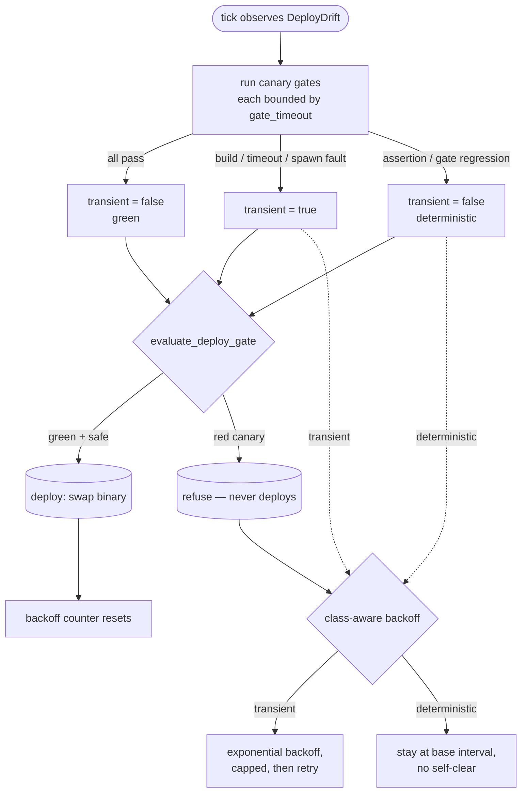

# Overseer deploy transient-canary timeout & bounded backoff

> **Status: implemented.** The `RelaunchConfig.gate_timeout` field and its
> `RELAUNCH_GATE_TIMEOUT_SECS` env override live in
> [`src/self_relaunch/types.rs`](https://github.com/rysweet/Simard/blob/main/src/self_relaunch/types.rs);
> the per-gate timeout enforcement (kill **and** reap on expiry) lives in
> [`src/self_relaunch/gates.rs`](https://github.com/rysweet/Simard/blob/main/src/self_relaunch/gates.rs);
> the additive `CanaryResult.transient` field and the `ProdCanaryRunner`
> failure-class mapping live in
> [`src/overseer/deploy.rs`](https://github.com/rysweet/Simard/blob/main/src/overseer/deploy.rs);
> and the class-aware bounded backoff lives in
> [`src/overseer/deploy_trigger.rs`](https://github.com/rysweet/Simard/blob/main/src/overseer/deploy_trigger.rs).
> The change is **additive and non-breaking**: no public signature was removed,
> [`evaluate_deploy_gate`](https://github.com/rysweet/Simard/blob/main/src/overseer/deploy.rs)
> and `DeployRefusal`'s `Display` are unchanged, and every existing
> `CanaryResult` / `RelaunchConfig` / `GateResult` / `TargetCanaryReport`
> construction site compiles against the new fields (`transient` and `timed_out`
> default to `false`; `gate_timeout` defaults to 600 s). Two new `run_canary`
> match arms (for the concrete `PretestSpawn` / `PretestTimeout` spawn faults)
> are additive — they narrow what previously fell through to the `Err(_)`
> catch-all, without changing the catch-all's behaviour for other errors.
> There is **no new persisted poison-ledger state** — the backoff is in-memory,
> idempotent, and resets on the first green canary.

## Why this exists

The Overseer's guarded self-deploy gate refuses a **red canary** — one or more
verification gates failed — and that refusal is correct: deploying an
unverified binary is exactly the danger the gate exists to prevent. But the
gate could not tell *why* the canary reddened, so it treated two very different
situations identically:

- A **deterministic regression** — a real `cargo test` failure or a broken
  binary on merged `main`. Retrying is pointless; the fix is to land code that
  makes the canary legitimately pass.
- A **transient blip** — a build that OOM'd, a gate subprocess that hung past
  its budget, or a spawn fault. The next attempt would very likely go green,
  but nothing distinguished it from a real regression.

Worse, a gate had **no per-gate timeout**. A hung `cargo test` (the exact OOM /
runaway-build class that motivated [#4415](https://github.com/rysweet/Simard/issues/4415)
and [#4422](https://github.com/rysweet/Simard/issues/4422)) could wedge the
whole tick indefinitely, leaving a runaway `cargo` child behind.

The observed failure mode: the running binary drifted 1–6 commits behind merged
`main`, every overseer tick re-observed `DeployDrift`, and every self-deploy
attempt failed the canary with the same opaque `deploy_gate: red canary` — for
6+ hours, with no landed fix and no automatic recovery.

This feature adds the two missing safety rails **without ever loosening the
gate**:

1. A **bounded per-gate timeout** so a hung gate cannot wedge a tick and leaves
   no zombie behind.
2. A **failure-class flag** (`transient`) so the scheduler can back off a flaky
   red canary politely and retry it, while a deterministic red canary is left
   alone (its fix is code, not retries).



> **Load-bearing invariant.** `transient` is a **scheduler-only** hint. It
> changes *how often* a refused deploy is retried; it **never** changes the
> go/no-go decision. A red canary is refused whether it is transient or
> deterministic — `evaluate_deploy_gate` is byte-for-byte unchanged. There is
> no path by which "transient" turns a red canary green or bypasses the gate.

## Brick A — per-gate subprocess timeout

### `RelaunchConfig.gate_timeout`

`RelaunchConfig` (in [`src/self_relaunch/types.rs`](https://github.com/rysweet/Simard/blob/main/src/self_relaunch/types.rs))
gains one additive field:

```rust
pub struct RelaunchConfig {
    pub canary_target_dir: PathBuf,
    pub health_timeout: Duration,
    pub manifest_dir: PathBuf,
    /// Wall-clock budget for a single verification gate subprocess (e.g. the
    /// full `cargo test` UnitTest gate). On expiry the child is killed AND
    /// reaped and the gate is recorded as a transient failure. Default 600 s;
    /// overridable via `RELAUNCH_GATE_TIMEOUT_SECS`, clamped to a non-zero
    /// floor and an absolute ceiling.
    pub gate_timeout: Duration,
}
```

`Default` sets `gate_timeout` to **600 seconds** (10 minutes) — long enough for
a cold `cargo test` on merged `main`, short enough that a genuinely hung gate is
reaped inside one tick rather than wedging the daemon.

### Environment override

| Env var                     | Default | Floor | Ceiling  | Notes                                                              |
| --------------------------- | ------- | ----- | -------- | ----------------------------------------------------------------- |
| `RELAUNCH_GATE_TIMEOUT_SECS`| `600`   | `1`   | `3600`   | Per-gate subprocess budget in seconds. Parse-or-default, then clamp. |

Parsing is **fail-safe**: an unset, empty, or unparseable value falls back to
the 600 s default; a parseable value is clamped to `[1, 3600]`. There is no
`unwrap` / `expect` / `panic!` on the env value, and `0` is clamped up to the
`1`-second floor so a mis-set env can never collapse the timeout into a
busy-loop.

```bash
# Give a slow host a 20-minute per-gate budget.
export RELAUNCH_GATE_TIMEOUT_SECS=1200

# Mis-set values are clamped, never fatal:
export RELAUNCH_GATE_TIMEOUT_SECS=0        # -> clamped up to 1 s
export RELAUNCH_GATE_TIMEOUT_SECS=99999    # -> clamped down to 3600 s
export RELAUNCH_GATE_TIMEOUT_SECS=banana   # -> falls back to 600 s
```

### Enforcement (kill **and** reap)

Each gate subprocess in
[`src/self_relaunch/gates.rs`](https://github.com/rysweet/Simard/blob/main/src/self_relaunch/gates.rs)
is run with the configured `gate_timeout`. `run_gate` previously blocked on
`Command::…output()` with **no** wall-clock bound; the enforcement wraps that
call so that on expiry the gate:

1. **kills the whole process group**, not just the direct child. The gate leads
   its own process group (`process_group(0)` on Unix), so a timeout SIGKILLs the
   negated group id and reaches every descendant. This is load-bearing for the
   UnitTest gate: `cargo test` spawns `rustc`/test-binary descendants that
   inherit the stdout/stderr pipe write-ends, so killing only the direct child
   would leave them alive holding the pipes open — the drain threads would never
   see EOF and the reaping `join()` would block *past* the timeout, defeating the
   bound for the very gate it exists to protect. Group-killing reaps the whole
   subtree so no zombie or runaway `cargo` survives the tick, and
2. **reaps** the group leader (waits on it), then
3. records a **failing** `GateResult` with a new **structured** `timed_out: true`
   flag (see below), plus a human-readable `detail` (e.g.
   `unit-test gate timed out after 600s`).

Gate subprocesses continue to be built with `Command::arg()` vectors only —
the env var feeds a `Duration`, never a command line, so there is no shell
interpolation surface.

#### Structured timeout signal on `GateResult`

`GateResult` today carries only `gate` / `passed` / `detail`. A timed-out gate
and a legitimately-failing gate would therefore be **identical in shape**, so
Brick A adds one additive field rather than encoding the class in a string:

```rust
pub struct GateResult {
    pub gate: RelaunchGate,
    pub passed: bool,
    pub detail: String,
    /// `true` only when this gate's subprocess was killed for exceeding
    /// `gate_timeout` (Brick A). A normal assertion failure leaves this `false`.
    /// Classification (Brick B) keys on THIS flag — never on `detail` text.
    pub timed_out: bool,
}
```

`verify_canary` threads this up: `TargetCanaryReport` gains a matching
`timed_out: bool`, set to `true` when the first reddening gate has
`timed_out == true`. This is what lets Brick B distinguish a hung probe from a
real regression **without string-sniffing** `detail` (which is
locale/format-fragile). All existing `GateResult` construction sites default
`timed_out` to `false`.

## Brick B — failure-class flag on `CanaryResult`

### `CanaryResult.transient`

`CanaryResult` (in [`src/overseer/deploy.rs`](https://github.com/rysweet/Simard/blob/main/src/overseer/deploy.rs))
gains one additive field alongside the existing `failing_gate` / `failing_detail`
diagnostics (see
[Overseer deploy red-canary diagnostics](./overseer-deploy-canary-diagnostics.md)):

```rust
pub struct CanaryResult {
    pub passed: bool,
    pub detail: String,
    pub failing_gate: Option<String>,
    pub failing_detail: Option<String>,
    /// Failure class of a RED canary, for the scheduler's retry cadence only.
    /// `true`  => a transient infrastructure blip (build fault, gate timeout,
    ///            subprocess spawn fault) that is likely to clear on retry.
    /// `false` => a deterministic result: any assertion/gate regression, and
    ///            ALWAYS `false` on a green canary.
    /// INVARIANT: `passed == true` implies `transient == false`.
    pub transient: bool,
}
```

### Classification map (`ProdCanaryRunner`)

`ProdCanaryRunner::run_canary` sets `transient` by mapping the canary outcome.
The rule is **default-deny to deterministic**: only clearly-infrastructural
faults are transient; anything that could be a real regression is deterministic.

The mapping is keyed on the **actual `run_canary` match arms** plus two
structured signals this feature adds (`GateResult.timed_out`, threaded into
`TargetCanaryReport.timed_out`; and explicit arms for the concrete spawn/infra
error variants). Critically,
`build_and_verify` returns **`Ok(report)` even when a gate legitimately fails**
(`report.passed == false`) — that `Ok`-red path is the *common* red canary and
is **deterministic** unless `report.timed_out` is set; an `Err(_)` means an
**infrastructure fault** during build/verify.

| `run_canary` outcome                                        | `passed` | `transient` | Rationale                                                              |
| ----------------------------------------------------------- | -------- | ----------- | --------------------------------------------------------------------- |
| `Ok(report)`, `passed == true` (green)                      | `true`   | `false`     | Invariant: a green canary is never "transient".                       |
| `Ok(report)`, `passed == false`, `report.timed_out == true` | `false`  | `true`      | A gate exceeded `gate_timeout` (Brick A structured flag); hung probe, not a semantic fail. |
| `Ok(report)`, `passed == false`, `report.timed_out == false`| `false`  | `false`     | Deterministic red — a gate legitimately failed; the fix is code.      |
| `Err(SafeUpdateError::BuildFailed)`                         | `false`  | `true`      | Build fault (OOM, disk, toolchain) — infrastructural, likely clears.  |
| `Err(SafeUpdateError::PretestSpawn` \| `PretestTimeout)`    | `false`  | `true`      | Could not even run the gate subprocess — infrastructural (see Brick B note 2). |
| `Err(SafeUpdateError::GateFailed)`                          | `false`  | `false`     | Default-deny: cannot prove it is infra, so treat as a real regression. |
| `Err(_)` any other variant                                  | `false`  | `false`     | Default-deny: never mask a possible regression as transient.          |

> **Fail-closed by construction.** Misclassifying a real regression as transient
> would let the scheduler keep retrying a genuinely broken build. So only
> build faults, structured `timed_out` gates, and concrete spawn faults are
> transient; every gate assertion (including the common `Ok(passed == false,
> timed_out == false)` path) is deterministic; and any unrecognised error
> variant resolves to deterministic.

> **Design decisions realised by this feature (not open questions).** Two shape
> gaps in today's code are closed *as part of building this*:
>
> 1. **Timeout signalling (Brick A → Brick B) uses a structured flag, not a
>    string.** A timed-out gate returns through the **`Ok(report, passed ==
>    false)`** arm, identical in shape to a deterministic assertion failure.
>    Rather than string-sniffing `detail` for `"timed out"` (locale/format
>    fragile, and it violates "don't infer class from a message"), Brick A adds
>    `timed_out: bool` to `GateResult`, `verify_canary` threads it into
>    `TargetCanaryReport.timed_out`, and `run_canary` classifies on
>    `report.timed_out`. This is the mechanism behind the `timed_out == true`
>    row above.
> 2. **Spawn faults are routed to a red `CanaryResult`, not swallowed.** Today
>    `run_canary`'s catch-all `Err(e) => Err(OverseerError::Capability { .. })`
>    turns every non-`BuildFailed`/non-`GateFailed` error into an `OverseerError`
>    that **never becomes a red `CanaryResult`**, so it never reaches the backoff.
>    There is **no `SafeUpdateError::SpawnFailed` variant** — within
>    `build_and_verify`, spawn/infra faults surface as the concrete
>    `SafeUpdateError::PretestSpawn` and `PretestTimeout` variants (the wider
>    codebase also has `SimardError::RpcSpawnFailed`). This feature adds explicit
>    match arms for those concrete variants that emit a `transient == true` red
>    `CanaryResult`; only genuinely-unknown errors fall through to the
>    `OverseerError` catch-all (default-deny). That is what makes the
>    `PretestSpawn`/`PretestTimeout` row above real rather than aspirational.

## `evaluate_deploy_gate` — unchanged (contract preservation)

[`evaluate_deploy_gate`](https://github.com/rysweet/Simard/blob/main/src/overseer/deploy.rs)
and `DeployRefusal` are **byte-for-byte unchanged**. The gate still refuses a
no-op, a rollback, a red canary, and a crash-loop, and it does not read
`transient`. The `transient` flag is consumed **only** by the deploy trigger's
scheduler to pick a retry interval — it can never authorize a deploy the gate
would otherwise refuse.

## Brick C — class-aware bounded backoff (`deploy_trigger`)

The existing process-global anti-thrash throttle
(`global_deploy_throttle_allow`, see the
[Self-deploy API reference](./self-deploy-api.md#anti-thrash)) already stops the
daemon redeploying every tick. Brick C extends it with **class-aware bounded
exponential backoff** keyed on the last canary's `transient` flag, so a flaky
red canary is retried on a widening (but capped) interval instead of hammering
the same failing build every base interval — while a deterministic red canary
is simply held at the base interval (retrying it more slowly gains nothing; the
fix is landing code).

### Behaviour

- **Transient red canary** → increment an in-memory consecutive-transient
  counter and apply **exponential backoff** on top of the base interval:
  `interval = min(base * 2^n, cap)`. All arithmetic is **saturating** (no
  overflow), the growth is bounded by an **absolute ceiling**, and the base has
  a **non-zero floor** — so the interval can neither collapse to a busy-loop nor
  grow to an unbounded sleep.
- **Deterministic red canary** → hold at the **base interval**. It does not
  grow the backoff (a deterministic failure will not self-clear by waiting) and
  it does not spuriously self-clear.
- **Green canary / successful deploy** → **reset** the consecutive-transient
  counter to zero. The next transient failure starts backoff from the base
  again.

The counter is **in-memory** (process-global, like the existing throttle) and
**idempotent**: re-evaluating the same tick does not double-count, and there is
no on-disk poison bit that could wedge deploy permanently. Restarting the daemon
starts from a clean slate.

### Configuration

| Env var                                           | Default | Floor | Ceiling | Purpose                                                                 |
| ------------------------------------------------- | ------- | ----- | ------- | ---------------------------------------------------------------------- |
| `SIMARD_OVERSEER_DEPLOY_MIN_INTERVAL_SECS`        | `900`   | `60`  | —       | Base anti-thrash interval (existing knob; the backoff base).           |
| `SIMARD_OVERSEER_DEPLOY_TRANSIENT_BACKOFF_CAP_SECS`| `7200`  | base  | `86400` | Absolute ceiling for the backed-off transient interval (default 2 h).  |

Both are parsed **fail-safe** (parse-or-default, then clamp). The cap is clamped
to be at least the base interval, so backoff is always well-formed. Setting the
cap equal to the base disables exponential growth (every transient retry waits
exactly one base interval).

```bash
# Base 15 min, let transient backoff widen up to 1 hour.
export SIMARD_OVERSEER_DEPLOY_MIN_INTERVAL_SECS=900
export SIMARD_OVERSEER_DEPLOY_TRANSIENT_BACKOFF_CAP_SECS=3600

# Pin transient retries to exactly the base interval (no exponential growth):
export SIMARD_OVERSEER_DEPLOY_TRANSIENT_BACKOFF_CAP_SECS=900
```

### Worked example

With `base = 900 s` and `cap = 7200 s`, a run of transient red canaries backs
off like this, then resets the instant the canary goes green:

| Consecutive transient reds | Interval before next retry |
| -------------------------- | -------------------------- |
| 1                          | 900 s (15 min)             |
| 2                          | 1 800 s (30 min)           |
| 3                          | 3 600 s (60 min)           |
| 4                          | 7 200 s (capped, 2 h)      |
| 5+                         | 7 200 s (held at cap)      |
| *green canary*             | **reset → 900 s**          |

A deterministic red canary stays flat at the 900 s base regardless of how many
times it recurs.

## Telemetry

All new signals are structured `tracing` events with OpenTelemetry attributes —
there are **no** `print!` / `println!` additions. The relevant attributes:

| Attribute                | Where                         | Meaning                                                  |
| ------------------------ | ----------------------------- | -------------------------------------------------------- |
| `gate` / `failing_gate`  | `self_relaunch`, `overseer::deploy` | The gate that reddened (incl. `timeout` / `build`). |
| `transient`              | `overseer::deploy`            | The failure class of the refused canary.                 |
| `backoff_secs`           | `overseer::deploy_trigger`    | The interval chosen before the next retry.               |
| `consecutive_transient`  | `overseer::deploy_trigger`    | The in-memory transient counter driving the backoff.     |

Only durations, gate names, failure class, and attempt counts are logged — no
new subprocess-output dumping beyond the existing bounded `failing_detail`
(capped at 512 bytes; see the
[diagnostics reference](./overseer-deploy-canary-diagnostics.md)).

## Security & safety invariants

- **Deploy authorization is unchanged.** `transient` is scheduler-only and
  never influences `evaluate_deploy_gate`. A red canary is always refused.
- **No busy-loop, no unbounded sleep.** `gate_timeout` has a non-zero floor; the
  backoff has a non-zero base floor, saturating arithmetic, and an absolute
  ceiling.
- **No zombies / runaway builds.** A timed-out gate child is killed **and**
  reaped.
- **No new persisted state.** The backoff counter is in-memory and resets on
  green; `src/ledger.rs` is untouched, and there is no on-disk "global deploy
  halt" bit that could permanently wedge deploy.
- **Fail-safe env parsing.** Every env var is parse-or-default-then-clamp with
  no `unwrap` / `expect` / `panic!`.
- **No shell surface.** Env vars feed `Duration`s, never command lines; gates
  keep using `Command::arg()` vectors.
- **Green invariant.** `passed == true` implies `transient == false`.

## Tests

- `src/self_relaunch/types.rs` — inline `#[cfg(test)]` unit tests for
  `gate_timeout` default (600 s) and `RELAUNCH_GATE_TIMEOUT_SECS`
  parse / default / clamp (floor, ceiling, unparseable).
- `src/self_relaunch/gates.rs` — inline tests that a fast-expiring timeout
  kills+reaps a sleeping fake gate command and sets `GateResult.timed_out ==
  true` (a normal assertion failure leaves it `false`), and a regression test
  that a timeout is **not wedged by a pipe-holding grandchild** (the group-kill
  reaps the whole subtree so the drain-thread `join()` returns promptly).
- `src/overseer/deploy.rs` — tests that `evaluate_deploy_gate` decision logic is
  unchanged; that `ProdCanaryRunner` maps a `report.timed_out` red, a
  `BuildFailed`, and a `PretestSpawn`/`PretestTimeout` error to
  `transient == true`, and a plain gate assertion (`Ok(passed == false,
  timed_out == false)`) / `GateFailed` / any other error to
  `transient == false`; and that a green canary always has
  `transient == false`.
- `src/overseer/tests_deploy_drift.rs` — reproducing test via the
  `FakeCanary` / `CanaryRunner` seam: a transient `BuildFailed` red is
  distinguished from a real regression by the `transient` flag; convergence
  tests that a transient red backs off and eventually retries, a deterministic
  red refuses and does not self-clear, and a green canary resets the backoff.
  The **production atomic path** is covered directly (not only the pure
  `TransientRedBackoff` model): `record_canary_outcome` widening / resetting the
  process-global streak that `effective_deploy_min_interval_secs` reads, so a
  refactor of the globals that diverges from the model cannot pass unnoticed.

## Source layout

```
src/self_relaunch/types.rs      # RelaunchConfig.gate_timeout + env parse/clamp
src/self_relaunch/gates.rs      # per-gate timeout enforcement (kill + reap);
                                #   GateResult.timed_out structured flag
src/overseer/deploy.rs          # CanaryResult.transient + ProdCanaryRunner mapping
                                #   (timed_out + PretestSpawn/PretestTimeout arms);
                                #   TargetCanaryReport.timed_out; evaluate_deploy_gate
                                #   unchanged (contract preserved)
src/overseer/deploy_trigger.rs  # class-aware bounded exponential backoff
src/overseer/tests_deploy_drift.rs
                                # reproducing + convergence tests
```

## Related

- [Overseer deploy red-canary diagnostics](./overseer-deploy-canary-diagnostics.md)
  — the `failing_gate` / `failing_detail` naming this backoff builds on.
- [Self-deploy API reference](./self-deploy-api.md) — the deploy gate, the
  `GuardedDeployer`, and the base anti-thrash throttle this extends.
- [Reconcile-and-self-deploy](../concepts/reconcile-and-self-deploy.md) — the
  drift-detection rationale for autonomous self-deploy.
- [Safe self-update](../safe-self-update.md) — the operator-facing safe upgrade
  rail and its drain/validate/rollback phases.
