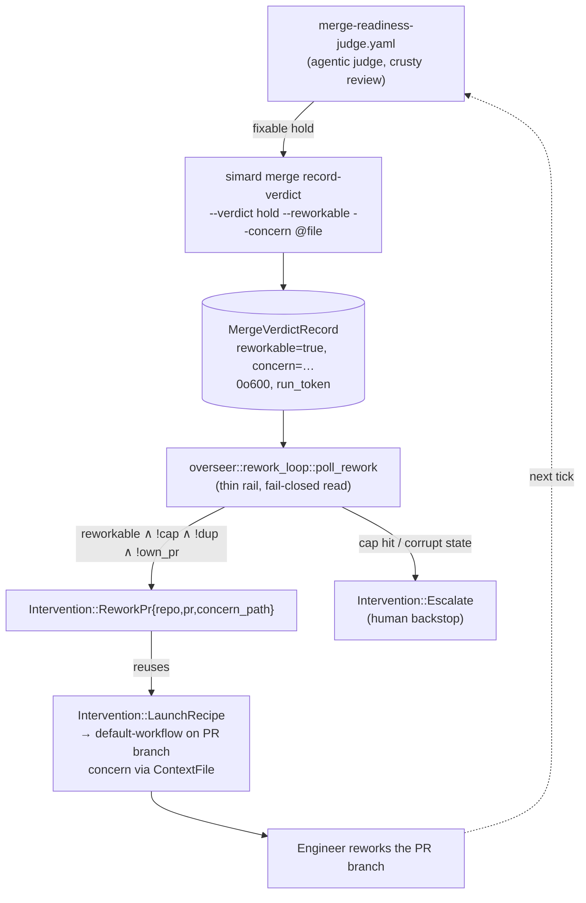

# Overseer autonomous PR rework loop

> **Status: current.** Opt-in via `SIMARD_OVERSEER_REWORK` (default **OFF**),
> gated by the master `SIMARD_OVERSEER_ENABLED`. When the flag is off the
> Overseer behaves exactly as before: a fixable merge hold dead-ends to human
> escalation.

Before this capability, when the agentic
[merge-readiness judge](./merge-record-verdict-cli.md) decided *"hold — but this
is fixable"*, the Overseer had no autonomous path forward: a fixable hold
escalated straight to a human, who then hand-shepherded the PR through rework.
The rework loop closes that gap. A fixable held PR is now reworked, re-reviewed
by the SAME judge, and merged with no human in the loop — or it cleanly
escalates after a capped number of attempts.

The design is **agentic-first** (see
[agentic-recipes-first principle](../concepts/agentic-recipes-first-principle.md)):
the *judgment* — "is this hold fixable, and what exactly must change?" — lives in
the merge-judge prompt. Rust is only a thin deterministic rail that reads a typed
verdict, counts attempts, and dispatches. There is **no** classifier, threshold
heuristic, or stdout scrape in Rust.

## How it works (end to end)



1. **Judge records a rework-able verdict.** On a *fixable* hold the
   `merge-readiness-judge` recipe calls `simard merge record-verdict` with the
   new `--reworkable` flag and a `--concern` describing exactly what must change.
   The fixable-vs-escalate decision is made **in the prompt**, never in Rust.
2. **The rail reads the typed verdict fail-closed.** `overseer::rework_loop`
   reads the [`MergeVerdictRecord`](#extended-merge-verdict-record) via
   `read_verified`. Absent/false `reworkable`, schema/identity/`run_token`
   mismatch, or malformed JSON all resolve to **not reworkable** → no-op.
3. **Guards gate the dispatch.** The rail admits a rework only when
   `reworkable == true` **and** the per-PR attempt cap is not hit **and** it is
   not a duplicate of an in-flight rework **and** the PR is not the Overseer's
   own (recursion guard). See [Guards](#guards).
4. **Dispatch reuses `LaunchRecipe`.** `Intervention::ReworkPr{repo, pr,
   concern_path}` is a thin dispatch tag whose `act()` reuses the existing
   `Intervention::LaunchRecipe` path: it runs **default-workflow** against the
   PR's repo, **on the PR's branch**, with the concern delivered as a
   [ContextFile](./recipe-context-file-transport.md) (`-c concern_path=…`) —
   **never** argv/env, so a large concern cannot trigger `E2BIG`.
5. **Emergent re-review.** The next Overseer tick re-runs the **same**
   `merge-readiness-judge` over the reworked PR. If the judge is satisfied it
   records `merge` and the normal
   [gated merge authority](./cross-repo-merge-authority.md) merges it
   (squash-only). If it still holds-fixable, the loop iterates — up to the cap.
6. **Escalation is the final backstop.** When the attempt cap is hit (or durable
   state is corrupt), the rail emits `Intervention::Escalate` to a human.
   Escalation is never the *first* response to a fixable hold.

## Extended merge-verdict record

The rework loop reuses the existing durable merge-verdict store
(`src/stewardship/merge_verdict_store.rs`, see
[merge-record-verdict-cli](./merge-record-verdict-cli.md)) and adds **two
optional fields**. No new stdout envelope is introduced.

```jsonc
{
  "schema_version": 1,          // unchanged — additive fields, NOT deny_unknown_fields
  "pr": 4931,
  "repo": "rysweet/Simard",
  "verdict": "hold",            // rework only ever pairs with a "hold"
  "reason": "…concise rationale…",
  "recorded_at": "2026-07-27T21:00:00Z",
  "run_token": "…opaque per-run token…",

  "reworkable": true,           // NEW — #[serde(default)] Option<bool>
  "concern": "The retry backoff in src/foo.rs multiplies before clamping; clamp first, then multiply, and add a unit test for the ceiling."  // NEW — #[serde(default)] Option<String>
}
```

| Field | Type | Semantics |
|-------|------|-----------|
| `reworkable` | `Option<bool>` (`#[serde(default)]`) | `Some(true)` ⇒ the hold is fixable and the rail may dispatch a rework. **Absent or `Some(false)` ⇒ not reworkable** (fail-closed). |
| `concern` | `Option<String>` (`#[serde(default)]`) | A concise, plain-English description of exactly what must change. Handed to the rework recipe as a ContextFile. Bounded; large payloads never go inline. |

**Compatibility.** `SCHEMA_VERSION` stays `1`: the fields are additive and the
struct is **not** `#[serde(deny_unknown_fields)]`, so old records (no
`reworkable`) deserialize cleanly and read as *not reworkable*. Every record this
capability writes is created `0o600` (owner-only) via an explicit
`PermissionsExt::from_mode`, written atomically (temp sibling + `rename`).

**Fail-closed read matrix.** `read_verified` is total (never panics) and returns
"not reworkable" for: missing file, malformed JSON, unknown `schema_version`,
`(repo, pr)` identity mismatch, `run_token` mismatch, and `reworkable` absent or
false. Only a well-formed, identity- and token-matched record with
`reworkable == true` authorizes a dispatch.

## Recording a rework-able verdict — CLI

The agent-facing write tool is the existing
[`simard merge record-verdict`](./merge-record-verdict-cli.md), extended with two
flags. The `merge-readiness-judge` recipe calls it; humans can use it for
fixtures/debugging.

```bash
simard merge record-verdict \
  --repo rysweet/Simard \
  --pr 4931 \
  --verdict hold \
  --reworkable \
  --concern @/path/to/concern.txt \
  --run-token "$SIMARD_RUN_TOKEN" \
  --reason "Fixable: backoff clamp ordering"
```

- `--reworkable` — marks the recorded hold as fixable. **Only valid with
  `--verdict hold`.**
- `--concern <TEXT>` / `--concern @FILE` — the plain-English concern. Prefer the
  `@FILE` form for anything non-trivial (avoids argv limits). **Requires
  `--reworkable`.**

### Contradiction guards (exit code 2)

The tool validates flag combinations and **refuses loudly** rather than writing a
contradictory record:

| Invocation | Result |
|------------|--------|
| `--verdict merge --reworkable` | **exit 2** — a merge verdict cannot be "reworkable". |
| `--concern …` without `--reworkable` | **exit 2** — a concern without a rework intent is meaningless. |
| `--reworkable` without `--concern` | **exit 2** — a rework with no concern gives the recipe nothing to act on. |
| invalid `--repo` slug | **exit 2** — reuses `validate_repo_slug` (traversal-safe). |

## Guards

All guards live in the Rust rail and are evaluated **before** any recipe launch.

### Numeric attempt cap

- Env: `SIMARD_OVERSEER_REWORK_MAX_ATTEMPTS`.
- **Default `3`**, **clamped to `1..=10`** (an out-of-range or non-numeric value
  is clamped, not honored verbatim).
- A **durable, monotonic** counter is kept per PR under the resolved
  [state root](./state-root-resolution.md)
  (`<state_root>/overseer/rework_attempts/<owner__name>/<pr>.json`), keyed by PR
  identity. Each dispatched rework increments it; it never decreases.
- When the counter reaches the cap the rail stops dispatching reworks and emits
  `Intervention::Escalate`. **Corrupt/unreadable state also escalates** (never
  "assume zero and retry forever").

### Dedup

The rail will not relaunch an *identical* rework: a rework already in flight for
the same `(repo, pr)` + concern signature is not dispatched again on the next
tick. This mirrors the Overseer's existing
[recipe-launch idempotency](./overseer-recipe-launch-idempotency.md) rail.

### Recursion / own-PR guard

The rail reuses the Overseer's identity guard (`SIMARD_OVERSEER_AUTHOR_LOGIN` /
`overseer/` branch prefix). It **refuses to rework the Overseer's own PRs**, so
the loop can never fight or amplify its own output. Consistent with the existing
guard, an *unconfigured* identity fails **closed** (refuse), never open.

### Budget

Rework dispatch is a cost-bearing `LaunchRecipe`, so it passes through the
existing `BudgetGate` (`SIMARD_DAILY_BUDGET_USD`). Over budget ⇒ hold + report,
never launch.

### Production wiring caveat (attempt-state commit ordering)

`poll_rework` commits the durable monotonic attempt counter **and** the in-flight
dedup key at admission time, *before* returning `Rework(_)` — this is the pinned
rail contract (see `attempt_counter_is_monotonic_and_cap_hit_escalates`). The
counter increments on the *decision to rework this verdict*, keyed by the
verdict's `run_token`; every fresh judge re-run stamps a new `run_token`, so the
cap counts real rework rounds and identical `(run_token, concern)` verdicts are
deduped while a dispatch is in flight.

Because admission and dispatch are two steps, the **production port** that wires
`poll_rework` into `run_cycle` must guarantee that a verdict admitted by
`poll_rework` is actually dispatched on the same tick — i.e. **reserve a launch
slot and confirm budget/recursion admission *before* calling `poll_rework`**, so
the shared per-cycle launch cap cannot strand an already-counted attempt. (In
this milestone the rework port is inert — `rework_port` is `None` until the M2
production wiring lands — so no stranding is reachable yet; this note is the
contract the M2 wiring must honor.)

## Configuration

| Env var | Default | Meaning |
|---------|---------|---------|
| `SIMARD_OVERSEER_ENABLED` | off | Master switch. Nothing below has effect unless this is truthy. |
| `SIMARD_OVERSEER_REWORK` | **off** | Enables the autonomous rework loop. Requires an explicit truthy value (`1`/`true`/`yes`/`on`). |
| `SIMARD_OVERSEER_REWORK_MAX_ATTEMPTS` | `3` | Per-PR rework attempt cap, clamped `1..=10`. |
| `SIMARD_OVERSEER_AUTHOR_LOGIN` | (unset) | Overseer's distinct identity for the own-PR recursion guard. Must be set (and distinct from the human operator) for the guard to admit real PRs. |

All flags follow the truthy-required helper convention used elsewhere in
`src/overseer/config.rs` (explicit truthy to enable; absent ⇒ off).

## Merge policy is preserved (not agent-decided)

The rework loop changes **only** what happens on a *fixable hold*. The merge
policy is unchanged and hardcoded in the rail — the agent never gets to weaken
it:

- **Squash-only**, **never** `--admin` / `--no-verify`.
- All objective gates (`evaluate_objective_gates`) + the
  [pr-verify diff scans](../design/overseer.md#pr-verify-checklist) + security
  checks stay intact.
- Every merge fires the existing **email + Signal** operator notification and
  Signal-@rysweet acknowledgement.
- The agentic merge-judge remains the **sole reviewer**; the rail is the safety
  authority and re-verifies the hard gates independently before any merge.

## Rails, files, and symbols

| Concern | Symbol / file |
|---------|---------------|
| Rework rail (pure fn returning an intervention) | `overseer::rework_loop::poll_rework` (`src/overseer/rework_loop.rs`) |
| Dispatch tag | `overseer::intervention::Intervention::ReworkPr{repo, pr, concern_path}` (`label() == "rework_pr"`); `act()` reuses the `LaunchRecipe` dispatch |
| Typed verdict store (extended) | `stewardship::merge_verdict_store::{MergeVerdictRecord, read_verified, write_record}` (`src/stewardship/merge_verdict_store.rs`) |
| Attempt counter | durable per-PR JSON under `<state_root>/overseer/rework_attempts/` |
| Judge prompt/recipe | `prompt_assets/simard/recipes/merge-readiness-judge.yaml` |
| Tick wiring | `overseer::run_cycle` Observe sub-step (flag-gated), `overseer::act` `ReworkPr` arm (`src/overseer/mod.rs`) |

## Testing (fixtures only — no live merges)

- **Fail-closed reader matrix** for the extended record: absent `reworkable` ⇒
  not reworkable; `reworkable=false` ⇒ no-op; schema/identity/`run_token`
  mismatch ⇒ no-op; malformed JSON ⇒ no-op; well-formed `reworkable=true` +
  matched token ⇒ dispatch. Confirms `0o600` on write and an extended
  round-trip; all pre-existing merge-verdict cases stay green.
- **Rail behavior**: monotonic counter increments; cap-hit ⇒ `Escalate`; dedup
  blocks an identical relaunch; own-PR guard refuses.
- **CLI**: `--reworkable`+`--concern` ✓; `--verdict merge --reworkable` ⇒ exit 2;
  `--concern` without `--reworkable` ⇒ exit 2; `--reworkable` without
  `--concern` ⇒ exit 2; invalid slug ⇒ exit 2.
- **Integration round-trip** (`tests/`): held → record `reworkable` → `ReworkPr`
  → re-review → merge, with a fake recipe runner and a fake `PrGhClient`. The
  test asserts the *judgment came from the recorded typed verdict*, not from Rust
  logic.

## Related

- [Overseer Signal operator-liaison](./overseer-signal-liaison.md)
- [Merge verdict record CLI & deterministic merge rail](./merge-record-verdict-cli.md)
- [Merge-readiness judge diff review](./merge-readiness-judge-diff-review.md)
- [Cross-repo merge authority](./cross-repo-merge-authority.md)
- [Recipe ContextFile transport](./recipe-context-file-transport.md)
- [Overseer — operator/observer co-process (design)](../design/overseer.md)
- [Agentic-recipes-first principle](../concepts/agentic-recipes-first-principle.md)
- [Configure the Overseer Signal liaison & PR rework loop](../howto/configure-overseer-signal-liaison-and-rework.md)
