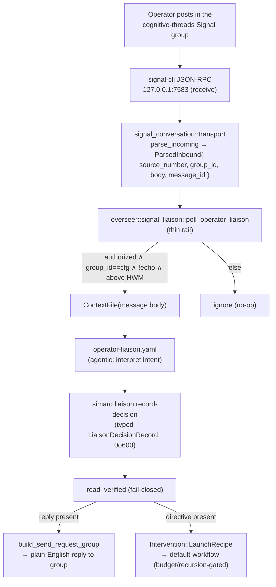

# Overseer Signal operator-liaison

> **Status: current.** Opt-in via `SIMARD_OVERSEER_SIGNAL_LIAISON` (default
> **OFF**), gated by the master `SIMARD_OVERSEER_ENABLED`. When off, the Overseer
> neither receives nor answers operator-group messages.

An external steward used to run a **detached python listener**
(`/tmp/simard-ct-listener.py`) against the signal-cli JSON-RPC daemon to catch
operator messages in the cognitive-threads group, then *manually* read them and
either answered or drove a fix. The operator-liaison folds that entire loop into
the Overseer as a first-class capability. With the flag on, the running daemon
autonomously ingests an operator Signal message, answers it in plain English on
the same group, and — when the message is a go-ahead to fix something — launches
the appropriate recipe. **No external listener process, no manual step.**

The design is **agentic-first** (see
[agentic-recipes-first principle](../concepts/agentic-recipes-first-principle.md)):
interpreting the operator's message, composing the reply, and deciding whether an
intervention is warranted is done by an **agentic recipe**. Rust is only a thin
deterministic rail — receive, authorize, dedup, dispatch. There is **no**
keyword classifier or stdout scrape of operator/agent text in Rust.

## How it works (end to end)



1. **Receive.** In the Observe phase of `run_cycle`, the rail drains new
   `receive` notifications from the single-account signal-cli daemon at
   `127.0.0.1:7583` (loopback-only), reusing the existing
   [Signal JSON-RPC transport](./overseer-signal-jsonrpc-transport.md).
2. **Parse (incl. group id).** `signal_conversation::transport::parse_incoming`
   now extracts `groupInfo.groupId` from both `dataMessage` and
   `syncMessage.sentMessage`, in addition to `sourceNumber`. A non-group message
   parses with `group_id: None` (regression-safe). All fields are treated as
   untrusted; parsing is total and never panics.
3. **Authorize + filter.** The rail acts **only** when the message is
   `authorized ∧ group_id == configured ∧ not-an-echo ∧ above the
   high-water-mark`. Authorization reuses the existing fail-closed E.164
   allowlist (exact match; an empty allowlist authorizes nobody). Self-echoes are
   suppressed with the existing `matches_recent_outbound` /
   `should_accept_sync_sent` checks. `group_id: None` never matches a group.
4. **High-water-mark / dedup.** A durable rail records the last-handled message
   marker per group under the [state root](./state-root-resolution.md) so each
   operator message is handled **exactly once**, even across restarts.
5. **Hand off to the agent.** The message body is written to a
   [ContextFile](./recipe-context-file-transport.md) (`-c message_path=…`,
   **never** argv/env → no `E2BIG`) and the `operator-liaison` recipe is invoked.
   The agent interprets intent and **acts via a tool**, recording a typed
   [`LiaisonDecisionRecord`](#liaison-decision-record) — it prints no envelope.
6. **Reply and/or intervene.** The rail reads the decision fail-closed and:
   - if a **reply** is present, sends it back to the *same group* via the new
     group-outbound path (`build_send_request_group`);
   - if a **directive** is present, dispatches the existing
     `Intervention::LaunchRecipe` (default-workflow) behind the normal
     budget/recursion/dedup guards.
   The two are **not** mutually exclusive — a single run may reply *and* direct
   an intervention.

## Signal group transport (the largest real gap closed)

Previously the transport extracted only `sourceNumber` and outbound targeted a
single recipient. The liaison requires **group** inbound *and* outbound:

- **Inbound.** `ParsedInbound` gains `group_id: Option<String>`, parsed from
  `params.envelope.dataMessage.groupInfo.groupId` and
  `params.envelope.syncMessage.sentMessage.groupInfo.groupId`. Direct
  (non-group) messages ⇒ `group_id: None`.
- **Outbound.** A new `build_send_request_group` emits a JSON-RPC `send` with
  `params.groupId` (instead of a single recipient), so replies land in the
  operator group. The existing single-recipient send path is unchanged.

See [Overseer Signal JSON-RPC transport](./overseer-signal-jsonrpc-transport.md)
and [Signal channel](./signal-conversation.md) for the underlying wire format.

## Liaison decision record

The liaison uses a **new sibling store**,
`src/stewardship/liaison_decision_store.rs`, cloned from the merge-verdict store
but with its own identity and lifecycle (a liaison decision is keyed by the
operator message, not by a PR). It never reuses or mutates `MergeVerdictRecord`.

Record path (traversal-safe):
`<state_root>/liaison_decisions/<group_id_hash>/<message_id>.json`, written
atomically (temp + `rename`) with owner-only `0o600`.

> **Why a hash, not the raw group id?** The merge-verdict store keys its
> directory on `<owner__name>`, which is already a filesystem-safe,
> human-readable slug. A Signal `group_id` is an opaque base64 blob that can
> contain `/`, `+`, and `=`, so it is **not** path-safe. The liaison store
> therefore keys its directory on a stable hex digest of the `group_id`
> (`<group_id_hash>`) to guarantee a single, traversal-safe path segment; the
> raw `group_id` is still recorded verbatim inside the JSON body for
> `read_verified` identity matching. `<state_root>` follows the shared
> resolution ladder (see [State-root resolution](./state-root-resolution.md)).

```jsonc
{
  "schema_version": 1,
  "group_id": "…configured operator group id…",
  "message_id": "…the operator message this answers…",
  "run_token": "…opaque per-run token…",
  "recorded_at": "2026-07-27T21:10:00Z",

  "reply": "Yes — I'll kick off a fix for the flaky canary now and report back.",   // optional plain-English reply to the group
  "directive": {                                                                     // optional intervention directive
    "recipe": "default-workflow",
    "task_description": "Investigate and fix the flaky deploy canary; see concern file.",
    "target_repo": "rysweet/Simard",
    "context_path": "<state_root>/liaison_decisions/…/directive-context.txt"
  }
}
```

| Field | Type | Semantics |
|-------|------|-----------|
| `group_id`, `message_id`, `run_token` | `String` | Identity + freshness. `read_verified` fails closed on any mismatch. |
| `reply` | `Option<String>` | Plain-English text to send back to the group. Absent ⇒ no reply. |
| `directive` | `Option<Directive>` | When present, the rail dispatches `Intervention::LaunchRecipe` (default-workflow). Large context goes via `context_path` (ContextFile), never inline. |

> **Task description must be self-contained.** The pure decision→actions mapping
> (`liaison_actions_from_decision`) carries the directive's `task_description`
> and `target_repo` into `RecipeBrief` **verbatim** — `RecipeBrief` has no
> separate context channel, so the launched `default-workflow` sees only the
> task description. `context_path` is staged durably (owner-only `0o600`, atomic
> rename) as the **audit record** of what the operator asked; it is *not* a
> second input channel to the workflow. The `operator-liaison` prompt therefore
> instructs the agent to inline every piece of operator context the workflow
> needs directly into the task-description file (which rides a file, so it has
> no argv/E2BIG limit). If a future milestone adds a first-class context channel
> to `RecipeBrief`, the rail can forward `context_path` directly; until then the
> self-contained task description is the contract.

**Fail-closed read matrix.** `read_verified` returns a typed `ReadOutcome` and
never panics: `Missing`, `Mismatch(schema | identity | token)`, malformed JSON,
plus the four valid shapes — reply-only, directive-only, both, and neither
(no-op). Only an identity- and token-matched record drives any action.

## Recording a decision — CLI

The agent-facing write tool is a new `simard liaison record-decision`
subcommand. The `operator-liaison` recipe calls it; humans can use it for
fixtures.

```bash
simard liaison record-decision \
  --group-id "$SIMARD_OPERATOR_GROUP_ID" \
  --message-id "$OPERATOR_MESSAGE_ID" \
  --run-token "$SIMARD_RUN_TOKEN" \
  --reply-path /path/to/reply.txt \
  --directive-recipe default-workflow \
  --directive-task-path /path/to/task.txt \
  --directive-repo rysweet/Simard \
  --directive-context-path /path/to/concern.txt
```

- `--reply-path FILE` — plain-English reply (file form avoids argv limits).
- Directive flags (`--directive-recipe`, `--directive-task-path`,
  `--directive-repo`, `--directive-context-path`) form an **all-or-nothing**
  group: supply the full set to direct an intervention, or none of them.
- At least one of a reply or a complete directive must be present.

### Contradiction guards (exit code 2)

| Invocation | Result |
|------------|--------|
| a **partial** directive (some but not all directive flags) | **exit 2** |
| neither a reply nor a directive | **exit 2** |
| invalid `--directive-repo` slug | **exit 2** — reuses `validate_repo_slug` |

## Acceptance, authorization & echo-suppression (security)

Acceptance is decided **in the Rust rail, before any recipe launch**:

```
accept  ⟺  authorized(source_number)          // fail-closed E.164 allowlist, exact match
          ∧ group_id == SIMARD_OVERSEER_SIGNAL_GROUP_ID
          ∧ not matches_recent_outbound(...)   // suppress our own posts
          ∧ should_accept_sync_sent(...)       // suppress sync-sent echoes
          ∧ message_id above the durable high-water-mark
```

- The **allowlist authorizes nobody when empty** — a misconfiguration cannot
  open the door.
- The signal-cli daemon binding stays **loopback-only** (`127.0.0.1:7583`).
- Untrusted operator text reaches the agent **only** via a ContextFile, never
  argv/shell; E.164 numbers and message bodies are redacted in `[simard]` logs.
- State tampering degrades to **no action**, never more privilege.

## Configuration

| Env var | Default | Meaning |
|---------|---------|---------|
| `SIMARD_OVERSEER_ENABLED` | off | Master switch — nothing below has effect unless truthy. |
| `SIMARD_OVERSEER_SIGNAL_LIAISON` | **off** | Enables the operator-liaison. Explicit truthy required (`1`/`true`/`yes`/`on`). |
| `SIMARD_OVERSEER_SIGNAL_OPERATOR_NUMBER` | (unset) | The authorized operator's E.164 number (mirrors the `SIMARD_OVERSEER_EMAIL_TO` style). |
| `SIMARD_OVERSEER_SIGNAL_GROUP_ID` | (unset) | The operator group id the liaison receives on and replies to. |
| `SIMARD_OVERSEER_AUTHOR_LOGIN` | (unset) | Overseer's distinct identity for the recursion guard on any directed intervention. |

## Rails, files, and symbols

| Concern | Symbol / file |
|---------|---------------|
| Liaison rail (pure fn returning reply + optional intervention) | `overseer::signal_liaison::poll_operator_liaison` (`src/overseer/signal_liaison.rs`) |
| Group transport | `signal_conversation::transport::{parse_incoming, build_send_request_group}` (`src/signal_conversation/transport.rs`) |
| Decision store | `stewardship::liaison_decision_store::{LiaisonDecisionRecord, ReadOutcome, read_verified, write_record}` (`src/stewardship/liaison_decision_store.rs`) |
| Write tool | `simard liaison record-decision` (`src/operator_cli/`) |
| Recipe + prompt | `prompt_assets/simard/recipes/operator-liaison.yaml`, `prompt_assets/simard/overseer/operator_liaison.md` |
| Tick wiring | `overseer::run_cycle` Observe sub-step (flag-gated) (`src/overseer/mod.rs`) |

## The `operator-liaison` recipe

`prompt_assets/simard/recipes/operator-liaison.yaml` (prompt
`prompt_assets/simard/overseer/operator_liaison.md`) reads the operator message
from its ContextFile and:

1. interprets the operator's intent semantically (question, status request,
   go-ahead to fix, etc.);
2. composes a plain-English reply when a reply is warranted;
3. decides whether an Overseer intervention is warranted and, if so, records a
   `directive` (default-workflow) with the task + a concern/context file;
4. **acts via `simard liaison record-decision`** — it prints no JSON envelope.

The recipe carries the canonical
[agentic-recipes-first](../concepts/agentic-recipes-first-principle.md) framing:
all judgment is the agent's; the rail only dispatches.

## Testing (fixtures only — no live Signal)

- **Transport**: `groupId` parsed from `dataMessage` *and*
  `syncMessage.sentMessage`; non-group ⇒ `None` (regression); group-outbound
  request shape; all existing `parse_incoming` tests stay green.
- **Decision store**: fail-closed reader matrix —
  `Missing`/`Mismatch(schema,identity,token)`/malformed/reply-only/
  directive-only/both/neither; `0o600` on write; round-trip.
- **Liaison rail**: HWM/dedup handles a message once; echo-suppression; the
  operator-number ∧ group-id filter; reply / directive / both cases — all with a
  fake receive source and a fake recipe runner.
- **CLI**: partial directive ⇒ exit 2; neither reply nor directive ⇒ exit 2;
  invalid slug ⇒ exit 2.

## Related

- [Overseer autonomous PR rework loop](./overseer-rework-loop.md)
- [Overseer Signal JSON-RPC transport](./overseer-signal-jsonrpc-transport.md)
- [Signal channel](./signal-conversation.md)
- [Overseer operator notifications](./overseer-operator-notifications.md)
- [Recipe ContextFile transport](./recipe-context-file-transport.md)
- [Overseer — operator/observer co-process (design)](../design/overseer.md)
- [Configure the Overseer Signal liaison & PR rework loop](../howto/configure-overseer-signal-liaison-and-rework.md)
- [Set up the Signal channel](../howto/set-up-the-signal-channel.md)
