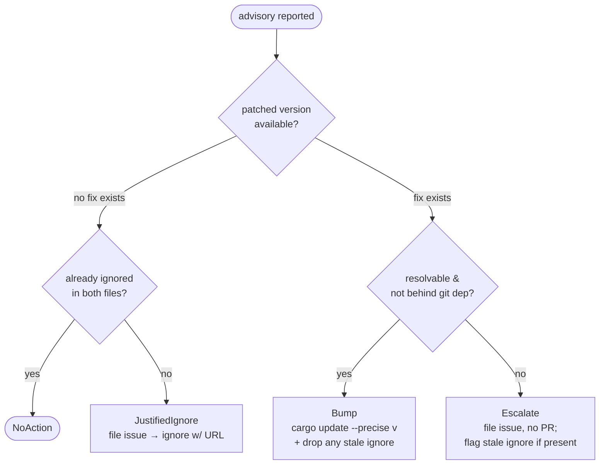

# Supply-chain advisory stewardship

> **Status: active.** This page documents the shipped proactive advisory
> stewardship for issue #2741: the **pinned** advisory DB that stabilises the
> PR-time gate, the **daily scheduled scan** that tracks the DB HEAD against the
> default branch, the **remediation reasoner** (`src/supply_chain_steward/`) that
> decides *bump-or-justified-ignore* behind a deterministic rail, and the
> **Dependabot** config that keeps patched crate versions flowing. It is both
> the operator reference and the spec the workflow + reasoner enforce.

`cargo-audit` and `cargo-deny check advisories` fetch the **latest** RUSTSEC
advisory database *at CI time*. That coupling is the problem this feature
removes: a brand-new upstream advisory retroactively fails the required advisory
checks on `main` **and on every open PR**, blocking unrelated feature work until
someone bumps a dependency.

The motivating incident: **RUSTSEC-2026-0204** (`crossbeam-epoch`) was published
2026-07-06 and immediately failed the required `cargo-deny` / `cargo-audit`
checks on `main` and every open PR, because both tools pulled the fresh DB. The
fix makes this class of surprise **never block the pipeline again**: the human PR
gate is decoupled from upstream DB churn, and a scheduled job becomes the source
of truth that files proactive fixes.

## At a glance

| Concern | Mechanism | File |
| --- | --- | --- |
| PR gate must not fail on a *brand-new* upstream advisory | Advisory checks run **offline against a pinned DB** | [`.github/advisory-db.sha`](#pr-gate-stabilisation-the-pinned-advisory-db) + `verify.yml` |
| Detect new advisories against the default branch | **Daily** `cargo audit` + `cargo deny check advisories` vs DB HEAD | [`.github/workflows/advisory-scan.yml`](#the-scheduled-advisory-scan) |
| Decide what to do about a new advisory | Pure `decide()` → `Bump \| JustifiedIgnore \| Escalate \| NoAction` | [`src/supply_chain_steward/`](#the-remediation-reasoner) |
| Open the tracking issue + remediation PR | Execution layer behind mockable traits | [`src/bin/supply-chain-steward.rs`](#the-steward-binary) |
| Keep patched versions flowing automatically | **Dependabot** cargo security + weekly lockfile | [`.github/dependabot.yml`](#dependabot) |

Three properties hold together:

1. **A freshly-published upstream advisory no longer fails unrelated PRs** — the
   PR gate is pinned and offline.
2. **A scheduled advisory scan files proactive fix PRs** — before the advisory
   would ever have blocked other work.
3. **Simard auto-remediates under a deterministic rail** — a *bump* when a fix
   exists, a *justified, tracked ignore* only when none does, and never a silent
   suppression of a fixable advisory.

## Chosen approach: pin the PR gate, HEAD the scheduled job

The task offered two ways to keep the PR gate stable — **pin** the advisory DB
revision for the gate and bump it deliberately, or make the PR-time check a
**soft warning** with the scheduled job as source of truth. Simard ships the
**pin** approach as the primary path:

- The PR-time advisory checks stay a **hard failure** (deterministic, matching
  the repo's SHA-pinned-actions philosophy) but are evaluated **only against the
  advisory DB revision recorded in `.github/advisory-db.sha`**. Upstream
  publishing a new advisory cannot change that revision, so it cannot
  retroactively fail an open PR.
- The **scheduled** job fetches the DB **HEAD**, is the single source of truth
  for "is there a new advisory?", and — when the fresh DB is otherwise clean —
  opens a PR that **bumps `.github/advisory-db.sha`** so the pin advances
  deliberately, reviewed like any other change.

> **Why pin, not soft-warn.** A soft-warning PR gate would let a *real* new
> vulnerability land silently on a green PR. Pinning keeps the gate a true
> blocker while decoupling it from the *timing* of upstream publication. The
> licenses / bans / sources checks are unaffected — only the **advisories**
> check reads the pin; everything else in `deny.toml` still runs normally.
>
> **Design-time contingency (A1).** If offline pinning proves infeasible for a
> given `cargo-deny` / `cargo-audit` release, the fallback is a soft-warning
> PR advisory step with the scheduled job as the source of truth. Pinning is the
> primary, shipped path.

## PR-gate stabilisation: the pinned advisory DB

### `.github/advisory-db.sha`

A one-line file holding the **full 40-char commit SHA** of
[`rustsec/advisory-db`](https://github.com/rustsec/advisory-db) that the PR gate
evaluates against:

```text
# .github/advisory-db.sha
# Pinned rustsec/advisory-db revision for the PR-time advisory gate (#2741).
# Advanced deliberately by the scheduled advisory-scan job when DB HEAD is clean.
a1b2c3d4e5f6a7b8c9d0e1f2a3b4c5d6e7f8a9b0
```

- The file contains exactly the SHA (a leading `#` comment block is tolerated by
  the checkout step, which reads the first non-comment, non-blank line).
- It is the **only** thing that changes when the pin advances — a
  `chore(deps): bump advisory-db pin` PR touches this file alone.

### The offline PR gate (`verify.yml`)

The `cargo-audit` and `cargo-deny` jobs check out the advisory DB at the pinned
SHA and run **without fetching**:

```yaml
cargo-audit:
  runs-on: ubuntu-latest
  timeout-minutes: 10
  permissions:
    contents: read
  steps:
    - name: Check out repository
      uses: actions/checkout@34e114876b0b11c390a56381ad16ebd13914f8d5 # v4
    - name: Read pinned advisory-db SHA
      id: pin
      run: echo "sha=$(grep -vE '^\s*(#|$)' .github/advisory-db.sha | head -n1)" >> "$GITHUB_OUTPUT"
    - name: Check out pinned advisory database
      uses: actions/checkout@34e114876b0b11c390a56381ad16ebd13914f8d5 # v4
      with:
        repository: rustsec/advisory-db
        ref: ${{ steps.pin.outputs.sha }}
        path: .advisory-db
    - name: Install cargo-audit
      uses: taiki-e/install-action@754bf4dbae00ad1b16b244717154b96ba27d2416 # cargo-audit
    - name: Run cargo audit (offline, pinned DB)
      run: cargo audit --no-fetch --db .advisory-db
```

`cargo-deny` **cannot** pin its advisory DB to a revision — it always fetches
upstream HEAD, with no rev flag or `db-path` override that the offline mode can
be steered to a pinned checkout reliably across releases (the A1 contingency
called this out). So the PR gate does **not** run `cargo deny check advisories`
at all; the pinned, offline `cargo-audit` job above is the single authoritative
advisory gate (same advisory set, immune to DB-HEAD churn). `cargo-deny` runs
only the advisory-DB-**independent** policies, which stay a hard, deterministic,
network-free gate:

```yaml
    - name: Run cargo deny check (licenses + bans + sources)
      # advisories intentionally omitted — the pinned, offline cargo-audit job
      # is the authoritative advisory gate. licenses/bans/sources do not read
      # the advisory DB, so they are deterministic and need no network fetch.
      run: cargo deny --locked check licenses bans sources
```

> **Why not `cargo deny check advisories` here at all?** Any run of
> `cargo deny check advisories` fetches the DB **HEAD**, re-introducing the exact
> retroactive-failure the pin removes. Rather than a brittle offline-cache seed
> (which the A1 contingency flagged as release-fragile) or a soft-warning step
> that adds a network fetch to every PR, the advisory check is consolidated in
> the pinned, offline `cargo-audit` job. `deny.toml`'s `[advisories]` policy
> (the `ignore` list) is still authoritative — it is exercised by the daily
> `advisory-scan` job (`cargo deny check advisories`) and by any local
> `cargo deny check`, and its `ignore` list is kept in sync with
> `.cargo/audit.toml` (which the pinned PR gate reads) by the reasoner.

Properties preserved from the existing guardrail jobs (see
[Supply-chain audit → CI guardrail](./supply-chain-audit.md#ci-guardrail)):

- **Lockfile-only** — no crate compilation, not in the memory-sensitive
  `pre-commit` job, never writes the shared `simard-ci-v2` cache.
- **`contents: read`** — no token write scope on the PR gate.
- **SHA-pinned actions** with explicit `tool:` version pins; `--locked` fails on
  a dirty `Cargo.lock`.
- **Hard failure** — a vulnerability present *in the pinned DB* still fails the
  PR, exactly as before. Only the *timing decoupling* is new.

## The scheduled advisory scan

### `.github/workflows/advisory-scan.yml`

```yaml
name: advisory-scan

on:
  schedule:
    - cron: "0 6 * * *"   # daily 06:00 UTC
  workflow_dispatch: {}    # manual trigger for testing / on-demand sweeps

permissions:
  contents: write        # bump advisory-db.sha / deny.toml / Cargo.lock on a branch
  issues: write          # file tracking issues
  pull-requests: write   # open remediation PRs

concurrency:
  group: advisory-scan
  cancel-in-progress: false

jobs:
  scan:
    runs-on: ubuntu-latest
    timeout-minutes: 20
    steps:
      - name: Check out default branch
        uses: actions/checkout@34e114876b0b11c390a56381ad16ebd13914f8d5 # v4
      - name: Install cargo-audit
        uses: taiki-e/install-action@754bf4dbae00ad1b16b244717154b96ba27d2416 # cargo-audit
      - name: Install cargo-deny
        uses: taiki-e/install-action@4e4e4d1450e58bef95d6f394ac20d46ad7d24ebf # cargo-deny
        with:
          tool: cargo-deny@0.19.9
      - name: Run supply-chain steward (scan DB HEAD, remediate)
        env:
          # Bot token so remediation PRs actually trigger required CI.
          # Absent → the steward still files issues + opens PRs, marks them
          # `needs-CI-trigger`, and NEVER self-merges (fail-safe).
          STEWARD_GH_TOKEN: ${{ secrets.STEWARD_GH_TOKEN }}
        run: cargo run --locked --bin supply-chain-steward -- scan
```

What a run does, in order:

1. **Fetch DB HEAD** and run `cargo audit --json` + `cargo deny check advisories`
   against the checked-out **default branch** lockfile, using the *latest*
   advisory database (not the pin).
2. For each **new lockfile-affecting security vulnerability** (see
   [advisory scope](#advisory-scope)), invoke the reasoner's pure
   [`decide()`](#the-decision-function) to pick an action.
3. **File a tracking issue** (idempotently — see [idempotency](#idempotency-and-deduplication))
   and, per the decision, **open a remediation PR** (a bump) or leave it
   issue-only (escalate / justified-ignore).
4. When the fresh DB is otherwise **clean** (no un-pinned advisory the gate would
   miss), open a `chore(deps): bump advisory-db pin` PR advancing
   [`.github/advisory-db.sha`](#githubadvisory-dbsha) to DB HEAD.
5. **Self-merge only its own green-CI remediation PRs** (see
   [self-merge](#self-merge)).

The daily cadence plus `workflow_dispatch` matches the task's "e.g. daily" and
makes the job testable on demand.

## The remediation reasoner

Module: `simard::supply_chain_steward`
Source: `src/supply_chain_steward/`
Binary: `supply-chain-steward` (`src/bin/supply-chain-steward.rs`)

All decision logic lives in a testable library module; a thin binary target
drives it from the scheduled workflow. This mirrors the split used by
[`stewardship`](./stewardship-api.md) and [`ci_health`](./ci-health-sweep.md):
pure decision, I/O behind mockable traits.

### Module layout

```
src/supply_chain_steward/
├── mod.rs        public entrypoint + re-exports (the only public surface)
├── types.rs      Advisory, PatchStatus, RemediationContext, Decision
├── parse.rs      parse_audit_json — `cargo audit --json` → Vec<Advisory>
├── decide.rs     decide — pure Advisory + RemediationContext → Decision
├── execute.rs    execute + RemediationOutcome — drives issue/PR/cargo-update/ignore-writes/self-merge via traits
├── config.rs     IgnoreFiles — read/write deny.toml + .cargo/audit.toml ignore lists (kept in sync)
├── gh.rs         SupplyChainGh trait, RealSupplyChainGh, FakeSupplyChainGh (cfg(test))
└── tests.rs      unit + end-to-end tests
```

`mod.rs` re-exports the public API:

```rust
pub use decide::decide;
pub use execute::{execute, RemediationOutcome};
pub use gh::{RealSupplyChainGh, SupplyChainGh};
pub use parse::parse_audit_json;
pub use types::{Advisory, Decision, PatchStatus, RemediationContext};

// Test-only fake re-exported for downstream test consumers.
#[cfg(any(test, feature = "test-utils"))]
pub use gh::FakeSupplyChainGh;
```

`supply_chain_steward` reuses `stewardship::dedup` (issue de-dup) and
`stewardship::merge_authority` (green-CI-only self-merge). It does **not** depend
on `engineer_loop` or `self_improve`.

### Types

```rust
/// One security vulnerability reported by `cargo audit --json` against Cargo.lock.
pub struct Advisory {
    pub id: String,            // e.g. "RUSTSEC-2026-0204"
    pub crate_name: String,    // affected crate
    pub installed: String,     // version currently in Cargo.lock
    pub patched: PatchStatus,  // parsed `versions.patched` requirement
    pub title: String,
    pub url: String,           // https://rustsec.org/advisories/<id>
}

/// The `versions.patched` field of an advisory, parsed from cargo-audit JSON.
pub enum PatchStatus {
    /// No fixed release exists (empty `patched` requirement).
    None,
    /// A patched version requirement exists, e.g. ">= 0.9.20".
    Fixed { requirement: String },
}

/// Facts the pure decision needs beyond the advisory itself — resolved by the
/// execution layer before `decide()` is called, so `decide()` stays pure.
pub struct RemediationContext {
    /// Lowest released version satisfying `patched` that resolves against
    /// Cargo.lock, if one exists. `None` when no fix is resolvable.
    pub resolvable_patch: Option<String>,
    /// True when the crate is reached only behind a first-party git dependency
    /// (a bump belongs in that upstream repo, not Simard's Cargo.lock).
    pub behind_git_dep: bool,
    /// True when a justified ignore for this advisory already exists in both
    /// deny.toml and .cargo/audit.toml. Interpreted together with patch status:
    /// an ignore with no upstream fix is honoured (→ NoAction), while an ignore
    /// whose fix has since shipped is *stale* and is corrected (→ Bump/Escalate
    /// plus removal of the stale entries). See "Stale-ignore revalidation".
    pub already_ignored: bool,
}
```

### The decision function

```rust
/// Pure, total, I/O-free. Given an advisory and pre-resolved context, decide
/// the single remediation action. This is the deterministic rail: the mapping
/// from (patch status, resolvability) to outcome is fixed and unit-tested.
pub fn decide(advisory: &Advisory, ctx: &RemediationContext) -> Decision;
```

```rust
pub enum Decision {
    /// A patched version exists AND is resolvable against Cargo.lock — do the
    /// minimal `cargo update -p <crate> --precise <to> --locked`. If the
    /// advisory was previously (mis)ignored as "no fix", the bump additionally
    /// removes the now-stale ignore from both files.
    Bump { crate_name: String, from: String, to: String },

    /// No patched version exists AND the advisory is not exploitable in
    /// Simard's usage — file a tracking issue, THEN add a justified ignore that
    /// embeds the issue URL, to BOTH deny.toml and .cargo/audit.toml.
    /// Produced ONLY from the no-patched-version branch (the hard rail).
    JustifiedIgnore { advisory_id: String, crate_name: String, reason: String },

    /// A fix exists but cannot be applied here (semver-incompatible, behind a
    /// first-party git dep, or not resolvable against Cargo.lock) — file a
    /// tracking issue, open NO auto-PR, and write NO ignore.
    Escalate { advisory_id: String, reason: String },

    /// Already mitigated: an existing justified ignore for an advisory that
    /// STILL has no upstream fix, or an advisory already patched in the
    /// lockfile — nothing to do. An ignore whose fix has since shipped is NOT
    /// NoAction; it is corrected to a Bump (or Escalate).
    NoAction,
}
```

The decision table — exhaustive and deterministic. `already ignored` only
short-circuits to `NoAction` **when no upstream fix exists**; a fix that has
since shipped makes the ignore *stale* and the advisory is remediated anyway:

| `patched` | resolvable patch | behind git dep | already ignored | Decision |
| --- | --- | --- | --- | --- |
| `None` | — | — | yes | **`NoAction`** — ignore still justified (no upstream fix) |
| `None` | — | — | no | **`JustifiedIgnore`** |
| `Fixed` | `Some(v)` | no | any | **`Bump { to: v }`** — and drop any now-stale ignore |
| `Fixed` | `None` | — | any | **`Escalate`** (fix exists, not resolvable) |
| `Fixed` | any | yes | any | **`Escalate`** (bump belongs upstream) |



> **The hard rail, stated once.** `decide()` can return `JustifiedIgnore`
> **only** from the `patched == None` branch. A *fixable* advisory can never be
> routed to an ignore — it becomes a `Bump` (fix applicable) or an `Escalate`
> (fix exists but not applicable here). This is what makes
> "the reasoner cannot silently suppress an advisory that has a fix" a
> statically-enforced, unit-tested property rather than a convention.

> **Stale-ignore revalidation.** `already_ignored` short-circuits to `NoAction`
> **only while the advisory still has no upstream fix**. If a fix later ships for
> an advisory previously ignored as "no fix" — exactly the RUSTSEC-2026-0204
> case, whose advisory says *"upgrade to >= 0.9.20"* — the reasoner does **not**
> skip it: it returns `Bump` (or `Escalate` if unappliable) and the execution
> layer **removes the stale ignore** from both `deny.toml` and
> `.cargo/audit.toml`. This is what lets the steward *correct* a mistaken stopgap
> ignore instead of silently honouring it forever.

### Which patched version is chosen

From the advisory's `versions.patched` semver requirement, the execution layer
picks the **lowest released version** that both satisfies the requirement **and**
resolves against `Cargo.lock`'s constraints, then runs:

```bash
cargo update -p <crate> --precise <version> --locked
```

This is the *minimal* bump — least churn that clears the advisory. If no
satisfying version resolves cleanly, `resolvable_patch` is `None` and the
decision is `Escalate` (never a forced, incompatible upgrade).

### Advisory scope

The reasoner acts **only** on **security-vulnerability** advisories (RUSTSEC with
an impact/fix) reported against `Cargo.lock`. **Unmaintained** and **unsound**
warnings follow the existing `deny.toml` policy
(`unmaintained = "workspace"`; see
[Dependency trust → advisory resolution](./dependency-trust-policy.md#advisory-resolution-policy))
— they are surfaced as tracking issues only and are **never** auto-ignored. This
keeps auto-suppression narrow: the reasoner will not mass-ignore informational
warnings.

### The execution layer

```rust
/// Drives a decision to completion behind mockable traits. Returns the concrete
/// outcome. All GitHub / cargo / git side effects go through `gh` and a command
/// runner so the whole path is unit-testable.
pub fn execute(
    decision: Decision,
    advisory: &Advisory,
    gh: &dyn SupplyChainGh,
) -> SimardResult<RemediationOutcome>;

pub enum RemediationOutcome {
    /// Opened a green-CI bump PR (and self-merged it, when CI passed and a bot
    /// token was present).
    OpenedBumpPr { pr_number: u32, url: String, merged: bool },
    /// Filed the tracking issue, then wrote the justified ignore to both files.
    FiledJustifiedIgnore { advisory_id: String, issue_url: String },
    /// Filed the tracking issue only; no PR, no ignore.
    Escalated { advisory_id: String, issue_url: String },
    /// Matched an existing tracking issue / already-mitigated advisory.
    Skipped { advisory_id: String, reason: String },
}
```

The **ordering invariant** for `JustifiedIgnore` is enforced here, not in
`decide()`:

1. `execute` first files (or matches) the tracking issue via `gh`.
2. **Only if** an issue URL is obtained does it write the ignore to **both**
   `deny.toml` and `.cargo/audit.toml`, embedding that URL.
3. If issue filing fails, it returns `Err(SupplyChainRemediationFailed { .. })`
   and writes **no** ignore.

A guard rejects any attempt to materialise an ignore without an issue URL with
`SimardError::SupplyChainSuppressionWithoutTracker { advisory_id }`, so the hard
rail also holds against a future bug in the execution path.

### Keeping the two ignore files in sync

A `JustifiedIgnore` writes **both** ignore lists so the two advisory gates cannot
drift back into disagreement (`config.rs`):

- **`deny.toml`** `[advisories] ignore` — an inline
  `{ id = "…", reason = "… <tracking-issue-url>" }` entry, matching the existing
  `RUSTSEC-2023-0071` (rsa — genuinely no upstream fix) style (ID +
  why-not-exploitable + link).
- **`.cargo/audit.toml`** `[advisories] ignore` — the **bare advisory ID**,
  above a comment carrying the same justification and link.

A unit test asserts the two files list the **same** set of ignored IDs after any
write, so a partial write is caught in CI. See
[Supply-chain audit → relationship to cargo-audit](./supply-chain-audit.md#relationship-to-cargo-audit).

### Idempotency and deduplication

The daily cron must be idempotent. The steward reuses
[`stewardship::dedup`](./stewardship-api.md#deduplication):

- The **signature** is keyed on the advisory ID (+ affected crate), embedded in
  each filed issue body as `stewardship-signature: <hex>`.
- Before filing, `find_existing` searches open issues for that signature; a match
  yields `Skipped` (no duplicate issue, no duplicate PR).
- Remediation PR branches use a deterministic name
  (`chore/advisory-<id-lowercased>`), so a second run updates the existing branch
  rather than opening a second PR.

### The steward binary

`src/bin/supply-chain-steward.rs` is a thin entrypoint (hyphenated binary name,
underscore file path — matching the repo's `[[bin]]` convention):

```
supply-chain-steward <SUBCOMMAND>

  scan            Fetch DB HEAD, run cargo-audit/-deny against the default
                  branch, and for each new vulnerability: decide → file issue →
                  open remediation PR (bump) or escalate; propose an
                  advisory-db.sha bump when the fresh DB is clean; self-merge
                  own green-CI PRs.
  decide-only     Parse `cargo audit --json` from stdin and print the Decision
                  for each advisory as JSON (no side effects). Used for testing
                  and local inspection.
```

It parses `cargo audit --json`, calls the pure `decide()`, then drives `execute`.
Output is via `tracing` only — **no** `println!`/`eprintln!` in the production
path (the `decide-only` inspection output is written through the CLI's normal
structured-output path, not stray prints).

### Self-merge

Only the steward's **own** remediation PRs self-merge, via
[`stewardship::merge_authority::merge_pr_if_merge_ready`](./cross-repo-merge-authority.md):

```rust
pub fn merge_pr_if_merge_ready(
    pr_number: u32,
    repo: &str,
    gh: &dyn PrGhClient,
) -> SimardResult<MergeOutcome>;
// MergeOutcome::Merged { .. } | Refused { pr_number, reason }
```

This is the existing green-CI-only squash-merge rail: it refuses unless **every
required check passes**. The steward **never** uses `--admin` or `--no-verify`
and never force-merges. A PR whose CI has not (or cannot) run is `Refused`.

### PR token and the fail-safe

Remediation PRs are opened with a dedicated bot token secret,
**`STEWARD_GH_TOKEN`** (scopes: `contents`, `pull-requests`, `issues`). This is
load-bearing: PRs created with the default `GITHUB_TOKEN` do **not** trigger
downstream workflows, so their required CI would never run — and a PR whose CI
never runs must never merge.

> **Fail-safe, not fail-open.** If `STEWARD_GH_TOKEN` is absent, the steward
> still files the tracking issue and opens the remediation PR, but labels the PR
> **`needs-CI-trigger`** and does **not** self-merge. Self-merge requires green
> CI; a PR whose CI cannot run is left for a human to re-trigger and merge.

### Error variants

```rust
// src/error/mod.rs
pub enum SimardError {
    // ...existing variants...
    /// `cargo audit --json` output could not be parsed into advisories.
    SupplyChainAuditParseFailed { reason: String },
    /// A remediation step (issue filing, cargo update, PR open, ignore write)
    /// failed; `reason` names the step and carries the underlying diagnostic.
    SupplyChainRemediationFailed { reason: String },
    /// Hard-rail guard: an ignore write was attempted with no tracking-issue
    /// URL. Never reachable through `decide()`; guards a future execution bug.
    SupplyChainSuppressionWithoutTracker { advisory_id: String },
}
```

Each variant has a `Display` arm in `src/error/display.rs` and an associated unit
test alongside the existing error-variant tests, matching the
[stewardship error-variant pattern](./stewardship-api.md#error-variants).

## Dependabot

### `.github/dependabot.yml`

Dependabot proposes patched versions automatically so the repo rarely lags a
fix, complementing the reasoner (which reacts to *advisories*):

```yaml
version: 2
updates:
  # Rust crates: security updates + weekly lockfile maintenance.
  - package-ecosystem: cargo
    directory: "/"
    schedule:
      interval: weekly
    open-pull-requests-limit: 5
    commit-message:
      prefix: "chore(deps)"
    # Security updates are enabled by default for the ecosystem; the weekly
    # schedule additionally proposes routine version/lockfile maintenance so a
    # patched crate is offered before an advisory ever lands.

  # Keep GitHub Actions pins current (SHA-pinned actions still get bump PRs).
  - package-ecosystem: github-actions
    directory: "/"
    schedule:
      interval: weekly
    commit-message:
      prefix: "chore(ci)"
```

Dependabot security-update PRs ride the **same pinned, offline PR gate** as any
other PR, and are reviewed/merged through the normal
[PR-finalization pipeline](./pr-finalization-pipeline.md). Dependabot and the
reasoner are complementary: Dependabot proposes *version* bumps proactively; the
reasoner reacts to *advisories* with a bump-or-justified-ignore decision and
keeps the advisory-DB pin advancing.

## Tests

The reasoner ships the task's mandated cases plus the escalate/ordering cases
(`src/supply_chain_steward/tests.rs`), all pure or trait-mocked:

| Test | Asserts |
| --- | --- |
| **patched → bump** | `decide()` returns `Bump { to }` with the correct minimal `--precise` version for an advisory with a `Fixed` requirement and a resolvable patch (e.g. RUSTSEC-2026-0204 → `crossbeam-epoch >= 0.9.20`). |
| **no fix → justified ignore** | `decide()` returns `JustifiedIgnore { advisory_id, crate_name, reason }` when `patched == None`; execution writes `{ id, reason }` **with the tracking-issue link** to both files. |
| **fix exists → never silent-suppress** | For any advisory with a `Fixed` requirement, `decide()` **never** returns `JustifiedIgnore` — it is `Bump` (applicable) or `Escalate` (not applicable). |
| **fix unappliable → escalate** | `decide()` returns `Escalate` when a patch exists but is unresolvable or behind a git dep; no PR, no ignore. |
| **stale ignore revalidated** | An advisory already ignored as "no fix" but now carrying a `Fixed` requirement yields `Bump` (not `NoAction`); execution removes the stale ignore from **both** files. |
| **ignore-only-after-issue** | `execute` writes the ignore **only after** an issue URL is present; issue-filing failure yields `Err` and **no** ignore write. |
| **ignore-file sync** | After a `JustifiedIgnore` write, `deny.toml` and `.cargo/audit.toml` list the identical set of ignored IDs, and each parses. |
| **idempotency** | A second `scan` over the same advisory returns `Skipped` (dedup by signature) — no duplicate issue or PR. |
| **`cargo deny check licenses bans sources`** | The committed `deny.toml` (including any written ignore) passes the DB-independent PR gate. |

## Running locally

```bash
# Inspect the decision for the current advisories, no side effects:
cargo audit --json | cargo run --locked --bin supply-chain-steward -- decide-only

# The DB-independent PR gate (licenses/bans/sources), exactly as CI runs it:
cargo deny --locked check licenses bans sources

# Advisories only, offline against the pinned DB (reproduces the PR advisory gate):
git clone https://github.com/rustsec/advisory-db .advisory-db
git -C .advisory-db checkout "$(grep -vE '^\s*(#|$)' .github/advisory-db.sha | head -n1)"
cargo audit --no-fetch --db .advisory-db

# Advisories against DB HEAD (reproduces the scheduled scan's detection step):
cargo audit
cargo deny --locked check advisories
```

A green `cargo deny --locked check licenses bans sources` plus a clean offline
`cargo audit` against the pin is exactly what the PR gate enforces. The scheduled
scan differs in that it fetches DB **HEAD** (`cargo audit` +
`cargo deny check advisories`) and, on a new vulnerability, files the issue/PR.

## Constraints honoured

- **Additive** — new workflow, new config files, a new library module + binary;
  no existing gate is weakened. The advisories gate is *re-pointed* to the pinned,
  offline `cargo-audit`; licenses / bans / sources / vet run unchanged.
- **No `Bridge` identifiers**; **no** new `println!`/`eprintln!` in the
  production path (`tracing` to stderr; `decide-only` writes its JSON result to
  stdout through an explicit writer).
- **The new workflow + `deny.toml` changes pass CI themselves** — the pinned
  offline advisories check, `cargo deny --locked check licenses bans sources`,
  `fmt`, `clippy`, `build`, and `test` all stay green.
- **Never `--admin` / `--no-verify`**; self-merge is green-CI-only via the
  existing merge-authority rail.
- **Stays in the Simard repo** — this is CI / supply-chain stewardship, not
  `amplihack-memory-lib` work.

## See also

- [Supply-chain audit and guardrails](./supply-chain-audit.md) — `deny.toml`
  policy, the build-script / proc-macro inventory, and how the guardrail jobs are
  wired into CI.
- [Dependency trust policy](./dependency-trust-policy.md) — `cargo-vet`
  certification and the advisory-resolution decision order this reasoner
  automates.
- [Respond to a proactive advisory remediation](../howto/respond-to-a-proactive-advisory-remediation.md) —
  operator how-to for the daily scan's issue + PR output.
- [CI-Health Sweep](./ci-health-sweep.md) and
  [Stewardship API](./stewardship-api.md) — the pure-decision / mocked-I/O and
  issue-dedup patterns this module reuses.
- [Cross-Repo Merge Authority](./cross-repo-merge-authority.md) — the
  green-CI-only self-merge rail the steward uses for its own PRs.
- [Security policy](https://github.com/rysweet/Simard/blob/main/SECURITY.md) —
  vulnerability reporting and supported versions.
