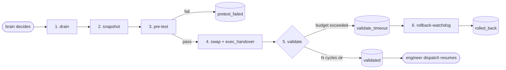

# Safe Self-Update

> Brain-orchestrated, drain → snapshot → pre-test → swap → validate →
> optional-rollback flow that turns Simard's `simard update` operator
> command into a *safe* upgrade the OODA daemon can drive autonomously.

## Why

`simard update` (the existing operator command) downloads a new binary,
runs `simard self-test` against it, and `exec`s into the new image. That
is fine for a human operator at a console — they can inspect the result
and react. It is *not* fine for an autonomous OODA daemon: a bad upgrade
that fails to start, or starts but immediately stops making progress,
leaves the operator with a host whose Simard daemon is silently broken.

`simard safe-update` adds the missing safety rails:

1. **Drain** in-flight engineer dispatches before swapping.
2. **Snapshot** the currently-running binary (sha256 + version + path)
   and copy it to `~/.simard/bin/simard.bak.<utc-iso8601>` so rollback
   has something to restore.
3. **Pre-test** the candidate binary's own `self-test` (which runs
   `gym run-suite starter`). Refuse the swap if the candidate fails its
   own suite.
4. **Swap** atomically (`rename(2)` first; copy-then-rename fallback
   for cross-filesystem installs) and write
   `~/.simard/state/upgrade-status.json#phase=exec_handover` so the
   incoming binary recognises it just inherited an in-flight upgrade.
5. **Validate** post-restart: the new binary's main loop checks the
   status file, and while in validation mode it must complete N clean
   OODA cycles within a wall-clock budget. After each cycle it writes
   `upgrade-heartbeat.json`. On success the phase flips to `validated`
   and `draining.flag` is removed (engineer dispatch resumes). On
   timeout the phase flips to `validate_timeout`.
6. **Rollback** (manual or watchdog-driven). Restores the latest
   backup, asks systemd to restart the OODA service, and writes
   `phase=rolled_back`.



## Configuration

`UpdateConfig` (defaults):

| Field                            | Default | Notes                                                                |
| -------------------------------- | ------- | -------------------------------------------------------------------- |
| `min_commits_since_build`        | `3`     | Triggering rule (1) — see "Brain triggering doctrine" below.         |
| `min_minutes_since_last_attempt` | `30`    | Triggering rule (4) cooldown.                                        |
| `drain_timeout_seconds`          | `300`   | Phase 1 budget. On timeout the flag stays set; operator investigates.|
| `pretest_timeout_seconds`        | `300`   | Phase 3 budget. Combined stdout/stderr captured to `last-pretest.log`.|
| `validate_timeout_cycles`        | `5`     | Number of clean OODA cycles required for `validated`.                |
| `validate_timeout_seconds`       | `600`   | Wall-clock budget for phase 5 before `validate_timeout`.             |
| `state_dir`                      | `~/.simard/state/` | Where all the on-disk state lives.                       |
| `engineer_worktrees_root`        | `~/.simard/engineer-worktrees/` | Where in-flight engineers are detected.       |

## On-disk state

Everything lives under `state_dir`:

| File                     | Owner            | Purpose                                                                  |
| ------------------------ | ---------------- | ------------------------------------------------------------------------ |
| `draining.flag`          | drain phase      | Empty marker. Engineer dispatch refuses while present.                   |
| `last-binary.json`       | snapshot phase   | `binary_path`, `sha256`, `mtime`, `version`, `backup_path`, `captured_at`.|
| `last-pretest.log`       | pretest phase    | Combined stdout+stderr of the candidate's `self-test`.                   |
| `upgrade-status.json`    | swap + validate  | `phase` ∈ {`pretest_failed`, `exec_handover`, `validated`, `validate_timeout`, `rolled_back`}. |
| `upgrade-heartbeat.json` | validate phase   | `last_cycle_at`, `cycles_seen`, `remaining_seconds`.                     |

Backups live in `~/.simard/bin/simard.bak.<utc-iso8601>`. Capped at 5
files; oldest pruned by *filename ordering* (which is identical to
mtime ordering by construction since the names are timestamps).

## Operator CLI

Three new subcommands, wired into `simard <command>`:

```
simard safe-update
    Drive phases 1–4 (drain → snapshot → pre-test → swap+exec). Downloads
    the latest release first, then exec()s into it on success.

simard rollback
    Restore the most recent simard.bak.<utc> over ~/.simard/bin/simard
    and ask systemd (--user) to restart simard-ooda. Records
    phase=rolled_back. Idempotent.

simard rollback-watchdog [--once] [--interval=SECS] [--max-iterations=N]
    Long-running loop that polls upgrade-status.json. When phase becomes
    validate_timeout, performs a rollback and exits. Designed to be run
    by systemd as simard-rollback-watchdog.service.
```

The watchdog defaults: 10-second polling, runs forever until either
a rollback succeeds or the operator stops it. `--once` and
`--max-iterations=N` are useful in cron and tests respectively.

If you are not on a systemd host, the rollback subcommand prints a
warning and skips the restart — restart your supervisor manually after
the bytes are restored.

## Brain triggering doctrine (four-part rule)

The OODA brain (see `prompt_assets/simard/ooda_decide.md` →
"Self-update awareness") may decide to invoke `safe-update` autonomously
**only when all four conditions hold**:

1. **Divergence ≥ N commits** — `git ls-remote origin main` is at least
   `min_commits_since_build` commits ahead of the running binary's
   embedded build commit.
2. **No critical WIP** — `critical_wip_engineers == 0` (no in-flight
   engineer dispatch is holding a PR-blocking goal).
3. **Clean cycle just completed** — previous cycle did not increment
   `failure_count` and did not file a tracking issue.
4. **Cooldown elapsed** — at least `min_minutes_since_last_attempt`
   minutes since `upgrade-status.json#started_at`.

If the brain observes `phase=exec_handover` it must NOT trigger
another upgrade (the new binary owns validation). If it observes
`phase=validate_timeout` it should defer to `simard rollback-watchdog`
rather than firing `simard rollback` directly.

## Failure modes (and what each one looks like)

| Symptom                                            | Likely cause                                             | Operator action                                          |
| -------------------------------------------------- | -------------------------------------------------------- | -------------------------------------------------------- |
| `DrainTimeout` and `draining.flag` still present   | Engineer subprocess is wedged.                           | Inspect `~/.simard/engineer-worktrees/`, kill stragglers, then `rm draining.flag` to reopen the dispatch gate. |
| `PretestSelfTestFailed` or `PretestTimeout`        | Candidate binary is broken or self-test hung.            | Inspect `state_dir/last-pretest.log`. Install path is unchanged. |
| `phase=exec_handover` for a long time              | New binary started but is stuck — heartbeat stale.       | `simard rollback-watchdog --once` or `simard rollback`. |
| `phase=rolled_back`                                | Rollback succeeded.                                      | Look at `reason` for the trigger. Investigate.           |
| `RollbackBackupCorrupt`                            | sha256 mismatch between `last-binary.json` and the most-recent `simard.bak.*` file. | Restore from your own backup; this is a refusal to silently overwrite a (possibly still-good) install with an unverified backup. |

## Engineer dispatch interlock

`spawn_agent_for_goal` (the engineer-dispatch entry point in
`src/engineer_loop/agent_spawn.rs`) calls `refuse_if_draining` first.
If `draining.flag` is present, the dispatch is refused with a
`BridgeCallFailed { bridge: "engineer", method: "spawn_agent_for_goal" }`
error. The brain treats this as an expected refusal, not a real
failure, while a safe-update is in progress.

## Tests

* Unit tests live alongside each phase in `src/safe_update/`.
* Integration tests in `src/safe_update/tests_orchestrator.rs` walk the
  six phases end-to-end using `/usr/bin/true` and `/usr/bin/false` as
  stand-in candidate binaries (no network, no live `gym run-suite`).
* Set `SIMARD_SAFE_UPDATE_SKIP_HANDOVER=1` to exercise the swap phase
  without actually exec()ing into the candidate — used by the
  integration tests so the test process survives.

## Source layout

```
src/safe_update/
    errors.rs                 # SafeUpdateError variants (one per phase)
    state.rs                  # status JSON schema + read/write helpers
    drain.rs                  # phase 1
    snapshot.rs               # phase 2
    pretest.rs                # phase 3
    swap.rs                   # phase 4
    validate.rs               # phase 5 (in-process, on the new binary)
    rollback.rs               # phase 6
    mod.rs                    # SafeUpdateOrchestrator + UpdateConfig
    tests_orchestrator.rs     # end-to-end integration tests
src/operator_cli/safe_update.rs
                              # wires `safe-update`, `rollback`, `rollback-watchdog`
src/cmd_self_update/download.rs
                              # `download_to_temp` factored out for reuse
src/cmd_self_update/update.rs
                              # `handle_self_update_download_only` for safe-update
src/engineer_loop/agent_spawn.rs
                              # refuse_if_draining() interlock
prompt_assets/simard/ooda_decide.md
                              # Self-update awareness (four-part doctrine)
```
